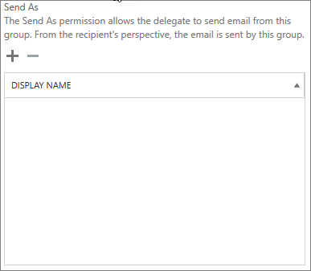
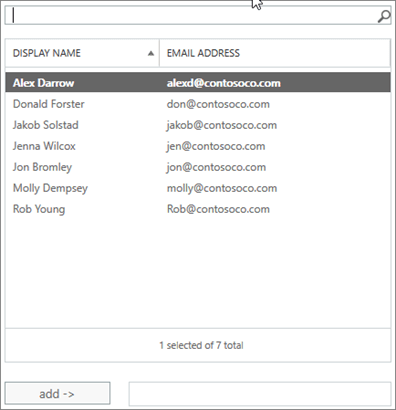
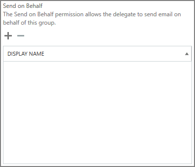

# Allow members to send as or send on behalf of a group

A member of a Microsoft 365 group who has been granted **Send as** or **Send on behalf** permissions can send email as the group, or on behalf of the group. (Guests in the group cannot be granted these permissions.)

This article explains how a global or Exchange administrator can set these permissions.
  
For example, if Megan Bowen is part of the **Training** Microsoft 365 group, and has **Send as** permissions on the group, if she sends an email as the group, it will look like the **Training** group sent the email. 
  
The **Send on Behalf** permission lets a user send email on behalf of a Microsoft 365 group. For example, if Alex Wilber is a part of the **Marketing** Microsoft 365 group, and has **Send on Behalf** permissions and sends an email as the group, the email looks like it was sent by **Alex Wilber on behalf of Marketing**.

> [!IMPORTANT]
> You can configure **Send as** or **Send on behalf** for a given user, but not both. If you configure both, it will default to **Send as**.

> [!TIP]
> See [Send email from or on behalf of a Microsoft 365 group](https://support.microsoft.com/office/0f4964af-aec6-484b-a65c-0434df8cdb6b) to learn how to use Outlook and Outlook on the Web to send email from a group.
    
## Allow members to send email as a group

This section explains how to allow users to send email as a group in the [Exchange admin center](https://go.microsoft.com/fwlink/p/?linkid=2059104) (EAC) in Exchange Online.
  
1. In the <a href="https://go.microsoft.com/fwlink/p/?linkid=2059104" target="_blank">Exchange admin center</a>, go to **Recipients** \> **Groups**.
    
2. Select **Edit**   on the group that you want to allow users to send as. 
    
3. Select **group delegation**.
    
4. In the **Send As** section, select the **+** sign to add the users that you want to send as the Group. 
    
    
  
5. Type to search or pick a user from the list. Select **OK** and **Save**.
    
    
  
## Allow members to send email on behalf of a group

This section explains how to allow users to send email on behalf of a group in the Exchange admin center (EAC) in Exchange Online.
  
1. In the <a href="https://go.microsoft.com/fwlink/p/?linkid=2059104" target="_blank">Exchange admin center</a>, go to **Recipients** \> **Groups**.
    
2. Select **Edit**  on the group that you want to allow users to send as. 
    
3. Select **group delegation**.
    
4. In the Send on Behalf section, select the **+** sign to add the users that you want to send as the Group. 
    
    
  
5. Type to search or pick a user from the list. Select **OK** and **Save**.
    
    

## Related articles

[Collaboration governance planning step-by-step](collaboration-governance-overview.md#collaboration-governance-planning-step-by-step)

[Create your collaboration governance plan](collaboration-governance-first.md)

[Learn more about Microsoft 365 groups](https://support.microsoft.com/office/b565caa1-5c40-40ef-9915-60fdb2d97fa2)

[Add-RecipientPermission](/powershell/module/exchange/add-recipientpermission)

[Set-UnifiedGroup](/powershell/module/exchange/set-unifiedgroup)