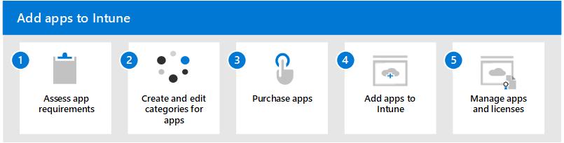

# Add apps to Microsoft Intune Overview

Before you can add apps to Microsoft Intune, you must first set up Intune. If you're new to Intune, start with the [Microsoft Intune free trail](/mem/intune/fundamentals/free-trial-sign-up). Trying out Intune is free for 30 days. When you complete the sign-up process, you'll have a new tenant that you can use to evaluate Intune. A tenant is a dedicated instance of [Azure Active Directory](/azure/active-directory/fundamentals/active-directory-whatis) (Azure AD) where your subscription to Intune is hosted. You can then configure the tenant, which involves many capabilities that you can use to protect your organization. One of those involves adding apps to Intune.

As an IT admin, you can use Intune to manage the apps that members of your organization use. This management functionality is in addition to managing devices and protecting data. One of your priorities as an admin is to ensure that the members of your organization have access to the apps they need to do their work. This goal can be a challenge because:
- There are a wide range of device platforms and app types.
- You might need to manage apps on both organization (company) devices and users' personal devices.
- You must ensure that your network and your data remain secure.
- Additionally, you might want to assign and manage apps on devices that aren't enrolled with Intune.

The end users of apps and devices at your organization might have several app requirements. Before adding apps to Intune and making them available to members of your organization, you may find it helpful to assess the app capabilities your organization needs. Are there specific apps that your organization needs? Do you support multiple types of devices? Do you need to manage corporate devices only? Will you manage the apps on personal devices used to access corporate resources? Are there specific groups of users at your organization that needed different protection and configuration of devices and apps?

This article helps you do the following tasks:
- Determine app requirements and questions that you should consider
- Provide categories of apps that the members of your organization use
- Acquire and add apps to Intune individually and in-volume
- Add apps based on recommended options
- Understand how to manage apps and confirm app license use

Follow these steps to add apps to Intune:
1. [Assess app requirements](apps-add-step-1.md)
2. [Create categories for apps](apps-add-step-2.md)
3. [Purchase apps](apps-add-step-3.md)
4. [Add apps to Intune](apps-add-step-4.md)
5. [Manage apps and licenses](apps-add-step-5.md)

Once you've completed the above steps, you are ready to configure, protect, assign, and monitor the managed apps your organization uses.
