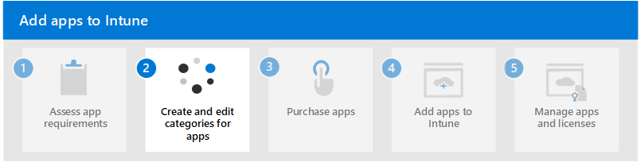

# Step 1. Assess app requirements

As an IT admin, before adding apps to Intune and making them available to the members of your organization, you may find it helpful to determine a few app requirements for your organization up front. You must determine app requirements, such as the platforms and capabilities that the members of your organization require. You must determine whether to use Intune to manage the devices as well as the apps, or have Intune manage just the apps without managing the devices. Intune supports both of these types [Mobile Application Management configurations](apps-guide-overview.md#mobile-application-management-configurations). In addition, you should determine the apps and capabilities that the members of your organization should use and who needs those apps. This step helps you assess and consider how you'll provide apps to your organization.

To start, first determine your organization's requirements by answering the following key questions:

| Questions | Details |
|---|---|
| Does my organization need to use Mobile Application Management (MAM) or Mobile Device Management (MDM)? | Intune supports both MAM and MDM. [MAM without device management](apps-guide-overview.md#mam-without-device-management) allows just your organization's apps to be managed by Intune, without enrolling the devices to be managed by Intune. [MAM with device management](apps-guide-overview.md#mam-with-device-management) (also known as MDM) allows your organization's apps and devices to be managed. There's advantages to each management method. For more information, see [Understanding MAM and MDM](#understanding-mam-and-mdm).  |
| What platforms do members of my organization use? | Intune supports a number of device platforms. You should consider supporting all possible device platforms that members of your organization use to access corporate data. For more information, see [Determine the platforms needed for each app](#determine-the-platforms-needed-for-each-app). |
| Which apps are needed to access organization information and data? | Determine which apps are currently used by members of your organization and which apps need to be available or added. For more information, see [Determine apps needed for your organization](apps-add-step-1.md#determine-apps-needed-for-your-organization).
| Which security apps are needed by your organization? | Determine which apps are currently used to protect your organization. Check if the security apps, such as [Microsoft Defender for Endpoint](/microsoft-365/security/defender-endpoint/microsoft-defender-endpoint), is available based on your licensing for Microsoft Intune.
| Do any of the apps used by members of your organization need specific configuration policies? | Intune allows you to create and assign app configuration policies. These types of policies are used to make sure the apps at your organization are set up correctly from the start. For instance, members of your organization won't have to determine or input the email settings that are needed for your organization. For more information, see [App configuration policies for Microsoft Intune](/mem/intune/apps/app-configuration-policies-overview). |
| Which groups of users need specific apps? | Intune allows you to add users to be managed. You can create groups of users to organize your devices and apps. For more information, see [Determine who will use the app](#determine-who-will-use-the-app). |

## Understanding MAM and MDM

Managing the apps that the members of your organization use on their devices is called mobile application management (MAM). MAM in Intune is designed to protect organization data at the application level, including custom apps and store apps. App management can be used on organization-owned devices and personal devices. When it's used with personal devices, only organization-related access and data are managed. This configuration allows your organization's apps to be managed by Intune, but doesn't enroll the devices to be managed by Intune. 

Managing devices at an organization is known as mobile device management (MDM). When you manage both the apps and devices at your organization, it's often referred to as **MAM + MDM**. There are additional benefits to using MDM with app protection policies. For example, a member of your organization could have both a phone issued by your organization, as well as their own personal tablet. The company phone could be enrolled in MDM where it's protected at the device level and also protected by app protection policies, while the personal device is protected by app protection policies only.

For more information, see [MAM configurations](apps-guide-overview.md#mobile-application-management-configurations).

## Determine the platforms needed for each app

Intune supports configuring and protecting the apps that the members of your organization use. The mobile device type (such as Windows and Android) is referred to as the device platform. Each device platform supports multiple operating systems (OS). When it comes to apps, Intune supports the following platforms:
- Windows
- iOS/iPadOS
- macOS
- Android

For details about platforms for the apps your organization uses, see [Deploy apps your organization uses](/mem/intune/fundamentals/manage-apps#deploy-apps-your-organization-uses).

## Determine apps needed for your organization

There are several types of apps that you can consider assigning to the members of your organization. There are store apps, apps created specifically for your organization, apps on the web, and apps that have been designed to work with Intune. You must determine all the apps that your organization currently uses and will need to use. 

Application that you may want to consider adding to Intune would commonly include the following areas:

- Communications
    - Email, meetings, calendar, tasks, messaging
    - Collaboration, communities, events, chats, channels
    - Sharing, booking, calling, sales
- Productivity
    - Spreadsheets, presentations, writing, reading
- Security
    - Authentication, verification, encryption, signatures, tokens
- Tools and utilities
    - Editors, compression, file viewers
    - Printing, annotations, workspace management
    - Dev Ops, location services
- Storage
    - Cloud storage, secure file store, inventory

Consider those apps that integrate with Intune by having built-in configuration and protection capabilities. For a list of apps, see [Microsoft Intune protected apps](/mem/intune/apps/apps-supported-intune-apps).

For more information, see [Determine the type of app for your solution](/mem/intune/apps/apps-add#determine-the-type-of-app-for-your-solution).

## Determine who will use the app

Intune uses Azure Active Directory (Azure AD) groups to manage devices and users. As an Intune admin, you can set up groups to suit your organizational needs. Create groups to organize users or devices by geographic location, department, or hardware characteristics. Use groups to manage tasks at scale. For example, you can set policies for many users or deploy apps to a set of devices.

As you're determining which apps the members of your organization needs, consider the various groups of users and the various apps they use. Knowing these groups is also helpful after you've added an app. As you add an app to Intune, you assign a group of users that can use the app.

To help determine the app users, see [Determine who will use the app](/mem/intune/apps/apps-add#assess-app-requirements). For details about adding groups of users, see [Add groups to organize users and devices](/mem/intune/fundamentals/groups-add).

## Next step

Continue with [Step 2](apps-add-step-2.md) to create and edit categories for apps in Microsoft Intune.
