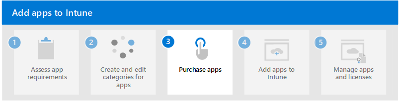

# Step 2. Create and edit categories for apps

App categories can be used to help you sort apps to make them easier for members of your organization (end users) to find in the [Company Portal](). The Company Portal app, Company Portal website, and Intune app on Android are Microsoft apps that were created to work with Microsoft Intune. These apps are where members of your organization can do common tasks related to app management on their individual devices. Common task may include enrolling devices, installing apps, and locating information (such as for assistance from your IT department). Additionally, these apps allow end-users to securely access company resources. The end user experience provides several different pages, such as **Home**, **Apps**, **App details**, **Devices**, and **Device details**. To quickly find available apps within the Company Portal, end-users can filter the apps on the **Apps** page. As the admin of Intune, you can assign one or more categories to an app.

Consider adding apps that fall into the following categories:
- Featured
- Education
- Productivity
- Developer
- Communication
- Security
- Tools
- Utilities
- Storage

When you add an app to Intune, you're given the option to select the category you want. Use the platform-specific articles to add an app and assign categories. For more information, see [Create and edit categories for apps](/mem/intune/apps/apps-add#create-and-edit-categories-for-apps).

## Next step

Continue with [Step 3](apps-add-step-3.md) to purchase or acquire apps in Microsoft Intune.
