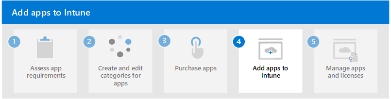

# Step 3. Purchase or acquire apps

When your organization purchases a license to use Microsoft Intune, there are Microsoft communication and productivity apps available that are included with your license. Additionally, many of the store apps are free to add to Intune and assign to members of your organization.

## Determine if you need to purchase apps

If the app you need to add to Intune isn't freely available as a store app or as part of your Intune license, you can consider purchasing the app.

There are three primary ways you would purchase an app:
- Purchase Apple store apps in-volume using [Apple Business Manager](apps-purchase-volume.md#apple-business-manager). Apple Business Manager provides an app Volume Purchase Program (VPP) that enables you to [purchase apps in-volume for Intune](apps-purchase-volume.md). 
- Work with an app vendor to purchase a [subscription or license](apps-license-overview.md#apps-requiring-account-subscription-or-license-from-the-app-vendor) to use a specific app based on platform. For a list of apps that have been designed to work with Intune, see [Microsoft Intune protected apps](/mem/intune/apps/apps-supported-intune-apps).
- Purchase a [line-of-business](apps-type-lob.md) (LOB) app from an app developer or vendor. You must work directly with the app developer or vendor to purchase the app. LOB apps commonly have the following characteristics:
    - A customized app that has been specifically designed or modified for your organization.
    - An app that has been created specifically for your organization by an app developer.

## Purchase apps in-volume from Apple

App licenses that can be purchased in-volume are purchased through a volume purchase program (VPP). Only Apple lets you purchase multiple app licenses using Apple Business Manager.

> [!IMPORTANT]
> Confirm that your [mobile device management (MDM) authority](/mem/intune/fundamentals/mdm-authority-set) is set to **Microsoft Intune** before purchasing or adding apps to Intune in-volume.

Most apps offered through a volume purchase program are free to add to Intune, however an app license (token) must be purchased through the volume purchase program (VPP).

### Apple Business Manager

Apple Business Manager is a web-based portal that allows you to purchase apps that can be managed by Intune.

Use the following steps to set up in-volume app purchases for iOS/iPadOS devices:

1. [Set up Apple Business Manager](apps-purchase-volume.md#set-up-apple-business-manager).
2. [Purchase apps using Apple Business Manager](apps-purchase-volume.md#purchase-apps-using-apple-business-manager).
3. [Sync purchased Apple app licenses with Microsoft Intune](apps-purchase-volume.md#sync-purchased-apple-app-licenses-with-microsoft-intune).

## Purchase an app subscription or license

Before purchasing an app that can be managed by Intune, check whether the app is already available to you:
1. Check whether the app is included with your Microsoft Intune subscription.
2. Check if the app is freely available to download and use by checking if the app is available directly in the [Microsoft Intune admin center](https://go.microsoft.com/fwlink/?linkid=2109431).
3. Check if you can purchase the app through a volume-purchase program (VPP), such as iOS/iPadOS apps.

You may need to work directly with an app developer or vendor to use an app that has been designed to be managed by Intune.

## Purchase a LOB app from an app developer or vendor

A line-of-business (LOB) app is a custom app that you add to Microsoft Intune from an app installation file. These apps are either developed in-house by your organization, or designed and developed by a third-party for your organization. These apps are unique to your organization. You need to work directly with the app developer to create the app for your organization. For more information, see [Understand line-of-business apps for Intune](apps-type-lob.md).

## Next step

Continue with [Step 4](apps-add-step-4.md) to add apps to Intune to Microsoft Intune.