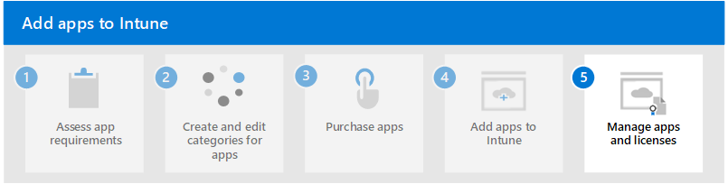

# Step 4. Add apps to Intune

Once you've assessed your app requirements, created categories for your apps in Intune, and purchased any needed apps that aren't freely available, you can add the apps to Intune.

You use [Microsoft Intune admin center](https://go.microsoft.com/fwlink/?linkid=2109431) to find, select, and add apps to Intune. When you add an app to Intune, you start by selecting the **app type**, such as **iOS store app**. Then, you can find and select the app that you need to add. Once you've select the app, you can add information about the app the members of your organization will see, such as app name, description, and minimum operating system needed. Additionally, if you already have groups of users available, you can assign those. Lastly, you create the app, which adds it to Intune.

> [!NOTE]
> You can specify that an app is required on the end-user's device. If the user modifies a required app (such as deleting it), Intune will automatically reinstall, update, or remove a required app within 24 hours.

## Add apps included with your Intune license

The first apps that you should consider adding to Intune are those [apps included as part of your Intune license](apps-license-overview.md#microsoft-app-licenses-included-with-intune). 

For instance, if you have a Microsoft 365 E5 license, consider adding the following apps to Intune first:
- Microsoft Word
- Microsoft Excel
- Microsoft PowerPoint
- Microsoft OneNote
- Microsoft Outlook
- Microsoft  Teams

These apps support the core Intune app protection policy settings and are also capable of supporting advanced app protection policy and app configuration policy settings. Each app has a different protection and configuration capabilities. These include the following capabilities:

- Core app protection policy settings
- App configuration
- Org allowed accounts
- Sync policy managed app data with native apps
- Org data notifications
- Open data into Org documents
- Save copies of org data

Use the following steps to add Microsoft licensed apps to Intune:
- [Add Microsoft 365 Apps for Windows devices to Intune](/mem/intune/apps/apps-add-office365)
- [Add Microsoft 365 Apps for macOS devices to Intune](/mem/intune/apps/apps-add-office365-macos)
- [Add Microsoft apps for iOS/iPadOS devices to Intune](/mem/intune/apps/store-apps-ios)
- [Add Microsoft apps for Android devices to Intune](/mem/intune/apps/store-apps-android)

> [!NOTE]
> In addition, consider adding the following Microsoft apps based on your existing license:
> - Microsoft Exchange
> - Microsoft SharePoint
> - Microsoft Viva Engage
> - Microsoft Viva
> - Project Online Desktop Client
> - Visio Online Plan 2
> - Microsoft Defender for Endpoint

For more information, see the following resources:
- [Microsoft Intune protected apps](/mem/intune/apps/apps-supported-intune-apps)
- [App functionality included with Microsoft 365 E5 license](apps-license-overview.md#app-functionality-included-with-microsoft-365-e5-license)

## Add volume purchased apps to Intune

Once you've added the apps included with you're Intune license to the Intune console, consider adding the apps that the members of your organization use most often. Those apps may be store apps, line-of-business apps, or web apps. Store apps can be purchased or acquired in-volume for iOS/iPadOS devices.

Use the following steps to add in-volume apps to Intune:

1. Determine which apps are used by members of your organization.
2. Narrow your app list to focus on the apps that are most used and most needed.
3. Determine which apps require your organization to have a license for the apps and that aren't already included as part of your Intune license.
4. Determine which apps are available in the Apple app stores as part of their [volume purchase program](apps-purchase-volume.md). 

    > [!NOTE]
    > Many apps that are part of a volume purchase program allow your organization to obtain the app license for free.

5. Based on your [organization's app platform needs](apps-add-step-1.md#determine-the-platforms-needed-for-each-app), add your needed apps in-volume:
    1. Use [Apple Business Manager](apps-purchase-volume.md#apple-business-manager) to purchase or acquire apps in-volume:
        1. [Set up Apple Business Manager](apps-purchase-volume.md#set-up-apple-business-manager)
        2. [Purchase apps using Apple Business Manager](apps-purchase-volume.md#purchase-apps-using-apple-business-manager)
        3. [Sync purchased Apple app licenses with Microsoft Intune](apps-purchase-volume.md#sync-purchased-apple-app-licenses-with-microsoft-intune)

For more information, see [Manage volume-purchased apps and books with Microsoft Intune](/mem/intune/apps/vpp-apps).

## Add Windows, iOS, and Android store apps to Intune

Many of the standard store apps displayed from within Microsoft Intune are freely available for you to add and deploy to members of your organization. In addition, you can purchase store apps for each device platform.

Use the following steps to add store apps to Intune:

1. Determine which apps are needed by members of your organization that haven't already been added to Intune using the steps above.
2. Determine which of those apps require your organization to have a license for the apps.
3. Determine each [store app type](apps-type-store.md) that your organization requires.
4. Determine which apps are available in the Microsoft, Apple, or Google app stores.
5. [Add store apps](apps-purchase-store.md#add-store-apps-based-on-platform) to Intune based on your [organization's app platform needs](apps-add-step-1.md#determine-the-platforms-needed-for-each-app).

For more information, see [Android store apps](/mem/intune/apps/store-apps-android), [iOS/iPadOS store apps](/mem/intune/apps/store-apps-ios), [Microsoft Store apps](/mem/intune/apps/store-apps-microsoft), and [Managed Google Play apps](/mem/intune/apps/apps-add-android-for-work).

## Add line-of-business apps to Intune

Line-of-business (LOB) apps are apps that you add to Microsoft Intune from an app installation file. These apps are often created in-house for your organization and support a specific purpose for your organization. To include LOB apps in your managed environment, you upload the app installation file to Intune and assign the app to devices or groups from Intune. LOB apps are supported by Intune for Android devices, iOS/iPadOS devices, Windows, and macOS devices. For more information about line-of-business apps, see [Understand line-of-business apps for Intune](apps-type-lob.md).

Use the following steps to add line-of-business apps to Intune:

1. Determine the platform(s) your LOB app requires.
2. Determine your specific [LOB app type](apps-type-lob.md#line-of-business-apps-types).
3. Add your LOB apps to Intune based on app type:
    1. [Android LOB apps](/mem/intune/apps/lob-apps-android)
    2. [iOS/iPadOS LOB apps](/mem/intune/apps/lob-apps-ios)
    3. [Windows LOB apps](/mem/intune/apps/lob-apps-windows)
    4. [Win32 apps](/mem/intune/apps/apps-win32-app-management)
    5. [Mac LOB apps](/mem/intune/apps/lob-apps-macos)

## Next step

Continue with [Step 5](apps-add-step-5.md) to manage apps and licenses in Microsoft Intune.