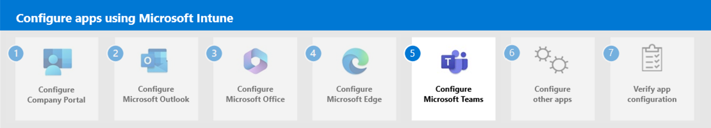

# Step 2. Configure Microsoft Outlook

Microsoft Intune makes it easy to provide Microsoft Outlook to your end users at your organization. Outlook provides secure email, calendar, contacts, and files. You can choose to add Microsoft Outlook to iOS or Android devices. Outlook for iOS and Android supports app settings that allow unified endpoint management (UEM) administrators (using tools such as Microsoft Intune) and Microsoft 365 or Office 365 administrators to customize the behavior of the app.

> [!NOTE]
> The methods described use Microsoft Intune as the unified endpoint management service and Exchange as the messaging platform. 

Outlook app configuration can be delivered by selecting either of the following methods:
1. **Managed devices** - Select the mobile device management (MDM) OS channel.
    - **iOS**: Use an App Configuration Policy for iOS. For related information, see the [Managed App Configuration](https://developer.apple.com/library/content/samplecode/sc2279/Introduction/Intro.html) channel for iOS.
    - **Android**: Use an App Configuration Policy for Android Enterprise. For related information, see the [Android in the Enterprise](https://developer.android.com/work/managed-configurations) channel for Android.
2. **Unmanaged devices**: Select an Intune App Protection Policy (APP) channel (also know as the **MAM channel**).
    - **iOS**: Use an App Protection Policy for iOS.
    - **Android**: Use an App Protection Policy for Android.

> [!NOTE]
> Managed devices are those devices that have been enrolled in a mobile device management (MDM) solution. Unmanaged devices that use managed apps, follow a mobile application management scenario.

Outlook for iOS and Android supports the following configuration scenarios:
- **Account setup configuration** - Must have enrolled devices.
- **Organization allowed accounts mode** - Must have enrolled devices.
- **General app configuration settings**
- **S/MIME settings**
- **Data protection settings**

> [!IMPORTANT]
> For configuration scenarios that require device enrollment on Android, the devices must be enrolled in Android Enterprise, and Outlook for Android must be deployed via the managed Google Play store. For more information, see [Set up enrollment of Android work profile devices](/intune/android-work-profile-enroll) and [Add app configuration policies for managed Android devices](/intune/app-configuration-policies-use-android).

| Configuration   scenario | Description |
|---|---|
| Account   setup configuration | Used with managed devices that   have been enrolled in a unified endpoint management (UEM) solution. Any UEM   provider is supported. Outlook for iOS and Android offers administrators the   ability to "push" account configurations to their Office 365 and   on-premises users leveraging hybrid Modern Authentication users. For more   information on account setup configuration, see [Account setup with modern   authentication in Exchange   Online](/exchange/clients-and-mobile-in-exchange-online/outlook-for-ios-and-android/setup-with-modern-authentication#account-setup-configuration-via-enterprise-mobility-management).  |
| Organization   allowed accounts mode | Used with managed devices that   have been enrolled in a unified endpoint management (UEM) solution. Any UEM   provider is supported. Examples may include only allowing work or school   accounts. Outlook for iOS and Android offers administrators the ability to   restrict email and storage provider accounts to only corporate accounts. For   more information on organization allowed accounts mode, see [Account setup   with modern authentication in Exchange   Online](/exchange/clients-and-mobile-in-exchange-online/outlook-for-ios-and-android/setup-with-modern-authentication#organization-allowed-accounts-mode). |
| General   app configuration settings | Outlook for iOS and Android   offers administrators the ability to customize the default configuration for   several in-app settings. This capability is offered for both enrolled devices   via any UEM provider and for devices that aren't enrolled when Outlook for   iOS and Android has an Intune App Protection Policy applied.
If an   App Protection Policy is targeted to the users, the recommendation is to   deploy the general app configuration settings in a **Managed Apps** device   enrollment model. This deployment ensures the App Configuration Policy is   deployed to both enrolled devices and unenrolled devices. |
| S/MIME   settings | On enrolled devices, Outlook for   iOS and Android supports automated certificate delivery. Outlook for iOS and   Android also supports app configuration settings that enable or disable   S/MIME in the app, as well as the user's ability to change the setting. For more information on how to deploy these settings via Microsoft Endpoint   Manager, see [Understanding   S/MIME](sensitive-labeling-and-protection-outlook-for-ios-android.md#understanding-smime).   For more information on the configuration keys, see [Configuration   keys](#configuration-keys). |
| Data   protection settings | Outlook for iOS and Android   supports app configuration policies for the following data protection   settings when the app is managed by Microsoft Endpoint Manager with an Intune   App Protection Policy applied:<ul><li>Managing the use of   wearable technology</li><li>Managing sensitive data in mail and   calendar reminder notifications</li><li>Managing the contact   fields synchronized to the native contacts app</li><li>Managing   calendar sync availability</li><li>Managing add-ins   availability</li><li>
These settings can be deployed to   the app regardless of device enrollment status. For more information on the   configuration keys, see [Configuration keys](#configuration-keys). |

For specific procedural steps and detailed documentation on the app configuration settings Outlook for iOS and Android supports, see [Deploying Outlook for iOS and Android app configuration settings](/exchange/clients-and-mobile-in-exchange-online/outlook-for-ios-and-android/outlook-for-ios-and-android-configuration-with-microsoft-intune).

## Configure Outlook on managed devices

You can configure Microsoft Outlook for managed devices by using an App Configuration Policy specifically for either the iOS/iPadOS or Android platforms. There are two areas to consider when configuring Outlook for managed devices:
- [Account setup configuration](#account-setup-configuration)
- [Organization allowed accounts mode settings](#organization-allowed-accounts-mode-settings)

> [!NOTE]
> Configuring Outlook on managed devices can be done with any Unified Endpoint Management (UEM) provider that uses the [Managed App Configuration channel for iOS](https://developer.apple.com/library/content/samplecode/sc2279/Introduction/Intro.html) or the [Android in the Enterprise channel for Android](https://developer.android.com/work/managed-configurations).

### Account setup configuration

You can configure account configuration setting for Microsoft Outlook on iOS and Android devices using Intune or other Unified Endpoint Management (UEM) providers. Once account setup configuration has been created as an App Configuration Policy in Intune (or other UEM provider) and the user enrolls their device, Outlook for iOS and Android will detect the related account and will then prompt the user to sign-in to the account. The only information the user needs to enter to complete the setup process is their password. Then, the user's mailbox content will load and the user can begin using the app. This process ensures that every device user successfully sets up Outlook. 

When creating an App Configurtion Policy in Intune, you can set up account configuration options for devices by specifically setting a key and value in the policy and assigning the policy to members of your organization. 

Available account setup configuration keys for Outlook include the following:
- `com.microsoft.outlook.Settings.OpenLinks.UseSystemDefaultBrowser`
- `com.microsoft.outlook.Settings.OpenLinks.UserChangeAllowed`
- `com.microsoft.outlook.EmailProfile.EmailAddress`
- `com.microsoft.outlook.EmailProfile.EmailUPN`
- `com.microsoft.outlook.EmailProfile.AccountType`

For more information about using the above keys, see [Account setup configuration](/exchange/clients-and-mobile-in-exchange-online/outlook-for-ios-and-android/outlook-for-ios-and-android-configuration-with-microsoft-intune#account-setup-configuration) in the Microsoft Exchange documentation.

### Organization allowed accounts mode settings

Outlook for iOS and Android on corporate-managed devices can be configured to only allow a single, corporate account to be provisioned within Outlook for iOS and Android. This capability is supported with Microsoft 365 and Office 365 accounts or on-premises accounts using hybrid modern authentication, however, only a single corporate account can be added to Outlook for iOS and Android. Similar to account setup configuration, you can configure organization allowed accounts mode settings for Microsoft Outlook on iOS and Android devices using Intune or other Unified Endpoint Management (UEM) providers. Once account setup configuration has been created as an App Configuration Policy in Intune (or other UEM provider), you have assigned the policy, and the user enrolls their device, Outlook for iOS and Android will detect the related account and will then prompt the user to sign-in to the account. 

Available organization allowed accounts mode configuration keys for Outlook include the following:
- `IntuneMAMAllowedAccountsOnly`
- `IntuneMAMUPN`
- `com.microsoft.intune.mam.AllowedAccountUPNs`

To ensure these users can only access corporate email on enrolled devices (whether it be iOS or Android Enterprise) with Intune, you will need to use an Azure Active Directory conditional access policy with the grant controls [Require devices to be marked as compliant](/azure/active-directory/conditional-access/require-managed-devices#require-device-to-be-marked-as-compliant) and [Require approved client app](/azure/active-directory/active-directory-conditional-access-technical-reference). Details on creating this type of policy can be found in [Azure Active Directory app-based conditional access](/azure/active-directory/active-directory-conditional-access-mam#exchange-online-policy).

For more information on the settings that need to be configured to deploy organization allowed accounts mode, see the [Organization allowed accounts mode settings](/exchange/clients-and-mobile-in-exchange-online/outlook-for-ios-and-android/outlook-for-ios-and-android-configuration-with-microsoft-intune#organization-allowed-accounts-mode-settings) and [Organization allowed accounts mode](/exchange/clients-and-mobile-in-exchange-online/outlook-for-ios-and-android/setup-with-modern-authentication#organization-allowed-accounts-mode) in the Microsoft Exchange documentation.

### Configuration process for managed devices

When you create a app configuration policy to be apply to a managed device in Intune, you specifically choose **Managed devices**. Managed devices are those devices that are managed by Intune or other unified endpoint management provider. The app, in this case Microsoft Outlook, must be pinned to the management profile on iOS/iPadOS or deployed through Managed Google Play on Android devices. 

For more information about creating an app configuration policy in Intune, see [Create an app configuration policy](/mem/intune/apps/app-configuration-policies-use-ios#create-an-app-configuration-policy) for iOS devices and [Create an app configuration policy](/mem/intune/apps/app-configuration-policies-use-android#create-an-app-configuration-policy) for Android Enterprise devices. In addition, see [Email apps](/mem/intune/apps/app-configuration-policies-use-android#email-apps) for Android Enterprise devices.

## Configure Outlook as managed app

Outlook for iOS and Android offers administrators the ability to customize the default configuration for several in-app settings. This capability is offered for both enrolled devices via any UEM provider and for devices that aren't enrolled when Outlook for iOS and Android has an Intune App Protection Policy applied.

Within Intune, you can create an app configuration policy that allows you to set the following types of configuration settings:
- Outlook configuration settings
- Microsoft Tunnel for Mobile Application Management settings
- S/MIME settings
- General configuration settings

> [!TIP]
> If an App Protection Policy is targeted to the users, the recommendation is to deploy the general app configuration settings in a **Managed Apps** device enrollment model. This deployment ensures the App Configuration Policy is deployed to both enrolled devices and unenrolled devices.

### Outlook configuration settings

In Intune, you can use an app configuration policy to set Outlook specific configuration settings for iOS and Android platforms. These settings are divided into the following categories:
- **General app configuration** settings
- **Data Protection configuration** settings
- **Sync contact fields to native contacts app configuration** settings

The following table provides a list of the **General app configuration** settings for Outlook:

| General   app configuration setting | Description |
|---|---|
| Focused   Inbox | Focused Inbox separates your   inbox into two tabs—Focused and Other. Your most important emails are on the   Focused tab while the rest remain easily accessible—but out of the way—on the   Other tab. When set as not configured, the default app setting is set to On. |
| Require   Biometrics to Access App | Biometrics,   such as TouchID or FaceID, can be required for users to access the app on   their device. When required, biometrics are used in addition to the   authentication method selected in this profile. This setting should not be   enabled when Intune App Protection Policies are deployed, as the app   protection policy includes access requirements prior to accessing managed   data. Enabling both will result in multiple access prompts to access Outlook   mobile. When set as not configured, the default app setting is set to off. If   you configure this setting, you can choose to use the **Allow user to change   setting** option. |
| Save   Contacts | Saving   contacts to the mobile device’s native address book allows new calls and text   messages to be linked with the user’s existing Outlook contacts. When set as   not configured, the default app setting is set to off. If you configure this   setting, you can choose to use the **Allow user to change setting** option. |
| External   Recipients MailTip | The External Recipients MailTip   is displayed if the sender adds a recipient that's external or adds a   distribution group that contains external recipients. This MailTip informs   senders if a message they're composing will leave the organization, helping them   make the correct decisions about wording, tone, and content. Available only   for Exchange Online accounts and on-premises accounts leveraging hybrid   modern authentication. When set as not configured, the default app setting is   set to On. |
| Block   External Images | When block external images is   enabled, the app will prevent the download of images hosted on the Internet   that are embedded in the message body. When set as not configured, the   default app setting is set to Off. If you configure this setting, you can choose   to the **Allow user to change setting** option. |
| Default   App Signature | Default   app signature indicates whether the app will use “Get Outlook for iOS” as the   default signature during message composition. If the setting is configured as   Off, the default signature will not be used; however, users can add their own   signature.  When set as Not Configured, the default app setting is set to   On. |
| Suggested   Replies | When you open a message, Outlook   might suggest replies below the message. If you select a suggested reply, you   can edit the reply before sending it. When set as not configured, the default   app setting is set to On. If you configure this setting, you can choose to   the **Allow user to change setting** option. |
| Organize   mail by thread | The default behavior in Outlook   is to bundle mail conversations into a threaded conversation view. If this   setting is disabled Outlook will display each mail individually and will not   group them by thread. |
| Discover   Feed | Discover Feed surfaces your most   frequently accessed Office files. By default, this feed is enabled when Delve   is enabled for the user. When set as not configured, the default app setting   is set to On. |
| Play My   Emails | The Play My Emails feature is   not enabled by default in the app, but it is promoted to eligible users via a   banner in the inbox. When set to Off, this feature will not be promoted to   eligible users in the app. Users can choose to manually enable Play My Emails   from within the app, even when this feature is set to Off. When set as Not   configured, the default app setting is On and the feature will be promoted to   eligible users. |
| Sync   Calendars | By default, an App Protection   Policy allows for calendar synchronization to the native Calendar app but can   be used to block calendar sync availability with the "Sync policy   managed app data with native apps or add-in" setting. Configuring this   setting to "Off" will block calendar synchronization when the App   Protection Policy setting is set to Allowed. If you configure this setting,   you can choose to use the **Allow user to change setting** option. |
| Text   Predictions | Outlook can suggest words and   phrases as you compose messages. When Outlook offers a suggestion, swipe to   accept it. When set as not configured, the default app setting is set to On.   If you configure this setting, you can choose to use the **Allow user to change   setting** option. |

The following table provides a list of the **Data Protection configuration** settings for Outlook:

| Data Protection configuration setting | Description |
|---|---|
| Org Data   on Wearables | This value specifies if Outlook   data can be synchronized to a wearable device. Setting the value to No   disables wearable synchronization. |
| Calendar Notifications | Allow calendar notifications to   display full details when the App Protection Policy setting "Org data   notifications" is set to "Block Org Data". |
| Allow Add-ins | By default, an App Protection   Policy allows users to utilize third-party add-ins but can be used to block   add-ins with the "Sync policy managed app data with native apps or   add-ins" setting. Configuring this setting to "Off" will block   add-ins when the App Protection Policy setting is set to Allowed. |
| Allow Calendar Sync | By default, an App Protection   Policy allows for calendar synchronization to the native Calendar app, but   can be used to block calendar sync availability. This setting operates   independent of the App Protection Policy setting and enables organizations to   define whether calendar sync is available for the work or school account. |

The following table provides a list of the **Sync contact fields to native contacts app configuration** settings for Outlook:

| Sync   contact fields to native contacts app configuration settings | Description |
|---|---|
| Address | This value specifies if the   contact's address should be synchronized to native contacts. |
| Birthday | This value specifies if the   contact's birthday should be synchronized to native contacts. |
| Company | This   value specifies if the contact's company name should be synchronized to   native contacts. |
| Department | This value specifies if the   contact's department should be synchronized to native contacts. |
| Email Address | This value specifies if the   contact's email address should be synchronized to native contacts. |
| Instant Messaging Address | This value specifies if the   contact's instant messaging address should be synchronized to native   contacts. |
| Job Title | This value specifies if the   contact's job title should be synchronized to native contacts. |
| Name Prefix | This value specifies if the   contact's name prefix should be synchronized to native contacts. |
| Name Suffix | This value specifies if the   contact's name suffix should be synchronized to native contacts. |
| Nickname | This value specifies if the   contact's nickname should be synchronized to native contacts. |
| Notes | This   value specifies if the contact's notes should be synchronized to native   contacts. |
| Phone Home Number | This value specifies if the   contact's home phone number should be synchronized to native contacts. |
| Phone Home Fax Number | This value specifies if the   contact's home fax number should be synchronized to native contacts. |
| Phone Mobile Number | This   value specifies if the contact's mobile phone number should be synchronized   to native contacts. |
| Phone Other Number | This value specifies if the   contact's other phone number should be synchronized to native contacts. |
| Phone Pager Number | This value specifies if the   contact's pager phone number should be synchronized to native contacts. |
| Phone Work Number | This value specifies if the work   phone number should be synchronized to native contacts. |
| Phone Work Fax Number | This value specifies if the   contact's work fax number should be synchronized to native contacts. |

> [!TIP]
> For recommendations about using these settings, see [General app configuration scenarios](/exchange/clients-and-mobile-in-exchange-online/outlook-for-ios-and-android/outlook-for-ios-and-android-configuration-with-microsoft-intune#general-app-configuration-scenarios).

### Microsoft Tunnel for Mobile Application Management settings

When you use the Microsoft Tunnel VPN Gateway, you can extend Tunnel support by adding Tunnel for Mobile Application Management (MAM). Tunnel for MAM extends the Microsoft Tunnel VPN gateway to support devices that run Android or iOS, and that aren't enrolled with Microsoft Intune.

> [!NOTE]
> This capability is available when you add Microsoft Intune Plan 2 or Microsoft Intune Suite as an add-on license. For more information, see [Use Intune Suite add-on capabilities](/mem/intune/fundamentals/intune-add-ons).

For more information about Microsoft Tunnel for MAM, see [Microsoft Tunnel for Mobile Application Management](\memdocs\intune\protect\microsoft-tunnel-mam).

### S/MIME settings

Secure Multipurpose Internet Mail Extensions (S/MIME) is a specification that allows users to send and receive digitally signed and encrypted emails. You can use an app configuration policy in Intune to configure your S/MIME settings for Outlook on iOS devices or Android devices. You can enable Outlook S/MIME settings to always sign and/or always encrypt on iOS and Android devices when using the **Managed apps** configuration option. 

S/MIME settings for Outlook can be configured by selecting the available options in an app configuration policy, or by using specific keys and values. When you select the options within the app configuration policy, you can choose from standard options. 

The following table provides a list of the **Sync contact fields to native contacts app configuration** settings for Outlook:

| Outlook   S/MIME settings | Description |
|---|---|
| Enable   S/MIME | Specify whether or not S/MIME   controls are enabled when composing an email. If you configure this   setting,  you can choose to use the   **Allow user to change setting** option. |
| Encrypt   all emails | Specify whether all emails must   be encrypted. Encrypting converts data to cipher text so that only the   intended recipient can read it. If you configure this setting,  you can choose to use the **Allow user to   change setting** option. |
| Sign all   emails | Specify whether all emails must   be signed. A digital signature verifies the authenticity of the email and   ensures that the contents are not tampered with in transit. If you configure   this setting,  you can choose to use   the **Allow user to change setting** option. |
| LDAP URL | This   is the LDAP hostname where clients can get the public encryption keys for   email recipients. Emails will be encrypted when a key is available.  |

You can find this setting in [Microsoft Intune admin center](https://go.microsoft.com/fwlink/?linkid=2109431) when using managed apps by selecting **Apps** > **App configuration policies**.  In addition, you can add an LDAP (Lightweight Directory Access Protocol) URL for Outlook S/MIME on iOS and Android devices for both managed apps and managed devices. For related information, see [App configuration policies for Microsoft Intune](/mem/intune/apps/app-configuration-policies-overview) and [S/MIME for Outlook for iOS and Android in Exchange Online](/exchange/clients-and-mobile-in-exchange-online/outlook-for-ios-and-android/smime-outlook-for-ios-and-android).

### General configuration settings

You can set app configuration settings by adding the name and value to an app configuration policy under the **General configuration settings** on the **Settings** pane. For more information about creating an app configuration policy in Intune, see [Create an app configuration policy](/mem/intune/apps/app-configuration-policies-use-ios#create-an-app-configuration-policy) for iOS devices and [Create an app configuration policy](/mem/intune/apps/app-configuration-policies-use-android#create-an-app-configuration-policy) for Android Enterprise devices. In addition, see [Email apps](/mem/intune/apps/app-configuration-policies-use-android#email-apps) for Android Enterprise devices.

## Next step
<!--

-->
Continue with [Step 3](apps-config-step-3.md) to configure Microsoft Office in Microsoft Intune.
