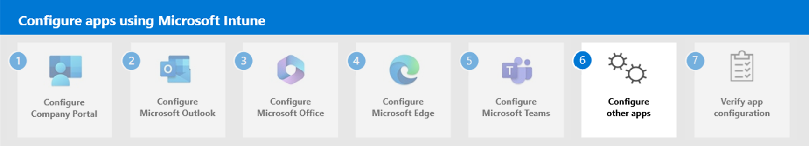

# Step 3. Configure Microsoft 365

## App configuration policy

- iOS/iPadOS there's nothing unique
- Android:
    - Permissions - Permissions granted here will override the “Default app permissions” policy for the selected apps. Learn more about [Android runtime permissions](/mem/intune/apps/app-configuration-policies-use-android). There's a large set of permissions that can be added for Android devices. You specify permissions you want to override. If they aren't chosen/specified explicitly, then the default behavior applies.
    - Configuration Settings - Available keys: `Allowed Accounts`, `Notes creation enabled`, `Teams app enabled`. 
    - Connected apps - Enable users to connect this app across the work and personal profiles. This setting only works for personally owned and corporate-owned work profile devices. Learn more about [connected apps](/mem/intune/apps/app-configuration-policies-use-android).

## Policies for Office apps

Intune provides policies specifically for Microsoft Office apps. You can select specific options to create mobile app management policies for Office mobile apps that connect to Microsoft 365 services. There are many policies for Office apps that you can add to Microsoft Intune and apply to groups of end users.

`intune\apps\app-office-policies.md`

**Policies for Office apps**: Select this option to create mobile app management policies for Office mobile apps that connect to Microsoft 365 services. You can also protect access to Exchange on-premises mailboxes by creating Intune app protection policies for Outlook for iOS/iPadOS and Android enabled with hybrid Modern Authentication. You must meet the requirements to use policies for Office apps. For more information about requirements, see [Requirements for using the Office cloud policy service](/deployoffice/overview-office-cloud-policy-service#requirements-for-using-the-office-cloud-policy-service). App protection policies aren't supported for other apps that connect to on-premises Exchange or SharePoint services. For related information, see [Overview of the Office cloud policy service for Microsoft 365 Apps for enterprise](/deployoffice/overview-office-cloud-policy-service).

## Configuration policies for individual Microsoft 365 apps

- Word iOS devices: nothing special
- Word Android devices:
    - Permissions
    - Configuration Settings
    - Connected apps
- Word iOS/Android MAM: 
    - General configuration settings
    - Microsoft Tunnel for MAM settings

## Specific configuration scenarios

### Controlling account access for apps on managed devices

## Next step
<!--

-->
Continue with [Step 4](apps-config-step-4.md) to configure Microsoft Edge in Intune.