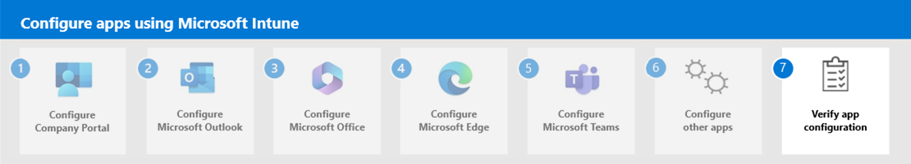

# Step 5. Configure Microsoft Teams

- Teams iOS devices
    - nothing predefined, however several key settings
- Teams Android MAM
    - General configuration settings
    - Microsoft Tunnel for Mobile Application Management settings
    - Edge configuration settings (get screenshot)

## Next step
<!--

-->
Continue with [Step 5](apps-config-step-5.md) to manage apps and licenses in Microsoft Intune.