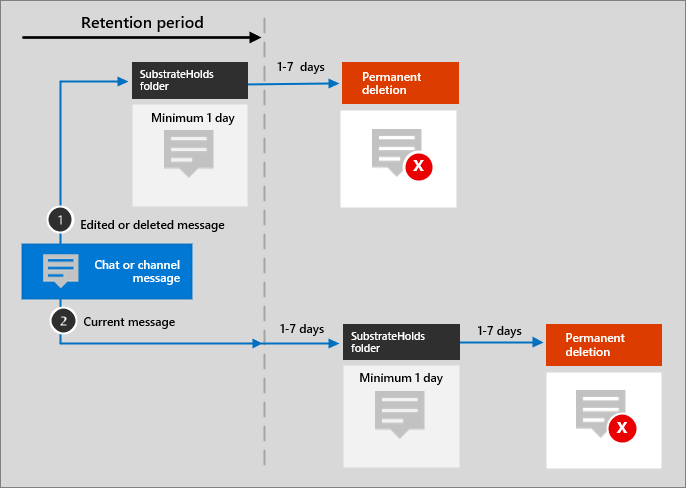

# Microsoft 365 architecture templates and icons

Helping our partners and customers design and architect new solutions is important. Architecture diagrams like those included in our guidance can help communicate design decisions and the relationships between components in an environment. We use a set of symbols and icons along with Visio templates to create the architecture diagrams we product and are providing these tools here to help you build a custom architecture diagram for your next solution.

You can see these icons, symbols, and templates in action in downloadable files available on the following pages:

- [Productivity illustrations](productivity-illustrations.md)
- [Microsoft cloud architecture models](cloud-architecture-models.md)

## Terms and download

Microsoft permits the use of these icons in architectural diagrams, training materials, or documentation. You may copy, distribute, and display the icons only for the permitted use unless granted explicit permission by Microsoft. Microsoft reserves all other rights.

 > [!div class="button"]
 > [Download SVG and PNG icons](https://go.microsoft.com/fwlink/?linkid=869455)

 > [!div class="button"]
 > [Download Visio templates and stencils](https://go.microsoft.com/fwlink/?linkid=2056186)

## Example architecture diagrams

You can use these icons and templates to create diagrams like the following examples:

1. Example search architecture diagram for SharePoint:

    

2. Teams retention lifecycle architecture diagram:

    

## More icon sets from Microsoft

- [Azure architecture icons](/azure/architecture/icons/)
- [Dynamics 365 architecture icons](/dynamics365/get-started/icons)
- [Microsoft Power Platform icons](/power-platform/guidance/icons)