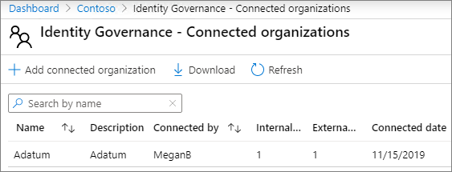
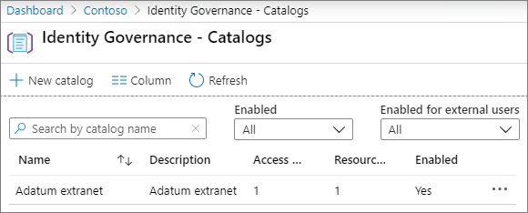
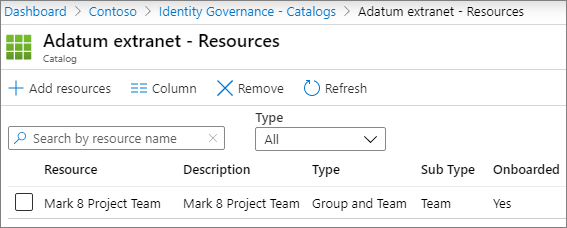
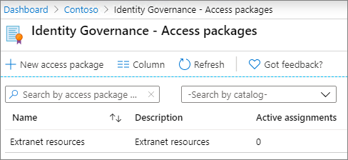
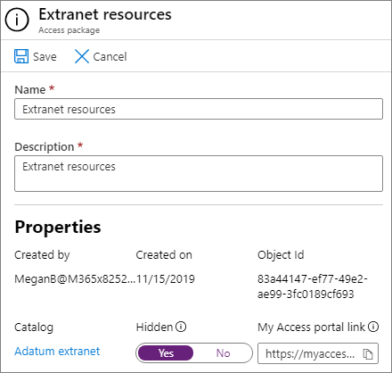
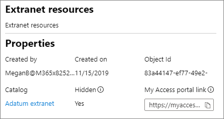

# Create a B2B extranet with managed guests

You can use [Entitlement Management](/azure/active-directory/governance/entitlement-management-overview) to create a B2B extranet to collaborate with a partner organization that uses Azure Active Directory. This allows users to self-enroll in the extranet site or team and receive access via an approval workflow.

With this method of sharing resources for collaboration, the partner organization can help maintain and approve the guests on their end, reducing the burden on your IT department and allowing those most familiar with the collaboration agreement to manage user access.

This article walks through the steps to create a package of resources (in this case, a site or team) that you can share with a partner organization through a self-service access registration model.

Before you begin, create the site or team that you want to share with the partner organization and enable it for guest sharing. See [Collaborate with guests in a site](collaborate-in-site.md) or [Collaborate with guests in a team](collaborate-as-team.md) for more information. We also recommend that you review [Create a secure guest sharing environment](create-secure-guest-sharing-environment.md) for information about security and compliance features that you can use to help maintain your governance policies when collaborating with guests.

## License requirements

Using this feature requires Microsoft Entra ID Governance licenses. To find the right license for your requirements, see [Compare generally available features of Microsoft Azure AD](https://www.microsoft.com/security/business/identity-access-management/azure-ad-pricing).

Specialized clouds, such as Azure Germany and Azure China 21Vianet, aren't currently available for use.

## Video demonstration

This video demonstrates the procedures covered in this article.

> [!VIDEO https://www.microsoft.com/videoplayer/embed/RE4wKUj?autoplay=false]

## Connect the partner organization

In order to invite guests from a partner organization, you need to add the partner's domain as a connected organization in Azure Active Directory.

To add a connected organization
1. In the [Microsoft Entra admin center](https://aad.portal.azure.com), select **Identity Governance**.
2. Select **Connected organizations**.
4. Select **Add connected organization**.
5. Type a name and description for the organization, and then select **Next: Directory + domain**.
6. Select **Add directory + domain**.
7. Type the domain for the organization that you want to connect, and then select **Add**.
8. Select **Connect**, and then Select **Next: Sponsors**.
9. Add people from your organization or the organization that you're connecting to who you want to approve access for guests.
10. Select **Next: Review + Create**.
11. Review the settings that you've chosen and then select **Create**.

    

## Choose the resources to share

The first step in selecting resources to share with a partner organization is to create a catalog to contain them.

To create a catalog
1. In the [Microsoft Entra admin center](https://aad.portal.azure.com), select **Identity Governance**.
2. Select **Catalogs**.
3. Select **New catalog**.
4. Type a name and description for the catalog and ensure that **Enabled** and **Enabled for external users** are both set to **Yes**.
5. Select **Create**.

   

Once the catalog has been created, you add the SharePoint site or team that you want to share with the partner organization.

To add resources to a catalog
1. In the Microsoft Entra Admin Center, select **Catalogs**, and then select the catalog where you want to add resources.
2. Select **Resources** and then select **Add resources**.
3. Select the teams or SharePoint sites that you want to include in your extranet, and then select **Add**.

   

Once you've defined the resources that you want to share, the next step is to create an access package, which defines the type of access that partner users are granted and the approval process for new partner users requesting access.

To create an access package
1. In the Microsoft Entra Admin Center, select **Catalogs**, and then select the catalog where you want to create an access package.
2. Select **Access packages**, and then select **New access package**.
3. Type a name and description for the access package, and then select **Next: Resource roles**.
4. Choose the resources from the catalog that you want to use for your extranet.
5. For each resource, in the **Role** column, choose the user role you want to grant to the guests who use the extranet.
6. Select **Next: Requests**.
7. Under **Users who can request access**, choose **For users not in your directory**.
8. Ensure that the **Specific connected organizations** option is selected, and then select **Add directories**.
9. Choose the connected organization that you add earlier, and then select **Select**
10. Under **Approval**, choose **Yes** for **Require approval**.
11. Under **First approver**, choose one of the sponsors that you added earlier or choose a specific user.
12. CliSelectck **Add fallback** and select a fallback approver.
13. Under **Enable**, choose **Yes**.
14. Select **Next: Lifecycle**.
15. Choose the expiration and access review settings that you want to use, and then select **Next: Review + Create**.
16. Review your settings, and then select **Create**.

    

If you're partnering with a large organization, you may want to hide the access package. If the package is hidden, then users in the partner organization won't see the package on their *My Access* portal. Instead, they must be sent a direct link to sign up for the package. Hiding the access package can reduce the number of inappropriate access requests and can also help keep available access packages organized in the partner organization's portal.

To set an access package to hidden
1. In the Microsoft Entra admin center, select **Access packages**, and then select your access package.
2. On the **Overview** page, select **Edit**.
3. Under **Properties**, choose **Yes** for **Hidden**, and then select **Save**.

   

## Invite partner users

If you set the access package to hidden, you need to send a direct link to the partner organization so that they can request access to your site or team.

To find the access portal link
1. In the Microsoft Entra Admin Center, select **Access packages**, and then select your access package.
2. On the **Overview** page, select **Copy to clipboard** link for the **My Access portal link**.

   

Once you have copied the link, you can share it with your contact at the partner organization, and they can send it to the users on their collaboration team.

## See Also

[Create a secure guest sharing environment](create-secure-guest-sharing-environment.md)
