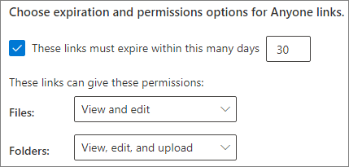
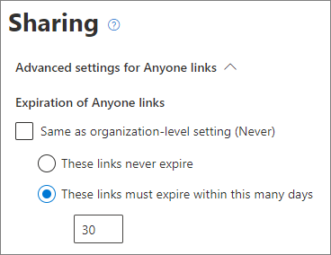
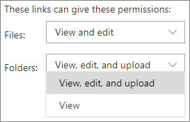
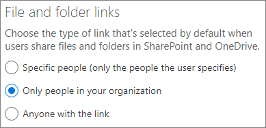
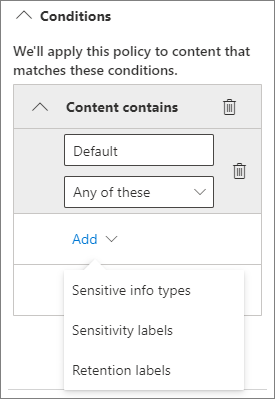
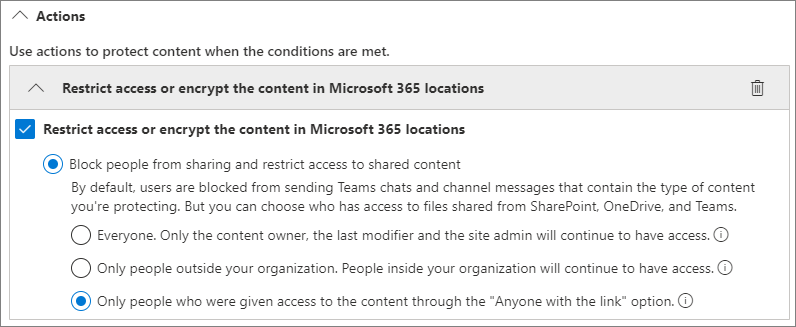
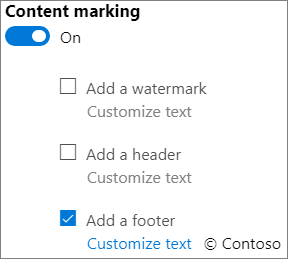

# Best practices for sharing files and folders with unauthenticated users

Unauthenticated sharing (*Anyone* links) can be convenient and is useful in various scenarios. *Anyone* links are the easiest way to share: people can open the link without authentication and are free to pass it on to others.

Usually, not all content in an organization is appropriate for unauthenticated sharing. This article covers the options available to help you create an environment where your users can use unauthenticated sharing of files and folders, but where there are safeguards in place to help protect your organization's content.

> [!NOTE]
> For unauthenticated sharing to work, you must enable it for your organization and for the individual site or team that you'll be using. See [Collaborating with people outside your organization](collaborate-with-people-outside-your-organization.md) for the scenario that you want to enable.

## Set an expiration date for Anyone links

Files are often stored in sites, groups, and teams for long periods of time. Occasionally there are data retention policies that require files to be retained for years. If such files are shared with unauthenticated people, this could lead to unexpected access and changes to files in the future. To mitigate this possibility, you can configure an expiration time for *Anyone* links.

Once an *Anyone* link expires, it can no longer be used to access content.

To set an expiration date for Anyone links across the organization

1. Open the [SharePoint admin center](https://admin.microsoft.com/sharepoint).
2. In the left navigation, click **Sharing**.
3. Under **Choose expiration and permissions options for Anyone links**, select the **These links must expire within this many days** check box. 
   
4. Type a number of days in the box, and then click **Save**.

To set an expiration date for Anyone links on a specific site

1. Open the [SharePoint admin center](https://admin.microsoft.com/sharepoint).
2. In the left navigation, expand **Sites**, and then click **Active sites**.
3. Select the site you want to change, and then click **Sharing**.
4. Under **Advanced settings for Anyone links**, under **Expiration of Anyone links**, clear the **Same as organization-level setting** check box. 
   
5. Select the **These links must expire within this many days** option, and type a number of days in the box.
6. Click **Save**.

Note that once an *Anyone* link expires, the file or folder can be re-shared with a new *Anyone* link.

You can set *Anyone* link expiration for a specific OneDrive by using [Set-SPOSite](/powershell/module/sharepoint-online/set-sposite).

## Set link permissions

By default, *Anyone* links for a file allow people to edit the file, and *Anyone* links for a folder allow people to edit and view files, and upload new files to the folder. You can change these permissions for files and for folders independently to view-only.

If you want to allow unauthenticated sharing, but are concerned about unauthenticated people modifying your organization's content, consider setting the file and folder permissions to **View**.

To set permissions for Anyone links across the organization

1. Open the [SharePoint admin center](https://admin.microsoft.com/sharepoint).
2. In the left navigation, click **Sharing**.
3. Under **Advanced settings for "Anyone" links**, select the file and folder permissions that you want to use. 
   

With *Anyone* links set to **View**, users can still share files and folders with guests and give them edit permissions by using *Specific people* links. These links require people outside your organization to authenticate as guests, and you can track and audit guest activity on files and folders shared with these links.

## Set default link type to only work for people in your organization

When *Anyone* sharing is enabled for your organization, the default sharing link is normally set to **Anyone**. While this can be convenient for users, it can increase the risk of unintentional unauthenticated sharing. If a user forgets to change the link type while sharing a sensitive document, they might accidentally create a sharing link that doesn't require authentication.

You can mitigate this risk by changing the default link setting to a link that only works for people inside your organization. Users who want to share with unauthenticated people would then have to specifically select that option.

To set the default file and folder sharing link for the organization
1. Open the [SharePoint admin center](https://admin.microsoft.com/sharepoint).
2. In the left navigation, click **Sharing**.
3. Under **File and folder links**, select **Only people in your organization**.

   

4. Click **Save**

To set the default file and folder sharing link for a specific site
1. Open the [SharePoint admin center](https://admin.microsoft.com/sharepoint).
2. In the left navigation, expand **Sites**, and then click **Active sites**.
3. Select the site you want to change, and then click **Sharing**.
4. Under **Default sharing link type**,  clear the **Same as organization-level setting** check box.

   

5. Select the **Only people in your organization** option and click **Save**.

## Prevent unauthenticated sharing of sensitive content

You can use [data loss prevention (DLP)](../compliance/dlp-learn-about-dlp.md) to prevent unauthenticated sharing of sensitive content. Data loss prevention can take action based on a file's sensitivity label, retention label, or sensitive information in the file itself.

To create a DLP rule
1. In the Microsoft 365 compliance admin center, go to the [Data loss prevention page](https://compliance.microsoft.com/datalossprevention).
2. Click **Create policy**.
3. Choose **Custom** and click **Next**.
4. Type a name for the policy and click **Next**.
5. On the **Locations to apply the policy** page turn off all settings except **SharePoint sites** and **OneDrive accounts**, and then click **Next**.
6. On the **Define policy settings** page, click **Next**.
7. On the **Customize advanced DLP rules** page, click **Create rule** and type a name for the rule.
8. Under **Conditions**, click **Add condition**, and choose **Content contains**.
9. Click **Add** and choose the type of information for which you want to prevent unauthenticated sharing.

   

10. Under **Actions** click **Add an action** and choose **Restrict access or encrypt the content in Microsoft 365 locations**.
11. Select the **Restrict access or encrypt the content in Microsoft 365 locations** check box and then choose the **Only people who were given access to the content through the "Anyone withe the link" options** option.

      

12. Click **Save** and then click **Next**.
13. Choose your test options and click **Next**.
14. Click **Submit**, and then click **Done**.

## Protect against malicious files

When you allow anonymous users to upload files, you're at an increased risk of someone uploading a malicious file. In Microsoft 365, you can use the *Safe Attachments* feature in Defender for Office 365 to automatically scan uploaded files and quarantine files that are found to be unsafe.

To turn on safe attachments
1. Open the [ATP Safe Attachments page](https://protection.office.com/safeattachmentv2) in the Security and Compliance admin center.
2. Click **Global settings**.
3. Turn on ATP for SharePoint, OneDrive, and Microsoft Teams.

   

4. Optionally turn on Safe Documents as well, and then click **Save**

See [ATP for SharePoint, OneDrive, and Microsoft Teams](../security/office-365-security/mdo-for-spo-odb-and-teams.md) and [Turn on ATP for SharePoint, OneDrive, and Microsoft Teams](../security/office-365-security/turn-on-mdo-for-spo-odb-and-teams.md) for additional guidance.

## Add copyright information to your files

If you use sensitivity labels in the Microsoft 365 Compliance admin center, you can configure your labels to add a watermark or a header or footer automatically to your organization's Office documents. In this way, you can make sure that shared files contain copyright or other ownership information.

To add a footer to a labeled file

1. Open the [Microsoft 365 compliance admin center](https://compliance.microsoft.com).
2. In the left navigation, under **Solutions**, click **Information protection**.
3. Click the label that you want to have add a footer, and then click **Edit label**.
4. Click **Next** to reach the **Content marking** tab, and then turn **On** content marking.
5. Select the check box for the type of text you want to add, and then click **Customize text**.
6. Type the text that you want added to your documents, select the text options that you want, and then click **Save**. 
   
7. Click **Next** to reach the end of the wizard, and then click **Save label**.

With content marking enabled for the label, the text you specified will be added to Office documents when a user applies that label.

## See Also

[Overview of sensitivity labels](/Office365/SecurityCompliance/sensitivity-labels)

[Limit accidental exposure to files when sharing with guests](share-limit-accidental-exposure.md)

[Create a secure guest sharing environment](create-secure-guest-sharing-environment.md)