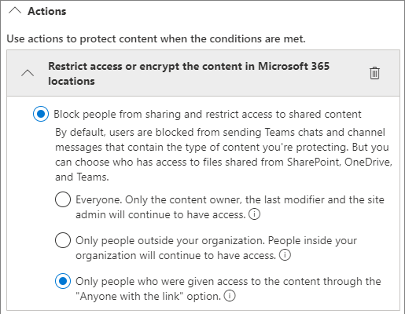

# Best practices for sharing files and folders with unauthenticated users

Unauthenticated sharing (*Anyone* links) can be convenient and is useful in various scenarios. *Anyone* links are the easiest way to share: people can open the link without authentication and are free to pass it on to others.

Usually, not all content in an organization is appropriate for unauthenticated sharing. This article covers the options available to help you create an environment where your users can use unauthenticated sharing of files and folders, but where there are safeguards in place to help protect your organization's content.

> [!NOTE]
> For unauthenticated sharing to work, you must enable it for your organization and for the individual site or team that you'll be using. See [Collaborating with people outside your organization](collaborate-with-people-outside-your-organization.md) for the scenario that you want to enable.

## Set an expiration date for *Anyone* links

Files are often stored in sites, groups, and teams for long periods of time. Occasionally there are data retention policies that require files to be retained for years. If such files are shared with unauthenticated people, this could lead to unexpected access and changes to files in the future. To mitigate this possibility, you can configure an expiration time for *Anyone* links.

Once an *Anyone* link expires, it can no longer be used to access content.

To set an expiration date for Anyone links across the organization

1. Open the SharePoint admin center, expand **Policies**, and then select <a href="https://go.microsoft.com/fwlink/?linkid=2185222" target="_blank">**Sharing**</a>.
1. Under **Choose expiration and permissions options for Anyone links**, select the **These links must expire within this many days** check box.</br>
   
1. Type a number of days in the box, and then select **Save**.

If you change the expiration time, existing links will keep their current expiration time if the new setting is longer, or be updated to the new setting if the new setting is shorter.

To set an expiration date for Anyone links on a specific site

1. Open the SharePoint admin center, expand **Sites**, and then select <a href="https://go.microsoft.com/fwlink/?linkid=2185220" target="_blank">**Active sites**</a>.
1. Select the site you want to change, and then select **Sharing**.
1. Under **Advanced settings for Anyone links**, under **Expiration of Anyone links**, clear the **Same as organization-level setting** check box.</br>
   
1. Select the **These links must expire within this many days** option, and type a number of days in the box.
1. Select **Save**.

Note that once an *Anyone* link expires, the file or folder can be reshared with a new *Anyone* link.

You can set *Anyone* link expiration for a specific site by using [Set-SPOSite](/powershell/module/sharepoint-online/set-sposite). 

```powershell
Set-SPOSite -Identity https://contoso.sharepoint.com/sites/marketing -OverrideTenantAnonymousLinkExpirationPolicy $true -AnonymousLinkExpirationInDays 15
```

## Set link permissions

By default, *Anyone* links for a file allow people to edit the file, and *Anyone* links for a folder allow people to edit and view files, and upload new files to the folder. You can change these permissions for files and for folders, independently, to view-only.

If you want to allow unauthenticated sharing, but are concerned about unauthenticated people modifying your organization's content, consider setting the file and folder permissions to **View**.

To set permissions for Anyone links across the organization

1. Open the SharePoint admin center, and select <a href="https://go.microsoft.com/fwlink/?linkid=2185222" target="_blank">**Sharing**</a>.
1. Under **Choose expiration and permissions options for Anyone links**, select the file and folder permissions that you want to use.</br>
   

With *Anyone* links set to **View**, users can still share files and folders with guests and give them edit permissions by using *Specific people* links. *Specific people* links require people outside your organization to authenticate as guests, and you can track and audit guest activity on files and folders shared with these links.

## Set default link type to a link that only work for people in your organization

When *Anyone* sharing is enabled for your organization, the default sharing link is normally set to **Anyone**. While this can be convenient for users, it can increase the risk of unintentional unauthenticated sharing. If a user forgets to change the link type while sharing a sensitive document, they might accidentally create a sharing link that doesn't require authentication.

You can mitigate this risk by changing the default link setting to a link that only works for people inside your organization. Users who want to share with unauthenticated people would then have to specifically select that option.

To set the default file and folder sharing link for the organization:

1. Open the SharePoint admin center, and select <a href="https://go.microsoft.com/fwlink/?linkid=2185222" target="_blank">**Sharing**</a>.
1. Under **File and folder links**, select **Only people in your organization**.

   

1. Select **Save**

To set the default file and folder sharing link for a specific site:

1. Open the SharePoint admin center, expand **Sites**, and then select <a href="https://go.microsoft.com/fwlink/?linkid=2185220" target="_blank">**Active sites**</a>.
1. Select the site you want to change, and then select **Sharing**.
1. Under **Default sharing link type**,  clear the **Same as organization-level setting** check box.

   

1. Select the **Only people in your organization** option, and then select **Save**.

## Prevent unauthenticated sharing of sensitive content

You can use [Microsoft Purview Data Loss Prevention (DLP)](/purview/dlp-learn-about-dlp) to prevent unauthenticated sharing of sensitive content. Data loss prevention can take action based on a file's sensitivity label, retention label, or sensitive information in the file itself.

To create a DLP rule:

1. In the [Microsoft Purview admin center](https://compliance.microsoft.com/), expand **Data loss prevention**, and select **Policies**.
1. Select **Create policy**.
1. Choose **Custom**, select **Custom policy,** and then select **Next**.
1. Type a name for the policy and select **Next**.
1. On the **Assign admin units** page, select **Next**.
1. On the **Locations to apply the policy** page turn off all settings except **SharePoint sites** and **OneDrive accounts**, and then select **Next**.
1. On the **Define policy settings** page, select **Next**.
1. On the **Customize advanced DLP rules** page, select **Create rule** and type a name for the rule.
1. Under **Conditions**, select **Add condition**, and choose **Content contains**.
1. Select **Add** and choose the type of information for which you want to prevent unauthenticated sharing.
1. Under **Actions** select **Add an action** and choose **Restrict access or encrypt the content in Microsoft 365 locations**.
1. Choose the **Block only people who were given access to the content through the "Anyone with the link" options** option.

      

1. Select **Save** and then select **Next**.
1. Choose your test options and select **Next**.
1. Select **Submit**, and then select **Done**.

## Protect against malicious files

When you allow anonymous users to upload files, you're at an increased risk of someone uploading a malicious file. You can use the *Safe Attachments* feature to check email attachments in a virtual environment before they're delivered to recipients and quarantine files that are found to be unsafe. For more information, see [Safe Attachments in Microsoft Defender for Office 365](/microsoft-365/security/office-365-security/safe-attachments-about).

You can also use the *Safe Documents* feature to scan opened Office documents in [Protected View](https://support.microsoft.com/office/d6f09ac7-e6b9-4495-8e43-2bbcdbcb6653) or [Application Guard for Office](https://support.microsoft.com/topic/9e0fb9c2-ffad-43bf-8ba3-78f785fdba46). For more information, see [Safe Documents in Microsoft 365 A5 or E5 Security](../security/office-365-security/safe-documents-in-e5-plus-security-about.md).

## Add copyright information to your files

If you use sensitivity labels in the Microsoft Purview admin center, you can configure *content marking* in your labels to add a watermark or a header or footer automatically to your organization's Office documents. In this way, you can make sure that shared files contain copyright or other ownership information.

To add a footer to a labeled file

1. Open the [Microsoft Purview admin center](https://compliance.microsoft.com).
1. In the left navigation, under **Solutions**, expand **Information protection** and select **Labels**.
1. Select the label where you want to add content marking, and then select **Edit label**.
1. Select **Next** to reach the **Choose protection settings for labeled items** page, and then select **Apply content marking**. Select **Next**
1. On the **Content marking** page, set **Content marking** to **On**.
1. Select the check box for the type of text you want to add, and then select **Customize text**.
1. Type the text that you want added to your documents, select the text options that you want, and then select **Save**.</br>
   
1. Select **Next** to reach the end of the wizard, and then select **Save label**.
1. Select **Done**.

With content marking enabled for the label, the text you specified will be added to Office documents when a user applies that label.

## Related articles

[Learn about sensitivity labels](/purview/sensitivity-labels)

[Limit accidental exposure to files when sharing with people outside your organization](share-limit-accidental-exposure.md)

[Create a more secure guest sharing environment](create-secure-guest-sharing-environment.md)
