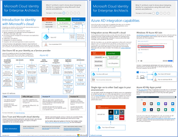
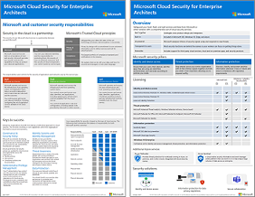
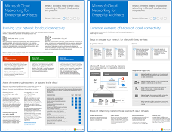
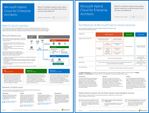
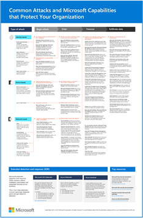

# Microsoft cloud for IT architects illustrations

These cloud architecture posters give you information about Microsoft cloud services, including Microsoft 365, Azure Active Directory (Azure AD), Microsoft Intune, Microsoft Dynamics 365, and hybrid on-premises and cloud solutions. 

IT decision makers and architects can use these resources to determine the ideal solutions for their workloads and to make decisions about core infrastructure components such as networking, identity, and security.

### Microsoft cloud identity for IT architects

What IT architects need to know about designing identity for organizations using Microsoft cloud services and platforms.
  
|**Item**|**Description**|
|:-----|:-----|
|   [View as a PDF](../downloads/MSFT_cloud_architecture_identity.pdf) \| [Download as a PDF](https://github.com/MicrosoftDocs/microsoft-365-docs/raw/public/microsoft-365/downloads/MSFT_cloud_architecture_identity.pdf)  \| [Download as a Visio](https://github.com/MicrosoftDocs/microsoft-365-docs/raw/public/microsoft-365/downloads/MSFT_cloud_architecture_identity.vsdx)  Updated September 2020 | This model contains:  <ul> <li> Introduction to identity with Microsoft's cloud </li><li> Azure AD IDaaS capabilities </li><li> Integrating on-premises Active Directory Domain Services (AD DS) accounts with Azure AD </li><li> Putting directory components in Azure IaaS </li><li> AD DS options for workloads in Azure IaaS </li></ul>    |

### Microsoft cloud security for IT architects

What IT architects need to know about security in Microsoft cloud services and platforms.
  
|**Item**|**Description**|
|:-----|:-----|
|.pdf)   [PDF](https://download.microsoft.com/download/6/D/F/6DFD7614-BBCF-4572-A871-E446B8CF5D79/MSFT_cloud_architecture_security%20(1).pdf)  \|  Updated April 2021 | This model contains: <ul><li>Microsoft and customer security responsibilities</li><li>Identity and device access</li><li>Threat protection</li><li>Information protection </ul> |
   

### Microsoft cloud networking for IT architects

What IT architects need to know about networking for Microsoft cloud services and platforms.
  
|**Item**|**Description**|
|:-----|:-----|
|    [View as a PDF](../downloads/MSFT_cloud_architecture_networking.pdf) \| [Download as a PDF](https://github.com/MicrosoftDocs/microsoft-365-docs/raw/public/microsoft-365/downloads/MSFT_cloud_architecture_networking.pdf)  \| [Download as a Visio](https://github.com/MicrosoftDocs/microsoft-365-docs/raw/public/microsoft-365/downloads/MSFT_cloud_architecture_networking.vsdx)  Updated August 2020 | This model contains: <ul><li> Evolving your network for cloud connectivity </li><li> Common elements of Microsoft cloud connectivity </li><li> ExpressRoute for Microsoft cloud connectivity </li><li> Designing networking for Microsoft SaaS, Azure PaaS, and Azure IaaS </li></ul>    |

### Microsoft hybrid cloud for IT architects

What IT architects need to know about hybrid cloud for Microsoft services and platforms.
  
|**Item**|**Description**|
|:-----|:-----|
|   [View as a PDF](../downloads/MSFT_cloud_architecture_hybrid.pdf)  \| [Download as a PDF](https://github.com/MicrosoftDocs/microsoft-365-docs/raw/public/microsoft-365/downloads/MSFT_cloud_architecture_hybrid.pdf)  \| [Download as a Visio](https://github.com/MicrosoftDocs/microsoft-365-docs/raw/public/microsoft-365/downloads/MSFT_cloud_architecture_hybrid.vsdx)  Updated August 2020 | This model contains: <ul><li> Microsoft's cloud offerings (SaaS, Azure PaaS, and Azure IaaS) and their common elements </li><li> Hybrid cloud architecture for Microsoft's cloud offerings </li><li> Hybrid cloud scenarios for Microsoft SaaS (Office 365), Azure PaaS, and Azure IaaS </li></ul> |

### Architecture approaches for Microsoft cloud tenant-to-tenant migrations 
This series of topics illustrates several architecture approaches for mergers, acquisitions, divestitures, and other scenarios that might lead you to migrate to a new cloud tenant. These topics provide starting-point guidance for enterprise resource planning. 

|**Item**|**Description**|
|:-----|:-----|
|   [PDF](https://download.microsoft.com/download/b/a/1/ba19dfe7-96e2-4983-8783-4dcff9cebe7b/microsoft-365-tenant-to-tenant-migration.pdf) \| Updated February 2021    |This model contains: <ul><li>A mapping of business scenarios to architecture approaches</li><li>Design considerations</li><li>Single event migration flow example</li><li>Phased migration flow example</li><li>Tenant move or split flow example</li></ul>|

### Common attacks and Microsoft capabilities that protect your organization
Learn about the most common cyber attacks and how Microsoft can help your organization at every stage of an attack. 

|**Item**|**Description**|
|:-----|:-----|
|   [PDF](https://download.microsoft.com/download/F/A/C/FACFC1E9-FA35-4DF1-943C-8D4237B4275B/MSFT_Cloud_architecture_security_commonattacks.pdf) \| [Visio](https://download.microsoft.com/download/F/A/C/FACFC1E9-FA35-4DF1-943C-8D4237B4275B/MSFT_Cloud_architecture_security_commonattacks.vsdx)   Updated August 2017 | This poster illustrates the path of common attacks and describes which capabilities help stop attackers at each stage of an attack.  |

