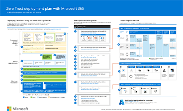

# Microsoft cloud for IT architects illustrations

These cloud architecture posters give you information about Microsoft cloud services, including Microsoft 365, Azure Active Directory (Azure AD), Microsoft Intune, Microsoft Dynamics 365, and hybrid on-premises and cloud solutions. 

IT decision makers and architects can use these resources to determine the ideal solutions for their workloads and to make decisions about core infrastructure components such as networking, identity, and security.

### Microsoft 365 Zero Trust deployment plan

This illustration provides a deployment plan for building Zero Trust security with Microsoft 365. Zero Trust is a new security model that assumes breach and verifies each request as though it originated from an uncontrolled network. Regardless of where the request originates or what resource it accesses, the Zero Trust model teaches us to "never trust, always verify."

| Item | Description |
|:-----|:-----|
|   [PDF](https://download.microsoft.com/download/f/d/b/fdb6ab0c-34bb-4cb8-84e6-5de8f13298da/m365-zero-trust-deployment-plan.pdf) \| [Visio](https://download.microsoft.com/download/f/d/b/fdb6ab0c-34bb-4cb8-84e6-5de8f13298da/m365-zero-trust-deployment-plan.vsdx)   Updated February 2023 | Use this illustration together with this article: [Microsoft 365 Zero Trust deployment plan](../security/Microsoft-365-zero-trust.md)   **Related solution guides**   <ul><li>[Deploy your identity infrastructure for Microsoft 365](/microsoft-365/enterprise/deploy-identity-solution-overview)</li><li>[Recommended identity and device access configurations](../security/office-365-security/microsoft-365-policies-configurations.md)</li><li>[Manage devices with Intune](manage-devices-with-intune-overview.md)</li><li>[Evaluate and pilot Microsoft 365 Defender](../security/defender/eval-overview.md)</li><li>[Deploy an information protection solution with Microsoft Purview](../compliance/information-protection-solution.md)</li><li>[Deploy information protection for data privacy regulations with Microsoft 365](information-protection-deploy.md)</li></ul>|

### Intune enrollment options

This guidance helps you decide which enrollment option is best for your endpoints, including options for:

- Windows devices
- macOS
- iOS/iPad
- Android

| Item | Description |
|:-----|:-----|
|   [PDF](https://download.microsoft.com/download/e/6/2/e6233fdd-a956-4f77-93a5-1aa254ee2917/msft-intune-enrollment-options.pdf) \| [Visio](https://download.microsoft.com/download/e/6/2/e6233fdd-a956-4f77-93a5-1aa254ee2917/msft-intune-enrollment-options.vsdx)   Updated June 2022 | **Related solution guides**   <ul><li>[Manage devices with Intune](manage-devices-with-intune-overview.md)</li><li>[Microsoft Intune planning guide](/mem/intune/fundamentals/intune-planning-guide)</ul>|

### Common attacks and Microsoft capabilities that protect your organization

Learn about the most common cyber attacks and how Microsoft can help your organization at every stage of an attack. 

| Item | Description |
|:-----|:-----|
|   [PDF](https://download.microsoft.com/download/F/A/C/FACFC1E9-FA35-4DF1-943C-8D4237B4275B/MSFT_Cloud_architecture_security_commonattacks.pdf) \| [Visio](https://download.microsoft.com/download/F/A/C/FACFC1E9-FA35-4DF1-943C-8D4237B4275B/MSFT_Cloud_architecture_security_commonattacks.vsdx)   Updated September 2021 | This poster illustrates the path of common attacks and describes which capabilities help stop attackers at each stage of an attack.   **Related solution guides**   <ul><li>[Evaluate and pilot Microsoft 365 Defender](../security/defender/eval-overview.md)</li><li>[Recommended identity and device access configurations](../security/office-365-security/microsoft-365-policies-configurations.md)</li><li>[Deploy information protection for data privacy regulations with Microsoft 365](information-protection-deploy.md)</li><li>[Deploy ransomware protection for your Microsoft 365 tenant](ransomware-protection-microsoft-365.md)</li><li>[Insider risk solutions in Microsoft 365](../compliance/insider-risk-solution-overview.md)</li></ul>|

### Microsoft cloud identity for IT architects

What IT architects need to know about designing identity for organizations using Microsoft cloud services and platforms.
  
| Item | Description |
|:-----|:-----|
|   [PDF](https://download.microsoft.com/download/3/6/a/36a7c1ba-fe48-414f-92c9-9c9ddba323cd/5594928a.pdf)    Updated November 2021 | This model contains:  <ul> <li> Introduction to identity with Microsoft's cloud </li><li> Azure AD IDaaS capabilities </li><li>Zero Trust identity and device access policies</li><li> Integrating on-premises Active Directory Domain Services (AD DS) accounts with Azure AD </li><li> Putting directory components in Azure IaaS </li><li> AD DS options for workloads in Azure IaaS </li></ul>    |

### Microsoft cloud security for IT architects

What IT architects need to know about security in Microsoft cloud services and platforms.
  
| Item | Description |
|:-----|:-----|
|   [PDF](https://download.microsoft.com/download/6/D/F/6DFD7614-BBCF-4572-A871-E446B8CF5D79/MSFT_cloud_architecture_security.pdf)   Updated February 2022 | This model contains: <ul><li>Microsoft and customer security responsibilities</li><li>Identity and device access</li><li>Threat protection</li><li>Information protection </li><li>Cloud app protection </li></ul> |

### Microsoft cloud networking for IT architects

What IT architects need to know about networking for Microsoft cloud services and platforms.
  
| Item | Description |
|:-----|:-----|
|    [View as a PDF](../downloads/MSFT_cloud_architecture_networking.pdf) \| [Download as a PDF](https://github.com/MicrosoftDocs/microsoft-365-docs/raw/public/microsoft-365/downloads/MSFT_cloud_architecture_networking.pdf)  \| [Download as a Visio](https://github.com/MicrosoftDocs/microsoft-365-docs/raw/public/microsoft-365/downloads/MSFT_cloud_architecture_networking.vsdx)  Updated August 2020 | This model contains: <ul><li> Evolving your network for cloud connectivity </li><li> Common elements of Microsoft cloud connectivity </li><li> ExpressRoute for Microsoft cloud connectivity </li><li> Designing networking for Microsoft SaaS, Azure PaaS, and Azure IaaS </li></ul>    |

### Microsoft hybrid cloud for IT architects

What IT architects need to know about hybrid cloud for Microsoft services and platforms.
  
| Item | Description |
|:-----|:-----|
|   [View as a PDF](../downloads/MSFT_cloud_architecture_hybrid.pdf)  \| [Download as a PDF](https://github.com/MicrosoftDocs/microsoft-365-docs/raw/public/microsoft-365/downloads/MSFT_cloud_architecture_hybrid.pdf)  \| [Download as a Visio](https://github.com/MicrosoftDocs/microsoft-365-docs/raw/public/microsoft-365/downloads/MSFT_cloud_architecture_hybrid.vsdx)  Updated August 2020 | This model contains: <ul><li> Microsoft's cloud offerings (SaaS, Azure PaaS, and Azure IaaS) and their common elements </li><li> Hybrid cloud architecture for Microsoft's cloud offerings </li><li> Hybrid cloud scenarios for Microsoft SaaS (Office 365), Azure PaaS, and Azure IaaS </li></ul> |

### Architecture approaches for Microsoft cloud tenant-to-tenant migrations 
This series of topics illustrates several architecture approaches for mergers, acquisitions, divestitures, and other scenarios that might lead you to migrate to a new cloud tenant. These topics provide starting-point guidance for enterprise resource planning. 

| Item | Description |
|:-----|:-----|
|   [PDF](https://download.microsoft.com/download/b/a/1/ba19dfe7-96e2-4983-8783-4dcff9cebe7b/microsoft-365-tenant-to-tenant-migration.pdf)   Updated May 2021    |This model contains: <ul><li>A mapping of business scenarios to architecture approaches</li><li>Design considerations</li><li>Single event migration flow example</li><li>Phased migration flow example</li><li>Tenant move or split flow example</li></ul>|

## Related resources

Get resources to create your own architecture design diagrams: [Microsoft 365 architecture icons and templates](architecture-icons-templates.md).

Go to the [Azure architecture center](/azure/architecture/).
