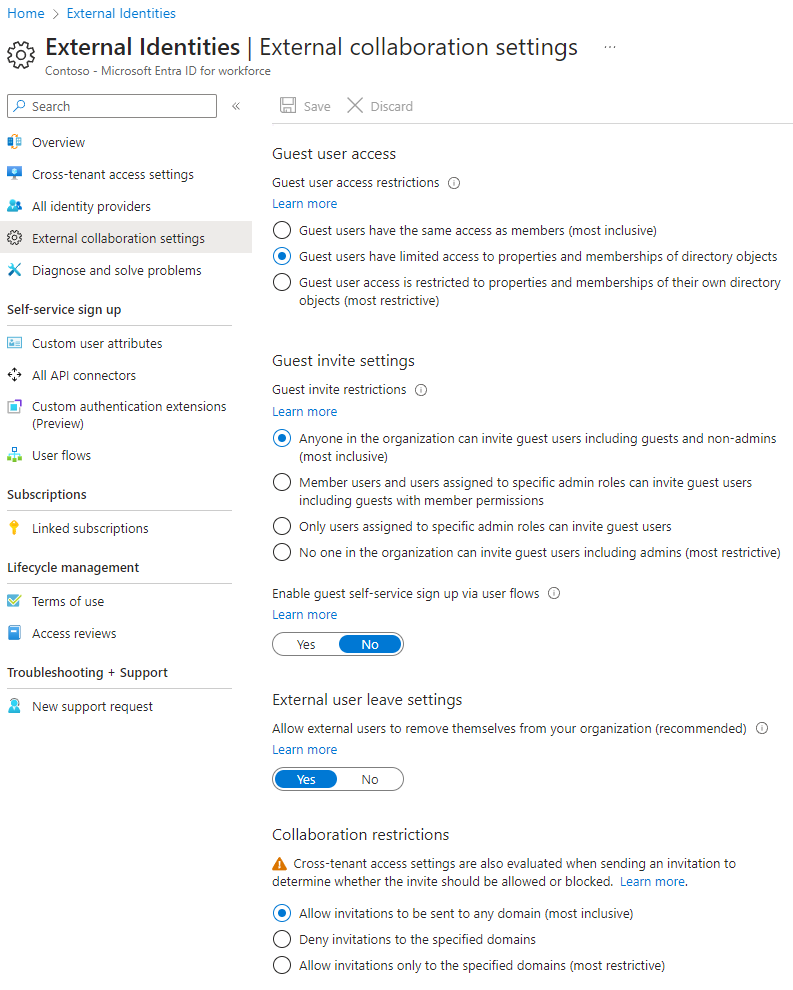
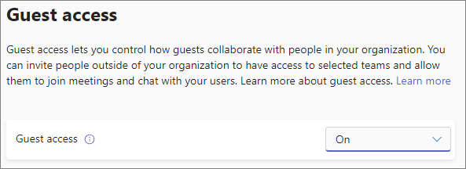
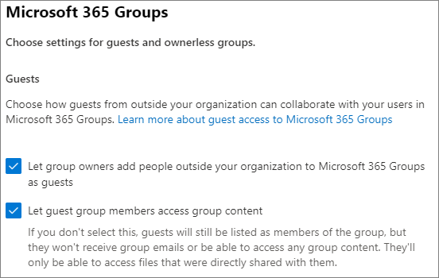
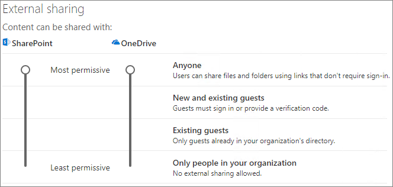
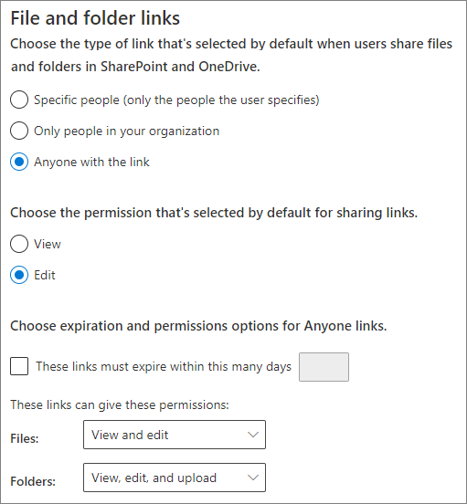
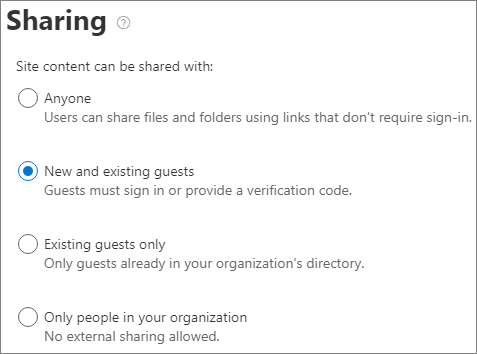

# Collaborate with guests in a team (IT Admins)

If you need to collaborate with guests across documents, tasks, and conversations, we recommend using Microsoft Teams. Teams provides all of the collaboration features available in Office and SharePoint with persistent chat and a customizable and extensible set of collaboration tools in a unified user experience.

In this article, we'll walk through the Microsoft 365 configuration steps necessary to set up a team for collaboration with guests. Once you have configured guest access, you can invite guests to teams by following the steps in [Add guests to a team in Teams](https://support.microsoft.com/office/fccb4fa6-f864-4508-bdde-256e7384a14f).

> [!NOTE]
> [Shared channels](collaborate-teams-direct-connect.md) offers a more seamless experience than guest accounts when collaborating with other Microsoft 365 organizations. Shared channels allow you to collaborate with people outside your organization using Teams channels without the need for external participants to sign in to your organization. We recommend you review [Plan external collaboration](plan-external-collaboration.md) to see if shared channels is a better options than collaborating with guests for any given scenario.

## Video demonstration

This video shows the configuration steps described in this document. 

> [!VIDEO https://www.microsoft.com/videoplayer/embed/RE44NTr?autoplay=false]

## Azure External collaboration settings

Sharing in Microsoft 365 is governed at its highest level by the [B2B external collaboration settings in Azure Active Directory](/azure/active-directory/external-identities/delegate-invitations). If guest sharing is disabled or restricted in Azure AD, this setting overrides any sharing settings that you configure in Microsoft 365.

Check the B2B external collaboration settings to ensure that sharing with guests isn't blocked.

To set external collaboration settings

1. Log in to Azure Active Directory at [https://entra.microsoft.com/](https://entra.microsoft.com/).
1. In the left navigation pane, expand **External identities**.
1. Select **External collaboration settings**.
1. Ensure that either **Member users and users assigned to specific admin roles can invite guest users including guests with member permissions** or **Anyone in the organization can invite guest users including guests and non-admins** is selected.
1. If you made changes, select **Save**.

Note the settings in the **Collaboration restrictions** section. Make sure that the domains of the guests that you want to collaborate with aren't blocked.

If you work with guests from multiple organizations, you may want to restrict their ability to access directory data. This prevents them from seeing who else is a guest in the directory. To do this, under **Guest user access restrictions**, select **Guest users have limited access to properties and membership of directory objects settings** or **Guest user access is restricted to properties and memberships of their own directory objects**.

## Teams guest access settings

Teams has an on/off switch for guest access and a variety of settings available to control what guests can do in a team. The **Allow guest access in Teams** setting must be **On** for guest access to work in Teams.

Check to ensure that guest access is enabled in Teams and make any adjustment to the guest settings based on your business needs. Keep in mind that these settings affect all teams.

To set Teams guest access settings

1. Log in to the Microsoft 365 admin center at [https://admin.microsoft.com](https://admin.microsoft.com).
1. In the left navigation pane, select **Show all**.
1. Under **Admin centers**, select **Teams**.
1. In the Teams admin center, in the left navigation pane select **Users** > <a href="https://go.microsoft.com/fwlink/p/?linkid=2173122" target="_blank">**Guest access**</a>.
1. Ensure that **Guest access** is set to **On**.
1. Make any desired changes to the additional guest settings, and then select **Save**.

Once Teams guest access is turned on, you can optionally control guest access to individual teams and their associated SharePoint sites using sensitivity labels. For more information, see [Use sensitivity labels to protect content in Microsoft Teams, Microsoft 365 groups, and SharePoint sites](../compliance/sensitivity-labels-teams-groups-sites.md).

> [!NOTE]
> It may take up to twenty-four hours for the Teams guest settings to become active after you turn it on.

## Microsoft 365 Groups guest settings

Teams uses Microsoft 365 Groups for team membership. The Microsoft 365 Groups guest settings must be turned on in order for guest access in Teams to work.

To set Microsoft 365 Groups guest settings

1. In the Microsoft 365 admin center, in the left navigation pane, expand **Settings**.
1. Select **Org settings**.
1. In the list, select **Microsoft 365 Groups**.
1. Ensure that the **Let group owners add people outside your organization to Microsoft 365 Groups as guests** and **Let guest group members access group content** check boxes are both checked.
1. If you made changes, select **Save changes**.

## SharePoint organization level sharing settings

Teams content such as files, folders, and lists are all stored in SharePoint. In order for guests to have access to these items in Teams, the SharePoint organization-level sharing settings must allow for sharing with guests.

The organization-level settings determine what settings are available for individual sites, including sites associated with teams. Site settings cannot be more permissive than the organization-level settings.

If you want to allow file and folder sharing with unauthenticated people, choose **Anyone**. If you want to ensure that all guests have to authenticate, choose **New and existing guests**. Choose the most permissive setting that's needed by any site in your organization.

To set SharePoint organization-level sharing settings

1. In the SharePoint admin center, in the left navigation pane, expand **Policies** and then select <a href="https://go.microsoft.com/fwlink/?linkid=2185222" target="_blank">**Sharing**</a>.
1. Ensure that external sharing for SharePoint is set to **Anyone** or **New and existing guests**.
1. If you made changes, select **Save**.

## SharePoint organization-level default link settings

The default file and folder link settings determine the link option that's shown to users by default when they share a file or folder. Users can change the link type to one of the other options before sharing, if desired.

Keep in mind that this setting affects all teams and SharePoint sites in your organization.

Choose any one of the following link-types which will be selected by default when users share files and folders:

- **Anyone with the link** - Choose this option if you expect to do a lot of unauthenticated sharing of files and folders. If you want to allow *Anyone* links but are concerned about accidental unauthenticated sharing, consider one of the other options as the default. This link type is only available if you've enabled **Anyone** sharing.
- **Only people in your organization** - Choose this option if you expect most file and folder sharing to be with people inside your organization.
- **Specific people** - Consider this option if you expect to do a lot of file and folder sharing with guests. This type of link works with guests and requires them to authenticate.
 

To set the SharePoint organization-level default link settings

1. Go to <a href="https://go.microsoft.com/fwlink/?linkid=2185222" target="_blank">**Sharing**</a> in the SharePoint admin center.
1. Under **File and folder links**, select the default sharing link that you want to use.
1. If you made changes, select **Save**.

To set the permission for the sharing link, under **Choose the permission that's selected by default for sharing links.**

1. Select **View** if you do not want users to make changes to the files and folders.
1. Select **Edit** if you want to allow users to make changes to the files and folders.

Optionally, choose an expiration time for *Anyone* links.

## Create a team

The next step is to create the team that you plan to use for collaborating with guests.

To create a team
1. In Teams, on the **Teams** tab, select **Join or create a team** (**+**).
1. Select **Create a team**.
1. Select **From scratch**.
1. Choose a sensitivity label if needed.
1. Choose **Private** or **Public**.
1. Type a name and description for the team, and then select **Create**.
1. Select **Skip**.

We'll invite users later. Next, it's important to check the site-level sharing settings for the SharePoint site that is associated with the team.

## SharePoint site-level sharing settings

Check the site-level sharing settings to make sure that they allow the type of access that you want for this team. For example, if you set the organization-level settings to **Anyone**, but you want all guests to authenticate for this team, then make sure the site-level sharing settings are set to **New and existing guests**.

To set site-level sharing settings
1. In the SharePoint admin center, in the left navigation pane, expand **Sites** and select <a href="https://go.microsoft.com/fwlink/?linkid=2185220" target="_blank">**Active sites**</a>.
1. Select the site for the team that you just created.
1. On the **Settings** tab, select **More sharing settings**.
1. Ensure that sharing is set to **Anyone** or **New and existing guests**.
1. If you made changes, select **Save**.

## Invite users

Guest sharing settings are now configured, so you can start adding internal users and guests to your team. 

To invite internal users to a team
1. In the team, select **More options** (**\*\*\***), and then select **Add member**.
2. Type the name of the person who you want to invite.
3. Select **Add**, and then select **Close**.

To invite guests to a team
1. In the team, select **More options** (**\*\*\***), and then select **Add member**.
2. Type the email address of the guest whom you want to invite.
3. Select **Edit guest information**.
4. Type the guest's full name and select the check mark.
5. Select **Add**, and then select **Close**.

> [!NOTE]
> Guests with a work or school account can only be invited by using their User Principal Name (UPN) (for example, adele@contoso.com). Inviting guests by using EAS ID, or other email formats, is not supported.

## Related topics

[Best practices for sharing files and folders with unauthenticated users](best-practices-anonymous-sharing.md)

[Limit accidental exposure to files when sharing with guests](share-limit-accidental-exposure.md)

[Create a secure guest sharing environment](create-secure-guest-sharing-environment.md)

[Create a B2B extranet with managed guests](b2b-extranet.md)

[SharePoint and OneDrive integration with Azure AD B2B](/sharepoint/sharepoint-azureb2b-integration-preview)
