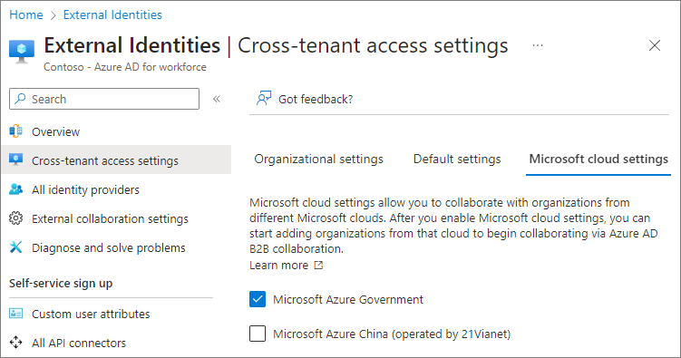

# Collaborate with guests from other Microsoft 365 cloud environments (Preview)

Microsoft 365 organizations have one of several tenant types and are located in one of three Microsoft clouds:

|Microsoft Azure cloud environment|Microsoft 365 cloud environment|
|:--------------------------------|:------------------------------|
|Microsoft Azure Commercial|Commercial, GCC|
|Microsoft Azure Government|GCC High, DoD|
|Microsoft Azure China|China (21Vianet)|

In order to invite guests from an organization in a different Microsoft Azure cloud environment, you must do the following:

1. If the organization you want to collaborate with is in a different Microsoft Azure cloud environment (such as commercial and DoD), enable cross-tenant connections with that Microsoft Azure cloud environment.
1. Set up cross-tenant access settings in Azure AD with the organization that you want to collaborate with.

Note that tenants in Microsoft Azure Government (Microsoft 365 GCC High and DoD) can't create a cross-tenant connection with tenants in Microsoft Azure China.

> [!NOTE]
> Cross-cloud guest access between Microsoft 365 China (21Vianet) and other Microsoft 365 cloud environments is not supported during the preview.

> [!IMPORTANT]
> The organization that you're collaborating with must also configure these settings for their organization.

## Prerequisites

Inviting guests from organizations in other Microsoft 365 cloud environments requires that guest access be configured for your organization. If you haven't previously configured guest access, see one of the following depending on your scenario:

- [Collaborate with guests on a document](collaborate-on-documents.md)
- [Collaborate with guests in a site](collaborate-in-site.md)
- [Collaborate with guests in a team](collaborate-as-team.md)

Additionally, to enable B2B collaboration with an organization in a different Microsoft 365 cloud environment, you need the organization's tenant ID. If you know the fully qualified domain name of the other organization, you can look up the tenantID in the Teams admin center. Open [meeting settings](https://admin.teams.microsoft.com/meetings/settings), select **Lookup** under **Cross-cloud meetings**, type in the fully qualified domain name, and select **Show tenant ID**.

## Allow cross-tenant connections with other Microsoft 365 cloud environments

If you're setting up guest sharing with a tenant that's in a different Microsoft Azure cloud environment than yours, then you need to enable connections with that cloud environment before you add the organizational relationship.

Enable the Microsoft Azure cloud environment you want to collaborate with in Azure AD cross tenant access settings.

1. Sign in to [Azure Active Directory](https://aad.portal.azure.com) using a Global administrator or Security administrator account.
1. Select **External Identities**, and then select **Cross-tenant access settings**.
1. Select **Microsoft cloud settings**.
1. Select the checkboxes next to the external Microsoft Azure cloud environments you want to enable.

   

### Add an organization

Once you've enabled the cloud environments you want to collaborate with, you need to add the specific organizations with which you want to enable B2B collaboration. Unlike B2B collaboration with organizations in the same cloud environment, B2B collaboration with organizations in different Microsoft 365 cloud environments requires that each organization be added to Azure AD cross-tenant access settings.

To add an organization

1. Sign in to [Azure Active Directory](https://aad.portal.azure.com) using a Global administrator or Security administrator account.
1. Select **External Identities**, and then select **Cross-tenant access settings**.
1. Select **Organizational settings**.
1. Select **Add organization**.
1. On the **Add organization** pane, type the tenant ID for the organization and press Enter. (Note that you can't search on domain names from other clouds.)
1. Select **Add**.
1. The organization appears in the organizations list. At this point, all access settings for this organization are inherited from your default settings.

New organizations inherit B2B collaboration settings from the default. If your default settings block B2B collaboration or if you want to limit collaboration to specific users or groups, update the organization's inbound and outbound settings.

##### Configure inbound settings for the organization

Use the inbound settings to specify which users or groups from the external organization can access resources in your organization.

To configure inbound settings for an organization

1. Select the inbound access link for the organization that you want to modify.
1. On the **B2B collaboration** tab, choose **Customize settings**.
1. On the **External users and groups** tab, choose **Allow access** and **All \<organization\> users and groups**. (You can choose **Select \<organization\> users and groups** if you want to limit access to specific users and groups, such as those who have signed a non-disclosure agreement.)
1. If you want to limit guest access to Microsoft 365, you can select the **Office 365** application on the **Applications** tab.
1. Select **Save** and close the **Inbound access settings** blade.

##### Configure outbound settings for the organization

Use the outbound settings to specify which users or groups from your organization can access resources in the external organization.

To configure outbound settings for an organization

1. Select the outbound access link for the organization that you want to modify.
1. On the **B2B collaboration** tab, choose **Customize settings**.
1. On the **Users and groups** tab, choose **Allow access** and set an **Applies to** of all users, or select the users or groups that you want to allow to access the external organization.
1. Select **Save**, choose **Yes** to confirm, and close the **Outbound access settings** blade.

## Related topics

[Meet with people in other Microsoft 365 clouds](/microsoftteams/cross-cloud-meetings)

[Configure Microsoft cloud settings for B2B collaboration](/azure/active-directory/external-identities/cross-cloud-settings)

[Configure cross-tenant access settings for B2B direct connect](/azure/active-directory/external-identities/cross-tenant-access-settings-b2b-direct-connect)

