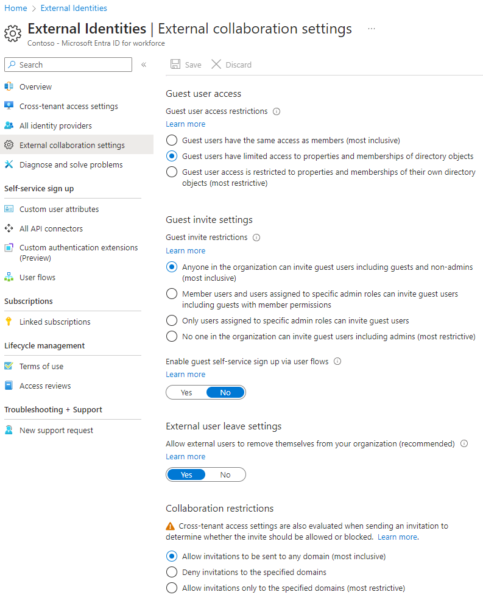

# Collaborate with guests in a site

If you need to collaborate with guests across documents, data, and lists, you can use a SharePoint site. Modern SharePoint sites are connected to Microsoft 365 Groups and can manage the site membership and provide additional collaboration tools such as a shared mailbox and a calendar.

In this article, we'll walk through the Microsoft 365 configuration steps necessary to set up a SharePoint site for collaboration with guests.

## Video demonstration

This video shows the configuration steps described in this document. 

> [!VIDEO https://www.microsoft.com/videoplayer/embed/RE44Llg?autoplay=false]

## Azure external collaboration settings

Sharing in Microsoft 365 is governed at its highest level by the [B2B external collaboration settings in Azure Active Directory](/azure/active-directory/external-identities/delegate-invitations). If guest sharing is disabled or restricted in Azure AD, this setting overrides any sharing settings that you configure in Microsoft 365.

Check the B2B external collaboration settings to ensure that sharing with guests is not blocked.

To set external collaboration settings

1. Log in to Azure Active Directory at [https://aad.portal.azure.com](https://aad.portal.azure.com).
2. In the left navigation pane, click **Azure Active Directory**.
3. Click **External identities**.
4. On the **Get started** screen, in the left navigation pane, click **External collaboration settings**.
5. Ensure that **Admins and users in the guest inviter role can invite** and **Members can invite** are both set to **Yes**.
6. If you made changes, click **Save**.

Note the settings in the **Collaboration restrictions** section. Make sure that the domains of the guests that you want to collaborate with aren't blocked.

If you work with guests from multiple organizations, you may want to restrict their ability to access directory data. This will prevent them from seeing who else is a guest in the directory. To do this, under **Guest user access restrictions**, select **Guest users have limited access to properties and membership of directory objects settings** or **Guest user access is restricted to properties and memberships of their own directory objects**.

## Microsoft 365 Groups guest settings

Modern SharePoint sites use Microsoft 365 Groups to control site access. The Microsoft 365 Groups guest settings must be turned on in order for guest access in SharePoint sites to work.

To set Microsoft 365 Groups guest settings

1. In the Microsoft 365 admin center, in the left navigation pane, expand **Settings**.
2. Click **Org settings**.
3. In the list, click **Microsoft 365 Groups**.
4. Ensure that the **Let group owners add people outside your organization to Microsoft 365 Groups as guests** and **Let guest group members access group content** check boxes are both checked.
5. If you made changes, click **Save changes**.

## SharePoint organization-level sharing settings

In order for guests to have access to SharePoint sites, the SharePoint organization-level sharing settings must allow for sharing with guests.

The organization-level settings determine the settings that will be available for individual sites. Site settings cannot be more permissive than the organization-level settings.

If you want to allow unauthenticated file and folder sharing, choose **Anyone**. If you want to ensure that all people outside your organization have to authenticate, choose **New and existing guests**. Choose the most permissive setting that will be needed by any site in your organization.

To set SharePoint organization-level sharing settings

1. In the Microsoft 365 admin center, in the left navigation pane, under **Admin centers**, click **SharePoint**.
2. In the SharePoint admin center, in the left navigation pane, under **Policies**, click **Sharing**.
3. Ensure that external sharing for SharePoint is set to **Anyone** or **New and existing guests**.
4. If you made changes, click **Save**.

## Create a site

The next step is to create the site that you plan to use for collaborating with guests.

To create a site
1. In the SharePoint admin center, under **Sites**, click **Active sites**.
2. Click **Create**.
3. Click **Team site**.
4. Type a site name and enter a name for the Group owner (site owner).
5. Under **Advanced settings**, choose if you want this site to be a public or private one.
6. Click **Next**.
7. Click **Finish**.

We'll invite users later. Next, it's important to check the site-level sharing settings for this site.

## SharePoint site-level sharing settings

Check the site-level sharing settings to make sure that they allow the type of access that you want for this site. For example, if you set the organization-level settings to **Anyone**, but you want all guests to authenticate for this site, then make sure the site-level sharing settings are set to **New and existing guests**.

Note that the site cannot be shared with unauthenticated people (**Anyone** setting), but individual files and folders can.

You can also use [sensitivity labels to control external sharing settings for SharePoint sites](../compliance/sensitivity-labels-teams-groups-sites.md).

To set site-level sharing settings
1. In the SharePoint admin center, in the left navigation, expand **Sites** and click **Active sites**.
2. Select the site that you want to share.
3. Click ..., and click **Sharing**.
4. Ensure that sharing is set to **Anyone** or **New and existing guests**.
5. If you made changes, click **Save**.

## Invite users

Guest sharing settings are now configured, so you can start adding internal users and guests to your site. Site access is controlled through the associated Microsoft 365 Group, so we'll be adding users there.

To invite internal users to a group
1. Navigate to the site where you want to add users.
2. Click **Members** link in the upper right which denotes the member count.
3. Click **Add members**.
4. Type the names or email addresses of the users that you want to invite to the site, and then click **Save**.

Guests can't be added from the site. You need to add them using Outlook on the web. Therefore, as a prerequisite to add and invite guests to a group, click the URL of the site in the **URL**  column to navigate to the site-specific page. From this page, click the **App launcher** icon and select **Outlook**. This is the screen from which you can invite guests into a group, for which procedure is described below.

To invite guests to a group
1. Under **Groups**, click the group to which you want to invite guests.
2. Open the group contact card, click **Members** link in the upper right (the link which denotes the member count).
3. click **Add members**.
4. Type the email addresses of the guests that you want to invite, and then click **Add**.
5. Click **Close**.
Note that you need to click **Close** only if you are not the owner of the group and as a result, you are not allowed to add the guest into the group. In such cases, the request to add the guest into the group is transferred to the group owner for approval.

## See also

[Best practices for sharing files and folders with unauthenticated users](best-practices-anonymous-sharing.md)

[Limit accidental exposure to files when sharing with guests](share-limit-accidental-exposure.md)

[Create a secure guest sharing environment](create-secure-guest-sharing-environment.md)

[Create a B2B extranet with managed guests](b2b-extranet.md)

[SharePoint and OneDrive integration with Azure AD B2B](/sharepoint/sharepoint-azureb2b-integration-preview)