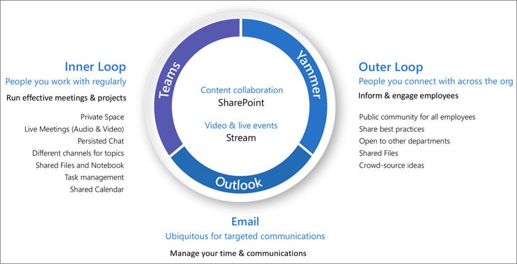

# What is collaboration governance?

Collaboration governance is how you manage users' access to resources, compliance with your business standards, and ensure the security of your data.

Organizations today are using a diverse tool set. There's the team of developers using team chat, the executives sending email, and the entire organization connecting over enterprise social. Multiple collaboration tools are in use because every group is unique and has their own functional needs and work style. Some will use only email while others will live primarily in chat. 

If users feel the IT-provided tools do not fit their needs, they will likely download their favorite consumer app which supports their scenarios. Although this process allows users to get started quickly, it leads to a frustrating user experience across the organization with multiple logins, difficulty sharing, and no single place to view content. This concept is referred to as “Shadow IT” and poses a significant risk to organizations. It reduces the ability to uniformly manage user access, ensure security, and service compliance needs.

Services such as Microsoft 365 groups, Teams, and Yammer empower users and reduces the risk of shadow IT by providing the tools needed to collaborate. Microsoft 365 has a rich set of tools to implement any governance capabilities your organization might require. 

This series of articles will help you understand how groups, teams, and SharePoint settings interact, what governance capabilities are available, and how to create and implement a governance plan for the collaboration features in Microsoft 365.

### Setting up secure collaboration with Microsoft 365

There are many options for deploying Microsoft 365 Groups and Teams for secure collaboration in your organization. We recommend you use this governance content alongside [Set up secure collaboration with Microsoft 365](setup-secure-collaboration-with-teams.md) and its associated articles to create the best collaboration solution for your organization.

### Data residency

If your organization is multi-national and you have data residency requirements for different geographies, include [Microsoft 365 Multi-Geo](/microsoft-365/enterprise/microsoft-365-multi-geo) as part of your collaboration governance plan.

## Why Microsoft 365 groups are important

Microsoft 365 groups lets you choose a set of people with whom you wish to collaborate, and easily set up a collection of resources for those people to share. Adding members to the group automatically grants the needed permissions to all assets provided by the group. Both Teams and Yammer use Microsoft 365 groups to manage their membership.

Microsoft 365 groups include a suite of linked resources that users can use for communication and collaboration. Groups always include a SharePoint site, Planner, a Power BI workspace, a mailbox and calendar, and Stream. Depending on how you create the group, you can optionally add other services such as Teams, Yammer, and Project.

|Resource|Description|
|:------|:----------|
|[Calendar](https://support.office.com/article/schedule-a-meeting-on-a-group-calendar-in-outlook-0cf1ad68-1034-4306-b367-d75e9818376a)|For scheduling events related to the group|
|[Inbox](https://support.office.com/article/have-a-group-conversation-in-outlook-a0482e24-a769-4e39-a5ba-a7c56e828b22)|For email conversations between group members. This inbox has an email address and can be set to accept messages from people outside the group and even outside your organization, much like a traditional distribution list.|
|[OneNote notebook](https://support.office.com/article/get-started-with-onenote-e768fafa-8f9b-4eac-8600-65aa10b2fe97)|For gathering ideas, research, and information|
|[Planner](https://support.office.com/article/microsoft-planner-help-4a9a13c6-3adf-4a60-a6fc-15c0b15e16fc)|For assigning and managing project tasks among your group members|
|[Power BI Workspace](/power-bi/collaborate-share/service-new-workspaces)|A data collaboration space with dashboards and reports|
|[Project and Roadmap](https://support.microsoft.com/project)|Web-based project management tools|
|[SharePoint team site](https://support.office.com/article/what-is-a-sharepoint-team-site-75545757-36c3-46a7-beed-0aaa74f0401e)|A central repository for information, links and content relating to your group|
|[Stream](https://support.microsoft.com/microsoft-stream)|A video streaming service|
|[Teams](https://support.microsoft.com/teams)|A chat-based workspace in Microsoft 365|
|[Yammer group](https://support.office.com/article/Learn-about-Office-365-groups-b565caa1-5c40-40ef-9915-60fdb2d97fa2)|A common place to have conversations and share information|

Microsoft 365 Groups includes a variety of governance controls, including an expiration policy, naming conventions, and a blocked words policy, to help you manage groups in your organization. Because groups control membership and access to this suite of resources, managing groups is a key part of governing collaboration in Microsoft 365.

## Define a collaboration strategy for your organization

There are multiple places to collaborate and have conversations within Microsoft 365. Understanding where users can start conversations can help you define a strategy for communication.

There are three main communication methods supported by Microsoft 365:

- Outlook: collaboration through email with a shared group inbox and calendar
- Microsoft Teams: a persistent-chat-based workspace where you can have informal, real-time, conversations around a variety of topics, organized by specific sub-groups
- Yammer: enterprise social experience for collaboration

- Teams: chat-based workspace (high velocity collaboration) – inner loop
  - Built for collaboration with the people your users work with every day
  - Puts information at the fingertips of users in a single experience
  - Add tabs, connectors and bots
  - Live chat, audio/video conferencing, recorded meetings

- Yammer: connect across the org (enterprise social) – outer loop
  - Communities of practice - Cross-functional groups of people who share a common interest or expertise but are not necessarily working together on a day-to-day basis
  - Leadership connection, learning communities, role-based communities

- Mailbox and calendar (email-based collaboration)
  - Used for targeted communication with a group of people
  - Shared calendar for meetings with other group members
 
As you determine how you want to use collaboration features in Microsoft 365, consider these methods of communication and which your users are likely to use in different scenarios.

> [!NOTE]
> When a new Office 365 Group is created via Yammer or Teams, the group isn't visible in Outlook or the address book because the primary communication between those users happens in their respective clients. Yammer groups cannot be connected to Teams.

## Best practices

As you start your governance planning process, keep these best practices in mind:

- **Talk to your users** - identify your biggest users of collaboration features and meet with them to understand their core business requirements and use case scenarios.

- **Balance risks and benefits** - review your business, regulatory, legal, and compliance needs and plan a solution that optimizes for all outcomes.

- **Adapt to different organizations and different types of content and scenarios** - consider the different needs for different groups or departments and different types of content such as intranet content versus a user's OneDrive content.

- **Align to business priorities** - business goals will help you define how much time and energy you need to invest in governance.

- **Embed governance decisions directly in the solutions you create** - many governance decisions can be implemented by turning on or off features in Microsoft 365.

- **Use a phased approach** - Roll collaboration features out to a small group of users first. Get feedback from them, watch for help desk tickets, and update any needed settings or processes before proceeding to a larger group.

- **Reinforce with training** - adapt solutions such as [Microsoft 365 learning pathways](/office365/customlearning) to ensure that your organization-specific expectations are reinforced with Microsoft-provided training.

- **Have a strategy for communicating governance policies and guidelines in your organization** - create a Microsoft 365 Adoption Center in a SharePoint communication site to communicate policies and procedures.

- **Define roles and responsibilities** - identify your governance core team and work through key governance decisions about provisioning and naming and external access first, and then work through the remaining decisions.

- **Revisit your decisions as business and technology changes** - meet periodically to review new capabilities and new business expectations.

For a closer look at these practices, read [Create your collaboration governance plan](collaboration-governance-first.md).

## End user impact and change management

Because groups and teams can be created in several ways, we recommend training your users to use the method that fits your organization the best:

- If your organization does most of its communication using email, instruct your users to create groups in Outlook.
- If your organization heavily uses SharePoint or is migrating from SharePoint on-premises, instruct your users to create SharePoint team sites for collaboration.
- If your organization has deployed Teams, instruct your users to create a team when they need need a collaboration space.

This helps avoid confusion if users are unfamiliar with how groups relate to their related services. For more information about how to talk to your users about groups, see [Explaining Microsoft 365 Groups to your users](../admin/create-groups/explain-groups-knowledge-worker.md).

## Key governance capabilities and licensing requirements

Governance capabilities for collaboration in Microsoft 365 include features in Microsoft 365, Teams, SharePoint, and Azure Active Directory.

| Capability or feature | Description | Licensing |
|:----------------------|:------------|:----------|
|Team and site sharing|Control if teams, groups, and sites can be shared with people outside your organization.|Microsoft 365 E5 or E3|
|Domain allow/block|Restrict sharing with people outside your organization to people from specific domains.|Microsoft 365 E5 or E3|
|Self-service site creation|Allow or prevent users from creating their own SharePoint sites.|Microsoft 365 E5 or E3|
|Restricted site and file sharing|Restrict site, file, and folder sharing to members of a specific security group.|Microsoft 365 E5 or E3|
|Restricted group creation|Restrict team and group creation to members of a specific security group.|Microsoft 365 E5 or E3 with Azure AD Premium or Azure AD Basic EDU licenses|
|Group naming policy|Enforce prefixes or suffixes on group and team names.|Microsoft 365 E5 or E3 with Azure AD Premium or Azure AD Basic EDU licenses|
|Group expiration policy|Set inactive groups and teams to expire and be deleted after a specified period of time.|Microsoft 365 E5 or E3 with Azure AD Premium licenses|
|Per-group guest access|Allow or prevent team and group sharing with people outside your organization on a per-group basis.|Microsoft 365 E5 or E3|

## Collaboration governance planning step-by-step

Follow these basic steps to create your governance plan:

1. Consider key business goals and processes - [create your governance plan](collaboration-governance-first.md) to meet the needs of your business.
2. Understand settings in services - [settings in groups and SharePoint](groups-sharepoint-governance.md) interact with each other, as do [settings in groups, SharePoint and Teams](groups-sharepoint-teams-governance.md) and [other services](groups-services-interactions.md). Be sure to understand these interactions as you plan your governance strategy.
3. Plan to manage user access - plan [the level of access you want to grant users in groups, SharePoint, and Teams](groups-teams-access-governance.md).
4. Plan to manage compliance settings - review the available [compliance options for Microsoft 365 groups, Teams, and SharePoint collaboration](groups-teams-compliance-governance.md).
5. Plan to manage communications - review the available [communications governance options for collaboration scenarios](groups-teams-communication-governance.md).
6. Plan for organization and lifecycle governance - choose [the policies you want to use for group and team creation, naming, expiration, and archiving](plan-organization-lifecycle-governance.md). Also, understand the [end of lifecycle options for groups, teams, and Yammer](end-life-cycle-groups-teams-sites-yammer.md)

## Training for administrators

These training modules from Microsoft Learn can help you learn the governance features in Microsoft 365.

#### Information protection

|Training:|Manage information protection and governance|
|:---|:---|
||The amount of data being generated today is growing faster than ever, employees want to get work done everywhere, and the regulatory landscape is constantly changing. Microsoft's solutions for information protection and governance help organizations achieve the right balance between keeping their data protected and their people productive. This learning path can help you prepare for the Microsoft 365 Certified: Security Administrator Associate and Microsoft 365 Certified: Enterprise Administration Expert certifications.  5 hr 13 min - Learning Path - 7 Modules|

> [!div class="nextstepaction"]
> [Start >](/learn/modules/m365-compliance-information-governance/introduction/)

  

|Training:|Protect enterprise information with Microsoft 365|
|:---|:---|
||Protecting and securing your organization's information is more challenging than ever. The Protect enterprise information with Microsoft 365 learning path discusses how to protect your sensitive information from accidental oversharing or misuse, how to discover and classify data, how to protect it with sensitivity labels, and how to both monitor and analyze your sensitive information to protect against its loss. This learning path can help you prepare for the Microsoft 365 Certified: Security Administrator Associate and Microsoft 365 Certified: Enterprise Administration Expert certifications..  1 hr - Learning Path - 5 Modules|

> [!div class="nextstepaction"]
> [Start >](/learn/modules/m365-security-info-overview/introduction/)

#### Security and compliance

|Training:|Demonstrate fundamental knowledge of Microsoft 365 security and compliance capabilities|
|:---|:---|
||Learn about the Microsoft 365 security and compliance solutions areas and the capabilities available to help enterprises secure their enterprise and meet regulatory requirements. If you're unfamiliar with basic cloud computing concepts, we recommend you take [Cloud Concepts - Principles of cloud computing](/learn/modules/principles-cloud-computing/index).  3 hr 11 min - Learning Path - 8 Modules|

> [!div class="nextstepaction"]
> [Start >](/learn/modules/what-is-m365/1-introduction/)

## Illustrations

These illustrations will help you understand how groups and teams interact with other services in Microsoft 365 and what governance and compliance features are available to help you manage these services in your organization.

### Groups in Microsoft 365 for IT Architects
What IT architects need to know about groups in Microsoft 365

|**Item**|**Description**|
|:-----|:-----|
|   [PDF](https://github.com/MicrosoftDocs/microsoft-365-docs/raw/public/microsoft-365/downloads/msft-m365-groups.pdf) \| [Visio](https://github.com/MicrosoftDocs/OfficeDocs-Enterprise/raw/live/Enterprise/downloads/msft-m365-groups.vsdx)   Updated June 2019|These illustrations detail the different types of groups, how these are created and managed, and a few governance recommendations.|

### Microsoft Teams and related productivity services in Microsoft 365 for IT architects
The logical architecture of productivity services in Microsoft 365, leading with Microsoft Teams.

|**Item**|**Description**|
|:-----|:-----|
|   [PDF](https://github.com/MicrosoftDocs/microsoft-365-docs/raw/public/microsoft-365/downloads/msft-m365-teams-logical-architecture.pdf) \| [Visio](https://github.com/MicrosoftDocs/OfficeDocs-Enterprise/raw/live/Enterprise/downloads/msft-m365-teams-logical-architecture.vsdx)   Updated April 2019   |Microsoft provides a suite of productivity services that work together to provide collaboration experiences with data governance, security, and compliance capabilities.    This series of illustrations provides a view into the logical architecture of productivity services for enterprise architects, leading with Microsoft Teams.|

### Microsoft 365 information protection and compliance capabilities

Microsoft 365 includes a broad set of information protection and compliance capabilities. Together with Microsoft’s productivity tools, these capabilities are designed to help organizations collaborate in real time while adhering to stringent regulatory compliance frameworks. 

This set of illustrations uses one of the most regulated industries, financial services, to demonstrate how these capabilities can be applied to address common regulatory requirements. Feel free to adapt these illustrations for your own use. 

| Item | Description |
|:-----|:-----|
|   English: [Download as a PDF](https://download.microsoft.com/download/3/a/6/3a6ab1a3-feb0-4ee2-8e77-62415a772e53/m365-compliance-illustrations.pdf)  \| [Download as a Visio](https://download.microsoft.com/download/3/a/6/3a6ab1a3-feb0-4ee2-8e77-62415a772e53/m365-compliance-illustrations.vsdx)   Japanese: [Download as a PDF](https://download.microsoft.com/download/6/f/1/6f1a7d0e-dd8e-442e-b073-8e94327ae4f8/m365-compliance-illustrations.pdf)  \| [Download as a Visio](https://download.microsoft.com/download/6/f/1/6f1a7d0e-dd8e-442e-b073-8e94327ae4f8/m365-compliance-illustrations.vsdx)   Updated November 2020|Includes: <ul><li>  Microsoft information protection and data loss prevention</li><li>Retention policies and retention labels </li><li>Information barriers</li><li>Communication compliance</li><li>Insider risk</li><li>Third-party data ingestion</li>|

## Conference sessions

Watch these conference sessions to learn more about governance for Microsoft 365 Groups and Teams.

**Fundamentals**

Learn the fundamentals and new innovations in Microsoft 365 Groups, including management and governance at scale, best practices for driving usage and adoption, and self-service.

- [Embrace Microsoft 365 Groups](https://www.youtube.com/watch?v=dAamBF1gb7M)

**Governance**

Learn how to set up your groups expiry lifecycle, naming policies, classification labels, collaboration with external guests, and manage group creation permissions.

- [Transform collaboration and fight shadow IT with Office 365 groups](https://www.youtube.com/watch?v=Bhf_bKx3lAg)

**Customer example**

See a behind-the-scenes example of how Microsoft 365 Groups, SharePoint, Teams, and Yammer work together to provide a global collaboration platform.

- [Finding your collaboration sweet spot with Office 365 Groups, SharePoint, Teams, and Yammer](https://www.youtube.com/watch?v=Rx9eVwqXeQk)

## See also

[Microsoft 365 security documentation](../security/index.yml)

[Microsoft 365 compliance documentation](../compliance/index.yml)