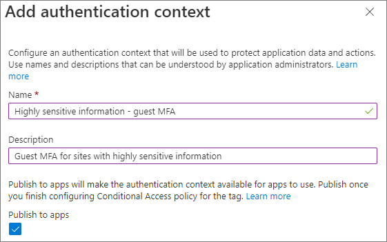
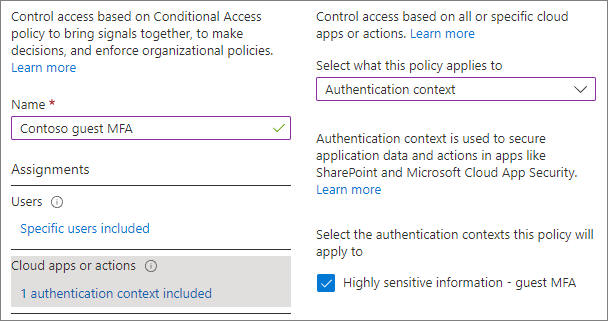

# Configure teams with protection for highly sensitive data

[!INCLUDE[Advanced Management](../includes/advanced-management.md)]

In this article, we look at setting up a team for a highly sensitive level of protection. Be sure you've completed the steps in [Deploy teams with baseline protection](configure-teams-baseline-protection.md) before following the steps in this article.

For this tier of protection, we create a sensitivity label that can be used across your organization for highly sensitive teams and files. Only members of your organization and guests that you have specified will be able to decrypt files that use this label.

The highly sensitive tier offers the following additional protections over the baseline tier:

- A sensitivity label for the team that allows you to turn guest sharing on or off and enforces a conditional access for access to the SharePoint site. The label is also used as a default label for files.
- Only team owners can create private channels.
- Site access is restricted to team members.

## Video demonstration

Watch this video for a walkthrough of the procedures described in this article.
<br>
<br>
> [!VIDEO https://www.microsoft.com/videoplayer/embed/RE4NzI7]

## Guest sharing

Depending on the nature of your business, you may or may not want to enable guest sharing for teams that contain highly sensitive data. If you do plan to collaborate with people outside your organization in the team, we recommend enabling guest sharing. Microsoft 365 includes a variety of security and compliance features to help you share sensitive content securely. This is generally a more secure option than emailing content directly to people outside your organization.

For details about sharing with guests securely, see the following resources:

- [Limit accidental exposure to files when sharing with people outside your organization](./share-limit-accidental-exposure.md)
- [Create a secure guest sharing environment](./create-secure-guest-sharing-environment.md)

To allow or block guest sharing, we'll use controls available in sensitivity labels.


## Authentication context

We'll use an [Azure Active Directory authentication context](/azure/active-directory/conditional-access/concept-conditional-access-cloud-apps#configure-authentication-contexts) to enforce more stringent access conditions when users access SharePoint sites.

First, add an authentication context in Azure Active Directory.

To add an authentication context
1. In [Azure Active Directory Conditional Access](https://aad.portal.azure.com/#blade/Microsoft_AAD_IAM/ConditionalAccessBlade), under **Manage**, click **Authentication context**.

2. Click **New authentication context**.

3. Type a name and description and select the **Publish to apps** check box.

    

4. Click **Save**.

Next, create a conditional access policy that applies to that authentication context and that requires guests to use multifactor authentication when accessing SharePoint.

To create a conditional access policy
1. In [Azure Active Directory Conditional Access](https://aad.portal.azure.com/#blade/Microsoft_AAD_IAM/ConditionalAccessBlade), click **New policy**.

1. Type a name for the policy.

1. On the **Users and groups** tab, choose the **Select users and groups** option, and then select the **Guest or external users** check box.

1. Choose **B2B collaboration guest users** from the dropdown.

1. On the **Cloud apps or actions** tab, under **Select what this policy applies to**, choose **Authentication context**, and select the check box for the authentication context that you created.

    

1. On the **Grant** tab, select **Require multifactor authentication**, and then click **Select**.

1. Choose if you want to enable the policy, and then click **Create**.

We'll point to the authentication context in the sensitivity label.

## Sensitivity labels

For the highly sensitive level of protection, we'll be using a sensitivity label to classify the team. We'll also use this label to classify and encrypt individual files in the team. (It can also be used on files in other file locations such as SharePoint or OneDrive.)

As a first step, you must enable sensitivity labels for Teams. See [Use sensitivity labels to protect content in Microsoft Teams, Microsoft 365 Groups, and SharePoint sites](../compliance/sensitivity-labels-teams-groups-sites.md) for details.

If you already have sensitivity labels deployed in your organization, consider how this label fits with your overall label strategy. You can change the name or settings if needed to meet the needs of your organization.

Once you have enabled sensitivity labels for Teams, the next step is to create the label.

To create a sensitivity label
1. Open the [Microsoft Purview compliance portal](https://compliance.microsoft.com).
1. Under **Solutions**, click **Information protection**.
1. On the **Labels** tab, click **Create a label**.
1. Give the label a name. We suggest **Highly sensitive**, but you can choose a different name if that one is already in use.
1. Add a display name and description, and then click **Next**.
1. On the **Define the scope for this label page**, select **Files & emails** and **Groups & sites** and clear **Include meetings**.
1. Click **Next**.
1. On the **Choose protection settings for files and emails** page, select **Apply or remove encryption**, and then click **Next**.
1. On the **Encryption** page, choose **Configure encryption settings**.
1. Under **Assign permissions to specific users and groups**, click **Assign permissions**.
1. Click **Add all users and groups in your organization**.
1. If there are guests who should have permissions to decrypt files, click **Add users or groups** and add them.
1.  Click **Save**, and then click **Next**.
1. On the **Auto-labeling for files and emails** page, click **Next**.
1. On the **Define protection settings for groups and sites** page, select **Privacy and external user access settings** and **External sharing and Conditional Access settings** and click **Next**.
1. On the **Define privacy and external user access settings** page, under **Privacy**, select the **Private** option.
1. If you want to allow guest access, under **External user access**, select **Let Microsoft 365 Group owners add people outside your organization to the group as guests**.
1. Click **Next**.
1. On the **Define external sharing and device access settings** page, select **Control external sharing from labeled SharePoint sites**.
1. Under **Content can be shared with**, choose **New and existing guests** if you're allowing guest access or **Only people in your organization** if not.
1. Select **Use Azure AD Conditional Access to protect labeled SharePoint sites**.
1. Select the **Choose an existing authentication context** option, and then select the authentication context that you created from the dropdown list.
1. Click **Next**.
1. On the **Auto-labeling for database columns** page, click **Next**.
1. Click **Create label**, and then click **Done**.

Once you've created the label, you need to publish it to the users who will use it. For sensitive protection, we'll make the label available to all users. You publish the label in the Microsoft Purview compliance portal, on the **Label policies** tab of the **Information protection** page. If you have an existing policy that applies to all users, add this label to that policy. If you need to create a new policy, see [Publish sensitivity labels by creating a label policy](../compliance/create-sensitivity-labels.md#publish-sensitivity-labels-by-creating-a-label-policy).

## Create a team

Further configuration of the highly sensitive scenario is done in the team itself and in the SharePoint site associated with the team, so the next step is to create a team.

We'll create the team in the Teams admin center.

To create a team for highly sensitive information
1. In the Teams admin center, expand **Teams** and select **Manage teams**.
1. Select **Add**.
1. Type a name and description for the team.
1. Add one or more owners for the team. (Keep yourself as an owner so you can [choose a default sensitivity label for files](#choose-a-default-sensitivity-label-for-files) below.)
1. Choose the sensitivity label that you created for highly sensitive information from the **Sensitivity** dropdown list.
1. Select **Apply**.

## Private channel settings

In this tier, we restrict creating private channels to team owners.

To restrict private channel creation
1. In the Teams admin center, select the team that you created, and then select **Edit**.
1. Expand **Member permissions**.
1. Set **Add and edit private channels** to **Off**.
1. Select **Apply**.

### Shared channel settings

[Shared channels](/MicrosoftTeams/shared-channels) doesn't have team-level settings. The shared channel settings you configure in the Teams admin center and Azure AD will be available for all teams regardless of sensitivity.

### SharePoint settings

Each time you create a new team with the highly sensitive label, there are two steps to do in SharePoint:
- Restrict access to the site to members of the team only
- Choose a default sensitivity label for the document library connected to the team.

The default sensitivity label must be configured in the site itself and can't be set up from the SharePoint admin center or via PowerShell.

#### Restrict site access to team members

Each time you create a new team with the highly sensitive label, you need to turn on restricted site access on the associated SharePoint site. This prevents people from outside the team from accessing the site or its content. (This requires a Microsoft Syntex - SharePoint Advanced Management license.)

[SharePoint PowerShell](/powershell/sharepoint/sharepoint-online/introduction-sharepoint-online-management-shell) is required to configure restricted site access.

If you haven't used restricted site access before, you need to turn it on for your organization. To do this, run the following command:

```Powershell
Set-SPOTenant -EnableRestrictedAccessControl $true
```

> [!NOTE]
> If you have Microsoft 365 Multi-Geo, you must run this command for each geo-location you want to use restricted access control.

Wait for approximately one hour before turning on restricted access control for the site.

To restrict site access for the site connected to your team, run the following command:

```Powershell
Set-SPOSite -Identity <siteurl> -RestrictedAccessControl $true
```

#### Choose a default sensitivity label for files

We'll use the sensitivity label that we created as the default sensitivity label for the site document library that is connected to Teams. This will automatically apply the highly sensitive label to any new label-compatible files that are uploaded to the library, encrypting them. (This requires a Microsoft Syntex - SharePoint Advanced Management license.)

You need to be a team owner to do this task.

To set a default sensitivity label for a document library

1. In Teams, navigate to the **General** channel of the team you want to update.

1. In the tool bar for the team, click **Files**.

1. Click **Open in SharePoint**.

1. In the SharePoint site, open **Settings** and then choose **Library settings**.

1. From the **Library settings** flyout pane, select **Default sensitivity labels**, and then select the highly sensitive label from the drop-down box.

For more details about how default library labels work, see [Configure a default sensitivity label for a SharePoint document library](/microsoft-365/compliance/sensitivity-labels-sharepoint-default-label) and [Add a sensitivity label to SharePoint document library](https://support.microsoft.com/office/54b1602b-db0a-4bcb-b9ac-5e20cbc28089).

## See Also

[Create and configure sensitivity labels and their policies](../compliance/create-sensitivity-labels.md)
