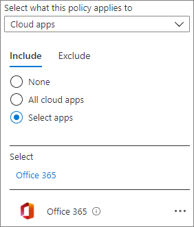

# Configure Teams with three tiers of protection

[!INCLUDE[Advanced Management](../includes/advanced-management.md)]

The articles in this series provide recommendations for configuring teams in Microsoft Teams, and their associated SharePoint sites, for file protection that balances security with ease of collaboration.

This article defines four different configurations, starting with a public team with the most open sharing policies. Each additional configuration represents a meaningful step up in protection, while the ability to access and collaborate on files stored within teams is reduced to the relevant set of team members. 

The configurations in this article align with Microsoft's recommendations for three tiers of protection for data, identities, and devices:

- Baseline protection

- Sensitive protection

- Highly sensitive protection

For more information about these tiers and capabilities recommended for each tier, see [Microsoft cloud for enterprise architects illustrations](./cloud-architecture-models.md)

For information about creating a Teams meeting environment that meets your compliance requirements, see [Configure Teams meetings with three tiers of protection](/MicrosoftTeams/configure-meetings-three-tiers-protection).

## Three tiers at a glance

The following table summarizes the configurations for each tier. Use these configurations as starting point recommendations and adjust the configurations to meet the needs of your organization. You may not need every tier.

|&nbsp;|Baseline (Public)|Baseline (Private)|Sensitive|Highly sensitive|
|:-----|:-----|:-----|:-----|:-----|
|Private or public team|Public|Private|Private|Private|
|Who has access?|Everybody in the organization, including B2B users.|Only members of the team. Others can request access to the associated site.|Only members of the team.|Only members of the team.|
|Private channels|Owners and members can create private channels|Owners and members can create private channels|Only owners can create private channels|Only owners can create private channels|
|Site-level guest access|**New and existing guests** (default).|**New and existing guests** (default).|**New and existing guests** or **Only people in your organization** depending on team needs.|**New and existing guests** or **Only people in your organization** depending on team needs.|
|Site-level conditional access|**Full access from desktop apps, mobile apps, and the web** (default).|**Full access from desktop apps, mobile apps, and the web** (default).|**Allow limited, web-only access**.|Custom conditional access policy|
|Default sharing link type|**Only people in your organization**|**Only people in your organization**|**Specific people**|**People with existing access**|
|Sensitivity labels|None|None|Sensitivity label used to classify the team and control guest sharing and unmanaged device access.|Sensitivity label used to classify the team, control guest sharing, and  specify a conditional access policy. Default file label is used on files to encrypt them.|
|Site sharing settings|**Site owners and members, and people with Edit permissions can share files and folders, but only site owners can share the site**.|**Site owners and members, and people with Edit permissions can share files and folders, but only site owners can share the site**.|**Site owners and members, and people with Edit permissions can share files and folders, but only site owners can share the site**.|N/A (Controlled by site-level restricted access control.)|
|Site-level restricted access control|None|None|None|Team members only|

Baseline protection includes public and private teams. Public teams can be discovered and accessed by anybody in the organization. Private teams can only be discovered and accessed by members of the team. Both of these configurations restrict sharing of the associated SharePoint site to team owners to assist in permissions management.

Teams for sensitive and highly sensitive protection are private teams in which sharing and the requesting of access for the associated site is limited and sensitivity labels are used to set policies around guest sharing, device access, and content encryption.

## Sensitivity labels

The sensitive and highly sensitive tiers use sensitivity labels to help secure the team and its files. To implement these tiers, you must enable [sensitivity labels to protect content in Microsoft Teams, Microsoft 365 Groups, and SharePoint sites](../compliance/sensitivity-labels-teams-groups-sites.md).

While the baseline tier does not require sensitivity labels, consider creating a "general" label and then requiring that all teams be labeled. This will help ensure that users make a conscious choice about sensitivity when they create a team. If you plan to deploy the sensitive or highly sensitive tiers, we do recommend creating a "general" label that you can use for baseline teams and for files that are not sensitive. For the highly sensitive tier, we'll also specify a default sensitivity label for document libraries so that Office files and other compatible files will have that label automatically applied when they're uploaded.

If you're new to using sensitivity labels, we recommend reading [Get started with sensitivity labels](../compliance/get-started-with-sensitivity-labels.md) to get started. 

If you have already rolled out sensitivity labels in your organization, consider how the labels used in the sensitive and highly sensitive tiers fit with your overall label strategy. 

## Sharing the SharePoint site

Each team has an associated SharePoint site where documents are stored. (This is the **Files** tab in a teams channel.) The SharePoint site retains its own permission management, but is linked to team permissions. Team owners are included as site owners and team members are included as site members in the associated site.

The resulting permissions allow:

- Team owners to administer the site and have full control over the site contents.
- Team members to create and edit files on the site. 

By default, team owners and members can share the site itself with people outside the team without actually adding them to the team. We recommend against this as it complicates user management and can lead to people who are not team members having access to team files without team owners realizing it. To help prevent this, starting in the baseline level of protection, we recommend that only owners be allowed to share the site directly.

While teams do not have a read-only permission option, the SharePoint site does. If you have stakeholders of partner groups who need to be able to view team files but not edit them, consider adding them directly to the SharePoint site with Read permissions.

For the highly sensitive tier, we'll restrict access to the site to members of the team only. This restriction will also prevent sharing files with people outside the team.

## Sharing files and folders

By default, both owners and members of the team can share files and folders with people outside the team. This may include people outside your organization, if you have allowed guest sharing. In all three tiers, we update the default sharing link type to help avoid accidental oversharing. In the highly sensitive tier, we restrict such sharing to team owners only. As noted above, in the highly sensitive tier, file access is limited to team members only.

## Sharing with people outside your organization

If you need to share Teams content with people outside your organization, there are two options:

- **Guest sharing** - Guest sharing uses Azure AD B2B collaboration which allows users to share files, folders, sites, groups, and teams with people from outside your organization. These people access shared resources by using guest accounts in your directory.
- **Shared channels** - Shared channels uses Azure AD B2B direct connect which allows users to share resources in your organization with people from other Azure AD organizations. These people access the shared channels in Teams by using their own work or school account. No guest account is created in your organization.

Both guest sharing and shared channels are useful depending on the situation. See [Plan external collaboration](plan-external-collaboration.md) for details on each and how to decide which to use for a given scenario.

If you plan to use guest sharing, we recommend configuring [SharePoint and OneDrive integration with Azure AD B2B](/sharepoint/sharepoint-azureb2b-integration-preview) for the best sharing and administration experience.

Teams guest sharing is on by default, but you can turn it off if needed in the sensitive and highly sensitive tiers by using a sensitivity label. Shared channels are on by default, but require setting up cross-organizational relationships for each organization you want to collaborate with. See [Collaborate with external participants in a channel](collaborate-teams-direct-connect.md) for details.

In the highly sensitive tier, we configure the default library sensitivity label to encrypt files to which it is applied. If you need guests to have access to these files, you must give them permissions when you create the label. External participants in shared channels can't be given permissions to sensitivity labels and can't access content encrypted by a sensitivity label.

We highly recommend that you leave guest sharing on for the baseline tier and for the sensitive or highly sensitive tiers if you need to collaborate with people outside your organization. The guest sharing features in Microsoft 365 provide a much more secure and governable sharing experience than sending files as attachments in email messages. It also reduces the risk of shadow IT where users use ungoverned consumer products to share with legitimate external collaborators.

If you regularly collaborate with other organizations that use Azure AD, shared channels may be a good option. Shared channels appear seamlessly in the other organization's Teams client and allow external participants to use their regular user account for their organization rather than having to log in separately using a guest account.

See the following references to create a secure and productive guest sharing environment for your organization:

- [Best practices for sharing files and folders with unauthenticated users](best-practices-anonymous-sharing.md)
- [Limit accidental exposure to files when sharing with people outside your organization](share-limit-accidental-exposure.md)
- [Create a secure guest sharing environment](create-secure-guest-sharing-environment.md)

## Conditional access policies

Azure AD conditional access offers many options for determining how people access Microsoft 365, including limitations based on location, risk, device compliance, and other factors. We recommend you read [What is Conditional Access?](/azure/active-directory/conditional-access/overview) and consider which additional policies might be appropriate for your organization.

For the sensitive and highly sensitive tiers, we use sensitivity labels to restrict access to SharePoint content. 

For the sensitive tier, we'll restrict access to web-only for unmanaged devices. (Note that guests often don't have devices that are managed by your organization. If you allow guests in any of the tiers, consider what kinds of devices they'll be using to access teams and sites and set your unmanaged device policies accordingly.)

For the highly sensitive tier, we'll use [Azure Active Directory authentication context](/azure/active-directory/conditional-access/concept-conditional-access-cloud-apps#configure-authentication-contexts) with the sensitivity label to trigger a custom conditional access policy when people access the SharePoint site associate with the team.

### Conditional access across Teams-related services

The conditional access settings in sensitivity labels only affect SharePoint access. If you want to expand conditional access beyond SharePoint, you can [Create an Azure Active Directory conditional access policy for all apps and services in your organization](/azure/active-directory/conditional-access/howto-conditional-access-policy-compliant-device) instead. To configure this policy specifically for [Microsoft 365 services](/azure/active-directory/conditional-access/concept-conditional-access-cloud-apps#office-365), select the **Office 365** cloud app under **Cloud apps or actions**.

Using a policy that affects all Microsoft 365 services can lead to better security and a better experience for your users. For example, when you block access to unmanaged devices in SharePoint only, users can access the chat in a team with an unmanaged device, but will lose access when they try to access the **Files** tab. Using the Office 365 cloud app helps avoid issues with [service dependencies](/azure/active-directory/conditional-access/service-dependencies).

## Next step

Start by [configuring the baseline level of protection](configure-teams-baseline-protection.md). If needed you can add [sensitive protection](configure-teams-sensitive-protection.md) and [highly sensitive protection](configure-teams-highly-sensitive-protection.md) on top of the baseline.

## Related topics

[Security and compliance in Microsoft Teams](/microsoftteams/security-compliance-overview)

[Alert policies](../compliance/alert-policies.md)
