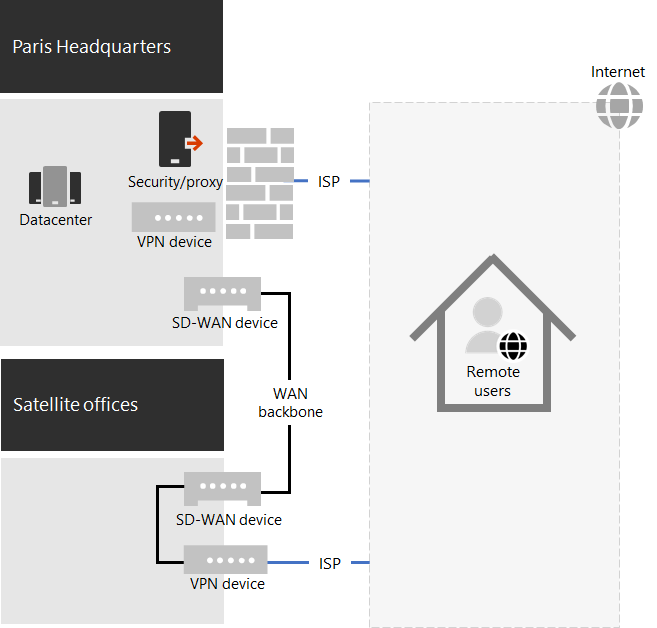

# Contoso's COVID-19 response and support for remote and onsite work

Contoso had always supported its remote workers, who accessed on-premises resources through a central VPN server in the Paris headquarters. Contoso had issued all remote workers a managed laptop. On-premises workers had a mixture of desktop computers and laptops.

## Contoso’s response to COVID-19

With the onset of the COVID-19 pandemic, suddenly all but essential workers were remote workers. Contoso responded by shifting its workforce to work from home and conduct its primary activities through remote access to on-premises resources and online using Microsoft 365 cloud services.

Contoso had remote access VPN servers in the Paris headquarters office to support the 25% of its already remote workforce, but quickly moved to scale up it's remote access capacity to support 90% of its workforce. Contoso deployed remote access VPN servers in each satellite office so that remote workers would use a regionally close entry point for access to the Contoso intranet.

Contoso also updated the configuration of VPN clients installed on laptops, tablets, and smart phones for split tunneling so that traffic for the Optimize set of Office 365 endpoints bypassed the VPN connection and was sent directly over the internet. For more information, see [Optimize Office 365 connectivity for remote users using VPN split tunneling](../enterprise/microsoft-365-vpn-split-tunnel.md).

Here is the resulting configuration with VPN devices installed in the Paris headquarters and each of the satellite offices. 

A remote worker with the installed VPN client uses DNS to find the regionally closest office and connects to the VPN device installed there. With split tunneling, traffic to Microsoft 365 Optimize endpoints gets sent directly to the regionally closest Microsoft 365 network location. All other traffic gets sent over the VPN connection to the VPN device.

## Contoso’s support for remote and onsite work

After the initial changes were made to support mostly remote workers during regional lockdowns, Contoso made infrastructure changes to support remote and onsite work in which a worker could be:

- Always remote.
- Always onsite.
- A combination of onsite and remote.

Microsoft 365 identity, security, and compliance features are designed for Zero Trust and to work regardless of the location of the user and their device. For more information, see [Zero Trust](https://www.microsoft.com/security/business/zero-trust).

However, managing new installs and updates of software is dependent on the location of the device because the software to install could come from an on-premises or an internet source. Contoso IT architects designed their new installs and updates infrastructure based on the location of the device, rather than the worker.

They designated two types of devices: dedicated on-premises and roaming.

### Dedicated on-premises

A dedicated on-premises device is a desktop or server computer that never leaves the Contoso intranet and does not have a VPN client installed. These on-premises devices continue to use Microsoft Endpoint Configuration Manager and its distribution points for installs and updates of Windows 10, Microsoft 365 Apps for enterprise, and the Edge browser.

### Roaming

A roaming device can leave the Contoso intranet and includes laptops issued to many office workers and all remote workers and other organization-owned devices such as smart phones and tablets with the Contoso VPN client installed. 

Because these devices can be connected to the Internet at any given time, they use Intune or other cloud-based services for installs and updates of Windows 10, Microsoft 365 Apps for enterprise, and Edge. They do not use the existing on-premises Configuration Manager distribution points.

This means some of the installs and updates for roaming device will be done over the internet while they are on-premises and connected to the intranet. But Contoso IT architects decided that simplicity of configuration was more important than optimization of intranet bandwidth to the internet, especially when most remote workers are seldom connected to the intranet.

Here is the resulting infrastructure.

Install and update behavior is determined by making the computer accounts of devices a member of one of these groups:

- OnPremDevices

  The Configuration Manager client on the device uses distribution points for installs and updates.

- RoamingDevices

  Intune and other settings on the device specify the use of the Microsoft 365 network for installs and updates.

## New onboarding process

For a new dedicated on-premises device issued to a new worker or for a new server in a datacenter, when the worker signs in, the Configuration Manager client based on the device's membership in the OnPremDevices group downloads and installs the latest updates for Windows 10, Microsoft 365 Apps for enterprise, and Edge from on-premises Configuration Manager distribution points. When complete, the dedicated on-premises device is ready for use and uses these distribution points for ongoing updates.

For a new remote device issued to a new worker, when the worker signs in, the device, based on its membership in the RoamingDevices group, contacts the Intune cloud service and other services and downloads and installs the latest updates for Windows 10, Microsoft 365 Apps for enterprise, and Edge. When complete, the remote device is ready for use and uses the installed VPN client for access to on-premises resources and the Microsoft 365 network for ongoing updates.

## Next step

[Set up your infrastructure for remote work](empower-people-to-work-remotely.md) in your organization.
