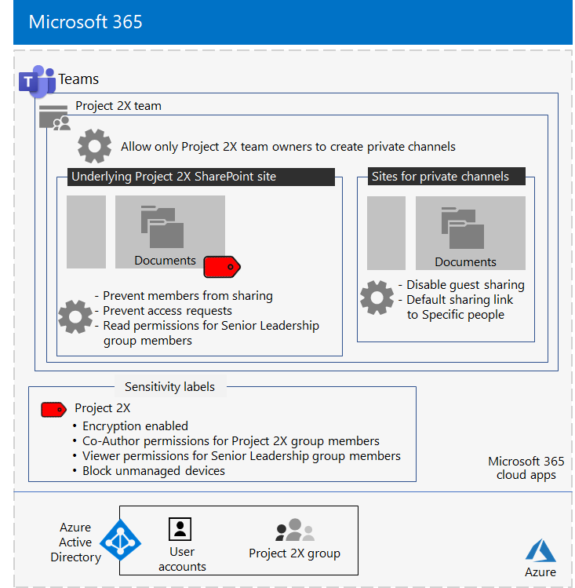
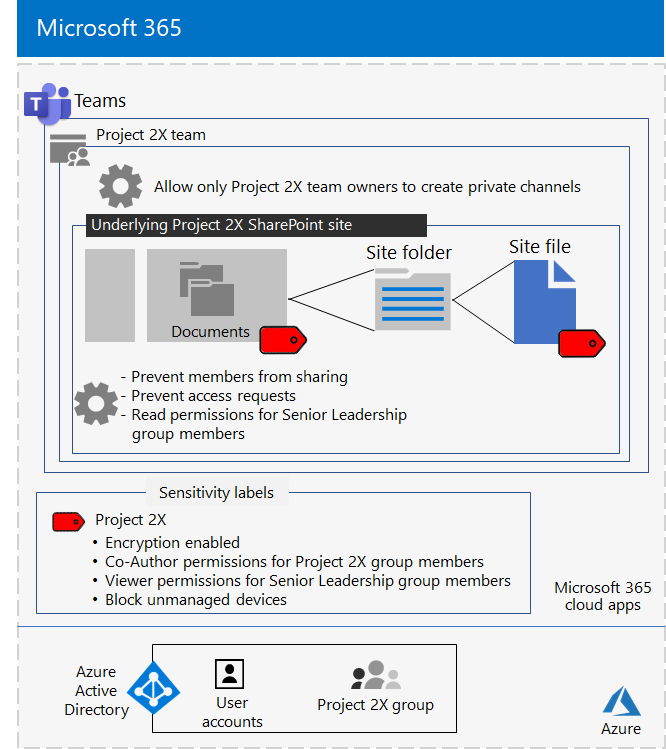

# Isolated team for a top-secret project of the Contoso Corporation

After an executive offsite, Contoso’s CEO ordered the development of a new suite of products and services that could double Contoso’s profits in the next five years. The top-secret project to develop the business, engineering, and market plan was named **Project 2X** and key staff across the company were recruited. 

The timelines for research and development were tight, which meant that collaboration had to be efficient and provide for secure meetings, ongoing conversations, and file storage.

The resulting deliverables for Project 2X were business plans, product and engineering specifications, and marketing materials and schedules in the form of Word, Excel, and PowerPoint files. 

Due to their sensitive nature, access to these files were:

- Restricted to Project 2X team members and senior leadership.
- Encrypted and protected with permissions to allow access only to Project 2X team members and senior leadership, even if the files were distributed outside of their secured folders.

Contoso IT staff used a [team with security isolation](secure-teams-security-isolation.md) for Project 2X and these steps.

## Step 1: Created a private team

First, to protect access to the underlying SharePoint site for the team, Contoso IT administrators configured the [recommended SharePoint access policies](../security/office-365-security/sharepoint-file-access-policies.md).

Next, a Contoso IT administrator created a new private team named Project 2X and added the user accounts of Project 2X staff as members. They also configured the team so that only Project 2X team owners can create private channels.

For the configuration details, see [Create a private team](secure-teams-security-isolation.md#create-a-private-team).

## Step 2: Created a sensitivity label for the Project 2X team

Contoso admins created a new sensitivity label named **Project 2X** that:

- Enabled encryption.
- Allowed Co-Author permissions for the Project 2X Microsoft 365 group.
- Allowed Viewer permissions for the Senior Leadership group.
- Blocked access to unmanaged devices.

Files in the **Documents** section of the underlying Project 2X SharePoint site were protected by:

- The site permissions, which only allow full permissions to members of the Project 2X Microsoft 365 group and read permissions to the Senior Leadership group.
- The Project 2X sensitivity label, with encryption and permissions that travel with the file if it is moved or copied from the site.

For the configuration details, see [Create a sensitivity label](secure-teams-security-isolation.md#create-a-sensitivity-label).

## Step 3: Configured the underlying SharePoint site

First, to protect access to the underlying SharePoint site for the team, Contoso IT administrators configured the [recommended SharePoint access policies](../security/office-365-security/sharepoint-file-access-policies.md).

Next, they configured additional permission settings for the site:

- To prevent Project 2X group members from sharing access to the site. For the configuration details, see [SharePoint settings for a team with security isolation](secure-teams-security-isolation.md#sharepoint-settings).
- For Read permissions for the Senior Leadership group.

Next, they configured additional permission settings for the site to prevent Project 2X group members from sharing access to the site. 

As private channels for the Project 2X were created, the group owner disabled guest sharing and set the default sharing link to the **Specific people** value.

Here is the resulting configuration of the Project 2X team with security isolation.

 ## Step 4: Trained Project 2X team members

Contoso security staff trained the Project 2X team members in a mandatory course that stepped them through:

- How to access the new Project 2X team, use meetings and chats, and how to collaborate on team files.
- How to create new files in the team and upload new files created locally.
- How to label files with the Project 2X sensitivity label.
- A demonstration of how the Project 2X  label protects a file even when it leaves the team.

The end result was a secure environment in which Project 2X team members collaborated in a secure environment for chats, meetings, and files.

Here is an example of a file stored in the underlying Project 2X site with the Project 2X sensitivity label assigned.

In a couple of instances, Project 2X team members downloaded files protected by the Project 2X label to a local drive for offline work. 

However, after being prompted for credentials when opening them, they realized their mistake and deleted them.

Because of the collaboration environment of Teams and the security features of Microsoft 365, the details of Project 2X were kept secret for the duration of the project. Contoso announced its plans and is in the process of rolling out the new products and services to the delight of its customers and investors and the chagrin of its competitors.

## Next step

[Deploy a team with security isolation](secure-teams-security-isolation.md) in your organization.

