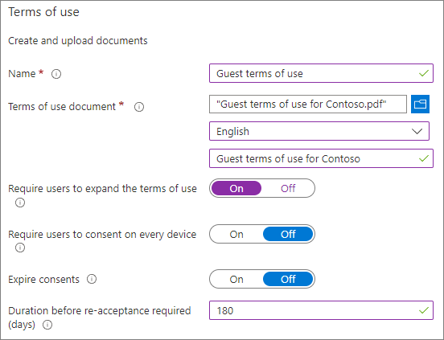
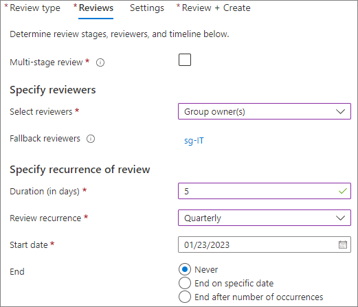
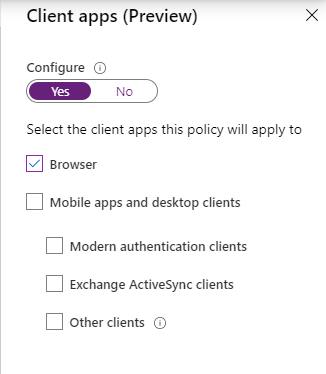
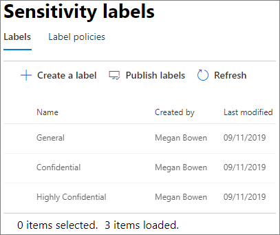
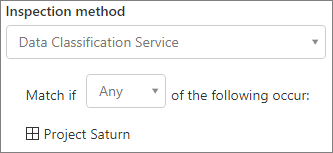
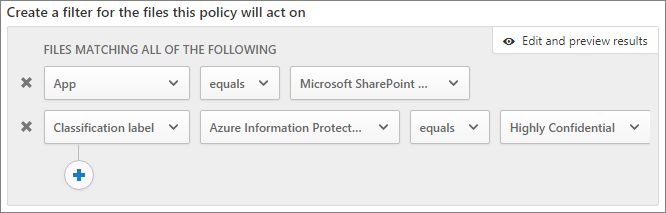

# Create a secure guest sharing environment

In this article, we'll walk through a variety of options for creating a secure guest sharing environment in Microsoft 365. This is an example scenario to give you an idea of the options available. You can use these procedures in different combinations to meet the security and compliance needs of your organization. At the end of the article, we'll walk through a test case to see how some of these options work together.

This scenario includes:

- Setting up multi-factor authentication for guests.
- Setting up a terms of use for guests.
- Setting up quarterly guest access reviews to periodically validate whether guests continue to need permissions to teams and sites.
- Restricting guests to web-only access for unmanaged devices.
- Configuring a session timeout policy to ensure guests authenticate daily.
- Creating and publishing sensitivity labels to classify content.
- Creating a sensitive information type for a highly confidential project.
- Automatically assigning a *highly confidential* label to documents that contain the sensitive information type.
- Automatically removing guest access from files labeled as *highly confidential*.

Some of the options discussed in this article require guests to have an account in Azure Active Directory. To ensure that guests are included in the directory when you share files and folders with them, use the [SharePoint and OneDrive integration with Azure AD B2B Preview](https://docs.microsoft.com/sharepoint/sharepoint-azureb2b-integration-preview).

Note that we won't discuss enabling guest sharing settings in this article. See [Collaborating with people outside your organization](https://docs.microsoft.com/Office365/Enterprise/collaborate-with-people-outside-your-organization) for details about enabling guest sharing for different scenarios.

## Set up multi-factor authentication for guests

Multi-factor authentication greatly reduces the chances of an account being compromised. Since guest users may be using personal email accounts that don't adhere to any governance policies or best practices, it's especially important to require multi-factor authentication for guests. If a guest user's username and password is stolen, requiring a second factor of authentication greatly reduces the chances of unknown parties gaining access to your sites and files.

In this example, we'll set up multi-factor authentication for guests by using a conditional access policy in Azure Active Directory.

To set up multi-factor authentication for guests
1. In Microsoft Azure, search for *Conditional access*.
2. On the **Conditional Access - Policies** blade, click **New policy**.
3. In the **Name** field, type *Guest MFA*.
4. Under **Assignments**, click **Users and groups**.
5. On the **Users and groups** blade, select **Select users and groups**, select the **All guests and external users** check box, and then click **Done**.
4. Under **Access controls**, click **Grant**.
5. On the **Grant** blade, select the **Require multi-factor authentication** check box, and then click **Select**.
6. On the **New** blade, under **Enable policy**, click **On**, and then click **Create**.

Now, guest will be required to enroll in multi-factor authentication before they can access shared content, sites, or teams.

### More information

[Planning a cloud-based Azure Multi-Factor Authentication deployment](https://docs.microsoft.com/azure/active-directory/authentication/howto-mfa-getstarted)

## Set up a terms of use for guests

Often times guest users may not have signed non-disclosure agreements or other legal agreements with your organization. You can require guests to agree to a terms of use before accessing files that are shared with them. The terms of use can be displayed the first time they attempt to access a shared file or site.

To create a terms of use, you first need to create the document in Word or another authoring program, and then save it as a .pdf file. This file can then be uploaded to Azure AD.

To create an Azure AD terms of use
1. Sign in to Azure as a Global Administrator, Security Administrator, or Conditional Access Administrator.
2. Navigate to [Terms of use](https://aka.ms/catou).
3. Click **New terms**. 
   
4. In the **Name** and **Display name** boxes, type *Guest terms of use*.
6. For **Terms of use document**, browse to the pdf file that you created and select it.
7. Select the language for your terms of use document.
8. Set **Require users to expand the terms of use** to **On**.
9. Under **Conditional Access**, in the **Enforce with Conditional Access policy template** list choose **Create conditional access policy later**.
10. Click **Create**.

Once you've created the terms of use, the next step is to create a conditional access policy that displays the terms of use to guest users.

To create a conditional access policy
1. In Microsoft Azure, search for *Conditional access*.
2. On the **Conditional Access - Policies** blade, click **New policy**.
3. In the **Name** box, type *Guest user terms of use policy*.
4. Under **Assignments**, click **Users and groups**.
5. On the **Users and groups** blade, select **Select users and groups**, select the **All guests and external users** check box, and then click **Done**.
6. Under **Assignments**, click **Cloud apps or actions**.
7. On the **Include** tab, select **Select apps**, and then click **Select**.
8. On the **Select** blade, select **Microsoft Teams**, **Office 365 SharePoint Online**, and **Outlook Groups**, and then click **Select**.
9. On the **Cloud apps or actions** blade, click **Done**.
10. Under **Access controls**, click **Grant**.
11. On the **Grant** blade, select **Guest terms of use**, and then click **Select**.
12. On the **New** blade, under **Enable policy**, click **On**, and then click **Create**.

Now, the first time a guest user attempts to access content or a team or site in your organization, they will be required to accept the terms of use.

### More information
[Azure Active Directory terms of use](https://docs.microsoft.com/azure/active-directory/conditional-access/terms-of-use)

## Set up guest access reviews

With access reviews in Azure AD, you can automate a periodic review of user access to various teams and groups. By requiring an access review for guests specifically, you can help ensure guest users do not retain access to your organization's sensitive information for longer than is necessary.

Access reviews can be organized into programs. A program is a grouping of similar access reviews that can be used to organize access reviews for reporting and auditing purposes.

In this example, we'll create a program for guest access reviews.

To create a program
1. Sign in to the Azure portal and open the [Identity Governance page](https://portal.azure.com/#blade/Microsoft_AAD_ERM/DashboardBlade).
2. In the left menu, click **Programs**
3. Click **New program**.
4. In the **Name** box, type *Guest access review program*.
5. In the **Description** box, type *Program for guest access reviews*.
6. Click **Create**.

Once the program has been created, we can create a guest access review and associate it with the program.

To set up a guest user access review
1. On the [Identity Governance page](https://portal.azure.com/#blade/Microsoft_AAD_ERM/DashboardBlade), in the left menu, click **Access reviews**.
2. Click **New access review**. 
   
3. In the **Name** box, type *Quarterly guest access review*.
4. For **Frequency**, choose **Quarterly**.
5. For **End**, choose **Never**.
6. For **Scope**, choose **Guest users only**.
7. Click **Group**, select the groups that you want to include in the access review, and then click **Select**.
8. Under **Programs**, click **Link to program**.
9. On the **Select a program** blade, choose **Guest access review program**
10. Click **Start**.

A separate access review is created for each group that you specify. Group owners of each groups will be emailed quarterly to approve or deny guest access to their groups.

It's important to note that guests can be given access to teams or groups, or to individual files and folders. When given access to files and folders, guests may not be added to any particular group. If you want to do access reviews on guest users who don't belong to a team or group, you can create a dynamic group in Azure AD to contain all guests and then create an access review for that group.

### More information
[Manage guest access with Azure AD access reviews](https://docs.microsoft.com/azure/active-directory/governance/manage-guest-access-with-access-reviews)

[Create an access review of groups or applications in Azure AD access reviews](https://docs.microsoft.com/azure/active-directory/governance/create-access-review)

## Set up web-only access for guest users

You can reduce your attack surface and ease administration by requiring guest users to access your teams, sites, and files by using a web browser only. This is done with an Azure AD conditional access policy.

To restrict guests to web-ony access
1. In Microsoft Azure, search for *Conditional access*.
2. On the **Conditional Access - Policies** blade, click **New policy**.
3. In the **Name** box, type *Guest user browser access*.
4. Under **Assignments**, click **Users and groups**.
5. On the **Users and groups** blade, select **Select users and groups**, select the **All guests and external users** check box, and then click **Done**.
6. Under **Assignments**, click **Cloud apps or actions**.
7. On the **Include** tab, select **Select apps**, and then click **Select**.
8. On the **Select** blade, select **Microsoft Teams**, **Office 365 SharePoint Online**, and **Outlook Groups**, and then click **Select**.
9. On the **Cloud apps or actions** blade, click **Done**.
10. Under **Assignments**, click **Conditions**.
11. On the **Conditions** blade, click **Client apps**.
12. On the **Client apps** blade, click **Yes** for **Configure**, and then select the **Mobile apps and desktop clients** and **Modern authentication clients** settings. 
    
13. Click **Done**, and then on the **Conditions** blade, click **Done** again.
14. Under **Access controls**, click **Grant**.
15. On the **Grant** blade, select **Require device to be marked as compliant** and **Require Hybrid Azure AD joined device**.
16. Under **For multiple controls**, select **Require one of the selected controls**, and then click **Select**.
17. On the **New** blade, under **Enable policy**, click **On**, and then click **Create**.

## Configure a session timeout for guest users

Requiring guests to authenticate on a regular basis can reduce the possibility of unknown users accessing your organization's content if a guest user's device isn't kept secure. You can configure a session timeout conditional access policy for guest users in Azure AD.

To configure a guest session timeout policy
1. In Microsoft Azure, search for *Conditional access*.
2. On the **Conditional Access - Policies** blade, click **New policy**.
3. In the **Name** box, type *Guest session timeout*.
4. Under **Assignments**, click **Users and groups**.
5. On the **Users and groups** blade, select **Select users and groups**, select the **All guests and external users** check box, and then click **Done**.
6. Under **Assignments**, click **Cloud apps or actions**.
7. On the **Include** tab, select **Select apps**, and then click **Select**.
8. On the **Select** blade, select **Microsoft Teams**, **Office 365 SharePoint Online**, and **Outlook Groups**, and then click **Select**.
9. On the **Cloud apps or actions** blade, click **Done**.
10. Under **Access controls**, click **Session**.
11. On the **Session** blade, select **Sign-in frequency**.
12. Select **1** and **Days** for the time period, and then click **Select**.
13. On the **New** blade, under **Enable policy**, click **On**, and then click **Create**.

## Create sensitivity labels

Sensitivity labels can be used in a variety of ways to classify and protect your organization's information. In this example, we'll look at how labels can be used to help you manage guest access to shared files and folders.

First, we'll create three sensitivity labels in the Microsoft 365 Compliance Center:

- General
- Confidential
- Highly Confidential

Use the following procedure to create the *General* and *Confidential* labels.

To create a classification label (General and Confidential)
1. In the [Microsoft 365 Compliance Center](https://compliance.microsoft.com), in the left navigation, expand **Classification**, and then click **Sensitivity labels**.
2. Click **Create a label**.
3. In **Label name**, type *General* or *Confidential*.
4. In **Tooltip**, type *General information that can be shared with employees, guests, and partners* or *Confidential information. Share only with employees and authorized guests*, and then click **Next**.
5. Leave encryption **Off** and click **Next**.
6. Leave content marking **Off** and click **Next**.
7. Leave endpoint data loss prevention **Off** and click **Next**.
8. Leave auto labeling **Off** and click **Next**.
9. Click **Create**.

With the *Highly Confidential* label, we'll add automatic watermarking of documents with the label.

To create a classification label (Highly confidential)
1. Click **Create a label**.
2. In **Label name**, type *Highly confidential*.
3. In **Tooltip**, type *Highly confidential information. Do not share with guests*, and then click **Next**.
4. Leave encryption **Off** and click **Next**.
5. Turn content marking **On**, select the **Add a header** check box, and then click **Customize text**.
6. Type *Highly confidential* for the header text and click **Save**.
7. On the **Content marking** page, turn content marking **On**.
8. Select the **Add a watermark** check box, and then click **Customize text**.
9. For **Watermark text**, type *Highly Confidential*.
10. Type *24* for **Font size**, and then click **Save**.
11. On the **Content marking** page, click **Next**.
12. Leave endpoint data loss prevention **Off** and click **Next**.
13. Leave auto labeling **Off** and click **Next**.
14. Click **Create**.

Once you've created the labels, the next step is to publish them. 

To publish labels
1. On the **Sensitivity labels** page, click **Publish labels**.
2. Click **Choose labels to publish**.
3. Click **Add**, select the labels that you created, and then click **Add**.
4. Click **Done**.
5. Click **Next**.
6. Leave the users and groups set to **All** and click **Next**.
7. In the **Apply this label by default to documents and email** list, choose **General**, and then click **Next**.
8. On the **Policy settings** page, type *Document sensitivity* for the name, and then click **Next**.
9. Click **Publish**.

With the labels published, they're available to users of Office desktop apps. When users apply the **Highly Confidential** label, a watermark is automatically added to the document.

### More information
[Overview of sensitivity labels](https://docs.microsoft.com/Office365/SecurityCompliance/sensitivity-labels)

## Create a sensitive information type for a highly confidential project

Sensitive information types are predefined strings that can be used in policy workflows to enforce compliance requirements. The Microsoft 365 Compliance Center comes with over one hundred sensitive information types, including driver's license numbers, credit card numbers, bank account numbers, etc.

You can create custom sensitive information types to help manage content specific to your organization. In this example, we'll create a custom sensitive information type for a highly confidential project. We can then use this sensitive information type to automatically apply a classification label.

To create a sensitive information type
1. In the [Microsoft 365 Compliance Center](https://compliance.microsoft.com), in the left navigation, expand **Classification**, and then click **Sensitive info types**.
2. Click **Create**.
3. For **Name** and **Description**, type **Project Saturn**, and then click **Next**.
4. Click **Add an element**.
5. On the **Detect content containing** list, select **Keywords**, and then type *Project Saturn* in the keyword box.
6. Click **Next**, and then click **Finish**.
7. If asked if you would like to test the sensitive information type, click **No**.

### More information
[Custom sensitive information types](https://docs.microsoft.com/Office365/SecurityCompliance/custom-sensitive-info-types)

## Create a policy to assign a label based on a sensitive information type

Once the sensitive information type is created, we can create a file policy in Microsoft Cloud App Security to apply the *Highly Confidential* label to documents that contain the *Project Saturn* string automatically.

> [!NOTE]
> There is a replication process that makes sensitivity labels available in Cloud App Security. You may not see the label available for a policy right away.

To create a sensitive information type-based file policy
1. Open [Microsoft Cloud App Security](https://portal.cloudappsecurity.com).
2. In the left navigation, expand **Control**, and then click **Policies**.
3. Click **Create policy**, and then choose **File policy**.
4. For **Policy name**, type *Project Saturn labeling*.
5. Under **Create a filter for the files this policy will act on**, click X twice to delete the default filters.
7. In the **Select a filter** list, choose **App**, and then select **Microsoft SharePoint Online** from the **Select apps...** list.
8. Under **Inspection method**, choose **Data classification service**.
9. On the **Choose inspection type** list, choose **Sensitive information type**.
10. Search for and select the *Project Saturn* sensitivity label, and then click **Done**. 
   
11. Under **Governance**, expand **Microsoft SharePoint Online**.
12. Select the **Apply classification label** check box and select the **Highly Confidential** label.
13. Click **Create**.

With the policy in place, when a user types "Project Saturn" into a document, Cloud App Security will automatically apply the *Highly Confidential* label when it scans the file.

### More information
[File policies](https://docs.microsoft.com/cloud-app-security/data-protection-policies)

## Create a policy to remove guest access to highly confidential files

In the example in this article, files with the *Highly Confidential* label shouldn't be shared with guests. We can create a file policy in Cloud App Security that automatically removes guest access from files with that label.

Note that this doesn't prevent users from sharing or re-sharing these files. You're still reliant on your users to follow your governance policies for files that are stored in sites that allow guest sharing. However, this can be a useful tool for removing guest access from files that had confidential information added to them after they were shared with guests.

To create a label-based file policy
1. Open [Microsoft Cloud App Security](https://portal.cloudappsecurity.com).
2. In the left navigation, expand **Control**, and then click **Policies**.
3. Click **Create policy**, and then choose **File policy**.
4. For **Policy name**, type *Project Saturn - remove guest access*.
5. Under **Create a filter for the files this policy will act on**, click X twice to delete the default filters.
6. In the **Select a filter** list, choose **App**, and then select **Microsoft SharePoint Online** from the **Select apps...** list.
7. Click **Add a filter**.
8. In the **Select a filter** list, choose **Classification label**, and then select **Azure Information Protection** from the **Select filter...** list.
9. In the **Select classification label** list, select **Highly Confidential**. 
   
10. Under **Governance**, expand **Microsoft SharePoint Online**.
11. Select the **Send policy-match digest to file owner** and **Remove external users** check boxes.
12. For the custom notification message, type *This file is highly confidential. Company policy prohibits sharing it with guests*.
13. Click **Create**.

It's important to note, that this policy removes access for files shared using a *Specific people* link. It doesn't remove access from unauthenticated (*Anyone*) links. It also doesn't remove access if the guest is a member of the site or team as a whole. If you plan to have highly confidential documents in a site or team with guest members, consider using [private channels in Teams](https://support.office.com/article/60ef929a-4d68-418b-bf4f-5784db184ec9) and only allowing members of your organization in the private channels.

## Test the solution

To test the solution described in this article, create a Word document and save it to a document library. Share the file with a guest user. When the guest attempts to access the document, they should be required to enroll in multi-factor authentication, and then accept the terms of use.

Once the guest has access to the document, type *Project Saturn* in the document and save it. Once Cloud App Security scans the document, the *Highly Confidential* label should be applied and the guest user should no longer have access to it.

You can use the tools described in this article in various combinations to help create a productive but safe guest sharing environment for your organization.

## Additional options

There are some additional options in Microsoft 365 and Azure Active Directory that can help secure your guest sharing environment.

- You can create a list of allowed or denied sharing domains to limit who users can share with. See [Restrict sharing of SharePoint and OneDrive content by domain](https://docs.microsoft.com/sharepoint/restricted-domains-sharing) and [Allow or block invitations to B2B users from specific organizations](https://docs.microsoft.com/azure/active-directory/b2b/allow-deny-list) for more information.
- You can limit which other Azure Active Directory tenants your users can connect to. See [Use tenant restrictions to manage access to SaaS cloud applications](https://docs.microsoft.com/azure/active-directory/manage-apps/tenant-restrictions) for information.
- You can create a managed environment where partners can help manage guest accounts. See [Create a B2B extranet with managed guests](https://docs.microsoft.com/Office365/Enterprise/b2b-extranet) for information.

## See Also

[Limit accidental exposure to files when sharing with guests](share-limit-accidental-exposure.md)

[Best practices for sharing files and folders with unauthenticated users](best-practices-anonymous-sharing.md)

[Create a B2B extranet with managed guests](b2b-extranet.md)
