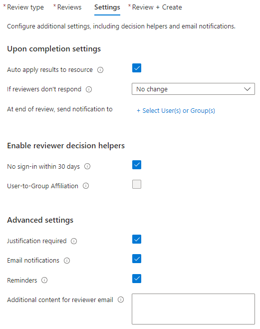

# Create a more secure guest sharing environment

In this article, we walk through various options for creating a more secure guest sharing environment in Microsoft 365. These are examples to give you an idea of the options available. You can use these procedures in different combinations to meet the security and compliance needs of your organization.

This article includes:

- Setting up multifactor authentication for guests.
- Setting up a terms of use for guests.
- Setting up quarterly guest access reviews to periodically validate whether guests continue to need permissions to teams and sites.
- Restricting guests to web-only access for unmanaged devices.
- Configuring a session timeout policy to ensure guests authenticate daily.
- Creating a sensitive information type for a highly sensitive project.
- Automatically assigning a sensitivity label to documents that contain a sensitive information type.
- Automatically removing guest access from files with a sensitivity label.

Some of the options discussed in this article require guests to have an account in Microsoft Entra ID. To ensure that guests are included in the directory when you share files and folders with them, use the [SharePoint and OneDrive integration with Microsoft Entra B2B Preview](/sharepoint/sharepoint-azureb2b-integration-preview).

Note that we don't discuss enabling guest sharing settings in this article. See [Collaborating with people outside your organization](collaborate-with-people-outside-your-organization.md) for details about enabling guest sharing for different scenarios.

## Set up multifactor authentication for guests

Multifactor authentication greatly reduces the chances of an account being compromised. Since guests may be using personal email accounts that don't adhere to any governance policies or best practices, it's especially important to require multifactor authentication for guests. If a guest's username and password is stolen, requiring a second factor of authentication greatly reduces the chances of unknown parties gaining access to your sites and files.

In this example, we set up multifactor authentication for guests by using a conditional access policy in Microsoft Entra ID.

To set up multifactor authentication for guests

1. Open the [Microsoft Entra admin center](https://entra.microsoft.com).
1. Expand **Protection**, and then select **Conditional Access**.
1. On the **Conditional Access | Overview** page, select **Create new policy**.
1. In the **Name** field, type a name.
1. Select the **Users** link.
1. Choose **Select users and groups**, and then select the **Guest or external users** check box.
1. In the dropdown, select **B2B collaboration guest users** and **B2B collaboration member users**.
1. Select the **Target resources** link.
1. Select **All cloud apps** on the **Include** tab.
1. Select the **Grant** link.
1. On the **Grant** blade, select the **Require multifactor authentication** check box, and then click **Select**.
1. Under **Enable policy**, select **On**, and then select **Create**.

Now, guests are required to enroll in multifactor authentication before they can access shared content, sites, or teams.

### More information

[Plan a Microsoft Entra multifactor authentication deployment](/entra/identity/authentication/howto-mfa-getstarted)

## Set up a terms of use for guests

In some situations, guests may not have signed non-disclosure agreements or other legal agreements with your organization. You can require guests to agree to a terms of use before accessing files that are shared with them. The terms of use can be displayed the first time they attempt to access a shared file or site.

To create a terms of use, you first need to create the document in Word or another authoring program, and then save it as a .pdf file. This file can then be uploaded to Microsoft Entra ID.

To create a Microsoft Entra terms of use

1. Open the [Microsoft Entra admin center](https://entra.microsoft.com).
1. Expand **Protection**, and then select **Conditional Access**.
1. Select **Terms of use**.
1. Select **New terms**.

   

1. Type a **Name**.
1. For **Terms of use document**, browse to the pdf file that you created and select it.
1. Select the language for your terms of use document.
1. Type a display name.
1. Set **Require users to expand the terms of use** to **On**.
1. Under **Conditional Access**, in the **Enforce with Conditional Access policy template** list choose **Create conditional access policy later**.
1. Select **Create**.

Once you've created the terms of use, the next step is to create a conditional access policy that displays the terms of use to guests.

To create a conditional access policy

1. In the Microsoft Entra admin center, under **Protection**, select **Conditional access**.
1. On the **Conditional Access | Overview** page, select **Create new policy**.
1. In the **Name** box, type a name.
1. Select the **Users** link.
1. Select **Select users and groups**, and then select the **Guest or external users** check box.
1. In the dropdown, select **B2B collaboration guest users** and **B2B collaboration member users**.
1. Select the **Target resources** link.
1. On the **Include** tab, select **Select apps**, and then click the **Select** link.
1. On the **Select** blade, select **Office 365**, then click **Select**.
1. Select the **Grant** link.
1. On the **Grant** blade, select the check box for the terms of use that you created, and then click **Select**.
1. Under **Enable policy**, select **On**, and then select **Create**.

Now, the first time a guest attempts to access content or a team or site in your organization, they'll be required to accept the terms of use.

### More information

[Microsoft Entra terms of use](/azure/active-directory/conditional-access/terms-of-use)

[Overview of Microsoft SharePoint eSignature](/microsoft-365/syntex/esignature-overview)

## Set up guest access reviews

With access reviews in Microsoft Entra ID, you can automate a periodic review of user access to various teams and groups. By requiring an access review for guests specifically, you can help ensure guests don't retain access to your organization's sensitive information for longer than is necessary.

To set up a guest access review

1. Open the [Microsoft Entra admin center](https://entra.microsoft.com).
1. Expand **Identity governance**, and select **Access reviews**.
1. Select **New access review**.
1. Choose the **Teams + Groups** option.
1. Choose the **All Microsoft 365 groups with guest users** option. Click **Select group(s) to exclude** if you want to exclude any groups.
1. Choose the **Guest users only** option, and then select **Next: Reviews**.
1. Under **Select reviewers**, choose **Group Owner(s)**.
1. Click **Select fallback reviewers**, choose who should be the fallback reviewers, and then click **Select**.
1. Choose a **Duration (in days)** for the review to be open for comments.
1. Under **Specify recurrence of review**, choose **Quarterly**.
1. Select a start date and duration.
1. For **End**, choose **Never**, and then select **Next: Settings**.

    

1. On the **Settings** tab, review the settings for compliance with your business rules.

    

1. Select **Next: Review + Create**.
1. Type a **Review name** and review the settings.
1. Select **Create**.

### More information

[Manage guest access with access reviews](/entra/id-governance/manage-guest-access-with-access-reviews)

[Create an access review of groups and applications in Microsoft Entra ID](/entra/id-governance/create-access-review)

## Set up web-only access for guests with unmanaged devices

If your guests use devices that aren't managed by your organization or another organization that you have a trust relationship with, you can require them to access your teams, sites, and files by using a web browser only. This reduces the chance that they might download sensitive files and leave them on an unmanaged device. This is also useful when sharing with environments that use shared devices.

For Microsoft 365 Groups and Teams, this is done with a Microsoft Entra Conditional Access policy. For SharePoint, this is configured in the SharePoint admin center. (You can also [use sensitivity labels to restrict guests to web-only access](/purview/sensitivity-labels-teams-groups-sites).)

To restrict guests to web-only access for Groups and Teams:

1. Open the [Microsoft Entra admin center](https://entra.microsoft.com).
1. Expand **Protection**, and then select **Conditional Access**.
1. On the **Conditional Access | Overview** page, select **Create new policy**.
1. In the **Name** box, type a name.
1. Select the **Users** link.
1. Select **Select users and groups**, and then select the **Guest or external users** check box.
1. In the dropdown, select **B2B collaboration guest users** and **B2B collaboration member users**.
1. Select the **Target resources** link.
1. On the **Include** tab, select **Select apps**, and then click the **Select** link.
1. On the **Select** blade, select **Office 365**, and then click **Select**.
1. Select the **Conditions** link.
1. On the **Conditions** blade, select the **Client apps** link.
1. On the **Client apps** blade, select **Yes** for **Configure**, and then select the **Mobile apps and desktop clients**, **Exchange ActiveSync clients**, and **Other clients** settings. Clear the **Browser** check box.

    

1. Select **Done**.
1. Select the **Grant** link.
1. On the **Grant** blade, select **Require device to be marked as compliant** and **Require Microsoft Entra hybrid joined device**.
1. Under **For multiple controls**, select **Require one of the selected controls**, and then click **Select**.
1. Under **Enable policy**, select **On**, and then select **Create**.

### More information

[SharePoint and OneDrive unmanaged device access controls](/sharepoint/control-access-from-unmanaged-devices)

## Configure a session timeout for guests

Requiring guests to authenticate on a regular basis can reduce the possibility of unknown users accessing your organization's content if a guest's device isn't kept secure. You can configure a session timeout conditional access policy for guests in Microsoft Entra ID.

To configure a guest session timeout policy

1. Open the [Microsoft Entra admin center](https://entra.microsoft.com).
1. Expand **Protection**, and then select **Conditional Access**.
1. On the **Conditional Access | Overview** page, select **Create new policy**.
1. In the **Name** field, type a name.
1. Select the **Users** link.
1. Select **Select users and groups**, and then select the **Guest or external users** check box.
1. In the dropdown, select **B2B collaboration guest users** and **B2B collaboration member users**.
1. Select the **Target resources** link.
1. On the **Include** tab, select **Select apps**, and then click the **Select** link.
1. On the **Select** blade, select **Office 365**, and then click **Select**.
1. Select the **Session** link.
1. On the **Session** blade, select **Sign-in frequency**.
1. Choose **1** and **Days** for the time period, and then click **Select**.
1. Under **Enable policy**, select **On**, and then select **Create**.

## Create a sensitive information type for a highly sensitive project

Sensitive information types are predefined strings that can be used in policy workflows to enforce compliance requirements. The Microsoft Purview compliance portal comes with over one hundred sensitive information types, including driver's license numbers, credit card numbers, bank account numbers, etc.

You can create custom sensitive information types to help manage content specific to your organization. In this example, we create a custom sensitive information type for a highly sensitive project. We can then use this sensitive information type to automatically apply a sensitivity label.

To create a sensitive information type

1. In the [Microsoft Purview compliance portal](https://compliance.microsoft.com), in the left navigation, expand **Data classification**, and then select **Classifiers**.
1. select the **Sensitive info types** tab.
1. Select **Create sensitive info type**.
1. For **Name** and **Description**, type **Project Saturn**, and then select **Next**.
1. Select **Create pattern**.
1. On the **New pattern** panel, select **Add primary element**, and then select **Keyword list**.
1. Type an **ID** such as *Project Saturn*.
1. In the **Case insensitive** box, type *Project Saturn, Saturn*, and then select **Done**.
1. Select **Create**, and then select **Next**.
1. Choose a confidence level, and then select **Next**.
1. Select **Create**.
1. Select **Done**.

For more information, see [Learn about sensitive information types](/purview/sensitive-information-type-learn-about).

## Create an auto-labeling policy to assign a sensitivity label based on a sensitive information type

If you're using sensitivity labels in your organization, you can automatically apply a label to files that contain defined sensitive information types.

To create an auto-labeling policy

1. Open the [Microsoft Purview admin center](https://compliance.microsoft.com).
1. In the left navigation, expand **Information protection**, and select **Auto-labeling**.
1. Select **Create auto-labeling policy**.
1. On the **Choose info you want this label applied to** page, choose **Custom** and then select **Custom policy**.
1. Select **Next**.
1. Type a name and description for the policy and select **Next**.
1. On the **Assign admin units** page, select **Next**.
1. On the **Choose locations where you want to apply the label** page, select **SharePoint sites** and optionally select **Edit** to choose the sites.
1. Select **Next**.
1. On the **Set up common or advanced rules** page, choose **Common rules** and select **Next**.
1. On the **Define rules for content in all locations** page, select **New rule**.
1. On the **New rule** page, give the rule a name, select **Add condition**, and then select **Content contains**.
1. Select **Add**, select **Sensitive info types**, choose the sensitive info types that you want to use, select **Add**, and then select **Save**.
1. Select **Next**.
1. Select **Choose a label**, select the label you want to use, and then select **Add**.
1. Select **Next**.
1. Leave the policy in simulation mode and choose if you want it to automatically turn on.
1. Select **Next**.
1. Select **Create policy**, and then select **Done**.

With the policy in place, when a user types "Project Saturn" into a document, the auto-labeling policy will automatically apply the specified label when it scans the file.

For more information about auto-labeling, see [Apply a sensitivity label to content automatically](/purview/apply-sensitivity-label-automatically).

### More information

[Configure a default sensitivity label for a SharePoint document library](/purview/sensitivity-labels-sharepoint-default-label)

## Create a DLP policy to remove guest access to highly sensitive files

You can use [Microsoft Purview Data Loss Prevention (DLP)](/purview/dlp-learn-about-dlp) to prevent unwanted guest sharing of sensitive content. Data loss prevention can take action based on a file's sensitivity label and remove guest access.

To create a DLP rule

1. Open the [Microsoft Purview admin center](https://compliance.microsoft.com).
1. In the left navigation, expand **Data loss prevention**, and select **Policies**.
1. Select **Create policy**.
1. Choose **Custom** and then **Custom policy**.
1. Select **Next**.
1. Type a name for the policy and select **Next**.
1. On the **Assign admin units** page, select **Next**.
1. On the **Locations to apply the policy** page, turn off all settings except **SharePoint sites** and **OneDrive accounts**, and then select **Next**.
1. On the **Define policy settings** page, select **Next**.
1. On the **Customize advanced DLP rules** page, select **Create rule** and type a name for the rule.
1. Under **Conditions**, select **Add condition**, and choose **Content is shared from Microsoft 365**.
1. In the dropdown, choose **with people outside my organization**.
1. Under **Conditions**, select **Add condition**, and choose **Content contains**.
1. Select **Add**, choose **Sensitivity labels**, choose the labels you want to use, and select **Add**.
1. Under **Actions** select **Add an action** and choose **Restrict access or encrypt the content in Microsoft 365 locations**.
1. Choose the **Block only people outside your organization** option.

    

1. Turn user notifications **On**, and then select the **Notify users in Office 365 service with a policy tip** check box.
1. Select **Save** and then select **Next**.
1. Choose your test options and select **Next**.
1. Select **Submit**, and then select **Done**.

It's important to note that this policy doesn't remove access if the guest is a member of the site or team as a whole. If you plan to have highly sensitive documents in a site or team with guest members, consider these options:

- Use [private channels](/MicrosoftTeams/private-channels) and only allow members of your organization in the private channels.
- Use [shared channels](/MicrosoftTeams/shared-channels) to collaborate with people outside your organization while only having people from your organization in the team itself.

## Additional options

There are some additional options in Microsoft 365 and Microsoft Entra ID that can help secure your guest sharing environment.

- You can create a list of allowed or denied sharing domains to limit who users can share with. See [Restrict sharing of SharePoint and OneDrive content by domain](/sharepoint/restricted-domains-sharing) and [Allow or block invitations to B2B users from specific organizations](/entra/external-id/allow-deny-list) for more information.
- You can limit which other Microsoft Entra tenants your users can connect to. See [Restrict access to a tenant](/entra/identity/enterprise-apps/tenant-restrictions) for information.
- You can create a managed environment where partners can help manage guest accounts. See [Create a B2B extranet with managed guests](b2b-extranet.md) for information.

## Related articles

[Limit accidental exposure to files when sharing with guests](share-limit-accidental-exposure.md)

[Best practices for sharing files and folders with unauthenticated users](best-practices-anonymous-sharing.md)
