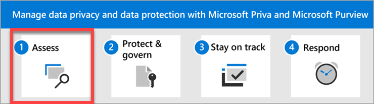

# Data privacy and protection – Assess data and risks

Welcome to **Step 1** of managing data privacy and data protection with Microsoft Priva and Microsoft Purview: **Assess your organization's data and risks**.

When you begin your data privacy journey, you'll want to first understand what types of personal data you have, how much, where it's stored, and how it flows over time. The best place to start understanding your data is with Microsoft Priva. You'll next want to know which regulations you'll need to comply with. Microsoft Purview Compliance Manager helps you identify which data privacy regulations most likely apply to your organization.

## Actions to take

|Action|Description|Get details|
|:---|:----------|:---------------|
|Use Priva to understand your organization's personal data.| Priva evaluates your organization's Microsoft 365 environment to determine the types and amounts of sensitive information types and where they're stored. It then gives you insights and key analytics to help you understand the privacy issues and associated risks in your organization.  To get started with Priva, check to make sure your users are appropriately licensed and have the roles they need. It's also a good idea to confirm that the [Microsoft 365 audit log is enabled](/privacy/priva/priva-setup#enable-the-microsoft-365-audit-log).   We recommend making some initial settings before you start. Visit Priva settings to turn [anonymization](/privacy/priva/priva-settings#anonymization) **On** for greater protection while reviewing sensitive data, and turn [user notification emails](/privacy/priva/priva-settings#user-notification-emails) **Off** while you're getting familiar with Privacy Risk Management policies. You can turn both on later.| [Learn more about Priva](/privacy/priva/priva-overview)    [Check Priva licensing guidance](/privacy/priva/priva-setup)  [Set user permissions for Priva](/privacy/priva/priva-permissions)  [Check Priva settings](/privacy/priva/priva-settings)  [Find and visualize personal data in your organization](/privacy/priva/priva-data-profile)|
|Visit Compliance Manager to assess your compliance posture.| The next step is knowing which data protection regulations apply to your organization so you know what your obligations are.

Keeping up with new and updated laws and regulations can be a full-time job in itself, and many organizations struggle with manual processes for monitoring, updating, and reporting on their state of compliance. Compliance Manager helps manage the complexities of implementing controls through built-in control mapping, versioning, and continuous control assessments. This automation and continuous monitoring helps you to stay current with regulations and certifications, and eases reporting to auditors. 

Use Compliance Manager to quickly assess your current environment and get an initial compliance score based on the Microsoft data protection baseline assessment. From there, you can create assessments that cover your multicloud environment and keep you on track with the regulations that are most relevant to your organization. | [Learn more about Compliance Manager](../compliance/compliance-manager.md)  [Start a premium assessments trial](../compliance/compliance-manager-setup.md#start-a-premium-assessments-trial)  [Learn about multicloud support](../compliance/compliance-manager-multicloud.md)|

## Optimizing your initial setup

Within 48-72 hours of starting Microsoft Priva, you'll start to see insights around personal data display for your organization. On the Priva overview page, you'll see insights on the amount of personal data that exists in your organization, where it lives, and how it moves. These insights are dynamically updated as new data comes in. Over time, you can better understand how personal data evolves in your Microsoft 365 environment so you can more quickly spot issues, identify and assess risks, and take action to fix issues. Learn more about [understanding the data presented on the overview page](/privacy/priva/priva-data-profile#explore-the-overview-page).

 ​Select **Data profile** underneath **Privacy risk management** on the left navigation of the Purview compliance portal. On this page, you can explore and document all the personal data types detected across repositories. Based on this information, you can decide if all the data types you're concerned about are successfully detected. If you find something missing, you can [create custom sensitive information types (SITs)](../compliance/create-a-custom-sensitive-information-type.md) and come back to the data profile page in the next 24-48 hours.

There are three data handling policies in Priva Privacy Risk Management: data overexposure, data transfers, and data minimization. You can [learn more about the policy types here](/privacy/priva/risk-management), and we'll discuss them further in step 2 of this solution. A default version of each policy type is set up and running when you start using Priva. You'll see them listed with the word **Default** in their names on your **Policies** page.

***We recommend turning off the default policies*** as you get started. This is because the default policies monitor for personal data based on multiple classification groups (sets of data based on privacy regulations), which can involve a broad array of SITs that may not be relevant to your industry or geographic location. You may also experience a high number of false positives. The result may be that an overwhelming amount of data that's less relevant appears in your data profile and gets factored into your insights. To create a more manageable and accurate view of the personal data you're most concerned with, we suggest setting up a customized policy at first. This also gives you time to become familiar with how policies work and watch for false positives. You can run the policy in test mode and continue to fine tune its settings until it's set up to track exactly what you need.

If you felt overwhelmed by the amount of data presented on your overview and data profile pages at the start, turning off the default policies and setting up one or more custom policies may present a more accurate and workable picture of your data estate and current risks.

We'll walk you through setting up your first policy in step 2 of this guidance.

## Next step

Visit [Step 2. Protect and govern your data](data-privacy-protection-protect-govern.md).