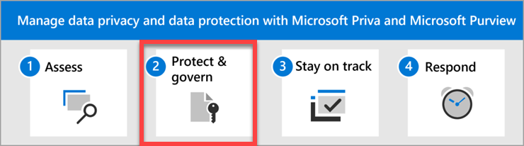

# Data privacy and protection – Protect and govern data

Welcome to **Step 2** of managing data privacy and data protection with Microsoft Priva and Microsoft Purview: **Protect and govern your data**.

When you know what personal data you have, where it is, and your regulatory requirements, it's time to put things in place to protect that data. Microsoft provides comprehensive, robust capabilities to help you protect personal data in two ways:
1. Features that IT admins set up to categorize sensitive items and take protective actions, and
1. Features that empower your employees to spot and fix data privacy issues quickly and get trained on sound data handling practices.

## Actions to take

|Action|Description|Get details|
|:---|:----------|:---------------|
|Identify sensitive information types so you know what needs protection.| Identifying and categorizing sensitive items managed by your organization is the first step in the Information Protection discipline. 

Microsoft Purview provides three ways of identifying items so that they can be categorized a) manually by users, b) automated pattern recognition, like sensitive information types, and c) machine learning.

Sensitive information types (SIT) are pattern-based classifiers. They detect sensitive information like social security, credit card, or bank account numbers to identify sensitive items.| [Learn more about sensitive information types](../compliance/sensitive-information-type-learn-about.md)   [View the full list of sensitive information types](../compliance/sensitive-information-type-entity-definitions.md)|
|Categorize and label your content so you can apply features to protect it.| Categorizing and labeling content so it can be protected and handled properly is the starting place for the information protection discipline. Microsoft 365 has three ways to classify content.| [Learn more about trainable classifiers](../compliance/classifier-learn-about.md)|
|Apply sensitivity labels to protect data, even if it roams.| When you’ve identified your sensitive data, you’ll want to protect it. That’s often challenging when people collaborate with others both inside and outside the organization. That data can roam everywhere, across devices, apps, and services. And when it roams, you want it to do so in a secure, protected way that meets your organization's business and compliance policies. 

Sensitivity labels from Microsoft Purview Information Protection let you classify and protect your organization's data, while making sure that user productivity and their ability to collaborate isn't hindered.| [Learn more about sensitivity labels](../compliance/sensitivity-labels.md)|
|Use data loss prevention policies to prevent the sharing of personal data.| Organizations have sensitive information under their control such as financial data, proprietary data, credit card numbers, health records, or social security numbers. To help protect sensitive information and reduce risk, they need a way to prevent their users from inappropriately sharing it with people who shouldn't have it. This practice is called data loss prevention (DLP).

Using Microsoft Purview Data Loss Prevention, you implement data loss prevention by defining and applying DLP policies to identify, monitor, and automatically protect sensitive items across Microsoft 365 services such as Teams, Exchange, SharePoint, and OneDrive; Office applications such as Word, Excel, and PowerPoint; Windows 10, Windows 11, and macOS (the current version and the previous two versions of macOS) endpoints; non-Microsoft cloud apps; and on-premises file shares and on-premises SharePoint.

This DLP solution detects sensitive items by using deep content analysis, not by just a simple text scan. Content is analyzed for primary data matches to keywords, by the evaluation of regular expressions, by internal function validation, and by secondary data matches that are in proximity to the primary data match. Beyond that, DLP also uses machine learning algorithms and other methods to detect content that matches your DLP policies.| [Learn more about data loss prevention](../compliance/dlp-learn-about-dlp.md)|
|Govern your Microsoft 365 data for compliance or regulatory requirements| Information governance controls can be employed in your environment to help address data privacy compliance needs, including a number that are specific to General Data Protection Regulation (GDPR), HIPAA-HITECH (the United States health care privacy act), California Consumer Protection Act (CCPA), and the Brazil Data Protection Act (LGPD). Microsoft Purview Data Lifecycle Management and Microsoft Purview Records Management provide these controls in the form of retention policies, retention labels, and records management capabilities.  | [Learn how to deploy a data governance solution with Microsoft Purview](../compliance/data-governance-solution.md)|
|Set up secure storage of personal data in Microsoft Teams.| If you plan to store highly sensitive personal data in Teams, you can configure a private team and use a sensitivity label that's specifically configured to secure access to the team and files within it.| [Learn more about configuring a team with security isolation](secure-teams-security-isolation.md)|
|Empower users to spot potential risks and fix issues.| Create data handling policies in Priva Privacy Risk Management so that your users can immediately identify risks in the data they create and manage.

Notification emails alert users when they transfer items with personal data within our outside of the organization, make content too broadly accessible, or hold onto personal data for too long. The notifications prompt users to take immediate remediation steps to secure personal data, and contain links to your organization's preferred privacy training.| [Learn more about Privacy Risk Management](/privacy/priva/risk-management)  [Create a policy to prevent data transfers, overexposure, or hoarding](/privacy/priva/risk-management-policies)  [Set up notifications for users to fix issues with content they handle](/privacy/priva/risk-management-notifications)|
|Use records management for high-value items that must be managed for business, legal, or regulatory record-keeping requirements.| A records management system is a solution for organizations to manage regulatory, legal, and business-critical records.

Microsoft Purview Records Management helps an organization manage their legal obligations, provides the ability to demonstrate compliance with regulations, and increases efficiency with regular disposition of items that are no longer required to be retained, no longer of value, or no longer required for business purposes.| [Learn more about records management](/purview/records-management)|

## Setting up your strategy for success

Identifying sensitive information types (SITs), categorizing and labeling your content, and deploying data loss prevention (DLP) policies are key steps in an [information protection strategy](../compliance/information-protection-solution.md). The links in the table above take you to detailed guidance for carrying out these essential tasks.

Protecting data is also the responsibility of every user in your organization who views, creates, and handles personal data in the course of the job duties. Each user must know and abide by your organization's internal and regulatory responsibilities to protect personal data wherever it exists in your organization. To that end, Priva helps you empower your users to know their responsibilities, to be informed when they're handling data in risky ways, and take immediate action to minimize privacy risks to the organization.

The three data handling policies available in Priva Privacy Risk Management help your users play a proactive role in your organization's data protection strategy. Email notifications with built-in remediation actions prompt users to apply the necessary protections and take a privacy training designated by your organization. This awareness and ability to act can help to cultivate better habits for preventing future privacy issues.

### Recommendations for your first Priva data handling policy

We recommend deploying policies in a phased approach so you can get to know how they behave and optimize them to suit your needs. For the first phase, we recommend creating one custom policy to serve as a basis of understanding. Let's use the example of creating a [data overexposure policy](/privacy/priva/risk-management-policy-data-overexposure), which identifies content items containing personal data that may be too broadly accessible by other people. You can find [detailed policy creation instructions starting here](/privacy/priva/risk-management-policy-data-overexposure#custom-setup-guided-policy-creation-process).

- When you get to the **Choose data to monitor** step of the policy creation wizard, we recommend selecting the **Individual sensitive information types** option and choosing the SITs that are most relevant to your organization. For example, if you're a  financial services company with customers in Europe, you'll likely want to include the EU debit card number as one of your SITs. [Find the list of SIT definitions here](../compliance/sensitive-information-type-entity-definitions.md).

- At the **Choose users and groups covered by this policy** step, we recommend selecting **Specific users or groups** and choosing a small inner circle of users in scope for this policy.

- At the **Choose conditions for the policy** step, we recommend selecting only **External** so that you're tracking data you might consider more at risk while keeping the total amount of data you'll have to monitor at more manageable levels.

- At the **Specify alerts and thresholds** step, we recommend turning alerts **On** so that when admins see alerts when policy matches are detected, they can gauge whether the severity and frequency meet their needs. Note that policies don't work retrospectively, so if you decide to keep alerts off at first and later turn them on, you wouldn't see any alerts for matches that occurred prior to turning on alerts.

- At the **Decide policy mode** state, we recommend [keeping the policy in test mode](/privacy/priva/risk-management-policies#testing-a-policy) and monitoring its performance for at least five days. This allows you to see what kind of matches the policy conditions are picking up, how the alerts will fire.

### Gradually setting up more policies and fine-tuning performance

After setting up and running your first policy, you may want to do the same with the other two policy types. This can be your second phase, where you gradually ramp up on using features as you go and optimize their settings. For example, you may choose not to send [user email notifications](/privacy/priva/risk-management-notifications) at first while you see how many matches your policy detects. Then eventually you may decide to turn email notifications on while the policies are still in test mode (at the **Define outcomes** stage of the policy settings). If users get too many emails, go back into the policy's **Outcomes** settings to adjust the frequency of the notifications. All of this fine-tuning can help you gauge the desired impact on your users before you deploy the policy more broadly throughout your organization.

#### Recommended settings for the other two  policy types
Below are specific recommendations for key settings when creating your first **data transfer** and **data overexposure** policies.

**Data transfer**:
- For **Data to monitor**, select specific SITs.
- For **Choose users and groups covered by this policy**, select an inner ring of users.
- For **Choose conditions for the policy**, choose the condition that matters the most.
- For **Define outcomes when a policy match is detected**, turn on email notifications.
- For **Specify alerts and thresholds**, turn alerts on for each time an activity occurs.
- For **Decide policy mode**, turn the policy mode on (which turns off test mode).

**Data minimization**:
- For **Data to monitor**, choose specific SITs or classification groups.
- For **Choose users and groups covered by this policy**, select an inner ring of users.
- For **Choose conditions for the policy**, choose 30, 60, 90, or 120 days.
- For **Decide policy mode**, keep the policy in test mode.

### Maximizing policy performance to minimize privacy risks

Allow your policies to run for at least two to four weeks. During this time, you should review and document the following results:

- The matches generated by each policy type and the instances of false positives and false negatives
- The impact and the feedback from end users and admins

Based on your findings, you can now tune the policy performance by doing the following:

- Including or excluding out-of-the-box and custom SITs or classification groups
- Creating versions of the policies with conditions and user groups to make targeting more efficient
- Tweaking the thresholds of the policy, including frequency of emails to users, number of days to monitor, etc.

Think of this as your third phase. You can create more versions of each policy type and deploy them to the whole organization in two rounds: a first round that covers 50% of your users, and a second round that covers 100% of your users.

This is also the stage where you accumulate learnings based on user behavior as noted in Priva and create specific privacy training for your users, which you can include in your policies' user email notifications.

## Next step

Visit [Step 3. Stay on track with privacy regulations](data-privacy-protection-regulations.md).