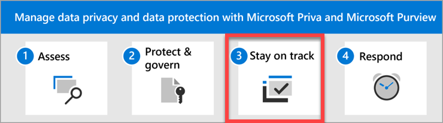

# Data privacy and protection – Stay on track with regulations

Welcome to **Step 3** of managing data privacy and data protection with Microsoft Priva and Microsoft Purview: **Stay on track with privacy regulations**.

Research shows that there are over 250 daily updates to global regulations[*](#reference). Microsoft Purview Compliance Manager helps you keep up with the evolving compliance and risk landscape by providing continuous control assessments and regulatory updates. Choose from a library of 350+ templates that correspond to national, regional, and industry-specific requirements on the collection and use of data. Modify the templates for your needs, or create your own custom template for assessments that meet your unique needs. Explore the links below for detailed guidance on managing your organization's compliance activities with Compliance Manager.

## Actions to take

|Action|Description|Get details|
|:---|:----------|:---------------|
|Monitor progress and improve your compliance score. | Make sure you've set up assessments in Compliance Manger to help you stay on top of new and evolving data privacy regulations and laws that apply to your organization.| [Build and manage assessments in Compliance Manager](../compliance/compliance-manager-assessments.md)  [Raise your score by completing improvement actions](../compliance/compliance-manager-improvement-actions.md) |
|Automatically test improvement actions. | To realize the full benefits of continuous control assessment, make sure your settings are configured to enable automatic testing of all eligible improvement actions.| [Set your testing source for automated testing](../compliance/compliance-manager-setup.md#testing-source-for-automated-testing)|
|Set alerts for changes in Compliance Manager. | Compliance Manager can alert you to changes as soon as they happen so that you can stay on track with your compliance goals. Set up alerts for improvement action changes such as a score increase or decrease, an implementation or test status change, a reassignment, or the addition or removal of evidence.| [Create alert policies](../compliance/compliance-manager-alert-policies.md)|
|Facilitate the work of assessors and auditors. | Make sure that individuals who oversee compliance activities in the organization have the right roles and can access evidence files and reporting. Compliance Manager allows scoped access to individual assessment for specific users.   You can upload evidence files to improvement actions that document your implementation and testing work. Assign improvement actions to users serving as assessors so they can determine a pass or fail status.  Provide reporting on your assessments to compliance stakeholders, auditors, and regulators. Exported reports contain details about control implementation status, test date, and test results.| [Grant user access to individual assessments](../compliance/compliance-manager-assessments.md#grant-user-access-to-individual-assessments)  [Store evidence documentation](../compliance/compliance-manager-improvement-actions.md#storing-evidence)  [Assign improvement actions to assessors](../compliance/compliance-manager-improvement-actions.md#assign-improvement-action-to-assessor-for-completion)  [Export an assessment report](../compliance/compliance-manager-assessments.md#export-an-assessment-report)|

## Next step

Visit [Step 4. Respond to data privacy incidents and subject requests](data-privacy-protection-respond-requests.md).

###### Reference
*Cost of Compliance 2021, Thomson Reuters, 2021