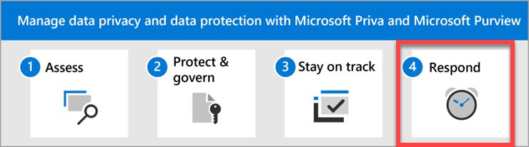

# Data privacy and protection – Respond to incidents and subject requests

Welcome to **Step 4** of managing data privacy and data protection with Microsoft Priva and Microsoft Purview: **Respond to data privacy incidents and subject requests**.

Features in both Purview and Priva can help you monitor, investigate, and respond to data privacy incidents in your organization as you operationalize related capabilities. Having processes, procedures, and other documentation for each incident may also be important to demonstrate compliance to regulatory bodies. These features include:

- Auditing and alert policies
- Subject rights requests, sometimes referred to as data subject requests
- More investigative tools and reporting

## Actions to take

|Action|Description|Get details|
|:---|:----------|:---------------|
|Set up alerts for potential incidents.| You can set up alerts to help you respond quickly to an array of privacy incidents, whether they come through Priva, auditing, or other alert policies.| [Priva policy alerts](/privacy/priva/risk-management-alerts)  [Unified auditing](/purview/audit-new-search)  [Mailbox auditing](/purview/audit-mailboxes)  [Microsoft Purview Audit (Premium)](/purview/audit-premium)  [Alert policies](/purview/alert-policies)|
|Manage subject rights requests at scale.| Several privacy regulations around the world grant individuals—or data subjects—the right to make requests to review or manage the personal data that companies have collected about them. These subject rights requests are also referred to as data subject requests (DSRs), data subject access requests (DSARs), or consumer rights requests.

For companies that store large amounts of information, finding the relevant data can be a formidable task. Fulfilling the requests, for most organizations, is a highly manual and time consuming process.

Microsoft Priva Subject Rights Requests is designed to help alleviate the complexity and length of time involved in responding to data subject inquires. This solution provides automation, insights, and workflows to help organizations fulfill requests more confidently and efficiently.| [Learn more about Subject Rights Requests](/privacy/priva/subject-rights-requests)|
|Use insider risk management as an investigative tool.| Microsoft Purview Insider Risk Management is a compliance solution that helps you minimize internal risk by enabling you detect, investigate, and act on malicious and inadvertent activities in your organization.

Insider risk policies allow you to define the types of risks to identify and detect in your organization. You can act on cases and escalate cases to Microsoft eDiscovery (Premium) if needed. Risk analysts in your organization can quickly take appropriate actions to make sure users are compliant with your organization's compliance standards.| [Learn more about insider risk management](/purview/insider-risk-management)|

## Building your monitoring and response strategy

Most data privacy regulations generally require the type of monitoring and response listed below:

- Auditing, alerting, and reporting for activities related to the storage, sharing, and processing of personal data.
- The ability to respond to subject requests and, in some cases, perform investigative and other administrative measures to comply with such requests.

Your organization may also wish to perform monitoring and response activities for other purposes, such as other compliance needs or for business reasons. Establishing your monitoring and response scheme for data privacy should be done as part of overall monitoring and response planning, implementation, and management.

Use the links above to explore how Purview capabilities can help you develop a monitoring and response scheme, and answer questions such as:

- What sort of day-to-day monitoring and investigative and reporting techniques are available for the different data types and sources?
- What mechanisms will be needed to handle subject rights requests and any remedial actions, such as anonymization, redaction, and deletion?