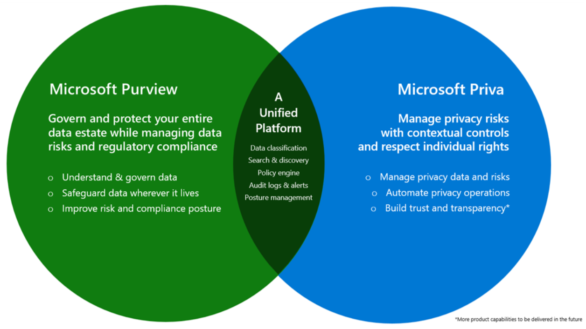
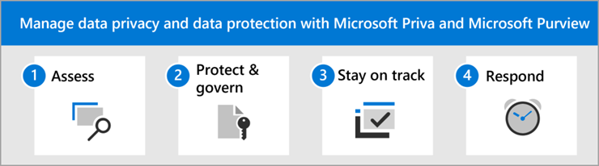

# Manage data privacy and data protection with Microsoft Priva and Microsoft Purview

At least 71% of countries/regions have passed or introduced data privacy legislation, according to the United Nations. Chances are good that your organization is based in, or has customers or employees in, regions with data privacy laws. A prominent example of a data privacy law with broad impact is the European Union's [General Data Protection Regulation (GDPR)](/compliance/regulatory/gdpr). Many organizations are subject to multiple regulations that themselves are frequently updated. As the regulatory landscape expands, it's never been more critical for organizations to safeguard personal data while staying on top of changes. Failure to comply with data privacy laws and regulations can result in considerable financial penalties, legal and business repercussions, and erosion of your customers' trust.

Data privacy and data protection go hand in hand. You can't have data privacy without data protection. Data protection helps protect personal data stored and managed by your organization from external threats and leakage. Data privacy provides another layer of sophisticated protection, which helps honor the purpose of personal data use and respects a data subject's rights throughout the data lifecycle. To help organizations regardless of size or location fortify their data privacy and protection posture, we offer robust and scalable solutions in Microsoft Priva and Microsoft Purview.

## How Microsoft Priva and Microsoft Purview work together

Microsoft Purview and Microsoft Priva provide a unified platform to help you comply with data privacy regulations. The complementary features in Purview risk and compliance solutions and Priva privacy management solutions help you assess the personal data within your organization, and provide automation and scalability to help reduce the complexity in adequately safeguarding the data.

## How to use this guide

Use the guidance in these articles to help you assess risks and take appropriate action to protect personal data in your Microsoft 365 environment. This guide comprises four overarching steps to help you understand how and when to use the appropriate Microsoft solution for meeting your organization's data privacy obligations.

The steps in this solution are:

1. [Assess your organization's data and risks](data-privacy-protection-assess.md): Start your journey by understanding your data and possible risks.
1. [Protect and govern your data](data-privacy-protection-protect-govern.md): Identify, categorize, and manage the data you need to protect.
1. [Stay on track with privacy regulations](data-privacy-protection-regulations.md): Monitor your progress in completing assessments and stay up-to-date as regulations change.
1. [Respond to data privacy incidents and subject requests](data-privacy-protection-respond-requests.md): Set up alerts so you can respond to privacy risks and automate your management of data subject requests.

> [!IMPORTANT]
> Following this guidance will not necessarily make you compliant with any data privacy regulation, especially considering the number of steps required that are outside the context of the features. You are responsible for ensuring your compliance and to consult your legal and compliance teams or to seek guidance and advice from third parties that specialize in compliance.

## Resources

- [Microsoft Privacy](/privacy)
- [Microsoft Purview risk and compliance solutions](../compliance/purview-compliance.md)
- [Microsoft compliance offerings](/compliance/regulatory/offering-home)
- [Data privacy thought paper: From privacy vulnerability to privacy resilience](https://aka.ms/dataprivacyresearch)
- [Priva Privacy Risk Management eBook](https://aka.ms/privaPRMeBook)
