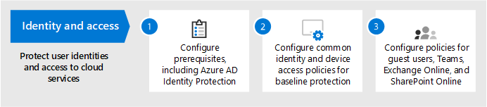
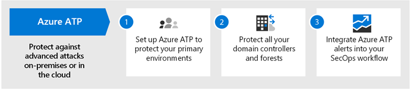
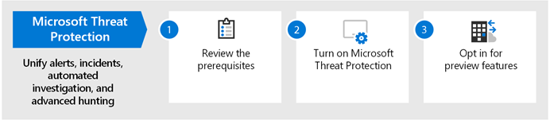
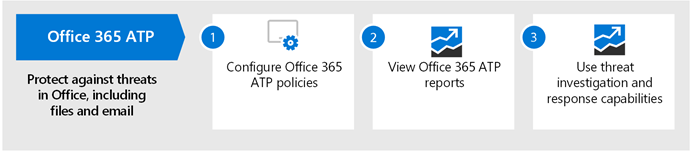
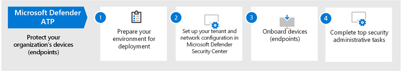
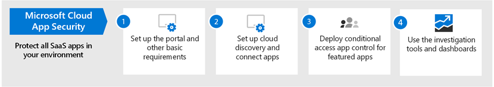
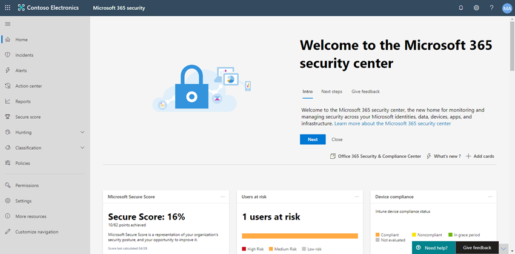

# Configure threat protection capabilities across Microsoft 365

Follow these steps to configure threat protection across Microsoft 365.

## Step 1: Set up multi-factor authentication and conditional access policies

[Multi-factor authentication](https://docs.microsoft.com/azure/active-directory/authentication/concept-mfa-howitworks) (MFA) requires users to verify their identity with a phone call or authenticator app. [Conditional access policies](https://docs.microsoft.com/azure/active-directory/conditional-access/overview) define certain requirements that must be met in order for users to access apps and data in Microsoft 365. MFA and conditional access policies work together to protect your organization. For example, if someone attempts to sign in from a mobile device using an account that  is not enabled for MFA, and a conditional access policy requires MFA to be in effect, that user will be prevented from signing in.  

Microsoft has tested and recommends a specific set of conditional access and related policies for protecting access to all of your SaaS applications, especially Microsoft 365. Policies are recommended for baseline, sensitive, and highly regulated protection. Begin by implementing the policies for baseline protection. 

[See a larger version of this image](https://github.com/MicrosoftDocs/microsoft-365-docs/raw/public/microsoft-365/media/microsoft-365-policies-configurations/Identity_device_access_policies_byplan.png)

### To implement baseline protection for Microsoft 365

 

1. [Configure prerequisites, including Azure Identity Protection](../security/office-365-security/identity-access-prerequisites.md).
2. [Configure common identity and device access policies](../security/office-365-security/identity-access-policies.md) for baseline protection.
3. Configure policies for [guest users](../security/office-365-security/identity-access-policies-guest-access.md), [Microsoft Teams](../security/office-365-security/teams-access-policies.md), [Exchange Online](../security/office-365-security/secure-email-recommended-policies.md), and [SharePoint Online and OneDrive](../security/office-365-security/sharepoint-file-access-policies.md).

### More information about protecting identities

- [Identity and device access configurations](../security/office-365-security/microsoft-365-policies-configurations.md)
- [Security guidance for Azure MFA](https://docs.microsoft.com/azure/active-directory/authentication/multi-factor-authentication-security-best-practices)

## Step 2: Configure Microsoft Defender for Identity

[Microsoft Defender for Identity](https://docs.microsoft.com/azure-advanced-threat-protection/what-is-atp) is a cloud-based security solution that works with your on-premises [Azure Active Directory](https://docs.microsoft.com/azure/active-directory/fundamentals/active-directory-whatis) signals to identify, detect, and investigate advanced threats, compromised identities, and malicious insider actions directed at your organization.

Microsoft Defender for Identity enables security operations (SecOps) analysts and security professionals struggling to detect advanced attacks in hybrid environments to:
- Monitor users, entity behavior, and activities with learning-based analytics.
- Protect user identities and credentials stored in Active Directory.
- Identify and investigate suspicious user activities and advanced attacks throughout the kill chain.
- Provide clear incident information on a simple timeline for fast triage.

### To set up Microsoft Defender for Identity

 

1. [Set up Microsoft Defender for Identity](https://docs.microsoft.com/azure-advanced-threat-protection/install-atp-step1) to protect your primary environments.
2. Protect all your [domain controllers](https://docs.microsoft.com/azure-advanced-threat-protection/atp-sensor-monitoring) and [forests](https://docs.microsoft.com/azure-advanced-threat-protection/atp-multi-forest).
3. Integrate [Microsoft Defender for Identity alerts](https://docs.microsoft.com/azure-advanced-threat-protection/suspicious-activity-guide?tabs=external) into your security operations (SecOps) workflow.

### More information about Microsoft Defender for Identity

- [What is Microsoft Defender for Identity?](https://docs.microsoft.com/azure-advanced-threat-protection/what-is-atp)
- [Video: Introduction to Microsoft Defender for Identity](https://www.youtube.com/watch?reload=9&v=EGY2m8yU_KE)
- [Microsoft Defender for Identity deployment](https://docs.microsoft.com/azure-advanced-threat-protection/what-is-atp#whats-next)

## Step 3: Turn on Microsoft 365 Defender

[Microsoft 365 Defender](https://docs.microsoft.com/microsoft-365/security/mtp/microsoft-threat-protection) combines signals and orchestrates capabilities into a single solution. With the integrated Microsoft 365 Defender solution, security professionals can stitch together the threat signals that each of these products receive and determine the full scope and impact of the threat; how it entered the environment, what it's affected, and how it's currently impacting the organization. Microsoft 365 Defender takes automatic action to prevent or stop the attack and self-heal affected mailboxes, endpoints, and user identities.

Microsoft 365 Defender unifies alerts, incidents, automated investigation and response, and advanced hunting across workloads (Microsoft Defender for Identity, Microsoft Defender for Office 365, Microsoft Defender for Endpoint, and Microsoft Cloud App Security) into a single pane of glass experience. After you have configured one or more of your Defender for Office 365 services, turn on Microsoft 365 Defender. New features are added continually to Microsoft 365 Defender; consider opting in to receive preview features.

### To set up Microsoft 365 Defender

 

1. [Review the prerequisites](https://docs.microsoft.com/microsoft-365/security/mtp/prerequisites).
2. [Turn on Microsoft 365 Defender](https://docs.microsoft.com/microsoft-365/security/mtp/mtp-enable).
3. [Opt in for preview features](https://docs.microsoft.com/microsoft-365/security/mtp/preview).

### More information about Microsoft 365 Defender

- [What is Microsoft 365 Defender?](https://docs.microsoft.com/microsoft-365/security/mtp/microsoft-threat-protection)
- [What's new in Microsoft 365 Defender](https://docs.microsoft.com/microsoft-365/security/mtp/whats-new)

## Step 4: Configure Microsoft Defender for Office 365

[Microsoft Defender for Office 365](https://docs.microsoft.com/microsoft-365/security/office-365-security/office-365-atp) safeguards your organization against malicious threats in email messages (attachments and URLs), Office documents, and collaboration tools. The following table lists Microsoft Defender for Office 365 features and capabilities that are included in Microsoft 365 E5:

|Configuration, protection, and detection capabilities|Automation, investigation, remediation, and education capabilities|
|---|---|
|[Safe Attachments](https://docs.microsoft.com/microsoft-365/security/office-365-security/atp-safe-attachments) [Safe Links](https://docs.microsoft.com/microsoft-365/security/office-365-security/atp-safe-links) [Safe Documents](https://docs.microsoft.com/microsoft-365/security/office-365-security/safe-docs) [ATP for SharePoint, OneDrive, and Microsoft Teams](https://docs.microsoft.com/microsoft-365/security/office-365-security/atp-for-spo-odb-and-teams) [Anti-phishing in Defender for Office 365 protection](https://docs.microsoft.com/microsoft-365/security/office-365-security/set-up-anti-phishing-policies#exclusive-settings-in-atp-anti-phishing-policies)|[Threat Trackers](https://docs.microsoft.com/microsoft-365/security/office-365-security/threat-trackers) [Threat Explorer](https://docs.microsoft.com/microsoft-365/security/office-365-security/threat-explorer) [Automated investigation and response](https://docs.microsoft.com/microsoft-365/security/office-365-security/office-365-air) [Attack Simulator](https://docs.microsoft.com/microsoft-365/security/office-365-security/attack-simulator)|
|

With Microsoft Defender for Office 365, people across your organization can communicate and collaborate more securely, with threat protection for their email content and Office documents.

### To set up Microsoft Defender for Office 365

 

1. [Set up and configure your Microsoft Defender for Office 365 policies](https://docs.microsoft.com/microsoft-365/security/office-365-security/protect-against-threats).
2. [View and use your Microsoft Defender for Office 365 reports](https://docs.microsoft.com/microsoft-365/security/office-365-security/view-reports-for-atp).
3. [Use threat investigation and response capabilities](https://docs.microsoft.com/microsoft-365/security/office-365-security/office-365-ti).

### More information about Microsoft Defender for Office 365

- [Microsoft Defender for Office 365 overview](https://docs.microsoft.com/microsoft-365/security/office-365-security/office-365-atp)
- [What's new in Microsoft Defender for Office 365](https://docs.microsoft.com/microsoft-365/security/office-365-security/whats-new-in-office-365-atp)

## Step 5: Configure Microsoft Defender for Endpoint

[Microsoft Defender for Endpoint](https://docs.microsoft.com/windows/security/threat-protection) protects your organizations devices (also referred to as endpoints) from cyberthreats, advanced attacks, and data breaches. Security teams can be more efficient in managing the security of their endpoints. Robust tools help organizations keep up with unpatched systems using  vulnerability detection with [Threat and Vulnerability management](https://docs.microsoft.com/windows/security/threat-protection/microsoft-defender-atp/next-gen-threat-and-vuln-mgt). Automated detection and remediation capabilities, such as [attack surface reduction](https://docs.microsoft.com/windows/security/threat-protection/microsoft-defender-atp/overview-attack-surface-reduction), [next-generation protection](https://docs.microsoft.com/windows/security/threat-protection/windows-defender-antivirus/windows-defender-antivirus-in-windows-10), [endpoint detection and response](https://docs.microsoft.com/windows/security/threat-protection/microsoft-defender-atp/overview-endpoint-detection-response), and [automated investigation and remediation](https://docs.microsoft.com/windows/security/threat-protection/microsoft-defender-atp/automated-investigations) help keep your devices safe from malware. On top of these capabilities, customers can get proactive notifications and consult with Microsoft Threat Experts on demand, as part of the opt-in managed hunting service. 

### Set up Microsoft Defender for Endpoint

 

1. [Prepare your Microsoft Defender for Endpoint deployment](https://docs.microsoft.com/windows/security/threat-protection/microsoft-defender-atp/deployment-phases).
2. [Set up your Microsoft Defender for Endpoint deployment](https://docs.microsoft.com/windows/security/threat-protection/micros.oft-defender-atp/production-deployment)
3. [Onboard to the Microsoft Defender for Endpoint service](https://docs.microsoft.com/windows/security/threat-protection/microsoft-defender-atp/onboarding).
4. [Complete your top security administrative tasks](https://docs.microsoft.com/windows/security/threat-protection/microsoft-defender-atp/tvm-security-recommendation).

### More information about Microsoft Defender for Endpoint

- [Learn more about Microsoft Defender for Endpoint](https://docs.microsoft.com/windows/security/threat-protection).
- [Try the Microsoft Defender for Endpoint evaluation lab](https://docs.microsoft.com/windows/security/threat-protection/microsoft-defender-atp/evaluation-lab).

## Step 6: Configure Microsoft Cloud App Security

[Microsoft Cloud App Security](https://docs.microsoft.com/cloud-app-security) is a Cloud Access Security Broker that supports log collection, API connectors, and reverse proxy. Microsoft Cloud App Security provides rich visibility, control over data travel, and sophisticated analytics to identify and combat cyberthreats across all your cloud services. With Microsoft Cloud App Security, your security operations can protect your organization's sensitive information, protect against cyberthreats and anomalies, discover and monitor apps that access your organization's data, and help make sure your organization's cloud apps meet compliance requirements.

### Set up Microsoft Cloud App Security

 

1. [Set up the portal and other basic requirements](https://docs.microsoft.com/cloud-app-security/general-setup).
2. [Set up cloud discovery](https://docs.microsoft.com/cloud-app-security/set-up-cloud-discovery) and [connect apps](https://docs.microsoft.com/cloud-app-security/enable-instant-visibility-protection-and-governance-actions-for-your-apps).
3. [Deploy conditional access app control for featured apps](https://docs.microsoft.com/cloud-app-security/proxy-deployment-aad).
4. [Use the investigation tools and dashboards](https://docs.microsoft.com/cloud-app-security/investigate).

### More information about Microsoft Cloud App Security

- [Review new features and capabilities](https://docs.microsoft.com/cloud-app-security/release-notes).
- [Learn more about Microsoft Cloud App Security](https://docs.microsoft.com/cloud-app-security/what-is-cloud-app-security).

## Step 7: Monitor status and take actions

After you have set up and deployed your threat protection services and capabilities, your next step is to monitor threat detections, and take appropriate actions. Your best starting point is the Microsoft 365 security center ([https://security.microsoft.com](https://security.microsoft.com)), where you can monitor and managing security across your Microsoft identities, data, devices, apps, and infrastructure. 

The Microsoft 365 security center is specifically intended for security admins and security operations teams. In the Microsoft 365 security center, you can:
- View the overall security health of your organization with [Secure Score](https://docs.microsoft.com/microsoft-365/security/mtp/microsoft-secure-score).
- [Monitor and view reports](https://docs.microsoft.com/microsoft-365/security/mtp/monitoring-and-reporting) on the status of your identities, data, devices, apps, and infrastructure.
- Connect the dots on alerts through [incidents](https://docs.microsoft.com/microsoft-365/security/mtp/incident-queue).
- Use [automated investigation and remediation](https://docs.microsoft.com/microsoft-365/security/mtp/mtp-autoir) to address threats.
- [Proactively hunt for threats](https://docs.microsoft.com/microsoft-365/security/mtp/advanced-hunting-overview), such as intrusion attempts or breach activity affecting your email, data, devices, and identities.
- [Understand the latest attack campaigns](https://docs.microsoft.com/microsoft-365/security/mtp/latest-attack-campaigns) and techniques with threat analytics.
- ... and more!

### More information about the Microsoft 365 security center

- [Get started with the Microsoft 365 security center](https://docs.microsoft.com/microsoft-365/security/mtp/overview-security-center).
- [Monitor and view reports](https://docs.microsoft.com/microsoft-365/security/mtp/monitoring-and-reporting).
- [See the security portals in Microsoft 365](https://docs.microsoft.com/microsoft-365/security/mtp/portals).

## Step 8: Train users

Training users can save your users and security operations team much time and frustration. Savvy users are less likely to open attachments or click links in questionable email messages, and they are more likely to avoid suspicious websites. 

The Harvard Kennedy School [Cybersecurity Campaign Handbook](https://go.microsoft.com/fwlink/?linkid=2015598&amp;clcid=0x409) provides excellent guidance on establishing a strong culture of security awareness within your organization, including training users to identify phishing attacks. 

Microsoft 365 provides the following resources to help inform users in your organization:

|Concept  |Resources  |
|---------|---------|
|Microsoft 365     |[Customizable learning pathways](https://docs.microsoft.com/office365/customlearning/) 
These resources can help you put together training for end users in your organization        |
|Microsoft 365 security |[Learning module: Secure your organization with built-in, intelligent security from Microsoft 365](https://docs.microsoft.com/learn/modules/security-with-microsoft-365) 
This module enables you to describe how Microsoft 365 security features work together and to articulate the benefits of these security features. |
|Multi-factor authentication     | [Two-step verification: What is the additional verification page?](https://docs.microsoft.com/azure/active-directory/user-help/multi-factor-authentication-end-user-first-time) 
This article helps end users understand what multi-factor authentication is and why it's being used at your organization.    |

In addition to this guidance, Microsoft recommends that your users take the actions described in this article: [Protect your account and devices from hackers and malware](https://support.office.com/article/066d6216-a56b-4f90-9af3-b3a1e9a327d6.aspx). These actions include:
- Using strong passwords
- Protecting devices 
- Enabling security features on Windows 10 and Mac PCs (for unmanaged devices)
    
Microsoft also recommends that users protect their personal email accounts by taking the actions recommended in the following articles:
- [Help protect your Outlook.com email account](https://support.microsoft.com/office/help-protect-your-outlook-com-email-account-a4f20fc5-4307-4ece-8231-6d4d4bd8a9ba)
- [Protect your Gmail account with 2-step verification](https://go.microsoft.com/fwlink/?linkid=2015688&amp;clcid=0x409)
