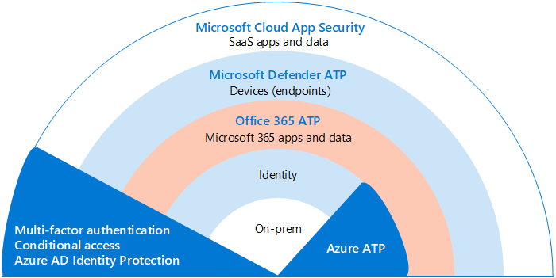
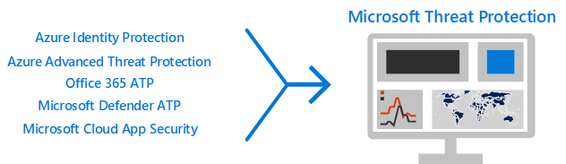
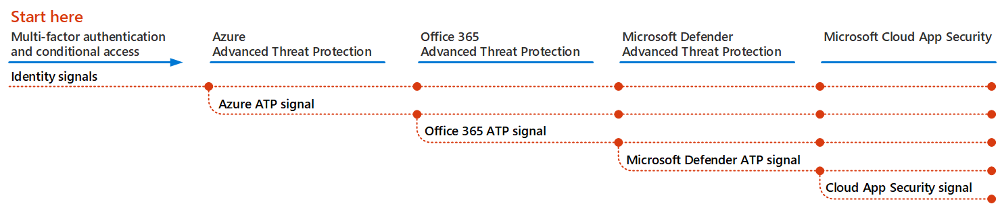
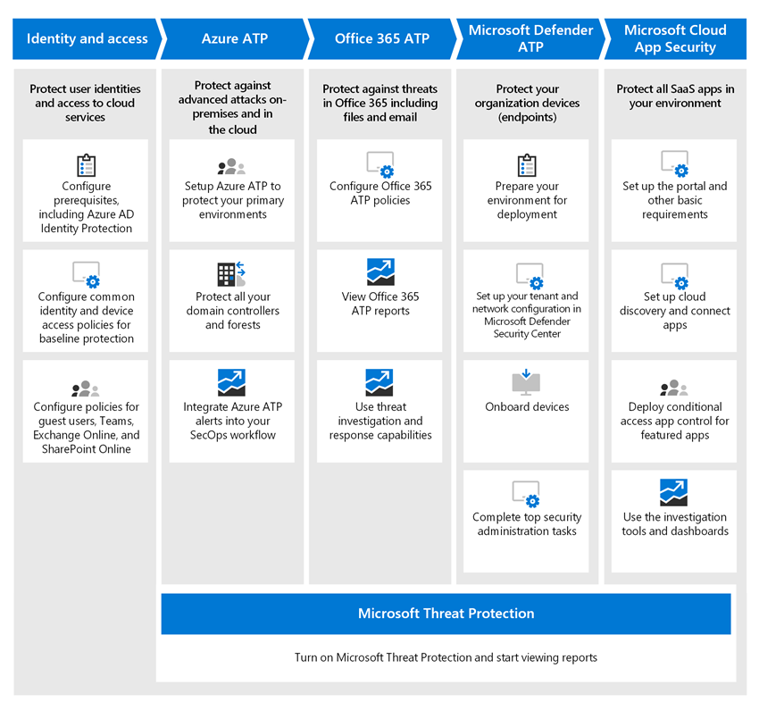

# Deploy threat protection capabilities across Microsoft 365

[Malware](https://docs.microsoft.com/windows/security/threat-protection/intelligence/understanding-malware), and sophisticated cyberattacks, such as [fileless threats](https://docs.microsoft.com/windows/security/threat-protection/intelligence/fileless-threats), are a common occurrence. Businesses need to protect themselves and their customers with effective IT network security capabilities. Such attacks can cause major problems for your organization, ranging from a loss of trust to financial woes, business-threatening downtime, and more. Protecting against threats is important, but it can be challenging to determine where to focus your organization's time, effort, and resources. 

Microsoft security solutions are built into our products and services. Automation and machine learning capabilities reduce the load on your security teams to make sure the right items are addressed. And the strength of Microsoft network security solutions is built on trillions of signals we process every day in our [Intelligent Security Graph](https://cloud-platform-assets.azurewebsites.net/intelligent-security-graph). Microsoft 365 security solutions include [Microsoft 365 Defender](https://docs.microsoft.com/microsoft-365/security/mtp/microsoft-threat-protection), a solution that brings together signals across your email, data, devices, and identities to paint a picture of advanced threats against your organization.

Watch this video for an overview of the deployment process.

> [!VIDEO https://www.microsoft.com/videoplayer/embed/RE4vsI7]

Use this article as a guide for implementing your threat protection solution.

## Threat protection in Microsoft 365 E5

[Microsoft 365 E5](https://www.microsoft.com/microsoft-365/enterprise-e5-business-software?activetab=pivot%3aoverviewtab) enables you to protect your organization with adaptive, built-in intelligence. With the threat protection features in Microsoft 365 E5, you can detect and investigate advanced threats, compromised identities, and malicious actions across your on-premises and cloud environment.

In Microsoft 365 E5, threat protection capabilities are integrated by default. Signals from each capability add strength to the overall ability to detect and respond to threats. The combined set of capabilities offers the best protection for organizations, especially multi-national organizations, compared to running non-Microsoft products. The following image depicts the threat protection services and capabilities in Microsoft 365 E5 that are described in this article.

As soon as you deploy any of the Defender for Office 365 capabilities, you can turn on Microsoft 365 Defender, which brings the signals and data together into one place. 

The following illustration depicts a recommended path for deploying these individual capabilities. 

|Solution/capabilities  |Description  |
|---------|---------|
|Multi-factor authentication and conditional access     |Protect against compromised identities and devices. Begin with this protection because it's foundational. The configuration recommended in this guidance includes Azure AD Identity Protection as a prerequisite.     |
|Microsoft Defender for Identity     |  A cloud-based security solution that leverages your on-premises Active Directory signals to identify, detect, and investigate advanced threats, compromised identities, and malicious insider actions directed at your organization. Focus on Microsoft Defender for Identity next because it protects your on-prem and your cloud infrastructure, has no dependencies or prerequisites, and can provide immediate benefit.       | 
|Microsoft Defender for Office 365     | Safeguards your organization against malicious threats posed by email messages, links (URLs), and collaboration tools. Protections for malware, phishing, spoofing, and other attack types. Configuring Microsoft Defender for Office 365 is recommended next because change control, migrating settings from incumbent system, and other considerations can take longer to deploy.   Note: Make sure to configure the threat protection capabilities that are included in all Office 365 subscriptions (Exchange Online Protection).       |
|Microsoft Defender for Endpoint    | An endpoint protection platform that helps prevent, detect, investigate, and respond to advanced threats.  Defender for Endpoint can take some time to deploy, but configuration can be done in parallel with other capabilities.   |
|Microsoft Cloud App Security     |   A cloud access security broker for discovery, investigation, and governance. You can enable Microsoft Cloud App Security early to begin collecting data and insights. Implementing information and other targeted protection across your SaaS apps involves planning and can take more time.       | 

> [!TIP]
> Organizations with multiple security teams can implement these capabilities in parallel.

## Deploy your threat protection solution

To make sure your organization has the best protection possible, set up and deploy your security solution to include the following steps:

1. [Set up multi-factor authentication and conditional access policies](deploy-threat-protection-configure.md#step-1-set-up-multi-factor-authentication-and-conditional-access-policies)
2. [Configure Microsoft Defender for Identity](deploy-threat-protection-configure.md#step-2-configure-microsoft-defender-for-identity)
3. [Turn on Microsoft 365 Defender](deploy-threat-protection-configure.md#step-3-turn-on-microsoft-365-defender)
4. [Configure Defender for Office 365](deploy-threat-protection-configure.md#step-4-configure-microsoft-defender-for-office-365)
5. [Configure Microsoft Defender for Endpoint](deploy-threat-protection-configure.md#step-5-configure-microsoft-defender-for-endpoint)
6. [Configure Microsoft Cloud App Security](deploy-threat-protection-configure.md#step-6-configure-microsoft-cloud-app-security)
7. [Monitor status and take actions](deploy-threat-protection-configure.md#step-7-monitor-status-and-take-actions)
8. [Train users](deploy-threat-protection-configure.md#step-8-train-users)

Your threat protection features can be configured in parallel, so if you have multiple network security teams responsible for different services, they can configure your organization’s protection features at the same time. The following diagram illustrates the high-level process for deploying threat protection capabilities. 

 
