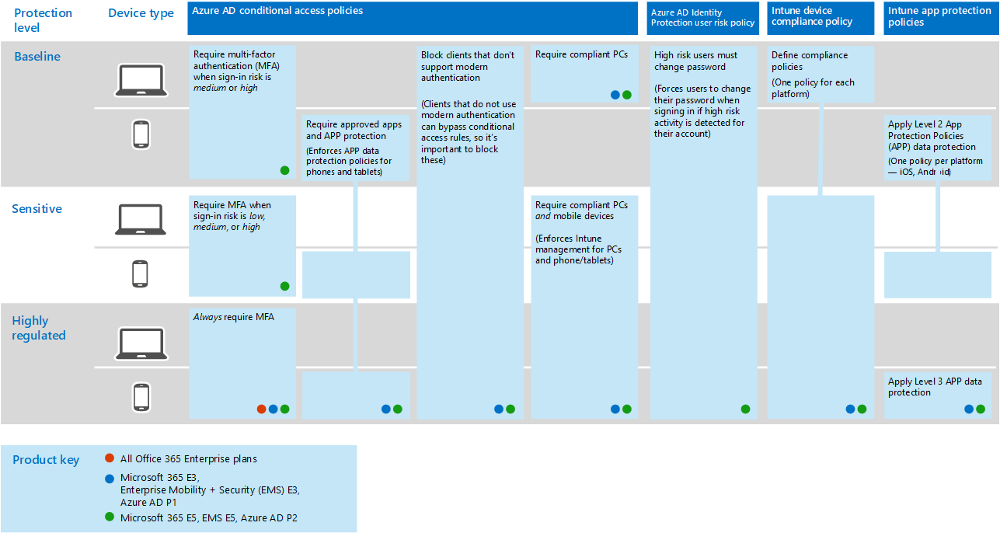

# Deploy threat protection capabilities across Microsoft 365

[Malware](https://docs.microsoft.com/windows/security/threat-protection/intelligence/understanding-malware), and sophisticated cyberattacks, such as [fileless threats](https://docs.microsoft.com/windows/security/threat-protection/intelligence/fileless-threats), are a common occurrence. Businesses must protect themselves and their customers. Such attacks can cause major problems for your organization, ranging from a loss of trust to financial woes, business-threatening downtime, and more. Protecting against threats is important, but it can be challenging to determine where to focus your organization's time, effort, and resources. 

Microsoft network security solutions are built into our products and services. Automation and machine learning capabilities reduce the load on your security teams to make sure the right items are addressed. And the strength of Microsoft security solutions is built on trillions of signals we process every day in our [Intelligent Security Graph](https://cloud-platform-assets.azurewebsites.net/intelligent-security-graph). Microsoft 365 security solutions include [Microsoft Threat Protection](https://docs.microsoft.com/microsoft-365/security/mtp/microsoft-threat-protection), which brings together signals across your email, data, devices, and identities to paint a picture of advanced threats against your organization.

Watch this video for an overview of the deployment process.

> [!VIDEO https://www.microsoft.com/videoplayer/embed/RE4vsI7]

Use this article as a guide for implementing your threat protection solution.

## Threat protection in Microsoft 365 E5

[Microsoft 365 E5](https://www.microsoft.com/microsoft-365/enterprise-e5-business-software?activetab=pivot%3aoverviewtab) enables you to protect your organization with adaptive, built-in intelligence. With the threat protection features in Microsoft 365 E5, you can detect and investigate advanced threats, compromised identities, and malicious actions across your on-premises and cloud environments.

In Microsoft 365 E5, threat protection capabilities are integrated by default. Signals from each capability add strength to the overall ability to detect and respond to threats. The combined set of capabilities offers the best protection for organizations, especially multi-national organizations, compared to running non-Microsoft products. The following image depicts the threat protection services and capabilities in Microsoft 365 E5 that are described in this article.

As soon as you deploy any of the advanced threat protection capabilities, you can turn on Microsoft Threat Protection, which brings the signals and data together into one place. 

The following illustration depicts a recommended path for deploying these individual capabilities. 

|Solution/capabilities  |Description  |
|---------|---------|
|Multi-factor authentication and conditional access     |Protect against compromised identities and devices. Begin with this protection because it's foundational. The configuration recommended in this guidance includes Azure AD Identity Protection as a prerequisite.     |
|Azure Advanced Threat Protection     |  A cloud-based security solution that leverages your on-premises Active Directory signals to identify, detect, and investigate advanced threats, compromised identities, and malicious insider actions directed at your organization. Focus on this next because it protects your on-prem and your cloud infrastructure, has no dependencies or prerequisites, and can provide immediate benefit.       | 
|Office 365 Advanced Threat Protection     | Safeguards your organization against malicious threats posed by email messages, links (URLs), and collaboration tools. Protections for malware, phishing, spoofing, and other attack types. This is recommended next because change control, migrating settings from incumbent system, and other considerations can take longer to deploy.   Note: Be sure you also configure the threat protection capabilities included in all Office 365 subscriptions (Exchange Online Protection).       |
|Microsoft Defender Advanced Threat Protection    | An endpoint protection platform that helps prevent, detect, investigate, and respond to advanced threats. This takes longer to deploy, but can be done in parallel with the other capabilities if other admins are responsible.   |
|Microsoft Cloud App Security     |   A cloud access security broker for discovery, investigation, and governance. You can enable this early to begin collecting data and insights. Implementing information and other targeted protection across your SaaS apps involves planning and can take more time.       | 

> [!TIP]
> Organizations with multiple security teams can implement these capabilities in parallel.

## Deploy your threat protection solution

To make sure your organization has the best protection possible, set up and deploy your security solution to include the following steps:

1. [Set up multi-factor authentication and conditional access policies](#step-1-set-up-multi-factor-authentication-and-conditional-access-policies)
2. [Configure Azure Advanced Threat Protection](#step-2-configure-azure-advanced-threat-protection)
3. [Turn on Microsoft Threat Protection](#step-3-turn-on-microsoft-threat-protection)
4. [Configure Office 365 Advanced Threat Protection](#step-4-configure-office-365-advanced-threat-protection)
5. [Configure Microsoft Defender Advanced Threat Protection](#step-5-configure-microsoft-defender-advanced-threat-protection)
6. [Configure Microsoft Cloud App Security](#step-6-configure-microsoft-cloud-app-security)
7. [Monitor status and take actions](#step-7-monitor-status-and-take-actions)
8. [Train users](#step-8-train-users)

Your threat protection features can be configured in parallel, so if you have multiple security teams responsible for different services, they can configure your organization’s protection features at the same time. The following diagram illustrates the high-level process for deploying threat protection capabilities. 

 

## Step 1: Set up multi-factor authentication and conditional access policies

[Multi-factor authentication](https://docs.microsoft.com/azure/active-directory/authentication/concept-mfa-howitworks) (MFA) requires users to verify their identity with a phone call or authenticator app. [Conditional access policies](https://docs.microsoft.com/azure/active-directory/conditional-access/overview) define certain requirements that must be met in order for users to access apps and data in Microsoft 365. MFA and conditional access policies work together to protect your organization. For example, if someone attempts to sign in from a mobile device using an account that  is not enabled for MFA, and a conditional access policy requires MFA to be in effect, that user will be prevented from signing in.  

Microsoft has tested and recommends a specific set of conditional access and related policies for protecting access to all of your SaaS applications, especially Microsoft 365. Policies are recommended for baseline, sensitive, and highly regulated protection. Begin by implementing the policies for baseline protection. 

[See a larger version of this image](https://github.com/MicrosoftDocs/microsoft-365-docs/raw/public/microsoft-365/media/Identity_device_access_policies_byplan.png)

### To implement baseline protection for Microsoft 365

 

1. [Configure prerequisites, including Azure Identity Protection](../enterprise/identity-access-prerequisites.md).
2. [Configure common identity and device access policies](../enterprise/identity-access-policies.md) for baseline protection.
3. Configure policies for [guest users](../enterprise/identity-access-policies-guest-access.md), [Microsoft Teams](../enterprise/teams-access-policies.md), [Exchange Online](../enterprise/secure-email-recommended-policies.md), and [SharePoint Online and OneDrive](../enterprise/sharepoint-file-access-policies.md).

### More information about protecting identities

- [Identity and device access configurations](../enterprise/microsoft-365-policies-configurations.md)
- [Security guidance for Azure MFA](https://docs.microsoft.com/azure/active-directory/authentication/multi-factor-authentication-security-best-practices)

## Step 2: Configure Azure Advanced Threat Protection

[Azure Advanced Threat Protection](https://docs.microsoft.com/azure-advanced-threat-protection/what-is-atp) (Azure ATP) is a cloud-based security solution that works with your on-premises [Azure Active Directory](https://docs.microsoft.com/azure/active-directory/fundamentals/active-directory-whatis) signals to identify, detect, and investigate advanced threats, compromised identities, and malicious insider actions directed at your organization.

Azure ATP enables security operations (SecOps) analysts and security professionals struggling to detect advanced attacks in hybrid environments to:
- Monitor users, entity behavior, and activities with learning-based analytics.
- Protect user identities and credentials stored in Active Directory.
- Identify and investigate suspicious user activities and advanced attacks throughout the kill chain.
- Provide clear incident information on a simple timeline for fast triage.

### To set up Azure ATP

 

1. [Set up Azure ATP](https://docs.microsoft.com/azure-advanced-threat-protection/install-atp-step1) to protect your primary environments.
2. Protect all your [domain controllers](https://docs.microsoft.com/azure-advanced-threat-protection/atp-sensor-monitoring) and [forests](https://docs.microsoft.com/azure-advanced-threat-protection/atp-multi-forest).
3. Integrate [Azure ATP alerts](https://docs.microsoft.com/azure-advanced-threat-protection/suspicious-activity-guide?tabs=external) into your security operations (SecOps) workflow.

### More information about Azure ATP

- [What is Azure ATP?](https://docs.microsoft.com/azure-advanced-threat-protection/what-is-atp)
- [Video: Introduction to Azure ATP](https://www.youtube.com/watch?reload=9&v=EGY2m8yU_KE)
- [Azure ATP deployment](https://docs.microsoft.com/azure-advanced-threat-protection/what-is-atp#whats-next)

## Step 3: Turn on Microsoft Threat Protection

[Microsoft Threat Protection](https://docs.microsoft.com/microsoft-365/security/mtp/microsoft-threat-protection) combines signals and orchestrates capabilities into a single solution. With the integrated Microsoft Threat Protection solution, security professionals can stitch together the threat signals that each of these products receive and determine the full scope and impact of the threat; how it entered the environment, what it's affected, and how it's currently impacting the organization. Microsoft Threat Protection takes automatic action to prevent or stop the attack and self-heal affected mailboxes, endpoints, and user identities.

Microsoft Threat Protection unifies alerts, incidents, automated investigation and response, and advanced hunting across workloads (Azure ATP, Office 365 ATP, Microsoft Defender ATP, and Microsoft Cloud App Security) into a single pane of glass experience. After you have configured one or more of your advanced threat protection services, turn on Microsoft Threat Protection. New features are added continually to Microsoft Threat Protection; consider opting in to receive preview features.

### To set up Microsoft Threat Protection

 

1. [Review the prerequisites](https://docs.microsoft.com/microsoft-365/security/mtp/prerequisites).
2. [Turn on Microsoft Threat Protection](https://docs.microsoft.com/microsoft-365/security/mtp/mtp-enable).
3. [Opt in for preview features](https://docs.microsoft.com/microsoft-365/security/mtp/preview).

### More information about Microsoft Threat Protection

- [What is Microsoft Threat Protection?](https://docs.microsoft.com/microsoft-365/security/mtp/microsoft-threat-protection)
- [What's new in Microsoft Threat Protection](https://docs.microsoft.com/microsoft-365/security/mtp/whats-new)

## Step 4: Configure Office 365 Advanced Threat Protection

[Office 365 Advanced Threat Protection](https://docs.microsoft.com/microsoft-365/security/office-365-security/office-365-atp) (Office 365 ATP) safeguards your organization against malicious threats in email messages (attachments and URLs), Office documents, and collaboration tools. The following table lists Office 365 ATP features and capabilities that are included in Microsoft 365 E5:

|Configuration, protection, and detection capabilities|Automation, investigation, remediation, and education capabilities|
|---|---|
|[Safe Attachments](https://docs.microsoft.com/microsoft-365/security/office-365-security/atp-safe-attachments) [Safe Links](https://docs.microsoft.com/microsoft-365/security/office-365-security/atp-safe-links) [Safe Documents](https://docs.microsoft.com/microsoft-365/security/office-365-security/safe-docs) [ATP for SharePoint, OneDrive, and Microsoft Teams](https://docs.microsoft.com/microsoft-365/security/office-365-security/atp-for-spo-odb-and-teams) [ATP anti-phishing protection](https://docs.microsoft.com/microsoft-365/security/office-365-security/set-up-anti-phishing-policies#exclusive-settings-in-atp-anti-phishing-policies)|[Threat Trackers](https://docs.microsoft.com/microsoft-365/security/office-365-security/threat-trackers) [Threat Explorer](https://docs.microsoft.com/microsoft-365/security/office-365-security/threat-explorer) [Automated investigation and response](https://docs.microsoft.com/microsoft-365/security/office-365-security/office-365-air) [Attack Simulator](https://docs.microsoft.com/microsoft-365/security/office-365-security/attack-simulator)|
|

With Office 365 ATP, people across your organization can communicate and collaborate more securely, with threat protection for their email content and Office documents.

### To set up Office 365 ATP

 

1. [Set up and configure your Office 365 ATP policies](https://docs.microsoft.com/microsoft-365/security/office-365-security/protect-against-threats).
2. [View and use your Office 365 ATP reports](https://docs.microsoft.com/microsoft-365/security/office-365-security/view-reports-for-atp).
3. [Use threat investigation and response capabilities](https://docs.microsoft.com/microsoft-365/security/office-365-security/office-365-ti).

### More information about Office 365 ATP

- [Office 365 ATP overview](https://docs.microsoft.com/microsoft-365/security/office-365-security/office-365-atp)
- [What's new in Office 365 ATP](https://docs.microsoft.com/microsoft-365/security/office-365-security/whats-new-in-office-365-atp)

## Step 5: Configure Microsoft Defender Advanced Threat Protection

[Microsoft Defender Advanced Threat Protection](https://docs.microsoft.com/windows/security/threat-protection) (Microsoft Defender ATP) protects your organizations devices (also referred to as endpoints) from cyberthreats, advanced attacks, and data breaches. IT network security teams can be more efficient in managing the security of their endpoints. Robust tools help organizations keep up with unpatched systems using vulnerability detection with [Threat and Vulnerability management](https://docs.microsoft.com/windows/security/threat-protection/microsoft-defender-atp/next-gen-threat-and-vuln-mgt). Automated detection and remediation capabilities, such as [attack surface reduction](https://docs.microsoft.com/windows/security/threat-protection/microsoft-defender-atp/overview-attack-surface-reduction), [next-generation protection](https://docs.microsoft.com/windows/security/threat-protection/windows-defender-antivirus/windows-defender-antivirus-in-windows-10), [endpoint detection and response](https://docs.microsoft.com/windows/security/threat-protection/microsoft-defender-atp/overview-endpoint-detection-response), and [automated investigation and remediation](https://docs.microsoft.com/windows/security/threat-protection/microsoft-defender-atp/automated-investigations) help keep your devices safe from malware. On top of these capabilities, customers can get proactive notifications and consult with Microsoft Threat Experts on demand, as part of the opt-in managed hunting service. 

### Set up Microsoft Defender ATP

 

1. [Prepare your Microsoft Defender ATP deployment](https://docs.microsoft.com/windows/security/threat-protection/microsoft-defender-atp/deployment-phases).
2. [Set up your Microsoft Defender ATP deployment](https://docs.microsoft.com/windows/security/threat-protection/micros.oft-defender-atp/production-deployment)
3. [Onboard to the Microsoft Defender ATP service](https://docs.microsoft.com/windows/security/threat-protection/microsoft-defender-atp/onboarding).
4. [Complete your top security administrative tasks](https://docs.microsoft.com/windows/security/threat-protection/microsoft-defender-atp/tvm-security-recommendation).

### More information about Microsoft Defender ATP

- [Learn more about Microsoft Defender ATP](https://docs.microsoft.com/windows/security/threat-protection).
- [Try the Microsoft Defender ATP evaluation lab](https://docs.microsoft.com/windows/security/threat-protection/microsoft-defender-atp/evaluation-lab).

## Step 6: Configure Microsoft Cloud App Security

[Microsoft Cloud App Security](https://docs.microsoft.com/cloud-app-security) is a Cloud Access Security Broker that supports log collection, API connectors, and reverse proxy. Microsoft Cloud App Security provides rich visibility, control over data travel, and sophisticated analytics to identify and combat cyberthreats across all your cloud services. With Microsoft Cloud App Security, your security operations can protect your organization's sensitive information, protect against cyberthreats and anomalies, discover and monitor apps that access your organization's data, and help make sure your organization's cloud apps meet compliance requirements.

### Set up Microsoft Cloud App Security

 

1. [Set up the portal and other basic requirements](https://docs.microsoft.com/cloud-app-security/general-setup).
2. [Set up cloud discovery](https://docs.microsoft.com/cloud-app-security/set-up-cloud-discovery) and [connect apps](https://docs.microsoft.com/cloud-app-security/enable-instant-visibility-protection-and-governance-actions-for-your-apps).
3. [Deploy conditional access app control for featured apps](https://docs.microsoft.com/cloud-app-security/proxy-deployment-aad).
4. [Use the investigation tools and dashboards](https://docs.microsoft.com/cloud-app-security/investigate).

### More information about Microsoft Cloud App Security

- [Review new features and capabilities](https://docs.microsoft.com/cloud-app-security/release-notes).
- [Learn more about Microsoft Cloud App Security](https://docs.microsoft.com/cloud-app-security/what-is-cloud-app-security).

## Step 7: Monitor status and take actions

After you have set up and deployed your threat protection services and capabilities, your next step is to monitor threat detections, and take appropriate actions. Your best starting point is the Microsoft 365 security center ([https://security.microsoft.com](https://security.microsoft.com)), where you can monitor and managing security across your Microsoft identities, data, devices, apps, and infrastructure. 

:::image type="content" source="../media/solutions-architecture-center/m365-security-center.png" alt-text="Microsoft 365 security center":::

The Microsoft 365 security center is specifically intended for security admins and security operations teams. In the Microsoft 365 security center, you can:
- View the overall security health of your organization with [Secure Score](https://docs.microsoft.com/microsoft-365/security/mtp/microsoft-secure-score).
- [Monitor and view reports](https://docs.microsoft.com/microsoft-365/security/mtp/monitoring-and-reporting) on the status of your identities, data, devices, apps, and infrastructure.
- Connect the dots on alerts through [incidents](https://docs.microsoft.com/microsoft-365/security/mtp/incident-queue).
- Use [automated investigation and remediation](https://docs.microsoft.com/microsoft-365/security/mtp/mtp-autoir) to address threats.
- [Proactively hunt for threats](https://docs.microsoft.com/microsoft-365/security/mtp/advanced-hunting-overview), such as intrusion attempts or breach activity affecting your email, data, devices, and identities.
- [Understand the latest attack campaigns](https://docs.microsoft.com/microsoft-365/security/mtp/latest-attack-campaigns) and techniques with threat analytics.
- ... and more!

### More information about the Microsoft 365 security center

- [Get started with the Microsoft 365 security center](https://docs.microsoft.com/microsoft-365/security/mtp/overview-security-center).
- [Monitor and view reports](https://docs.microsoft.com/microsoft-365/security/mtp/monitoring-and-reporting).
- [See the security portals in Microsoft 365](https://docs.microsoft.com/microsoft-365/security/mtp/portals).

## Step 8: Train users

Training users can save your users and security operations team much time and frustration. Savvy users are less likely to open attachments or click links in questionable email messages, and they are more likely to avoid suspicious websites. 

The Harvard Kennedy School [Cybersecurity Campaign Handbook](https://go.microsoft.com/fwlink/?linkid=2015598&amp;clcid=0x409) provides excellent guidance on establishing a strong culture of security awareness within your organization, including training users to identify phishing attacks. 

Microsoft 365 provides the following resources to help inform users in your organization:

|Concept  |Resources  |
|---------|---------|
|Microsoft 365     |[Customizable learning pathways](https://docs.microsoft.com/office365/customlearning/) 
These resources can help you put together training for end users in your organization        |
|Microsoft 365 security |[Learning module: Secure your organization with built-in, intelligent security from Microsoft 365](https://docs.microsoft.com/learn/modules/security-with-microsoft-365) 
This module enables you to describe how Microsoft 365 security features work together and to articulate the benefits of these security features. |
|Multi-factor authentication     | [Two-step verification: What is the additional verification page?](https://docs.microsoft.com/azure/active-directory/user-help/multi-factor-authentication-end-user-first-time) 
This article helps end users understand what multi-factor authentication is and why it's being used at your organization.    |

In addition to this guidance, Microsoft recommends that your users take the actions described in this article: [Protect your account and devices from hackers and malware](https://support.office.com/article/066d6216-a56b-4f90-9af3-b3a1e9a327d6.aspx). These actions include:
- Using strong passwords
- Protecting devices 
- Enabling security features on Windows 10 and Mac PCs (for unmanaged devices)
    
Microsoft also recommends that users protect their personal email accounts by taking the actions recommended in the following articles:
- [Help protect your Outlook.com email account](https://support.microsoft.com/en-us/office/help-protect-your-outlook-com-email-account-a4f20fc5-4307-4ece-8231-6d4d4bd8a9ba)
- [Protect your Gmail account with 2-step verification](https://go.microsoft.com/fwlink/?linkid=2015688&amp;clcid=0x409)
