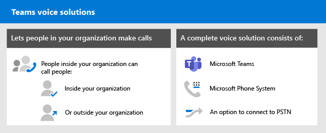
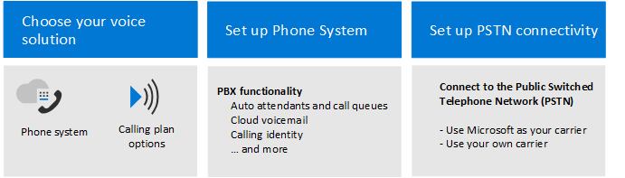

# Plan and deploy a Teams voice solution

A Teams voice solution enables people in your organization to make calls both within and outside your organization. A complete voice solution consists of Teams, Microsoft Phone System, and a choice of options for connecting to the Public Switched Telephone Network (PSTN).

Phone System provides complete Private Branch Exchange (PBX) capabilities for your organization. Calls between users in your organization--no matter their geographic location--are handled internally within Phone System thereby removing long-distance costs on these internal calls.  

By connecting Phone System to the Public Switched Telephone Network (PSTN), your Teams users can make calls outside your organization as well.

This solution guidance helps you to:

- Choose the voice solution that is right for your organization
- Deploy the voice solution you selected

Follow these steps to choose, plan, and configure your voice solution:

1. [Choose your voice solution](/MicrosoftTeams/cloud-voice-landing-page?bc=%2fmicrosoft-365%2fsolutions%2fbreadcrumb%2ftoc.json&toc=%2fmicrosoft-365%2fsolutions%2ftoc.json)

2. [Set up Phone System](/microsoftteams/setting-up-your-phone-system?bc=%2fmicrosoft-365%2fsolutions%2fbreadcrumb%2ftoc.json&toc=%2fmicrosoft-365%2fsolutions%2ftoc.json)

3. Set up PSTN connectivity by choosing one, or a combination, of the following:
   - [Calling Plan](/microsoftteams/set-up-calling-plans?bc=%2fmicrosoft-365%2fsolutions%2fbreadcrumb%2ftoc.json&toc=%2fmicrosoft-365%2fsolutions%2ftoc.json) - Microsoft's all-in-the-cloud solution with Microsoft as your PSTN carrier
   - [Direct Routing](/microsoftteams/direct-routing-configure?bc=%2fmicrosoft-365%2fsolutions%2fbreadcrumb%2ftoc.json&toc=%2fmicrosoft-365%2fsolutions%2ftoc.json) - Use Direct Routing to connect your own PSTN carrier to Teams 

In addition, you might want read about how a large, multi-national corporation migrated to a Teams voice solution in the [Contoso case study](/MicrosoftTeams/voice-case-study-overview?bc=%2fmicrosoft-365%2fsolutions%2fbreadcrumb%2ftoc.json&toc=%2fmicrosoft-365%2fsolutions%2ftoc.json).

For information about required licenses, see the following:

- [Teams add-on licenses](/microsoftteams/teams-add-on-licensing/microsoft-teams-add-on-licensing?bc=%2fmicrosoft-365%2fsolutions%2fbreadcrumb%2ftoc.json&tabs=enterprise#what-voice-features-are-available-with-my-plan/toc.json)

- [Direct Routing licensing requirements](/microsoftteams/direct-routing-plan?bc=%2fmicrosoft-365%2fsolutions%2fbreadcrumb%2ftoc.json#licensing-and-other-requirements/toc.json)
