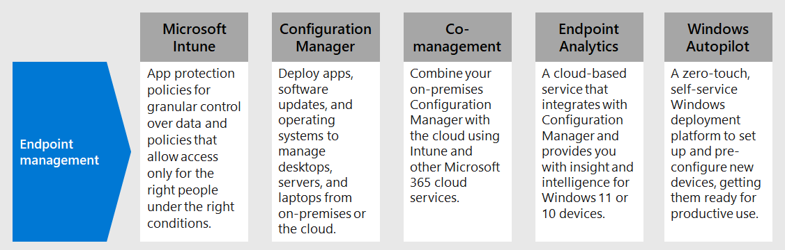

# 3. Deploy endpoint management for your devices, PCs, and other endpoints

With remote workers, you need to support a growing number of personal devices. Endpoint management is a policy-based approach to security that requires devices to comply with specific criteria before they are granted access to resources. Microsoft Endpoint Manager delivers a modern workplace and modern management capabilities to keep your data secure in the cloud and on-premises. 

Endpoint Manager provides services and tools for managing mobile devices, desktop computers, virtual machines, embedded devices, and servers by combining the following services you may already know and be using.

## Microsoft Intune

Intune is designed to help you safeguard data when you don’t manage the devices used to access organization data. Intune app protection policies combined with Azure AD Conditional Access provide granular control over data on mobile devices. Intune also enables you to define comprehensive policies that allow only the right people under the right conditions to access your company data and ensure the data stays protected by controlling how they use it within Office, Outlook and other mobile apps.

For more information, see this [overview of Microsoft Intune](https://docs.microsoft.com/intune/fundamentals/what-is-intune).

## Configuration Manager

Configuration Manager is an on-premises management solution to manage desktops, servers, and laptops that are on your network or internet-based. You can cloud-enable it to integrate with Intune, Azure AD, Microsoft Defender ATP, and other cloud services. Use Configuration Manager to deploy apps, software updates, and operating systems. You can also monitor compliance, query and act on clients in real time, and much more.

For more information, see this [overview of Configuration Manager](https://docs.microsoft.com/mem/configmgr/core/understand/introduction).

## Co-management

Co-management combines your existing on-premises Configuration Manager investment with the cloud using Intune and other Microsoft 365 cloud services. You choose whether Configuration Manager or Intune is the management authority for the seven different workload groups.

As part of Endpoint Manager, co-management uses cloud features, including Conditional Access. You keep some tasks on-premises, while running other tasks in the cloud with Intune.

For more information, see this [overview of co-management](https://docs.microsoft.com/mem/configmgr/comanage/overview).

## Desktop Analytics

Desktop Analytics is a cloud-based service that integrates with Configuration Manager and provides you with insight and intelligence so you can make informed decisions about your Windows clients. It combines data from your organization with data aggregated from millions of devices connected to Microsoft cloud services. With Desktop Analytics, you can create an inventory of apps running in your organization, assess app compatibility with the latest Windows 10 feature updates, identify compatibility issues, and receive mitigation suggestions based on cloud-enabled data insights, create pilot groups that represent the entire application and driver estate across a minimal set of devices, and deploy Windows 10 to pilot and production-managed devices.

For more information, see this [overview of Desktop Analytics](https://docs.microsoft.com/mem/configmgr/desktop-analytics/overview)

## Windows Autopilot

Windows Autopilot is a zero-touch, self-service Windows deployment platform. It includes a collection of technologies used to set up and pre-configure new devices, getting them ready for productive use. You can also use Windows Autopilot to reset, repurpose and recover devices. This solution enables an IT department to achieve the above with little to no infrastructure to manage, with a process that's easy and simple. From the user's perspective, it only takes a few simple operations to make their device ready to use. From the IT pro's perspective, the only interaction required from the end user is to connect to a network and to verify their credentials.

For more information, see this [overview of Windows Autopilot](https://docs.microsoft.com/windows/deployment/windows-autopilot/windows-autopilot).

## Admin technical resources for endpoint management

- [Enroll managed devices for security, leverage app settings for unmanaged devices, and use device and app policies](https://docs.microsoft.com/microsoft-365/enterprise/mobility-infrastructure)
- [How to enroll different types of devices for mobile device management (MDM)](https://docs.microsoft.com/mem/intune/enrollment/device-enrollment)
- [How to educate your end users about Microsoft Intune](https://docs.microsoft.com/mem/intune/fundamentals/end-user-educate)
 
## Results of Step 3

You are using the suite of Endpoint Manager features and capabilities to manage mobile devices, desktop computers, virtual machines, embedded devices, and servers.

## Next step

Continue with [Step 4](empower-people-to-work-remotely-teams-productivity-apps.md) to provide remote access to on-premises apps and services.
