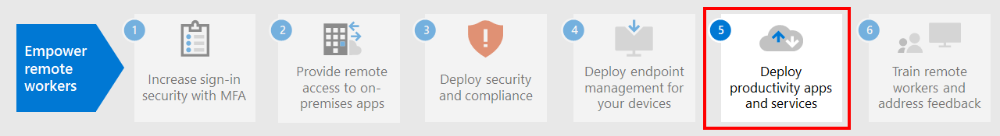

# Step 4. Deploy endpoint management for your devices, PCs, and other endpoints

With hybrid workers, you need to support a growing number of personal devices. Endpoint management is a policy-based approach to security that requires devices to comply with specific criteria before they are granted access to resources. The Microsoft Intune family of products delivers modern management capabilities to keep your data secure in the cloud and on-premises. 

[Microsoft Intune family of products](/mem/endpoint-manager-overview) provides services and tools for managing mobile devices, desktop computers, virtual machines, embedded devices, and servers by combining the following services you may already know and be using.

:::image type="content" source="../media/empower-people-to-work-remotely/endpoint-managment-step-grid.png" alt-text="The components of endpoint management for Microsoft 365" lightbox="../media/empower-people-to-work-remotely/endpoint-managment-step-grid.png":::

## Microsoft Intune

Microsoft Intune is a cloud-based service that focuses on mobile device management (MDM) and mobile application management (MAM) that is included with Microsoft 365. 

- **MDM:** For organization-owned devices, you can exercise full control including settings, features, and security. Devices are "enrolled" in Intune where they receive Intune policies with rules and settings. For example, you can set password and PIN requirements, create a VPN connection, set up threat protection, and more.

- **MAM:** Remote workers might not want you to have full control of their personal devices, also known as bring-your-own device (BYOD) devices. You can give your hybrid workers options and still protect your organization. For example, hybrid workers can enroll their devices if they want full access to your organization resources. Or, if these users only want access to email or Microsoft Teams, then use app protection policies that require multi-factor authentication (MFA) to use these apps.

For more information, see the [Manage devices with Intune](manage-devices-with-intune-overview.md) foundation solution.

## Configuration Manager

Configuration Manager is an on-premises management solution to manage desktops, servers, and laptops that are on your network or internet-based. Use Configuration Manager to deploy apps, software updates, and operating systems. You can also monitor compliance, query and act on clients in real time, and much more. You can cloud-enable it to integrate with Intune, Microsoft Entra ID, Microsoft Defender for Endpoint, and other cloud services. 

For more information, see this [overview of Configuration Manager](/mem/configmgr/core/understand/introduction).

## Co-management

Co-management combines your existing on-premises Configuration Manager investment with the cloud using Intune and other Microsoft 365 cloud services. You choose whether Configuration Manager or Intune is the management authority for different workloads. 

Co-management uses Intune-based cloud features, including Conditional Access and enforcing device compliance. You keep some tasks on-premises, while running other tasks in the cloud.

For more information, see this [overview of co-management](/mem/configmgr/comanage/overview).

## Endpoint Analytics

Endpoint analytics aims to improve user productivity and reduce IT support costs by providing insights into the user experience. The insights enable IT to optimize the end-user experience with proactive support and to detect regressions to the user experience by assessing user impact of configuration changes.

For more information, see this [overview of Endpoint Analytics](/mem/analytics/overview)

## Windows Autopilot

Windows Autopilot is a zero-touch, self-service Windows deployment platform. It includes a collection of technologies you use to set up and pre-configure new devices, getting them ready for productive use. You can also use Windows Autopilot to reset, repurpose and recover devices. 

Windows Autopilot enables an IT department to pre-configure devices with little to no infrastructure to manage, with a process that's easy and simple. 

- From the user's perspective, it only takes a few simple operations to make their device ready to use. 
- From the IT pro's perspective, the only interaction required from the end user is to connect to a network and to verify their credentials.

For more information, see this [overview of Windows Autopilot](/windows/deployment/windows-autopilot/windows-autopilot).

## Admin technical resources for endpoint management

- [Device management roadmap for Microsoft 365](../enterprise/device-management-roadmap-microsoft-365.md)
- [How to enroll different types of devices for mobile device management](/mem/intune/enrollment/device-enrollment)
- [How to educate your end users about Microsoft Intune](/mem/intune/fundamentals/end-user-educate)
 
## Results of Step 4

You are using the Microsoft Intune product family's features and capabilities to manage mobile devices, desktop computers, virtual machines, embedded devices, and servers.

## Next step

Continue with [Step 5](empower-people-to-work-remotely-teams-productivity-apps.md) to get your hybrid workers using Microsoft 365 productivity apps such as Microsoft Teams.
