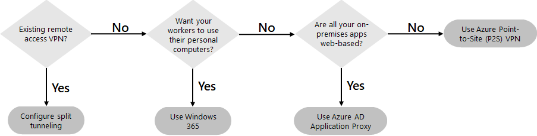
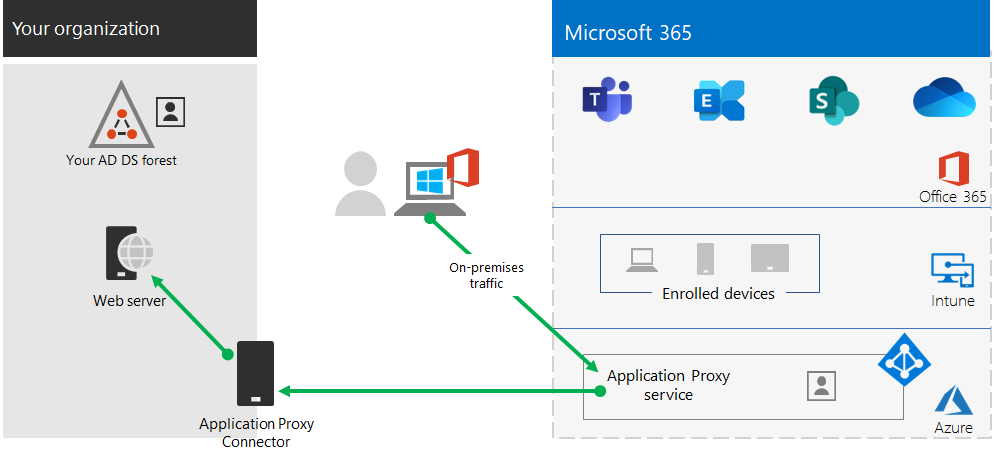
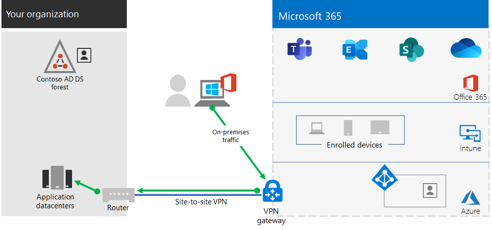
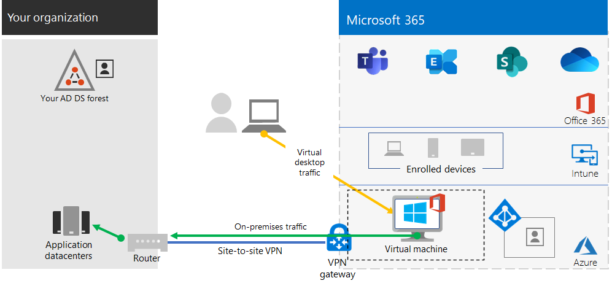
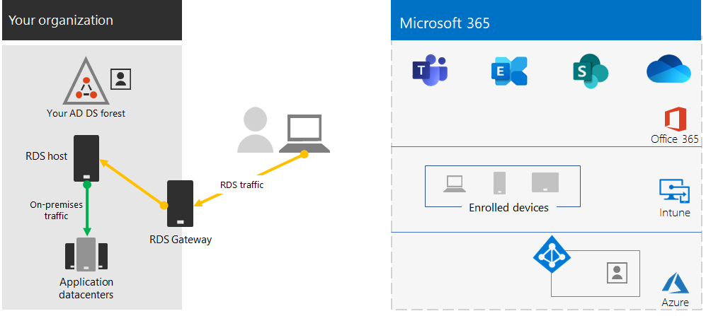
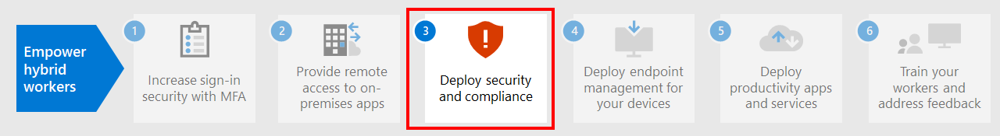

# Step 2. Provide remote access to on-premises apps and services

If your organization uses a remote access VPN solution, typically with VPN servers on the edge of your network and VPN clients installed on your users' devices, your users can use remote access VPN connections to access on-premises apps and servers. But you may need to optimize traffic to Microsoft 365 cloud-based services.

If your users do not use a VPN solution, you can use Azure Active Directory (Azure AD) Application Proxy and Azure Point-to-Site (P2S) VPN to provide access, depending on whether all your apps are web-based.

Here are the primary configurations for remote access:

- You are already using a remote access VPN solution.
- You are not using a remote access VPN solution and you want your remote workers to use their personal computers.
- You are not using a remote access VPN solution, you have hybrid identity, and you need remote access only to on-premises web-based apps.
- You are not using a remote access VPN solution and you need access to on-premises apps, some of which are not web-based.

See this flowchart for the remote access configuration options discussed in this article.

With remote access connections, you can also use [Remote Desktop](https://support.microsoft.com/help/4028379/windows-10-how-to-use-remote-desktop) to connect your users to an on-premises PC. For example, a remote worker can use Remote Desktop to connect to the PC in their office from their Windows, iOS, or Android device. Once they are remotely connected, they can use it as if they were sitting in front of it.

## Optimize performance for remote access VPN clients to Microsoft 365 cloud services

If your remote workers are using a traditional VPN client to obtain remote access to your organization network, verify that the VPN client has split tunneling support.

Without split tunneling, all of your remote work traffic gets sent across the VPN connection, where it must be forwarded to your organization’s edge devices, get processed, and then sent on the Internet.

Microsoft 365 traffic must take an indirect route through your organization, which could be forwarded to a Microsoft network entry point far away from the VPN client’s physical location. This indirect path adds latency to the network traffic and decreases overall performance. 

With split tunneling, you can configure your VPN client to exclude specific types of traffic from being sent over the VPN connection to the organization network.

To optimize access to Microsoft 365 cloud resources, configure your split tunneling VPN clients to exclude traffic to the **Optimize** category Microsoft 365 endpoints over the VPN connection. For more information, see [Office 365 endpoint categories](../enterprise/microsoft-365-network-connectivity-principles.md#new-office-365-endpoint-categories). See [this list](../enterprise/urls-and-ip-address-ranges.md) of Optimize category endpoints.

Here is the resulting traffic flow, in which most of the traffic to Microsoft 365 cloud apps bypass the VPN connection.

This allows the VPN client to send and receive crucial Microsoft 365 cloud service traffic directly over the Internet and to the nearest entry point into the Microsoft network.

For more information and guidance, see [Optimize Office 365 connectivity for remote users using VPN split tunneling](../enterprise/microsoft-365-vpn-split-tunnel.md).

## Deploy remote access when all your apps are web apps and you have hybrid identity

If your remote workers are not using a traditional VPN client and your on-premises user accounts and groups are synchronized with Azure AD, you can use Azure AD Application Proxy to provide secure remote access for web-based applications hosted on on-premises servers. Web-based applications include SharePoint Server sites, Outlook Web Access servers, or any other web-based line of business applications. 

Here are the components of Azure AD Application Proxy.

For more information, see this [overview of Azure AD Application Proxy](/azure/active-directory/manage-apps/application-proxy).

>[!Note]
>Azure AD Application Proxy is not included with a Microsoft 365 subscription. You must pay for usage with a separate Azure subscription.
>

## Deploy remote access when not all your apps are web apps

If your remote workers are not using a traditional VPN client and you have apps that are not web-based, you can use an Azure Point-to-Site (P2S) VPN.

A P2S VPN connection creates a secure connection from a remote worker’s device to your organization network through an Azure virtual network. 

For more information, see this [overview of P2S VPN](/azure/vpn-gateway/point-to-site-about).

>[!Note]
>Azure P2S VPN is not included with a Microsoft 365 subscription. You must pay for usage with a separate Azure subscription.
>

## Deploy Windows Virtual Desktop to provide remote access for remote workers using personal devices 

To support remote workers who can only use their personal and unmanaged devices, use Windows Virtual Desktop in Azure to create and allocate virtual desktops for your users to use from home. Virtualized PCs can act just like PCs connected to your organization network.

For more information, see this [overview of Windows Virtual Desktop](/azure/virtual-desktop/overview). 

>[!Note]
>Windows Virtual Desktop is not included with a Microsoft 365 subscription. You must pay for usage with a separate Azure subscription.
>

## Protect your Remote Desktop Services connections with the Remote Desktop Services Gateway

If you are using Remote Desktop Services (RDS) to allow employees to connect into Windows-based computers on your on-premises network, you should use a Microsoft Remote Desktop Services gateway in your edge network. The gateway uses Transport Layer Security (TLS) to encrypt traffic and prevents the on-premises computer hosting RDS from being directly exposed to the Internet.

See [this article](https://www.microsoft.com/security/blog/2020/04/16/security-guidance-remote-desktop-adoption/) for more information.

## Admin technical resources for remote access

- [How to quickly optimize Office 365 traffic for remote staff & reduce the load on your infrastructure](https://techcommunity.microsoft.com/t5/office-365-blog/how-to-quickly-optimize-office-365-traffic-for-remote-staff-amp/ba-p/1214571)
- [Optimize Office 365 connectivity for remote users using VPN split tunneling](../enterprise/microsoft-365-vpn-split-tunnel.md)

## Results of Step 2

After deployment of a remote access solution for your remote workers:

| Remote access configuration | Results |
|:-------|:-----|
| A remote access VPN solution is in place | You have configured your remote access VPN client for split tunneling and for the Optimize category of Microsoft 365 endpoints. |
| No remote access VPN solution and you need remote access only to on-premises web-based apps | You have configured Azure Application Proxy. |
| No remote access VPN solution and you need access to on-premises apps, some of which are not web-based | You have configured Azure P2S VPN. |
| Remote workers are using their personal devices from home | You have configured Windows Virtual Desktop. |
| Remote workers are using RDS connections to on-premises systems | You have deployed a Remote Desktop Services gateway in your edge network. |
|||

## Next step

Continue with [Step 3](empower-people-to-work-remotely-security-compliance.md) to deploy Microsoft 365 security and compliance services to protect your apps, data, and devices.