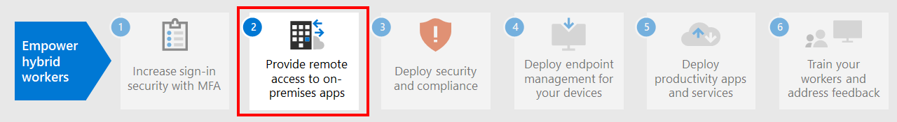

# Step 1. Increase sign-in security for hybrid workers with MFA

To increase the security of sign-ins of your hybrid workers, use multi-factor authentication (MFA). MFA requires that user sign-ins be subject to an additional verification beyond the user account password. Even if a malicious user determines a user account password, they must also be able to respond to an additional verification, such as a text message sent to a smartphone before access is granted.

For all users, including hybrid workers and especially admins, Microsoft strongly recommends MFA.

There are three ways to require your users to use MFA based on your Microsoft 365 plan.

|Plan  |Recommendation  |
|---------|---------|
|All Microsoft 365 plans (without Azure AD Premium P1 or P2 licenses)     |[Enable Security defaults in Azure AD](/azure/active-directory/fundamentals/concept-fundamentals-security-defaults). Security defaults in Azure AD include MFA for users and administrators.   |
|Microsoft 365 E3 (includes Azure AD Premium P1 licenses)     | Use [Common Conditional Access policies](/azure/active-directory/conditional-access/concept-conditional-access-policy-common) to configure the following policies:  - [Require MFA for administrators](/azure/active-directory/conditional-access/howto-conditional-access-policy-admin-mfa)  - [Require MFA for all users](/azure/active-directory/conditional-access/howto-conditional-access-policy-all-users-mfa)   - [Block legacy authentication](/azure/active-directory/conditional-access/howto-conditional-access-policy-block-legacy)       |
|Microsoft 365 E5 (includes Azure AD Premium P2 licenses)     | Taking advantage of Azure AD Identity Protection, begin to implement Microsoft's [recommended set of Conditional Access and related policies](../security/office-365-security/identity-access-policies.md) by creating these policies:  - [Require MFA when sign-in risk is medium or high](../security/office-365-security/identity-access-policies.md#require-mfa-based-on-sign-in-risk)  - [Block clients that don't support modern authentication](../security/office-365-security/identity-access-policies.md#block-clients-that-dont-support-multi-factor) - [High risk users must change password](../security/office-365-security/identity-access-policies.md#high-risk-users-must-change-password)       |
| | |

## Security defaults

Security defaults is a new feature for Microsoft 365 and Office 365 paid or trial subscriptions created after October 21, 2019. These subscriptions have security defaults turned on, which ***requires all of your users to use MFA with the Microsoft Authenticator app***.
 
Users have 14 days to register for MFA with the Microsoft Authenticator app from their smart phones, which begins from the first time they sign in after security defaults has been enabled. After 14 days have passed, the user won't be able to sign in until MFA registration is completed.

Security defaults ensure that all organizations have a basic level of security for user sign-in that is enabled by default. You can disable security defaults in favor of MFA with Conditional Access policies or for individual accounts.

For more information, see this [overview of security defaults](/azure/active-directory/fundamentals/concept-fundamentals-security-defaults).

## Conditional Access policies

Conditional Access policies are a set of rules that specify the conditions under which sign-ins are evaluated and allowed. For example, you can create a Conditional Access policy that states:

- If the user account name is a member of a group for users that are assigned the Exchange, user, password, security, SharePoint, or global administrator roles, require MFA before allowing access.

This policy allows you to require MFA based on group membership, rather than trying to configure individual user accounts for MFA when they are assigned or unassigned from these administrator roles.

You can also use Conditional Access policies for more advanced capabilities, such as requiring that the sign-in is done from a compliant device, such as your laptop running Windows 10.

Conditional Access requires Azure AD Premium P1 licenses, which are included with Microsoft 365 E3 and E5.

For more information, see this [overview of Conditional Access](/azure/active-directory/conditional-access/overview).

## Azure AD Identity Protection support

With Azure AD Identity Protection, you can create an additional Conditional Access policy that states:

- If the risk of the sign-in is determined to be medium or high, require MFA.

Azure AD Identity Protection requires Azure AD Premium P2 licenses, which are included with Microsoft 365 E5.

For more information, see [Risk-based Conditional Access](/azure/active-directory/conditional-access/howto-conditional-access-policy-risk#require-mfa-medium-or-high-sign-in-risk-users).

With Azure AD Identity Protection, you can also create a policy to require your users to register for MFA. For more information, see [Configure the Azure AD Multi-Factor Authentication registration policy](/azure/active-directory/identity-protection/howto-identity-protection-configure-mfa-policy)

## Using these methods together

Keep the following in mind:

- You cannot enable security defaults if you have any Conditional Access policies enabled.
- You cannot enable any Conditional Access policies if you have security defaults enabled.

If security defaults are enabled, all new users are prompted for MFA registration and the use of the Microsoft Authenticator app. 

This table shows the results of enabling MFA with security defaults and Conditional Access policies.

| Method | Enabled | Disabled | Additional authentication method |
|:-------|:-----|:-------|:-------|
| **Security defaults**  | Can’t use Conditional Access policies | Can use Conditional Access policies | Microsoft Authenticator app |
| **Conditional Access policies** | If any are enabled, you can’t enable security defaults | If all are disabled, you can enable security defaults  | User specifies during MFA registration  |
||||

## Let your users reset their own passwords

Self-Service Password Reset (SSPR) enables users to reset their own passwords without impacting IT staff. Users can quickly reset their passwords at any time and from any place. For more information, see [Plan an Azure AD self-service password reset deployment](/azure/active-directory/authentication/howto-sspr-deployment).

## Sign in to SaaS apps with Azure AD

In addition to providing cloud authentication for users, Azure AD can also be your central way to secure all your apps, whether they’re on-premises, in Microsoft’s cloud, or in another cloud. By [integrating your apps into Azure AD](/azure/active-directory/manage-apps/plan-an-application-integration), you can make it easy for hybrid workers to discover the applications they need and sign into them securely.

## Admin technical resources for MFA and identity

- [Top 5 ways your Azure AD can help you enable remote work](https://techcommunity.microsoft.com/t5/azure-active-directory-identity/top-5-ways-your-azure-ad-can-help-you-enable-remote-work/ba-p/1144691)
- [Identity roadmap for Microsoft 365](../enterprise/identity-roadmap-microsoft-365.md)
- [Azure Academy Azure AD training videos](https://www.youtube.com/watch?v=pN8o0owHfI0&list=PL-V4YVm6AmwUFpC3rXr2i2piRQ708q_ia)

## Results of Step 1

After deployment of MFA, your users:

- Are required to use MFA for sign-ins.
- Have completed the MFA registration process and are using MFA for all sign-ins.
- Can use SSPR to reset their own passwords.

## Next step

Continue with [Step 2](empower-people-to-work-remotely-remote-access.md) to provide remote access to on-premises apps and services.