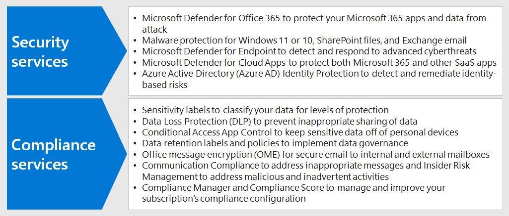
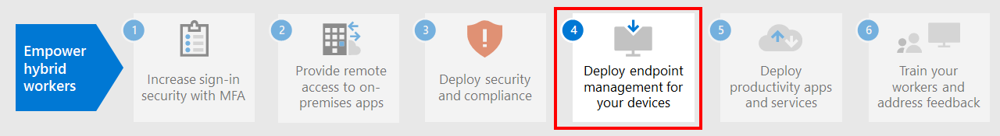

# Step 3: Deploy security and compliance for remote workers

For remote workers, some of whom never go into the office or who go infrequently, security and compliance are an important part of the overall solution. All of their communications occur over the Internet instead of being confined to an organizational intranet. 

There are things you and your workers can do to remain productive while decreasing cybersecurity risk and maintaining compliance with your internal policies and data regulations.

Remote work needs these elements of security and compliance:

- Controlled access to the productivity apps that remote workers use, such as Microsoft Teams 
- Controlled access to and protection of the data that remote workers create and use, such as chat conversations or shared files
- Protection of Windows 10 devices from malware and other types of cyberattacks
- Protection of email, files, and site with consistent labeling for levels of sensitivity and protection
- Prevention of leaked information
- Adherence to regional data regulations

Here are the features of Microsoft 365 that provide security and compliance services for remote workers.

## Security

Protect your applications and data with these security features of Microsoft 365.

| Capability or feature | Why I need it | Licensing |
|:-------|:-----|:-------|
| Microsoft Defender for Office 365 | Protect your Microsoft 365 apps and data—such as email messages, Office documents, and collaboration tools—from attack.    Microsoft Defender for Office 365 collects and analyzes signals from your apps for detection, investigation, and remediation of security risks and safeguards your organization against malicious threats posed by email messages, links (URLs), and collaboration tools. It also provides automated tenant configuration assessment and configuration tooling for standard and strict security postures. | Microsoft 365 E3 or E5 | 
| Malware protection | ‎Microsoft Defender Antivirus and Device Guard provides device-based malware protection.    SharePoint‎ Online automatically scans file uploads for known malware. ‎   Exchange Online Protection‎ (‎EOP‎) secures cloud mailboxes. | Microsoft 365 E3 or E5 |
| Microsoft Defender for Endpoint | Protect your organization’s devices from cyber threats and data breaches and detect, investigate, and respond to advanced threats. | Microsoft 365 E5 |
| Cloud App Security | Protect your cloud-based services—both Microsoft 365 and other SaaS apps—from attack. | Microsoft 365 E5 or individual Cloud App Security licenses |
| Azure AD Identity Protection	| Automate detection and remediation of identity-based risks.   Create risk-based Conditional Access policies to require multi-factor authentication (MFA) for risky sign-ins. | Microsoft 365 E5 or E3 with Azure AD Premium P2 licenses |
||||

See [Top 12 tasks for security teams to support working from home](../security/top-security-tasks-for-remote-work.md) for more information.

## Compliance

Comply with internal policies or regulatory requirements with these compliance features of Microsoft 365.

| Capability or feature | Why I need it | Licensing |
|:-------|:-----|:-------|
| Sensitivity labels | Classify and protect your organization's data without hindering the productivity of users and their ability to collaborate by placing labels with various levels of protection on email, files, or sites. | Microsoft 365 E3 or E5 |
| Data Loss Protection (DLP) | Detect, warn, and block risky, inadvertent, or inappropriate sharing, such as sharing of data containing personal information, both internally and externally. | Microsoft 365 E3 or E5 | 
| Conditional Access App Control | Prevent sensitive data from being downloaded to users' personal devices. | Microsoft 365 E3 or E5 |
| Data retention labels and policies | Implement information governance controls, such as how long to keep data and requirements on the storage of personal data on customers, to comply with your organization's policies or data regulations. | Microsoft 365 E3 or E5 |
| Office message encryption (OME) | Send and receive encrypted email messages between people inside and outside your organization that contains regulated data, such as personal data on customers. | Microsoft 365 E3 or E5 |
| Compliance Manager | Manage regulatory compliance activities related to Microsoft cloud services with this workflow-based risk assessment tool in the Microsoft Service Trust Portal. | Microsoft 365 E3 or E5 |
| Compliance Manager | See an overall score of your current compliance configuration and recommendations for improving it in the Microsoft 365 compliance center. | Microsoft 365 E3 or E5 |
| Communication Compliance  | Detect, capture, and take remediation actions for inappropriate messages in your organization. | Microsoft 365 E5 or Microsoft 365 E3 with the Compliance or Insider Risk Management add-ons |
| Insider Risk Management |  Detect, investigate, and act on malicious and inadvertent risks in your organization. Microsoft 365 can detect these kinds of risks even when a worker is using an unmanaged device. | Microsoft 365 E5 or Microsoft 365 E3 with the Compliance or Insider Risk Management add-ons |
||||

See [Quick tasks for getting started with Microsoft 365 compliance](../compliance/compliance-quick-tasks.md) for more information.

## Results of Step 3

For your remote workers, you have implemented:

- Security
  - Controlled access to apps and data that remote workers use to communicate and collaborate
  - Malware protection for cloud service data, email, and Windows 10 devices 
- Compliance
  - Consistent labeling for levels of sensitivity and protection
  - Policies to prevention information leakage
  - Adherence to regional data regulations

## Next step

Continue with [Step 4](empower-people-to-work-remotely-manage-endpoints.md) to manage your devices, PCs, and other endpoints.
