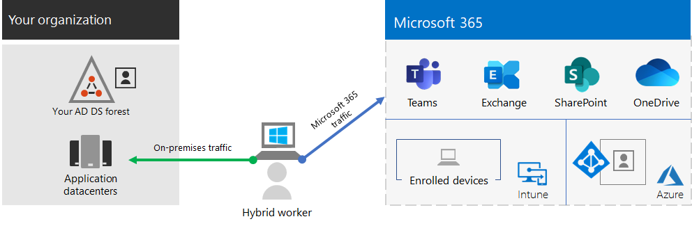
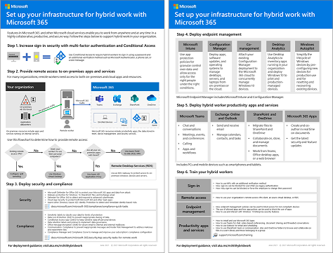
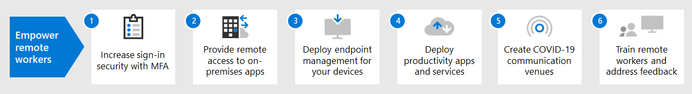

# Set up your infrastructure for hybrid work with Microsoft 365

To secure and optimize your worker’s productivity and collaboration, you need to allow on-site and remote workers to easily and securely access your organization's on-premises and cloud-based information, tools, and resources. This solution steps through the deployment of key layers of infrastructure that empower your workers to do their best work, wherever they are.

Hybrid workers can work on-site or remotely in a combination of locations. Allowing workers to work away from a traditional office is important for many organizations to:

- Hire and retain workers who are unwilling to relocate or require a flexible work environment.
- Reduce worker commuting, leaving workers with more time to be productive and for stress-reducing activities outside of work.
- Save on office space.

Microsoft 365 has the capabilities to empower your hybrid workers to work either on-site or remotely.

>[!Note]
>If you are new to Microsoft 365, see [these resources](https://www.microsoft.com/microsoft-365).
>

Watch this video for an overview of the deployment process.
 
 
> [!VIDEO https://www.microsoft.com/videoplayer/embed/RE4F1af]

For IT professionals managing onsite and cloud-based infrastructure to enable hybrid worker productivity, this solution provides these key capabilities:

- Connected

  From anywhere in the world and at any time, your workers are able to access: 

  - Cloud-based services and data in your Microsoft 365 subscription. 

  - Organization resources, such those offered by on-premises application datacenters.

- Secure

  Sign-ins are secured with multi-factor authentication (MFA) and built-in security features of Microsoft 365 and Windows 10 protect against malware, malicious attacks, and data loss.

- Managed

  Your hybrid worker's devices can be managed from the cloud with security settings, allowed apps, and to require compliance with system health.

- Collaborative and productive

  Your hybrid workers can be as productive as on-premises in a highly collaborative way with:

  - Online meetings and chat sessions with Teams. 

  - Shared workspaces for cloud-based file storage with global accessibility and real-time collaboration with SharePoint and OneDrive.

  - Shared tasks and workflows to divide up the work and get things done. 

For a seamless sign-in experience, your on-premises Active Directory Domain Services (AD DS) user accounts should be synchronized with Azure Active Directory (Azure AD). To protect your Windows 10 devices, they should be enrolled in Intune. Here is a high-level view of the infrastructure.

To enable the capabilities of Microsoft 365 for your hybrid workers, use these Microsoft 365 features.

| Capability or feature | Description | Licensing |
|:-------|:-----|:-------|
| MFA enforced with security defaults	| Protect against compromised identities and devices by requiring a second form of authentication for sign-ins. Security defaults requires MFA for all user accounts.	| Microsoft 365 E3 or E5 |
| MFA enforced with Conditional Access| Require MFA based on the properties of the sign-in with Conditional Access policies.	| Microsoft 365 E3 or E5 | 
| MFA enforced with risk-based Conditional Access	| Require MFA based on the risk of the user sign-in with Microsoft Defender for Identity. | Microsoft 365 E5 or E3 with Azure AD Premium P2 licenses | 
| Self-Service Password Reset (SSPR)	| Allow your users to reset or unlock their passwords or accounts.	| Microsoft 365 E3 or E5 |
| Azure AD Application Proxy	| Provide secure remote access for web-based applications hosted on intranet servers.	| Requires separate paid Azure subscription |
| Azure Point-to-Site VPN	| Create a secure connection from a remote worker’s device to your intranet through an Azure virtual network.	| Requires separate paid Azure subscription |
| Windows Virtual Desktop	| Support remote workers who can only use their personal and unmanaged devices with virtual desktops running in Azure. | Requires separate paid Azure subscription |
| Remote Desktop Services (RDS)	| Allow employees to connect into Windows-based computers on your intranet.	| Microsoft 365 E3 or E5 | 
| Remote Desktop Services Gateway	| Encrypt communications and prevent the RDS hosts from being directly exposed to the Internet.	| Requires separate Windows Server licenses |
| Microsoft Intune | Manage devices and applications.	| Microsoft 365 E3 or E5 | 
| Configuration Manager	| Manage software installations, updates, and settings on your devices | Requires separate Configuration Manager licenses |
| Desktop Analytics	| Determine the update readiness of your Windows clients.	| Requires separate Configuration Manager licenses |
| Windows Autopilot	| Set up and pre-configure new Windows 10 devices for productive use.	| Microsoft 365 E3 or E5 |
| Microsoft Teams, Exchange Online, SharePoint Online and OneDrive, Microsoft 365 Apps, Microsoft Power Platform, and Yammer | Create, communicate, and collaborate. | Microsoft 365 E3 or E5 |
||||

For security and compliance criteria, see [Deploy security and compliance for remote workers](empower-people-to-work-remotely-security-compliance.md).

For a 2-page summary of this solution, see the [Empower hybrid workers poster](../downloads/empower-remote-workers.pdf).

You can also download this poster in [PDF](https://github.com/MicrosoftDocs/microsoft-365-docs/raw/public/microsoft-365/downloads/empower-remote-workers.pdf) or  [PowerPoint](https://download.microsoft.com/download/5/1/1/511b77a9-a34c-4ea7-af2a-32b07f20b780/empower-remote-workers.pptx) formats and print it on letter, legal, or tabloid (11 x 17) size paper.

## Provide hybrid working for all of your workers

You can enable all of your workers to stay productive from anywhere with these devices:

- A modern device, such as a Surface laptop and Windows 10, which has the features, security, and performance to access Microsoft 365 cloud apps and services directly over the web.

- Any device including older laptops or desktops used from home, which can access Microsoft 365 cloud apps and services indirectly through a quickly deployed [Windows 10-based virtual desktop](empower-people-to-work-remotely-remote-access.md#deploy-windows-virtual-desktop-to-provide-remote-access-for-remote-workers-using-personal-devices). This option provides high performance, strong security, and simplified IT management.

## Next steps

Use these steps to secure and optimize access to your organization's servers and cloud services and maximize your hybrid worker's productivity.

1. [Increase sign-in security with MFA](empower-people-to-work-remotely-secure-sign-in.md)
2. [Provide remote access to on-premises apps and services](empower-people-to-work-remotely-remote-access.md)
3. [Deploy security and compliance services](empower-people-to-work-remotely-security-compliance.md)
4. [Deploy endpoint management for your devices, PCs, and other endpoints](empower-people-to-work-remotely-manage-endpoints.md)
5. [Deploy hybrid worker productivity apps and services](empower-people-to-work-remotely-teams-productivity-apps.md)
6. [Train your workers and address usage feedback](empower-people-to-work-remotely-train-monitor-usage.md)

To see how a fictional but representative multi-national organization set up its infrastructure for hybrid work, see [Contoso's COVID-19 response and infrastructure for hybrid work](contoso-remote-onsite-work.md).
