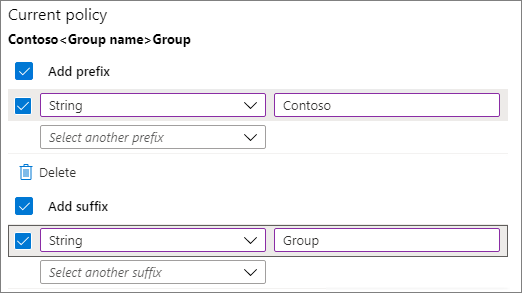

# Microsoft 365 Groups and Microsoft Teams naming policy

You can use a naming policy to enforce a consistent naming strategy for Microsoft 365 groups  and teams created by users in your organization. A naming policy can help you and your users identify the function of the group, membership, geographic region, or who created the group. The naming policy can also help categorize groups in the address book. You can use the policy to block specific words from being used in group names and aliases.

The naming policy is applied to groups that are created across all groups workloads (like Outlook, Microsoft Teams, SharePoint, Planner, Viva Engage, etc.). It gets applied to both the group name and group alias. It also gets applied when a user creates a group and when the group name, alias, description, or avatar is edited for an existing group.

> [!TIP]
> A Microsoft 365 group naming policy only applies to Microsoft 365 groups. It doesn't apply to distribution groups created in Exchange Online. To create a naming policy for distribution groups, see [Create a distribution group naming policy](/exchange/recipients-in-exchange-online/manage-distribution-groups/create-group-naming-policy).

The group naming policy consists of the following features:

- **Prefix-Suffix naming policy**: You can use prefixes or suffixes to define the naming convention of groups (for example: "US\_My Group\_Engineering"). The prefixes/suffixes can either be fixed strings or user attributes like [Department] that are substituted based on the user who is creating the group.

- **Custom Blocked Words**: You can upload a set of blocked words specific to your organization that would be blocked in groups created by users. (For example: "CEO, Payroll, HR").

## Licensing requirements

Using Azure AD naming policy for Microsoft 365 Groups requires that you possess but not necessarily assign an Azure Active Directory Premium P1 license or Azure AD Basic EDU license for each unique user (including guests) that is a member of one or more Microsoft 365 groups.

This is also required for the administrator that creates the groups naming policy.

## Prefix-Suffix naming policy

Prefixes and suffixes can either be fixed strings or user attributes.

### Fixed strings

You can use short strings that can help you differentiate groups in the global address list and left navigation of the group workloads. Some of the common prefixes suffixes are keywords like 'Grp\_Name' , '\#Name', '\_Name'

### Attributes

You can use attributes that can help identify who created the group like [Department] and where it was created from like [Country].

Examples:

- Policy = "GRP [GroupName] [Department]"
- User's department = Engineering
- Created group name = "GRP My Group Engineering"

Supported Azure Active Directory (Azure AD) attributes are [Department], [Company], [Office], [StateOrProvince], [CountryOrRegion], and [Title].

- Unsupported user attributes are considered as fixed strings, for example [postalCode].

- Extension attributes and custom attributes aren't supported.

It's recommended that you use attributes that have values filled in for all users in your organization and don't use attributes that have longer values.

### Things to look out for

- During policy creation, the total prefixes and suffixes string length is restricted to 53 characters.

- Prefixes and suffixes can contain special characters supported in group name and group alias. When the prefixes and suffixes contain special characters that aren't allowed in the group alias, they're only applied to the group name. So in this case, the prefixes and suffixes applied to group name would be different from the ones applied to the group alias.

  > [!NOTE]
  > A period (.) or a hyphen (-) is permitted anywhere in the group name, except at the beginning or end of the name. An underscore (_) is permitted anywhere in the group name, including at the beginning or end of the name.

- If you are using Viva Engage Office 365 connected groups, avoid using the following characters in your naming policy: @, \#, \[, \], \<, and \>. If these characters are in the naming policy, regular Viva Engage users can't create groups.

> [!Tip]
> - Use short strings as suffix.
> - Use attributes with values.
> - Don't be too creative, total name length has a maximum of 264 characters.
> - Upload your organization specific blocked words to restrict usage.

## Custom blocked words

You can enter a comma separated list of blocked words to be blocked in group names and aliases.

No substring searches are carried out; specifically, an exact match between the user entered name and the custom blocked words is required to trigger a failure.

**Things to look out for**:

- The blocked words are case-insensitive.

- When a user enters a blocked word, the group client shows an error message with the blocked word.

- There are no character restrictions in the blocked words used.

- There's a limit of 5000 words that can be set as blocked words.

## Admin override

Some administrators are exempted from these policies, across all group workloads and endpoints, so that they can create groups with these blocked words and with their desired naming conventions. The following are the list of administrator roles exempted from the group naming policy.

- Global admin

- Partner Tier 1 Support

- Partner Tier 2 Support

- User account admin

## How to set up the naming policy

To set up a naming policy:

1. In [Azure Active Directory](https://aad.portal.azure.com), under **Manage**, click **Groups**.
2. Under **Settings**, click **Naming policy**.
3. Choose the **Group naming policy** tab.
4. Under **Current policy**, choose if you want to require a prefix or suffix or both, and select the appropriate check boxes.
5. Choose between **Attribute** and **String** for each line and then specify the attribute or string.
6. When you have added the prefixes and suffixes that you need, click **Save**.

## Related topics

[Collaboration governance planning recommendations](collaboration-governance-overview.md#collaboration-governance-planning-recommendations)

[Create your collaboration governance plan](collaboration-governance-first.md)

[Azure Active Directory cmdlets for configuring group settings](/azure/active-directory/enterprise-users/groups-settings-cmdlets)
