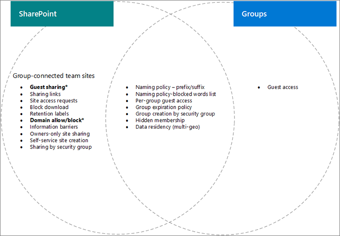

# SharePoint and Microsoft 365 Groups integration (IT Admins)

Some settings for Microsoft 365 Groups and SharePoint in Microsoft 365, particularly related to sharing and group and team site creation, overlap with each other. This article provides descriptions of these interactions and best practices for how to work with these settings.

## The effects of SharePoint settings on Microsoft 365 groups

|SharePoint setting|Description|Effect on Microsoft 365 groups|Recommendation|
|:-----------------|:----------|:-----------------------------|:-------------|
|External sharing for organization and site|Determines if sites, files, and folders can be shared with people outside the organization.|If SharePoint and Microsoft 365 Groups settings don't match, guests in the group may be blocked from accessing the site, or external access may be available in the site but not the group.|When changing sharing settings, check both Microsoft 365 Groups settings and SharePoint site settings for group-connected team sites.  See [Collaborate with guests in a site](./collaborate-in-site.md).|
|Domain allow/block|Allows or prevents content being shared with specified domains.|Microsoft 365 Groups doesn't recognize SharePoint allowlists or blocklists. Users from domains disallowed in SharePoint could gain access to SharePoint through a group.|Manage domain allowlists or blocklists for Azure AD and SharePoint together, along with external access for meetings. Create an org-wide governance process for allowing and blocking domains.  See [SharePoint domain settings](/sharepoint/restricted-domains-sharing), [Azure AD domain settings](/azure/active-directory/b2b/allow-deny-list), and [External access](/microsoftteams/trusted-organizations-external-meetings-chat).|
|Allow only users in specific security groups to share externally|Specifies security groups who can share sites, folders, and files externally.|This setting doesn't affect group owners sharing Microsoft 365 groups externally. Group guests have access to the associated SharePoint site.||
|SharePoint site sharing settings|Determines who can share the site directly, outside of group membership. (The group or site owner configures this setting.)|This setting doesn't affect the group directly, but it can allow users to be added to a site and not have access to other group resources|Consider using this setting to limit sharing of the site directly and manage site access through the group.|
|Let users create sites from the SharePoint start page and OneDrive|Specifies if users can create new SharePoint sites.|If this setting is turned off, users can still create group-connected team sites by creating a group.||

## The effects of Microsoft 365 Groups settings on SharePoint

|Microsoft 365 Groups setting|Description|Effect on SharePoint|Recommendation|
|:---------------------------|:----------|:-------------------|:-------------|
|Naming policies|Specifies group name prefixes and suffixes, and blocked words for group creation|Policies are enforced for users creating group-connected team sites, but not communication sites or sites with other templates.|Create separate naming guidance for communication sites if needed.|
|Group guest access|Specifies if people outside the organization can be added to groups.|If SharePoint and Microsoft 365 Groups settings don't match, guests in the group may be blocked from accessing the site, or external access may be available in the site but not the group.|When changing sharing settings, check both Microsoft 365 Groups settings and SharePoint site settings for group-connected team sites.  See [Collaborate with guests in a site](./collaborate-in-site.md)|
|Group creation by security group|Only members of a specific security group can create Microsoft 365 groups.|Users who aren't members of the security group can't create a group-connected team site.|Be sure your process for requesting a group includes instructions for requesting a site.|
|Group expiration policy|Specifies a time period after which Microsoft 365 groups that aren't actively used are automatically deleted.|When the group is deleted, the associated SharePoint site is also deleted. Content protected by retention policies is retained.|Use expiration policies to avoid sprawl of unused Microsoft 365 groups and sites.|

## Related topics

[Collaboration governance planning recommendations](collaboration-governance-overview.md#collaboration-governance-planning-recommendations)

[Create your collaboration governance plan](collaboration-governance-first.md)

[Collaborating with people outside your organization](./collaborate-with-people-outside-your-organization.md)

[Manage site creation in SharePoint](/sharepoint/manage-site-creation)
