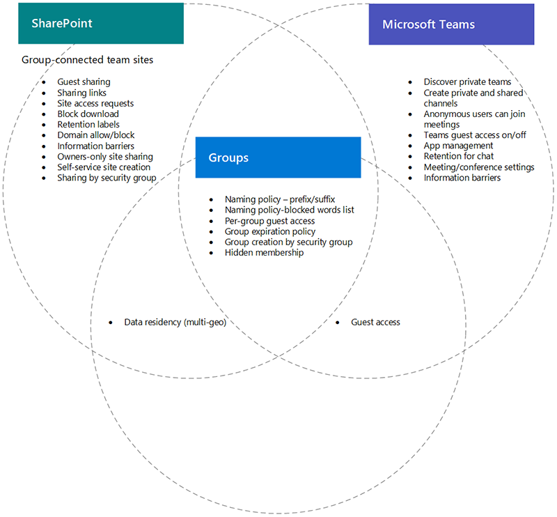

# Microsoft Teams, SharePoint, and Microsoft 365 Groups integration (IT Admins)

Some settings for Microsoft 365 Groups, Microsoft Teams, and SharePoint in Microsoft 365, particularly related to sharing and group/team and SharePoint site creation, overlap with each other. This article provides descriptions of these interactions and best practices for how to work with these settings.

## The effects of SharePoint settings on groups and teams

|SharePoint setting|Description|Effect on Microsoft 365 groups and Teams|Recommendation|
|:-----------------|:----------|:---------------------------------------|:-------------|
|External sharing for organization and site|Determines if sites, files, and folders can be shared with people outside the organization.|If SharePoint, Microsoft 365 Groups, and Teams settings don't match, guests in the team may be blocked from accessing the site, or unexpected external access may occur.|When changing sharing settings, check Microsoft 365 Groups settings, Teams settings, and SharePoint site settings for group-connected team sites.   See [Collaborate with guests in a team](/microsoft-365/solutions/collaborate-as-team)|
|Domain allow/block|Allows or prevents content being shared with specified domains.|Microsoft 365 Groups and Teams don't recognize SharePoint allowlists or blocklists. Users from domains disallowed in SharePoint could gain access to SharePoint sites or content through a team.|Manage domain allowlists or blocklists for Azure AD and SharePoint together, along with external access for meetings. Create an org-wide governance process for allowing and blocking domains.  See [SharePoint domain settings](/sharepoint/restricted-domains-sharing), [Azure AD domain settings](/azure/active-directory/b2b/allow-deny-list), and [External access](/microsoftteams/trusted-organizations-external-meetings-chat).|
|Allow only users in specific security groups to share externally|Specifies security groups who can share SharePoint sites, folders, and files externally.|This setting doesn't prevent team owners from sharing teams externally. Team guests have access to the associated SharePoint site.||
|SharePoint site sharing settings|Determines who can share the site directly, outside of team membership. The team or site owner configures this setting.|This setting doesn't affect the team directly, but it can allow users to be added to a site and not have access to the team itself or other Teams resources|Consider using this setting to limit sharing of the site directly and manage site access through the team.|
|Let users create sites from the SharePoint start page and OneDrive|Specifies if users can create new SharePoint sites.|If this setting is turned off, users can still create group-connected team sites by creating a team.||

## The effects of groups settings on teams

|Microsoft 365 groups setting|Description|Effect on Teams|Recommendation|
|:---------------------------|:----------|:--------------|:-------------|
|Naming policies|Specifies Microsoft 365 group name prefixes and suffixes, and blocked words for group creation|Policies are enforced for users creating teams.||
|Microsoft 365 Groups guest access|Specifies if people outside the organization can be added to Microsoft 365 groups.|If either the Microsoft 365 Groups or Teams guest sharing settings are off, the team can't be shared with guests.|When changing guest sharing settings, check the settings for Teams, Microsoft 365 Groups, and the SharePoint site associated with the team.   See [Collaborate with guests in a team](/microsoft-365/solutions/collaborate-as-team)|
|Microsoft 365 group creation by security group|Only members of a specific security group can create Microsoft 365 groups.|Users who aren't members of the security group can't create a team.|Be sure your process for requesting a Microsoft 365 group includes instructions for requesting a team or a SharePoint site.|
|Microsoft 365 group expiration policy|Specifies a time period after which Microsoft 365 groups that aren't actively used are automatically deleted.|When the group is deleted, the team and associated SharePoint site are also deleted. Content protected by retention policies is retained.|Use expiration policies to avoid sprawl of unused teams, Microsoft 365 groups, and sites.|

## Related topics

[Collaboration governance planning recommendations](collaboration-governance-overview.md#collaboration-governance-planning-recommendations)

[Create your collaboration governance plan](collaboration-governance-first.md)

[Collaborating with people outside your organization](./collaborate-with-people-outside-your-organization.md)

[Manage site creation in SharePoint](/sharepoint/manage-site-creation)
