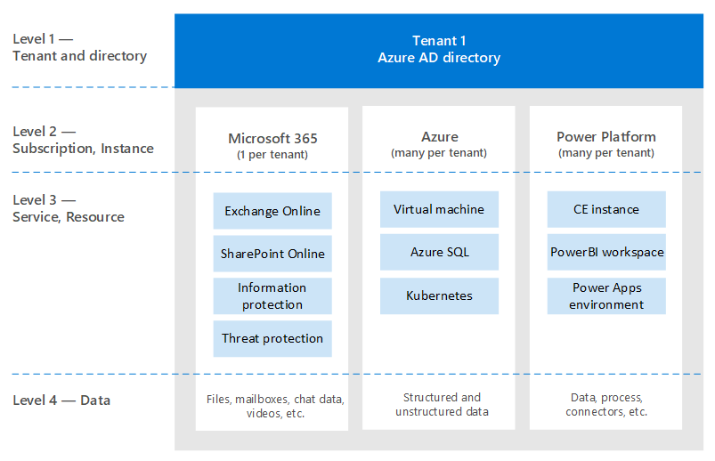
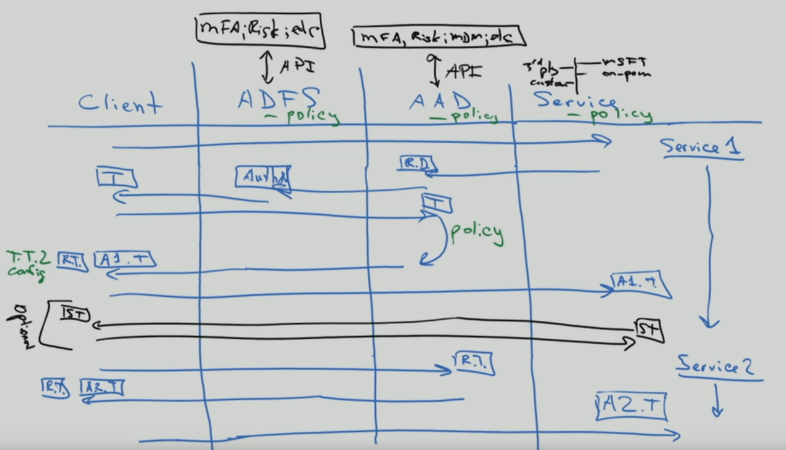
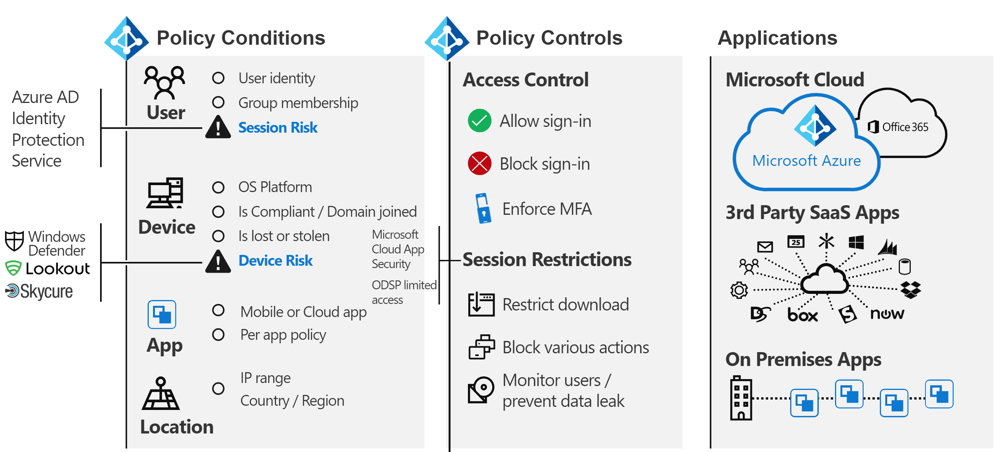
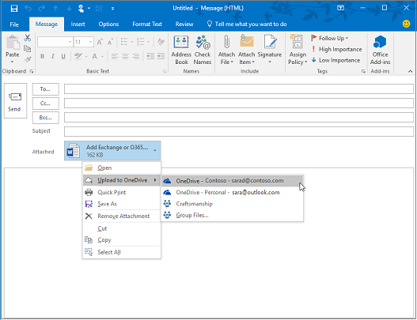
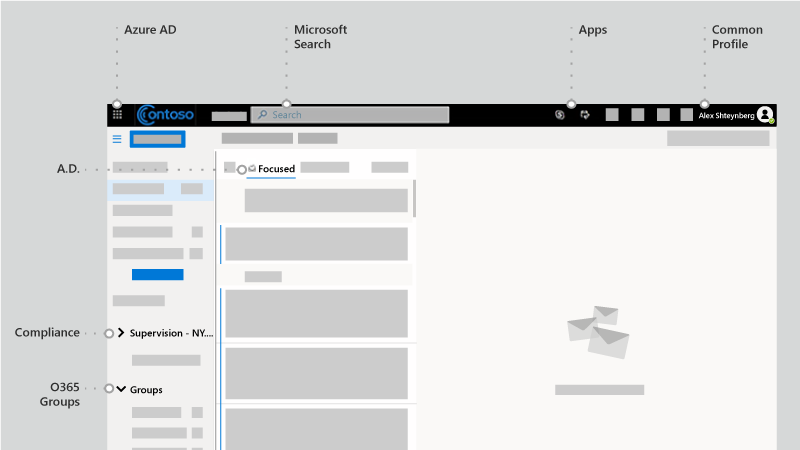
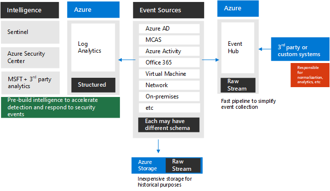
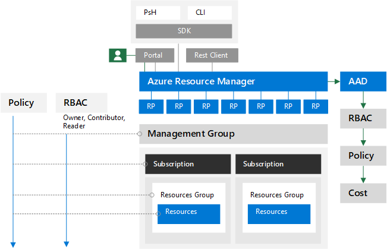

# To identity and beyond—One architect's viewpoint

In this article, [Alex Shteynberg](https://www.linkedin.com/in/alex-shteynberg/), Principal Technical Architect at Microsoft, discusses top design strategies for enterprise organizations adopting Microsoft 365 and other Microsoft cloud services.

## About the author

I'm a Principal Technical Architect at the New York [Microsoft Technology Center](https://www.microsoft.com/mtc?rtc=1). I mostly work with large customers and complex requirements. My viewpoint and opinions are based on these interactions and may not apply to every situation. However, in my experience, if we can help customers with the most complex challenges, we can help all customers.

I typically work with 100+ customers each year. While every organization has unique characteristics, it's interesting to see trends and commonalities. For example, one trend is cross-industry interest for many customers. After all, a bank branch can also be a coffee shop and a community center.

In my role, I focus on helping customers arrive at the best technical solution to address their unique set of business goals. Officially, I focus on Identity, Security, Privacy, and Compliance. I love the fact that these touch everything we do. It gives me an opportunity to be involved with most projects. This activity keeps me busy and enjoying this role.

I live in New York City (the best!) and really enjoy the diversity of its culture, food, and people (not traffic). I love to travel when I can and hope to see most of the world in my lifetime. I'm currently researching a trip to Africa to learn about wildlife.

## Guiding principles

- **Simple is often better**: You can do (almost) anything with technology, but it doesn't mean you should. Especially in the security space, many customers overengineer solutions. I like [this video](https://www.youtube.com/watch?v=SOQgABDSYZE) from Google's Stripe conference to underscore this point.
- **People, process, technology**: [Design for people](https://en.wikipedia.org/wiki/Human-centered_design) to enhance process, not tech first. There are no "perfect" solutions. We need to balance various risk factors and decisions will be different for each business. Too many customers design an approach that their users later avoid.
- **Focus on 'why' first and 'how' later**: Be the annoying 7-yr old kid with a million questions. We can't arrive at the right answer if we don't know the right questions to ask. Lots of customers make assumptions on how things need to work instead of defining the business problem. There are always multiple paths that can be taken.
- **Long tail of past best practices**: Recognize that best practices are changing at light speed. If you've looked at Azure AD more than three months ago, you're likely out of date. Everything here's subject to change after publication. “Best” option today may not be the same six months from now.

## Baseline concepts

Don't skip this section. I often find that I must step-back to these articles, even for customers who have been using cloud services for years.
Alas, language isn't a precise tool. We often use the same word to mean different concepts or different words to mean the same concept. I often use this diagram below to establish some baseline terminology and "hierarchy model."
  

 

When you learn to swim, it's better to start in the pool and not in the middle of the ocean. I'm not trying to be technically accurate with this diagram. It's a model to discuss some basic concepts.

In the diagram:

- Tenant = an instance of Azure AD. It's at the "top" of a hierarchy, or Level 1 in the diagram. We can consider this level to be the "[boundary](/azure/active-directory/users-groups-roles/licensing-directory-independence)" where everything else occurs ([Azure AD B2B](/azure/active-directory/b2b/what-is-b2b) aside). All Microsoft enterprise cloud services are part of one of these tenants. Consumer services are separate. "Tenant" appears in documentation as Office 365 tenant, Azure tenant, WVD tenant, and so on. I often find these variations cause confusion for customers.
- Services/subscriptions, Level 2 in the diagram, belong to one and only one tenant. Most SaaS services are 1:1 and can't move without migration. Azure is different, you can [move billing](/azure/cost-management-billing/manage/billing-subscription-transfer) and/or a [subscription](/azure/active-directory/fundamentals/active-directory-how-subscriptions-associated-directory) to another tenant. There are many customers that need to move Azure subscriptions. This scenario has various implications. Objects that exist outside of the subscription don't move. For example, role-based access control (Azure RBAC), Azure AD objects (groups, apps, policies, etc.), and some services (Azure Key Vault, Data Bricks, etc.). Don't migrate services without a good business need. Some scripts that can be helpful for migration are [shared on GitHub](https://github.com/lwajswaj/azure-tenant-migration).
- A given service usually has some sort of "sublevel" boundary, or Level 3 (L3). This boundary is useful to understand for segregation of security, policies, governance, and so on. Unfortunately, there's no uniform name that I know of. Some examples names for L3 are: Azure Subscription = [resource](/azure/azure-resource-manager/management/manage-resources-portal); Dynamics 365 CE = [instance](/dynamics365/admin/new-instance-management); Power BI = [workspace](/power-bi/service-create-the-new-workspaces); Power Apps = [environment](/power-platform/admin/environments-overview); and so on.
- Level 4 is where the actual data lives. This 'data plane' is a complex article. Some services are using Azure AD for RBAC, others aren't. I'll discuss it a bit when we get to delegation articles.

Some additional concepts that I find many customers (and Microsoft employees) are confused about or have questions about include the following issues:

- Anyone can [create](/azure/active-directory/fundamentals/active-directory-access-create-new-tenant) many tenants at [no cost](https://azure.microsoft.com/pricing/details/active-directory/). You don't need a service provisioned within it. I have dozens. Each Tenant name is unique in Microsoft's worldwide cloud service (in other words, no two tenants can have the same name). They all are in the format of TenantName.onmicrosoft.com. There are also processes that create Tenants automatically ([unmanaged tenants](/azure/active-directory/users-groups-roles/directory-self-service-signup)). For example, this can occur when a user signs up for an enterprise service with an email domain that doesn't exist in any other tenant.
- In a managed tenant, many [DNS domains](/azure/active-directory/fundamentals/add-custom-domain) can be registered in it. This doesn't change the original tenant name. There's currently no easy way to rename a tenant (other than migration). Although the tenant name is technically not critical these days, some may find this to be limiting.
- You should reserve a tenant name for your organization even if you aren't yet planning to deploy any services. Otherwise somebody can take it from you and there's no simple process to take it back (same problem as DNS names). I hear this way too often from customers. What your tenant name should be is a debate article as well.
- If you own DNS namespace(s), you should add all of these to your tenant(s). Otherwise one could create an [unmanaged tenant](/azure/active-directory/users-groups-roles/directory-self-service-signup) with this name, which then causes disruption to [make it managed](/azure/active-directory/users-groups-roles/domains-admin-takeover).
- DNS namespace (such as contoso.com) can belong to one and only one Tenant. This has implications for various scenarios (for example, sharing an email domain during a merger or acquisition, and so on). There's a way to register a DNS sub (such as div.contoso.com) in a different tenant, but that should be avoided. By registering a top-level domain name, all subdomains are assumed to belong to the same tenant. In multi-tenant scenarios (see below) I would normally recommend using another top-level domain name (such as contoso.ch or ch-contoso.com).
- Who should "own" a tenant? I often see customers that do not know who currently owns their tenant. This lack of knowledge is a big red flag. Call Microsoft support ASAP. Just as problematic is when a service owner (often an Exchange administrator) is designated to manage a tenant. The tenant will contain all services that you may want in the future. The tenant owner should be a group that can make decision for enablement of all cloud services in an organization. Another problem is when a tenant owner group is asked to manage all services. This doesn't scale for large organizations.
- There's no concept of a sub/super tenant. For some reason, this myth keeps repeating itself. This applies to [Azure AD B2C](/azure/active-directory-b2c/) tenants as well. I hear too many times, "My B2C environment is in my XYZ Tenant," or "How do I move my Azure tenant into my Office 365 tenant?"
- This document mostly focuses on the commercial worldwide cloud, because that's what most customers are using. It sometimes useful to know about [sovereign clouds](/azure/active-directory/develop/authentication-national-cloud). Sovereign clouds have additional implications to discuss which are out of scope for this discussion.

## Baseline identity articles

There's much documentation about Microsoft's identity platform – Azure Active Directory (Azure AD). For those who are just starting, it often feels overwhelming. Even after you learn about it, keeping up with constant innovation and change can be challenging. In my customer interactions I often find myself serving as "translator" between business goals and "Good, Better, Best" approaches to address these (and human "cliff notes" for these articles). There's rarely a perfect answer and the "right" decision is a balance of various risk factors. Below are some of the common questions and confusion areas I tend to discuss with customers.

### Provisioning

Azure AD doesn't solve for lack of governance in your identity world! [Identity governance](/azure/active-directory/governance/identity-governance-overview) should be a critical element independent of any cloud decisions. Governance requirements change over time, which is why it's a program and not a tool.

[Azure AD Connect](/azure/active-directory/hybrid/whatis-azure-ad-connect) vs. [Microsoft Identity Manager](/microsoft-identity-manager/microsoft-identity-manager-2016) (MIM) vs. something else (third party or custom)? Save yourself a lot of headache now and in the future and go with Azure AD Connect. There are all kinds of smarts in this tool to address peculiar customer configurations and ongoing innovations.

Some edge cases that may drive towards a more complex architecture:

- I have multiple AD forests without network connectivity between these. There's a new option called [Cloud Provisioning](/azure/active-directory/cloud-provisioning/what-is-cloud-provisioning).
- I don't have Active Directory, nor do I want to install it. Azure AD Connect can be configures to [sync from LDAP](/azure/active-directory/hybrid/plan-hybrid-identity-design-considerations-tools-comparison) (partner may be required).
- I need to provision the same objects to multiple tenants. This scenario isn't technically supported but depends on definition of "same."

Should I customize default synchronization rules ([filter objects](/azure/active-directory/hybrid/how-to-connect-sync-configure-filtering), [change attributes](/azure/active-directory/hybrid/reference-connect-sync-attributes-synchronized), [alternate login ID](/azure/active-directory/hybrid/plan-connect-userprincipalname), and so on)? Avoid it! An identity platform is only as valuable as the services that use it. While you can do all kinds of nutty configurations, to answer this question you need to look at the impact on applications. If you filter mail-enabled objects, then the GAL for online services will be incomplete; if the application relies on specific attributes, filtering these will have unpredictable impact; and so on. It's not an identity team decision.

XYZ SaaS supports Just-in-Time (JIT) provisioning, why are you requiring me to synchronize? See above. Many applications need "profile" information for functionality. You can't have a GAL if all mail-enabled objects aren't available. Same applies to [user provisioning](/azure/active-directory/app-provisioning/user-provisioning) in applications integrated with Azure AD.

### Authentication

[Password hash sync](/azure/active-directory/hybrid/how-to-connect-password-hash-synchronization) (PHS) vs. [pass-through authentication](/azure/active-directory/hybrid/how-to-connect-pta-how-it-works) (PTA) vs. [federation](/azure/active-directory/hybrid/how-to-connect-fed-compatibility).

Usually there's a passionate [debate](/azure/active-directory/hybrid/choose-ad-authn) around federation. Simpler is usually better and therefore use PHS unless you have a good reason not to. It's also possible to configure different authentication methods for different DNS domains in the same tenant.

Some customers enable federation + PHS mainly for:

- An option to [fall back](/azure/active-directory/hybrid/plan-migrate-adfs-password-hash-sync) to (for disaster recovery) if the federation service isn't available.
- Additional capabilities (ex.: [Azure AD DS](/azure/active-directory-domain-services/tutorial-configure-password-hash-sync)) and security services (ex.: [leaked credentials](/azure/active-directory/reports-monitoring/concept-risk-events#leaked-credentials))
- Support for services in Azure that do not understand federated authentication (for example, [Azure Files](/azure/storage/files/storage-files-active-directory-overview)).

I often walk customers through client authentication flow to clarify some misconceptions. The result looks like the picture below, which isn't as good as the interactive process of getting there.

This type of whiteboard drawing illustrates where security policies are applied within the flow of an authentication request. In this example, policies enforced through Active Directory Federation Service (AD FS) are applied to the first service request, but not subsequent service requests. This behavior is at least one reason to move security controls to the cloud as much as possible.

We've been chasing the dream of [single sign-on](/azure/active-directory/manage-apps/what-is-single-sign-on) (SSO) for as long as I can remember. Some customers believe they can achieve this by choosing the "right" federation (STS) provider. Azure AD can help significantly to [enable SSO](/azure/active-directory/manage-apps/plan-sso-deployment) capabilities, but no STS is magical. There are too many "legacy" authentication methods that are still used for critical applications. Extending Azure AD with [partner solutions](/azure/active-directory/saas-apps/tutorial-list) can address many of these scenarios. SSO is a strategy and a journey. You can't get there without moving towards [standards for applications](/azure/active-directory/develop/v2-app-types). Related to this article is a journey to [passwordless](/azure/active-directory/authentication/concept-authentication-passwordless) authentication, which also doesn't have a magical answer.

[Multi-factor authentication](/azure/active-directory/authentication/concept-mfa-howitworks) (MFA) is essential today ([here](https://techcommunity.microsoft.com/t5/azure-active-directory-identity/your-pa-word-doesn-t-matter/ba-p/731984) for more). Add to it [user behavior analytics](/azure/active-directory/authentication/tutorial-risk-based-sspr-mfa) and you have a solution that prevents most common cyber-attacks. Even consumer services are moving to require MFA. Yet, I still meet with many customers who don't want to move to [modern authentication](../enterprise/hybrid-modern-auth-overview.md) approaches. The biggest argument I hear is that it will impact users and legacy applications. Sometimes a good kick might help customers move along - Exchange Online [announced changes](https://techcommunity.microsoft.com/t5/exchange-team-blog/basic-auth-and-exchange-online-february-2020-update/ba-p/1191282). Lots of Azure AD [reports](/azure/active-directory/fundamentals/concept-fundamentals-block-legacy-authentication) are now available to help customers with this transition.

### Authorization

Per [Wikipedia](https://en.wikipedia.org/wiki/Authorization), "to authorize" is to define an access policy. Many people look at it as the ability to define access controls to an object (file, service, and so on). In the current world of cyber threats, this concept is rapidly evolving to a dynamic policy that can react to various threat vectors and quickly adjust access controls in response to these. For example, if I access my bank account from an unusual location, I get additional confirmation steps. To approach this, we need to consider not just the policy itself but the ecosystem of threat detection and signal correlation methodologies.

The policy engine of Azure AD is implemented using [Conditional Access policies](/azure/active-directory/conditional-access/overview). This system depends on information from a variety of other threat detection systems to make dynamic decisions. A simple view would be something like the following illustration:

Combining all these signals together allows for dynamic policies like these:

- If a threat is detected on your device, your access to data will be reduced to web only without the ability to download.
- If you are downloading an unusually high volume of data, anything you download will be encrypted and restricted.
- If you access a service from an unmanaged device, you'll be blocked from highly sensitive data but allowed to access non-restricted data without the ability to copy it to another location.

If you agree with this expanded definition of authorization, then you need to implement additional solutions. Which solutions you implement will depend on how dynamic you want the policy to be and which threats you want to prioritize. Some examples of such systems are:

- [Azure AD Identity Protection](/azure/active-directory/identity-protection/)
- [Microsoft Defender for Identity](/azure-advanced-threat-protection/)
- [Microsoft Defender for Endpoint](/windows/security/threat-protection/microsoft-defender-atp/microsoft-defender-advanced-threat-protection)
- [Microsoft Defender for Office 365](../security/office-365-security/defender-for-office-365.md)
- [Microsoft Defender for Cloud Apps](/cloud-app-security/) (Defender for Cloud Apps)
- [Microsoft 365 Defender](../security/defender/microsoft-365-defender.md)
- [Microsoft Intune](/mem/intune/)
- [Microsoft Purview Information Protection](../compliance/information-protection.md)
- [Microsoft Sentinel](/azure/sentinel/)

Of course, in addition to Azure AD, various services and applications have their own specific authorization models. Some of these are discussed later in the delegation section.

### Audit

Azure AD has detailed [audit and reporting](/azure/active-directory/reports-monitoring/) capabilities. However, these reports are usually not the only source of information needed to make security decisions. See more discussion on this in the delegation section.

## There's no Exchange

Don't Panic! This doesn't mean Exchange is being deprecated (or SharePoint, and so on). It's still a core service. What I mean is, for quite some time now, technology providers have been transitioning user experiences (UX) to encompass components of multiple services. In Microsoft 365, a simple example is "[modern attachments](https://support.office.com/article/Attach-files-or-insert-pictures-in-Outlook-email-messages-BDFAFEF5-792A-42B1-9A7B-84512D7DE7FC)" where attachments to email are stored in SharePoint Online or OneDrive for Business.

Looking at the Outlook client you can see many services that are "connected" as part of this experience, not just Exchange. This includes Azure AD, Microsoft Search, Apps, Profile, compliance, and Office 365 groups.

Read about [Microsoft Fluid Framework](https://techcommunity.microsoft.com/t5/microsoft-365-blog/microsoft-ignite-blog-microsoft-fluid-framework-preview/ba-p/978268) for preview of upcoming capabilities. In preview now, I can read and reply to Teams conversations directly in Outlook. In fact, the [Teams client](https://products.office.com/microsoft-teams/download-app) is one of the more prominent examples of this strategy.

Overall, it's becoming harder to draw a clear line between Office 365 and other services in Microsoft clouds. I view it as a great benefit to customers since they can benefit from total innovation across everything we do even if they use one component. Pretty cool and has far reaching implications for many customers.

Today, I find many customer IT groups are structured around "products." It's logical for an on-premises world since you need an expert for each specific product. However, I'm totally happy that I don't have to debug an Active Directory or Exchange database ever again as these services have moved to the cloud. Automation (which cloud kind of is) removes certain repetitive manual jobs (look what happened to factories). However, these tasks are replaced with more complex requirements to understand cross-services interaction, impact, business needs, and so on. If you are willing to [learn](/training/), there are great opportunities enabled by cloud transformation. Before jumping into technology, I often talk to customers about managing change in IT skills and team structures.

To all SharePoint fan-people and developers, please stop asking "How can I do XYZ in SharePoint online?" Use [Power Automate](/power-automate/) (or Flow) for workflow, it's a much more powerful platform. Use [Azure Bot Framework](/azure/bot-service/) to create a better UX for your 500-K item list. Start using [Microsoft Graph](https://developer.microsoft.com/graph/) instead of CSOM. [Microsoft Teams](/MicrosoftTeams/Teams-overview) includes SharePoint but also a world more. There are many other examples I can list. There's a vast and wonderful universe out there. Open the door and [start exploring]().

The other common impact is in the compliance area. This cross-services approach seems to completely confuse many compliance policies. I keep seeing organizations that state, "I need to journal all email communications to an eDiscovery system." What does this really mean when email is no longer just email but a window into other services? Office 365 has a comprehensive approach for [compliance](../compliance/index.yml), but changing people and processes are often much more difficult than technology.

There are many other people and process implications. In my opinion, this factor is a critical and under-discussed area. Perhaps more in another article.

## Tenant structure options

### Single tenant vs. multi-tenant

In general, most customers should have only one production tenant. There are many reasons why multiple tenants are challenging (give it a [Bing search](https://www.bing.com/search?q=office%20365%20multiple%20tenants)) or read this [whitepaper](https://aka.ms/multi-tenant-user). At the same time, many enterprise customers I work with have another (small) tenant for IT learning, testing, and experimentation. Cross-tenant Azure access is made easier with [Azure Lighthouse](https://azure.microsoft.com/services/azure-lighthouse/). Office 365 and many other SaaS services have limits for cross-tenant scenarios. There's a lot to consider in [Azure AD B2B](/azure/active-directory/b2b/what-is-b2b) scenarios.

Many customers end-up with multiple production tenants after a merger and acquisition (M&A) and want to consolidate. Today that's not simple and would require Microsoft Consulting Services (MCS) or a partner plus third-party software. There's ongoing engineering work to address various scenarios with multi-tenant customers in the future.

Some customers choose to go with more than one tenant. This should be a very careful decision and almost always business reason driven! Some examples include the following reasons:

- A holding type company structure where easy collaboration between different entities is not required and there's strong administrative and other isolation needs.
- After an acquisition, a business decision is made to keep two entities separate.
- Simulation of a customer's environment that doesn't change the customer's production environment.
- Development of software for customers.

In these multi-tenant scenarios, customers often want to keep some configuration the same across tenants, or report on configuration changes and drifts. This often means moving from manual changes to configuration as code. Microsoft Premiere support offers a workshop for these types of requirements based on this public IP: <https://Microsoft365dsc.com>.

### Multi-Geo

To [Multi-Geo](../enterprise/microsoft-365-multi-geo.md) or not to Multi-Geo, that is the question. With Office 365 Multi-Geo, you can provision and store data at rest in the geo locations that you've chosen to meet [data residency](../enterprise/o365-data-locations.md) requirements. There are many misconceptions about this capability. Keep the following in mind:

- It doesn't to provide performance benefits. It could make performance worse if the [network design](https://aka.ms/office365networking) is not correct. Get devices "close" to the Microsoft network, not necessarily to your data.
- It's not a solution for [GDPR compliance](https://www.microsoft.com/trust-center/privacy/gdpr-overview). GDPR doesn't focus on data sovereignty or storage locations. There are other compliance frameworks for that.
- It doesn't solve delegation of administration (see below) or [information barriers](../compliance/information-barriers.md).
- It is not the same as multi-tenant and requires additional [user provisioning](/azure/active-directory/hybrid/how-to-connect-sync-feature-preferreddatalocation) workflows.
- It doesn't [move your tenant](../enterprise/moving-data-to-new-datacenter-geos.md) (your Azure AD) to another geography.

## Delegation of administration

In most large organizations, separation of duties and role-based access control (RBAC) is a necessary reality. I'm going to apologize ahead of time. This activity is not as simple as some customers want it to be. Customer, legal, compliance, and other requirements are different and sometimes conflicting around the world. Simplicity and flexibility are often on opposite sides of each other. Don't get me wrong, we can do a better job at this. There have been (and will be) significant improvements over time. Visit your local [Microsoft Technology Center](https://www.microsoft.com/mtc) to work out the model that fits your business requirements without reading 379230 docs! Here, I'll focus on what you should think about and not why it's this way. Below are five different areas to plan for and some of the common questions I've encountered.

### Azure AD and Microsoft 365 admin centers

There's a long and growing list of [built-in roles](/azure/active-directory/roles/permissions-reference). Each role consists of a list of role permissions grouped together to allow specific actions to be performed. You can see these permissions in the "Description" tab inside each role. Alternatively, you can see a more human readable version of these permissions in the Microsoft 365 Admin Center. The definitions for built-in roles cannot be modified. I generally, group these roles into three categories:

- **Global administrator**: This "all powerful" role should be [highly protected](../enterprise/protect-your-global-administrator-accounts.md) just like you would in other systems. Typical recommendations include: no permanent assignment and use Azure AD Privileged Identity Management (PIM); strong authentication; and so on. Interestingly, this role doesn't give you access to everything by default. Typically, I see confusion about compliance access and Azure access, discussed later. However, this role can always assign access to other services in the tenant.
- **Specific service admins**: Some services (Exchange, SharePoint, Power BI, and so on) consume high-level administration roles from Azure AD. This behavior isn't consistent across all services and there are more service-specific roles discussed later.
- **Functional**: There's a long (and growing) list of roles focused on specific operations (guest inviter, and so on). Periodically, more of these roles are added based on customer needs.

It's not possible to delegate everything (although the gap is decreasing), which means the Global admin role would need to be used sometimes. Configuration-as-code and automation should be considered instead of people membership of this role.

**Note**: The Microsoft 365 admin center has a more user-friendly interface but has subset of capabilities compared to the Azure AD admin experience. Both portals use the same Azure AD roles, so changes are occurring in the same place. Tip: if you want an identity-management focused admin UI without all the Azure clutter, use <https://aad.portal.azure.com>.

What's in the name? Don't make assumptions from the name of the role. Language is not a very precise tool. The goal should be to define operations that need to be delegated before looking at what roles are needed. Adding somebody to the "Security Reader" role doesn't make them see security settings across everything.

The ability to create [custom roles](/azure/active-directory/users-groups-roles/roles-custom-overview) is a common question. This capability is limited in Azure AD today (see below) but will grow in capabilities over time. I think of these custom roles as applicable to functions in Azure AD and may not span "down" the hierarchy model (discussed above). Whenever I deal with "custom," I tend to go back to my principal of "simple is better."

Another common question is ability to scope roles to a subset of a directory. One example is something like "Helpdesk Administrator for users in EU only." [Administrative Units](/azure/active-directory/users-groups-roles/directory-administrative-units) (AU) are intended to address this. Like above, I think of these scopes as applicable to functions in Azure AD and may not span "down." Of course, certain roles don't make sense to scope (global admins, service admins, and so on).

Today, all these roles require direct membership (or dynamic assignment if you use [Azure AD PIM](/azure/active-directory/privileged-identity-management/)). This means customers must manage these directly in Azure AD, and these roles cannot be based on a security group membership. I'm not a fan of creating scripts to manage these roles as it would need to run with elevated rights. I generally recommend API integration with process systems like ServiceNow or using partner governance tools like Saviynt. There's engineering work going on to address this over time.

I mentioned [Azure AD PIM](/azure/active-directory/privileged-identity-management/) a few times. There's a corresponding Microsoft Identity Manager (MIM) [Privileged Access Management](/microsoft-identity-manager/pam/privileged-identity-management-for-active-directory-domain-services) (PAM) solution for on-premises controls. You might also want to look at [Privileged Access Workstations](/windows-server/identity/securing-privileged-access/privileged-access-workstations) (PAWs) and [Azure AD Identity Governance](/azure/active-directory/governance/identity-governance-overview). There are various third-party tools as well, which can enable just-in-time, just-enough, and dynamic role elevation. This capability is usually part of a larger discussion for securing an environment.

Sometimes scenarios call for adding an external user to a role (see the multi-tenant section, above). This works just fine. [Azure AD B2B](/azure/active-directory/b2b/) is another large and fun article to walk customers through, perhaps in another article.

### Microsoft 365 Defender and Microsoft 365 Purview compliance portals

**Email & Collaboration roles** in the [Microsoft 365 Defender portal](../security/office-365-security/mdo-portal-permissions.md) and ***Role groups for Microsoft Purview solutions** in the [Microsoft 365 Purview compliance portal](../compliance/microsoft-365-compliance-center-permissions.md) are a collection of "role groups", which are separate and distinct from Azure AD roles. This can be confusing because some of these role groups have the same name as Azure AD roles (for example, Security Reader), yet they can have different membership. I prefer the use of Azure AD roles. Each role group consists of one or more "roles" (see what I mean about reusing the same word?) and have members from Azure AD, which are email enabled objects. Also, you can create a role group with the same name as a role, which may or may not contain that role (avoid this confusion).

In a sense, these permissions are an evolution of the Exchange role groups model. However, Exchange Online has its own [role group management](/exchange/permissions-exo) interface. Some role groups in Exchange Online are locked and managed from Azure AD or the Microsoft 365 Defender and Microsoft 365 Purview compliance portals, but others might have the same or similar names and are managed in Exchange Online (adding to the confusion). I recommend you avoid using the Exchange Online user interface unless you need scopes for Exchange management.

You can't create custom roles. Roles are defined by services created by Microsoft and will grow as new services are introduced. This behavior is similar in concept to [roles defined by applications](/azure/active-directory/develop/howto-add-app-roles-in-azure-ad-apps) in Azure AD. When new services are enabled, often new role groups need to be created in order to grant or delegate access to these (for example, [insider risk management](../compliance/insider-risk-management-configure.md).

These role groups also require direct membership and cannot contain Azure AD groups. Unfortunately, today these role groups aren't supported by Azure AD PIM. Like Azure AD roles, I tend to recommend management of these role groups through APIs or a partner governance product like Saviynt, or others.

Microsoft 365 Defender portal and Microsoft 365 Purview compliance portal roles span Microsoft 365 and you can't scope these role groups to a subset of the environment (like you can with administrative units in Azure AD). Many customers ask how they can subdelegate. For example, "create a DLP policy only for EU users." Today, if you have rights to a specific function in the Microsoft 365 Defender and Microsoft 365 Purview compliance portals, you have rights to everything covered by this function in the tenant. However, many policies have capabilities to target a subset of the environment (for example, "make these [labels](../compliance/create-sensitivity-labels.md#publish-sensitivity-labels-by-creating-a-label-policy) available only to these users"). Proper governance and communication are a key component to avoid conflicts. Some customers choose to implement a "configuration as code" approach to address subdelegation in the Microsoft 365 Defender and Microsoft 365 Purview compliance portals. Some specific services support subdelegation (see below).

### Service Specific

As stated earlier, many customers are looking to achieve a more granular delegation model. A common example: “Manage XYZ service only for Division X users and locations” (or some other dimension). The ability to do this depends on each service and is not consistent across services and capabilities. In-addition, each service may have a separate and unique RBAC model. Instead of discussing all of these models (it will take forever), I'm adding relevant links for each service. This list is not complete, but it will get you started.

- **Exchange Online** - (/exchange/permissions-exo/permissions-exo)
- **SharePoint Online** - (/sharepoint/manage-site-collection-administrators)
- **Microsoft Teams** - (/microsoftteams/itadmin-readiness)
- **eDiscovery** - (../compliance/index.yml)
  - **Permission Filtering** - (../compliance/index.yml)
  - **Compliance Boundaries** - (../compliance/set-up-compliance-boundaries.md)
  - **eDiscovery (Premium)** - (../compliance/overview-ediscovery-20.md)
- **Viva Engage** - (/viva/engage/manage-viva-engage-users/manage-viva-engage-admins)
- **Multi-geo** - (../enterprise/add-a-sharepoint-geo-admin.md)
- **Dynamics 365** – (/dynamics365/)

  Note: this link is to the root of documentation. There are multiple types of services with variations in the admin/delegation model.

- **Power Platform** - (/power-platform/admin/admin-documentation)
  - **Power Apps** - (/power-platform/admin/wp-security)

    Note: there are multiple types with variations in the admin/delegation models.

  - **Power Automate** - (/power-automate/environments-overview-admin)
  - **Power BI** - (/power-bi/service-admin-governance)

    Note: data platform security and delegation (which Power BI is a component) is a complex area.

- **Intune** - (/mem/intune/fundamentals/role-based-access-control)
- **Microsoft Defender for Endpoint** - (/windows/security/threat-protection/microsoft-defender-atp/user-roles)
- **Microsoft 365 Defender** - (../security/defender/m365d-permissions.md)
- **Microsoft Defender for Cloud Apps** - (/cloud-app-security/manage-admins)
- **Stream** - (/stream/assign-administrator-user-role)
- **Information barriers** - (../compliance/information-barriers.md)

### Activity Logs

Office 365 has a [unified audit log](../compliance/search-the-audit-log-in-security-and-compliance.md). It's a very [detailed log](/office/office-365-management-api/office-365-management-activity-api-schema), but don't read too much into the name. It may not contain everything you want or need for your security and compliance needs. Also, some customers are really interested in [Audit (Premium)](../compliance/advanced-audit.md).

Examples of Microsoft 365 logs that are accessed through other APIs include the following features:

- [Azure AD](/azure/azure-monitor/platform/diagnostic-settings) (activities not related to Office 365)
- [Exchange Message Tracking](/powershell/module/exchange/get-messagetrace)
- Threat/UEBA Systems discussed above (for example, Azure AD Identity Protection, Microsoft Defender for Cloud Apps, Microsoft Defender for Endpoint, and so on)
- [Microsoft Purview Information Protection](../compliance/data-classification-activity-explorer.md)
- [Microsoft Defender for Endpoint](/windows/security/threat-protection/microsoft-defender-atp/api-power-bi)
- [Microsoft Graph](https://graph.microsoft.com)

It's important to first identify all log sources needed for a security and compliance program. Also note that different logs have different on-line retention limits.

From the admin delegation perspective, most Microsoft 365 activity logs do not have a built-in RBAC model. If you have permission to see a log, then you can see everything in it. A common example of a customer requirement is: “I want to be able to query activity only for EU users” (or some other dimension). To achieve this requirement, we need to transfer logs to another service. In the Microsoft cloud, we recommend transferring it to either [Microsoft Sentinel](/azure/sentinel/overview) or [Log Analytics](/azure/azure-monitor/learn/quick-create-workspace).

High level diagram:

The diagram above represents built-in capabilities to send logs to Event Hub and/or Azure Storage and/or Azure Log Analytics. Not all systems include this out-of-the-box yet. But there are other approaches to send these logs to the same repository. For example, see [Protecting your Teams with Microsoft Sentinel](https://techcommunity.microsoft.com/t5/azure-sentinel/protecting-your-teams-with-azure-sentinel/ba-p/1265761).

Combining all the logs into one storage location includes added benefit, such as cross-correlations, custom retention times, augmenting with data needed to support RBAC model, and so on. Once data is in this storage system, you can create a Power BI dashboard (or another type of visualization) with an appropriate RBAC model.

Logs do not have to be directed to one place only. It might also be beneficial to integrate [Office 365 Logs with Microsoft Defender for Cloud Apps](/cloud-app-security/connect-office-365-to-microsoft-cloud-app-security) or a custom RBAC model in [Power BI](../admin/usage-analytics/usage-analytics.md). Different repositories have different benefits and audiences.

It's worth mentioning that there's a very rich built-in analytics system for security, threats, vulnerabilities, and so on in a service called [Microsoft 365 Defender](../security/defender/microsoft-365-defender.md).

Many large customers want to transfer this log data to a third-party system (for example, SIEM). There are different approaches for this, but in-general [Azure Event Hub](/azure/azure-monitor/platform/stream-monitoring-data-event-hubs) and [Graph](/graph/security-integration) are good starting points.

### Azure

I'm often asked if there's a way to separate high-privilege roles between Azure AD, Azure, and SaaS (ex.: Global Administrator for Office 365 but not Azure). Not really. Multi-tenant architecture is needed if complete administrative separation is required, but that adds significant [complexity](https://aka.ms/multi-tenant-user) (see above). All these services are part of the same security/identity boundary (look at the hierarchy model above).

It's important to understand relationships between various services in the same tenant. I'm working with many customers that are building business solutions that span Azure, Office 365, and Power Platform (and often also on-premises and third-party cloud services). One common example:

1. I want to collaborate on a set of documents/images/etc (Office 365)
2. Send each one of them through an approval process (Power Platform)
3. After all components are approved, assemble these items into a unified deliverable(s) (Azure)
[Microsoft Graph API](/azure/active-directory/develop/microsoft-graph-intro) is your best friend here. Not impossible, but significantly more complex to design a solution spanning [multiple tenants](/azure/active-directory/develop/single-and-multi-tenant-apps).

Azure Role-Based Access Control (RBAC) enables fine-grained access management for Azure. Using RBAC, you can manage access to resources by granting users the fewest permissions needed to perform their jobs. Details are out of scope for this document, but for more information on RBAC, see [What is role-based access control (RBAC) in Azure?](/azure/role-based-access-control/overview) RBAC is important but only part of the governance considerations for Azure. [Cloud Adoption Framework](/azure/cloud-adoption-framework/govern/) is a great starting point to learn more. I like how my friend, [Andres Ravinet](https://www.linkedin.com/in/andres-ravinet/), walks customers step by step though various components to decide on the approach. High-level view for various elements (not as good as the process to get to actual customer model) is something like this:

As you can see from above picture, many other services should be considered as part of the design (ex.: [Azure Policies](/azure/governance/policy/overview), [Azure Blueprints](/azure/governance/blueprints/overview), [Management Groups](/azure/governance/management-groups/), and so on).

## Conclusion

Started as a short summary, ended-up longer than I expected. I hope you are now ready to venture into a deep see of creating delegation model for your organization. This conversation is very common with customers. There's no one model that works for everyone. Waiting for a few planned improvements from Microsoft engineering before documenting common patterns we see across customers. In the meantime, you can work with your Microsoft account team to arrange a visit to the nearest [Microsoft Technology Center](https://www.microsoft.com/mtc). See you there!
