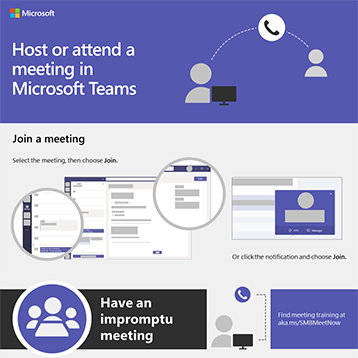
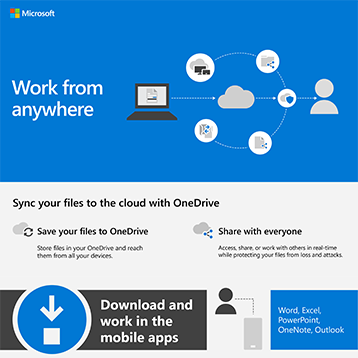
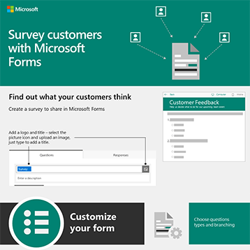

# Microsoft 365 infographics for your users

These infographics represent best practices for working and collaborating in Microsoft 365. Share them with your users to help ensure that they are taking advantage of secure storage and sharing for files, holding collaborative meetings, and more.

Find more [downloadable Office infographics](https://support.microsoft.com/office/great-ways-to-work-with-office-6fe70269-b9a4-4ef0-a96e-7a5858b3bd5a) on the [Microsoft 365 training](https://support.microsoft.com/training) site.

## Security tips

Download this infographic with security tips for the members of your team - whether your team is a business or nonprofit organization, such as a political campaign:

| Item | Description |
|:-----|:-----|
|   [Download as a PDF](../campaigns/downloads/M365CampaignsWhatCanUsersDoToSecure.pdf) \ [Download as a PowerPoint](../campaigns/downloads/M365CampaignsWhatCanUsersDoToSecure.pptx)| Share these best practices for keeping your organization's information secure. This infographic was created to support the staff of political campaigns because these are targeted by sophisticated hackers. You are welcome to use the PowerPoint to customize this infographic for your own organization. Related article: [How the security recommendations for Microsoft 365 affect your users](../campaigns/m365-campaigns-users.md)|

## Share your business files

Download an infographic to get a quick overview of ways to share your business files:
  
| Item | Description |
|:-----|:-----|
|   [Download as a PDF](https://go.microsoft.com/fwlink/?linkid=2079435) \ [Download as a PowerPoint](https://go.microsoft.com/fwlink/?linkid=2079438) | Use these best practices when you share and collaborate on business files so you can keep your information secure and protected. Related article: [Overview of sharing business files](../business-video/overview-file-sharing.md)|

## Host online meetings

Download an infographic to get a quick overview of how to join or host an online meeting with Microsoft Teams:

| Item | Description |
|:-----|:-----|
|   [Download as a PDF](https://go.microsoft.com/fwlink/?linkid=2078712) \ [Download as a PowerPoint](https://go.microsoft.com/fwlink/?linkid=2079515) | A quick introduction to how to host or join an online meeting with Microsoft Teams. Related article: [Host online meetings for your business](../business-video/overview-online-meetings.md)|

## Work from anywhere

Download an infographic to get tips for working from anywhere:

| Item | Description |
|:-----|:-----|
|   [Download as a PDF](https://go.microsoft.com/fwlink/?linkid=2079451) \ [Download as a PowerPoint](https://go.microsoft.com/fwlink/?linkid=2079455) | See tips for how to set up your mobile devices to allow you to work from anywhere. Related article: [Work from anywhere](../business-video/work-from-anywhere.md)|

## Survey customers with Forms

Download an infographic to find out how to survey customers (internal or external) with Microsoft Forms:

| Item | Description |
|:-----|:-----|
|   [Download as a PDF](https://go.microsoft.com/fwlink/?linkid=2079526) \ [Download as a PowerPoint](https://go.microsoft.com/fwlink/?linkid=2079446) | Use Microsoft Forms to find out what your customers think. Related article: [Collect information with Microsoft Forms](https://support.microsoft.com/topic/collect-information-with-microsoft-forms-a55d6e0d-04f6-45b8-b05f-b141b8ecb4d5)|
