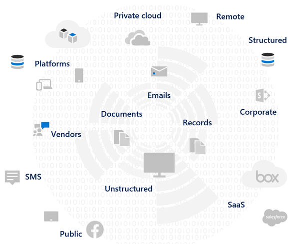
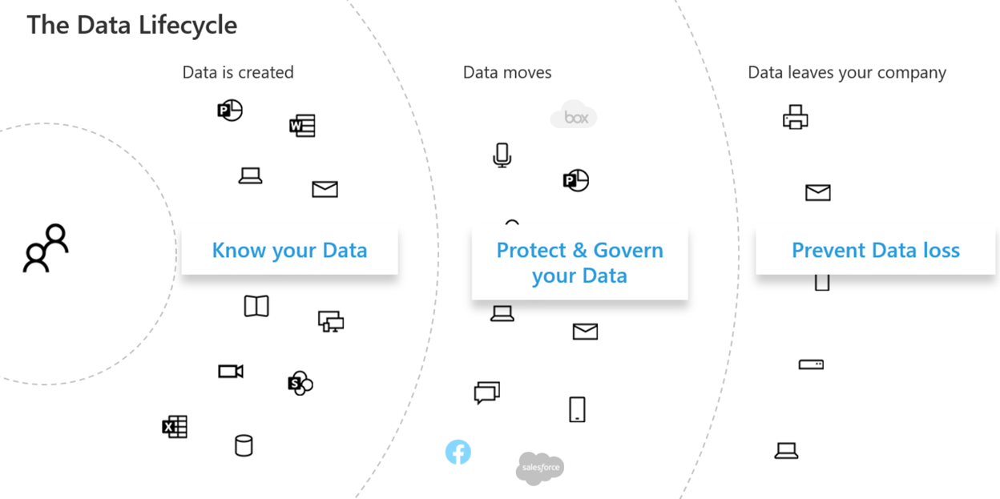
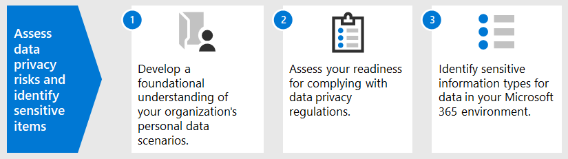
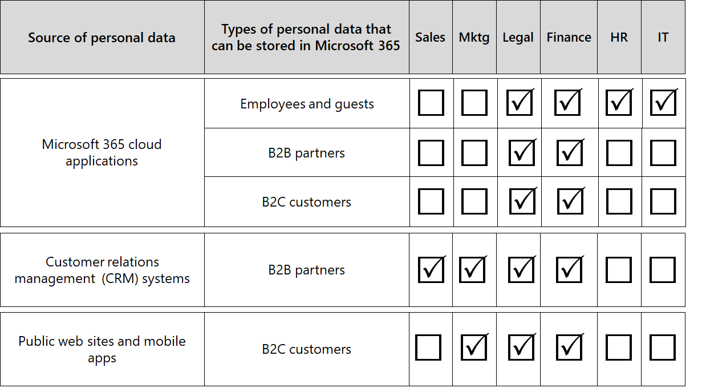

# Assess data privacy risks and identify sensitive items with Microsoft 365

Assessing the data privacy regulations and risks that your organization is subject to is a key first step before implementing any related improvement actions, including those achievable with Microsoft 365 features and services. 

## Potentially applicable data privacy regulations

For a good reference on the broader regulatory framework for data privacy regulations, see the [Microsoft Services Trust Portal](https://servicetrust.microsoft.com/) and the [series of articles on the General Data Protection Regulation (GDPR) regulation](/compliance/regulatory/gdpr), as well as other materials on the regulations you may be subject to in your industry or region.

### GDPR

The GDPR, the most well-known and cited of the data privacy regulations, regulates the collection, storage, processing, and sharing of any personal data that relates to an identified or identifiable natural person that is a resident of the European Union (EU). 

According to GDPR Article 4: 

- ‘personal data’ means any information relating to an identified or identifiable natural person (‘data subject’); an identifiable natural person is one who can be identified, directly or indirectly, in particular by reference to an identifier such as a name, an identification number, location data, an online identifier or to one or more factors specific to the physical, physiological, genetic, mental, economic, cultural or social identity of that natural person.

### ISO 27001

Adherence to other standards like ISO 27001 has also been recognized by several European supervisory authorities as a valid proxy of intent across the people, process, and technology spectrum. The standards it specifies overlap and adherence to ISO-27001-driven protection mechanisms may be considered a proxy fulfilling some privacy obligations in certain circumstances.

### Other data privacy regulations

Other prominent data privacy regulations also specify requirements for the handling of personal data.

In the United States, these include the California Consumer Protection Act ([CCPA](/compliance/regulatory/ccpa-faq)), HIPAA-HITECH (United States health care privacy act), and the Graham Leach Bliley Act (GLBA). Additional state-specific regulations are also in-place or in development. 

Around the world, additional examples include Germany's National GDPR Implementation Act (BDSG), the Brazil Data Protection Act (LGPD), and many others.

## Regulation mapping to Microsoft 365 technical control categories

Many of the data privacy-related regulations have overlapping requirements, so you should understand which regulations they are subject to prior to developing any technical control scheme. 

For later reference in the articles of this overall solution, this table provides excerpts from a sampling of data privacy regulations. 

| Regulation | Article/section | Excerpt | Applicable technical control categories |
|:-------|:-----|:-------|:-------|
| GDPR | Article 5(1)(f) | Personal data shall be processed in a manner that ensures appropriate security of the personal data, including protection against unauthorized or unlawful processing and against accidental loss, destruction or damage, using appropriate technical or organizational measures ('integrity and confidentiality'.  |  (All)   Identity   Device   Threat Protection   Protect information   Govern information   Discover and respond |
|  | Article (32)(1)(a) | Taking into account the state of the art, the costs of implementation and the nature, scope, context and purposes of processing as well as the risk of varying likelihood and severity for the rights and freedoms of natural persons, the controller and the processor shall implement appropriate technical and organizational measures to ensure a level of security appropriate to the risk, including inter alia as appropriate: (a) the pseudonymization and encryption of personal data. | Protect information |
|  | Article (13)(2)(a) | "…the controller shall, at the time when personal data are obtained, provide the data subject with the following further information necessary to ensure fair and transparent processing: (a) the period for which the personal data will be stored, or if that is not possible, the criteria used to determine that period. | Govern information |
|  | Article (15)(1)(e) | The data subject shall have the right to obtain from the controller confirmation as to whether or not personal data concerning him or her are being processed, and where that is the case, access to the personal data and the following information: (e) the existence of the right to request from the controller rectification or erasure of personal data or restriction of processing of personal data concerning the data subject or to object to such processing | Discover and respond |
| LGPD | Article 46 | Processing agents shall adopt security, technical and administrative measures able to protect personal data from unauthorized accesses and accidental or unlawful situations of destruction, loss, alteration, communication, or any type of improper or unlawful processing. | Protect information   Govern information   Discover and respond|
|  | Article 48 | The controller must communicate to the national authority and to the data subject the occurrence of a security incident that may create risk or relevant damage to the data subjects. | Discover and respond |
| HIPPA-HITECH | 45 CFR 164.312(e)(1) | Implement technical security measures to guard against unauthorized access to electronic protected health information that is being transmitted over an electronic communications network. | Protect information |
|  | 45 C.F.R. 164.312(e)(2)(ii) | Implement a mechanism to encrypt electronic protected health information whenever deemed appropriate. | Protect information |
|  | 45 CFR 164.312(c)(2) | Implement electronic mechanisms to corroborate that electronic protected health information has not been altered or destroyed in an unauthorized manner. | Govern information |
|  | 45 CFR 164.316(b)(1)(i) | If an action, activity, or assessment is required by this subpart to be documented, maintain a written (which may be electronic) record of the action, activity, or assessment | Govern information |
|  | 45 CFR 164.316(b)(1)(ii) | Retain the documentation required by paragraph (b)(1) of this section for 6 years from the date of its creation or the date when it last was in effect, whichever is later. | Govern information |
|  | 45 C.F.R. 164.308(a)(1)(ii)(D) | Implement procedures to regularly review records of information system activity, such as audit logs, access reports, and security incident tracking reports | Discover and respond |
|  | 45 C.F.R. 164.308(a)(6)(ii) | Identify and respond to suspected or known security incidents; mitigate, to the extent practicable, harmful effects of security incidents that are known to the covered entity or business associate; and document security incidents and their outcomes. | Discover and respond |
|  | 45 C.F.R. 164.312(b) | Implement hardware, software, and procedural mechanisms that record and examine activity in information systems that contain or use electronic protected health information. | Discover and respond |
| CCPA | 1798.105(c) | A business that receives a verifiable request from a consumer to delete the consumer’s personal information pursuant to subdivision (a) of this section shall delete the consumer’s personal information from its records and direct any service providers to delete the consumer’s personal information from their records | Discover and respond |
|  | 1798.105(d) | (exceptions to 1798.105(c)   A business or a service provider shall not be required to comply with a consumer’s request to delete the consumer’s personal information if it is necessary for the business or service provider to maintain the consumer’s personal information in order to: (refer to the current regulation for additional information). | Discover and respond |
|||||

>[!Important]
>This is not intended to be an exhaustive list. Refer to [Compliance Manager](../compliance/compliance-manager.md) or your legal or compliance advisor for further information on the applicability of the cited sections to the technical control categories listed.
>

## Knowing your data

Regardless of the regulations you are subject to, where different user data types inside and outside your organization interact with your systems are all important factors that may impact your overall personal data protection strategy, subject to the industry and government regulations that apply to your organization. This includes where personal data is stored, what type it is, and how much of it there is, and under what circumstances it was collected.
 

### Data portability 

Data also moves around over time as it is processed, refined, and other versions are derived from it. An initial snapshot is never enough. There needs to be an ongoing process for knowing your data. This represents one of the biggest challenges for large organizations that handle significant volumes of personal data. Organizations that don't address the "know your data" problem could potentially end up with very high risk and possible fines from regulatory agencies.

 
### Where the personal data is

To address data privacy regulations, you can’t rely on general notions of where you think personal data might exist, either now or in the future. Data privacy regulations require that organizations prove that they know where personal data is on an ongoing basis. This makes it important to take an initial snapshot of all your data sources for possible storage of personal information, including your Microsoft 365 environment, and establish mechanisms for ongoing monitoring and detection.

If you have not already assessed your overall readiness and risk associated with data privacy regulations, use the following 3-step framework to get started. 

>[!Note]
>This article and its content are not meant to take the place of legal advisory services. It just provides some basic guidance and links to tools that may be of assistance in the early stages of your assessment.
>
 
## Step 1: Develop a foundational understanding of your organization's personal data scenarios 

You need to gauge exposure to data privacy risk based on the type of personal data it currently manages, where it is stored, what protective controls are placed on it, how it's lifecycle is managed, and who has access to it. 

As a starting point, it's important to inventory what types of personal data exist in your Microsoft 365 environment. Use these categories:

- Employee data required to carry out day-to-day business functions
- Data the organization has about its business customers, partners, and other relationships in the business-to-business (B2B) scenario
- Data the organization has about consumers who provide information to online services that the organization manages in the business-to-customer (B2C) scenario

Here is an example of the different types of data for typical departments of an organization.

Much of the personal data that is subject to data privacy regulation is typically collected and stored outside of Microsoft 365. Any personal data from consumer-facing web or mobile applications would need to have been exported from such applications to Microsoft 365 in order to be subject to data privacy scrutiny within Microsoft 365. 

Your data privacy exposure in Microsoft 365 may be more limited relative to your web applications and CRM systems, which this solution does not address.

It's also important to think about the following common data privacy compliance challenges when evaluating your risk profile:

 - **Personal data distribution.** How scattered is information about a given subject? Is it known well enough to convince regulatory bodies that proper controls are in place? Can it be investigated and remediated if needed?
- **Protecting against exfiltration.** How do you protect personal data of a given type or source from being compromised and how to respond if it was?
- **Protection vs. risk.** What information protection mechanisms are appropriate relative to the risk and how to maintain business continuity and productivity and minimize end-user impact if end-user intervention is required? For example, should manual classification or encryption be used?
- **Personal data retention.** How long does information containing personal data need to be kept around for valid business reasons and how to avoid past keep-it-forever practices, balanced with retention needs for business continuity?
- **Handling data subject requests.** What mechanisms will be needed to handle data subject requests (DSRs) and any remedial actions, such as anonymization, redaction, and deletion?
- **Ongoing monitoring and reporting.** What sort of day-to-day monitoring, investigative, and reporting techniques are available for the different data types and sources?
- **Limitations on data processing.** Are there limitations on data use for information collected or stored through these methods that the organization must reflect in privacy controls? For example, commitments that personal data will not be used by sales personnel may require your organization to put mechanisms in place to prevent transfer or storage of that information in systems associated with the sales organization.

### Employee data required to carry out day-to-day business functions

Organizations by nature need to collect data on employees for electronic identity and HR purposes, subject to what they agree to in their employee agreements. As long as a person works for a company, this is typically not an issue. The organization may want to put mechanisms in place to prevent malicious actors from exfiltration or leaking employee personal data. 

If a person leaves a company, organizations typically have processes, procedures, and retention and deletion schedules for removing user accounts, decommissioning mailboxes and personal drives, and changing the employee status in things like human resources systems. For situations where litigation is involved, an employee or another party to a legal investigation may have valid reasons for obtaining information about personal data stored in the organization's systems. On some occasions, that party may request that such data be removed or anonymized. 

To address such needs, organizations should have processes and procedures in place that address preventative, detective, and remedial needs to facilitate such requests, noting that some information about an employee may be reasonably considered crucial for business continuity. For example, information that an individual authored a file or performed a function. 

>[!Note]
>For investigative and remediation techniques for personal data in Microsoft 365, see the [monitor and respond article](information-protection-deploy-monitor-respond.md). You may also want to employ automated classification and protection schemes to make sure that personal data is controlled while inside the organization, as well as prevent it from leaving the organization in malicious actor situations. See the [protect information article](information-protection-deploy-protect-information.md) for more information.
>
 
### Data the organization has about its business customers in the B2B scenario

Collection of B2B information is also a challenge because your organization might need to keep records of customer names and transactions in its various systems for business continuity purposes yet protect that information from inadvertent or malicious exfiltration. Like employee data, organizations must have policies, procedures, and technical controls in place to protect such data, as well as age it out according to defined retention and deletion schedules. 

Typically, contracts with external customers, partners, and the other entities with which the organization does business will have language addressing the handling of such data, including protection, retention, and deletion both during and after the entity has a relationship with the organization. 

### Data the organization has about consumers who provide information to online services that the organization manages in the B2C scenario

This category is the one most people think about for data privacy, due to many public instances of customer data leakage. This can be intentional, such as a third party under contract to the provider, or unintentional, such as exfiltration by a malicious actor. Consumer data protection is one of the primary reasons the EU and others enacted these regulations. Data privacy regulations like GDPR and CCPA require you to do planning for:

- [Action plans](/compliance/regulatory/gdpr-action-plan) and [accountability readiness checklists](/compliance/regulatory/gdpr-arc-Office365)
- [Data Protection Impact Assessments](/compliance/regulatory/gdpr-data-protection-impact-assessments)
- [Breach notifications](/compliance/regulatory/gdpr-breach-Office365)
- [Data subject requests](/compliance/regulatory/gdpr-dsr-Office365)

If your organization does not do a lot of direct-from-consumer data collection, this category may be less of an issue. However, you may still need to go through the processes outlined in these articles to achieve compliance.

### Step 1 summary

Understanding your exposure to risk and data privacy regulation is an important first step that is based on a foundational understanding of your organization's personal data scenarios.

If you don't have personal data from consumers in your Microsoft 365 environment or it is confined to certain parts of the environment and the need for a technical control is predicated on there being consumer-type data exposure, then that technical control may only need to be employed in high risk parts of the environment, not everywhere.

While an external organization or standard control set recommendation, such as from Compliance Manager in Microsoft 365, may help inform your control strategy, your choice of implementation should be driven by data inventory awareness to quantify your real risk exposure.

Most organizations will have some exposure to one of the above scenarios. Taking a holistic approach to assessment is important.

## Step 2: Assess your readiness for complying with data privacy regulations

Although specific to GDPR, the questions posed in the free [Microsoft GDPR assessment tool](https://www.microsoft.com/cyberassessment/en/gdpr/uso365) provide a good start towards understanding your overall data privacy readiness. 

Organizations subject to other data privacy regulations, such as CCPA in the United States or Brazil’s LGPD, may also benefit from this tool’s inventory of readiness due overlapping provisions with the GDPR.

GDPR assessment consists of these sections:

| Section | Description |
|:-------|:-----|
| Governance | <ol><li>Does your privacy policy explicitly state what data information is being processed? </li><li>Do you regularly run Privacy Impact Assessments (PIAs)? </li><li> Do you use a tool to manage personal information (PI)? </li><li> Do you have legal authority to conduct business using PI data on any given individual? Do you track consent for data? </li><li> Do you track, implement, and manage audit controls? Do you monitor for data leaks? </li></ol>|
| Deletion and notification | <ol><li>Do you give explicit instructions on how users' data can be accessed? </li><li> Do you have documented processes in place for handling opt out consent? </li><li>	Do you have an Automated Deletion process for data? </li><li>	Do you have a process to validate identity when engaging with a customer? </li></ol>|
| Risk mitigation and information security | <ol><li>Do you use tools to scan unstructured data? </li><li>Are all servers up to date, and do you leverage firewalls to protect them? </li><li>Do you run regular backups of your servers? </li><li>Do you actively monitor for data leaks? </li><li>Do you encrypt your data at rest and in transmission? </li></ol>|
| Policy management | <ol><li>How do you manage your Binding Corporate Rules (BCRs)? </li><li>Do you track consent for data? </li><li> On a scale of 1 to 5, 5 being completely covered, do your contracts cover data classifications and handling requirements? </li><li>Do you have and regularly test an incident response plan? </li><li>What policy do you use to manage access? </li></ol>|
|||
 
## Step 3: Identify sensitive information types that occur in your Microsoft 365 environment. 

This step involves identification of particular sensitive information types that are subject to specific regulatory controls, as well as the occurrence of them in your Microsoft 365 environment. 

Finding content in your environment containing personal can be a formidable task, formerly involving a combination of using Compliance Search, eDiscovery, Advanced eDiscovery, DLP, and auditing. 

With the new **Data Classification** solution in the Microsoft Compliance admin center, this has become much easier with the [Content Explorer](../compliance/data-classification-content-explorer.md) capability, which works with either built-in or custom sensitive information types, including those related to personal data.
 
### Sensitive information types

The Microsoft Compliance admin center comes pre-loaded with over 100 sensitive information types, most of them related to identifying and locating personal data. These built-in sensitive information types can help identify and protect credit card numbers, bank account numbers, passport numbers, and more, based on patterns that are defined by a regular expression (regex) or a function. To learn more, see [What the sensitive information types look for](../compliance/sensitive-information-type-entity-definitions.md).

If you need to identify and protect an organization-specific or regional type of sensitive items, such as a custom format for employee IDs, or other personal information not already covered by a built-in sensitive information type, you can create a custom sensitive information type with these methods: 

- PowerShell
- Custom rules with exact data match (EDM)
- Through the Compliance Center admin UI, as highlighted in the [Use Compliance Score and Compliance Manager article](information-protection-deploy-compliance.md)

You can also customize an existing, built-in sensitive information type.

See these articles for more information:

- [Customize a built-in sensitive information type](../compliance/customize-a-built-in-sensitive-information-type.md)
- [Learn about sensitive information types](../compliance/sensitive-information-type-learn-about.md)
- [Create a custom sensitive information type in the Security & Compliance Center](../compliance/create-a-custom-sensitive-information-type.md)
- [Create a custom sensitive information type in Security & Compliance Center PowerShell](../compliance/create-a-custom-sensitive-information-type-in-scc-powershell.md)
- [Create custom sensitive information types with Exact Data Match based classification](../compliance/create-custom-sensitive-information-types-with-exact-data-match-based-classification.md)

### Content Explorer

An important tool that for determining the occurrence of sensitive items in your environment is the new [Content Explorer](../compliance/data-classification-content-explorer.md) in the Microsoft 365 Compliance admin center. It's an automated tool for initial and ongoing scanning of your entire Microsoft 365 subscription for the occurrence of sensitive information types and display of the results.
 
The new Content Explorer tool allows you to quickly identify the locations of sensitive items in your environment, using either built-in sensitive information types or custom ones. This may involve establishing a process and assigned responsibility to regularly investigate the presence and location of sensitive items.

Along with the other steps highlighted in this article, this provides a starting point for identifying your overall risk exposure, readiness, and location of sensitive items to protect through planned Microsoft 365 configuration and monitoring. 

### Other methods to identify personal data in your environment

In addition to the Content Explorer, organizations have access to the Content Search capability to produce custom searches to find personal data in their environment, using advanced search criteria and custom filters.

Detailed guidance on the use of Content Search for discovery of personal data is provided in [this article](/compliance/regulatory/gdpr). Content Search and other discovery techniques are also explored in [DSRs for the GDPR and CCPA](/compliance/regulatory/gdpr-dsr-Office365#introduction-to-dsrs).

Additional insights on investigative and remediation techniques for personal data in Microsoft 365 are provided in the [monitor and respond article](information-protection-deploy-monitor-respond.md).

> [!NOTE]
> To Find what sensitive information you have in files stored on-premises, please refer to [Azure Information Protection](/azure/information-protection/quickstart-findsensitiveinfo).