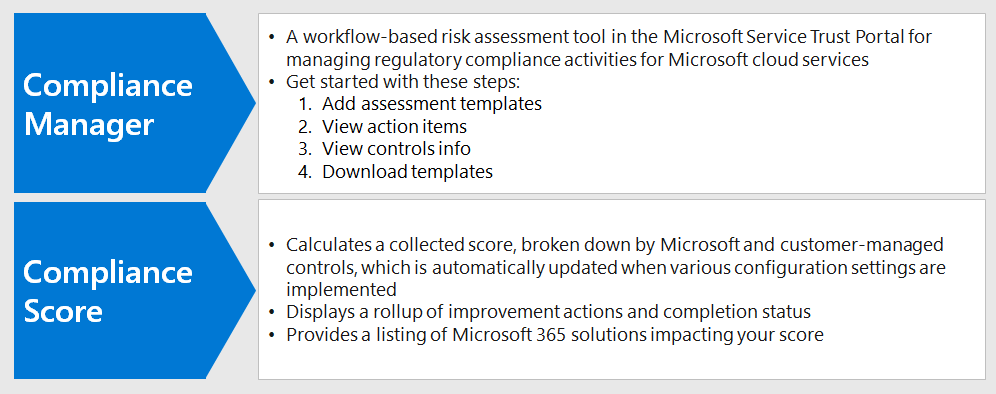
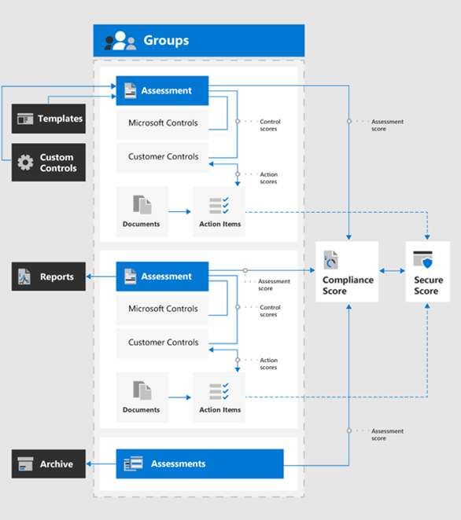
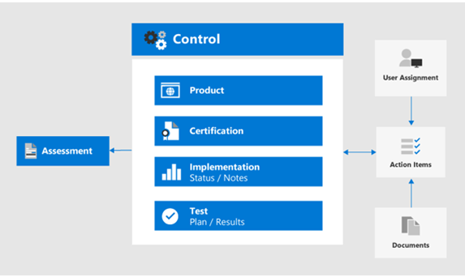

# Use Compliance Score and Compliance Manager to manage improvement actions

Microsoft Compliance Score and Compliance Manager can be used together to manage improvements related to data privacy regulations such as the European Union [General Data Protection Regulation (GDPR)](../compliance/gdpr.md), [California Consumer Protection Act CCPA)](../compliance/ccpa-faq.md), HIPAA-HITECH (US health care privacy act), and the Brazil Data Protection Act (LGPD). 

This article provides guidance on the use of these tools for data privacy purposes.

>[!Note]
>The customer actions provided in Compliance Manager are recommendations. It is up to you to evaluate the effectiveness of these recommendations in your regulatory environments prior to implementation. Compliance Manager recommendations should not be interpreted as a guarantee of compliance.
>

## Planned updates for Compliance Score and Compliance Manager

[Compliance Score](../compliance/compliance-score.md) (currently in preview) requires adding your target assessments for a regulation (such as GDPR) from the [Compliance Manager](../compliance/compliance-manager-overview.md). In a future release, much of the functionality in Compliance Manager will be merged into a unified Compliance Score experience, reducing the need for multiple tools.

Here are the tools for your subscription, which require you to sign-in:

- [Compliance Score in the Microsoft Compliance admin center](https://compliance.microsoft.com/compliancescore)
- [Compliance Manager in the Microsoft Services Trust Portal](https://servicetrust.microsoft.com/ComplianceManager/V3)

## Getting started with Compliance Manager 

[Compliance Manager](../compliance/working-with-compliance-manager.md) (currently in preview) is a free workflow-based risk assessment tool in the Microsoft Service Trust Portal for managing regulatory compliance activities related to Microsoft cloud services. As part of your Microsoft 365 or Azure Active Directory (Azure AD) subscription, Compliance Manager helps you manage regulatory compliance within the shared responsibility model for Microsoft cloud services.

While you can view your overall compliance score and perform a number of other functions in the Compliance center's **Compliance Score** page, you need to use Compliance Manager through the Services Trust Portal to first configure assessments for your data privacy regulations. Data from these assessments will then show up in Compliance Score for further viewing and filtering. 

Using the Compliance Manager interface, you can select one or more data privacy-related regulation templates and group them to assess and track required improvement actions across the set. You can also view information about the controls each regulation calls for specific to the target service, separated by Microsoft vs. customer-managed controls.

Assessments and improvement status selected here also appear in Compliance Score in the Microsoft Compliance Center, which emphasize the importance of your initial setup in Compliance Manager. These relationships are shown in this figure.
 

Here are the key steps to help you get started.

### 1. Assessment templates

From the Compliance Manager, the first step is to add assessments specific to the data privacy regulations of interest and include them in a defined "Data Privacy Regulations" group.

[Groups](../compliance/working-with-compliance-manager.md#groups) are containers that allow you to organize Assessments and share common information and workflow tasks between Assessments that have the same or related customer-managed controls. When two different Assessments in the same group share customer-managed control, the completion of implementation details, testing, and status for the control automatically synchronize to the same control in any other Assessment in the Group. This unifies the assigned Action Items for each control across the group and reduces duplicating work. 

You can also choose to use groups to organize. Assessments by year, area, compliance standard, or other groupings to help organize your compliance work.

### 2. Action items

Once the assessments have been added, you can view Action Items specific to each group or individual regulation:

- **Improvement action list.** Navigate to the Action Items list and view the improvement actions associated across the regulations included in the group. Many actions span regulations so a single list item may represent multiple regulations. 
 
- **Improvement action filtering.** For many data privacy regulations and groups of regulations, the list of improvement actions can be quite large, so consider filtering the list using the filter drop down. For example, if you select "technical controls", the list will be reduced to just those which have a technical implementation in the organization, as many of the actions are related to administrative operations in various aspects of the business which are also documented in Compliance Manager. In this article, we will focus on technical controls, so this filtering approach is recommended.
 
- **Additional information and review.** For each action, you can click on the link to **Read More**, which tells you more about the recommended activity, or **Review**, which opens a form allowing you to do the following:
 
   - Assign the action to a someone in your organization to manage
   - Manage documents related to addressing the action
   - Specify status for the item
   - Specify implementation and test dates
   - Record additional information, implementation notes, and test plan notes for the subject action
  
- **Non-applicable items as out-of-scope.** Some improvement actions included in the Action Items list might not apply to your planned implementation. You can specify that they are out of scope in Compliance Manager and remove the action and its evidence from the calculation of the compliance score value. 

For example, if your organization has elected to use Microsoft Managed Key", a recommendation to Use Customer Key is not applicable to your deployment. In this case, your organization would mark it as **Not in scope** in the **Control Actions** for the applicable regulatory template.
 
### 3. Controls info

For an assessment-specific view, view the [Controls Info](../compliance/compliance-manager-overview.md#controls) for each assessment group. This provides an assessment-specific view, which is difference than the Action Items list, which provides a technical control-specific view.
 

Navigate to the **Controls Info** list and view the list of in-scope services for the regulation in question. 
 
Regulation-specific control groupings list the actions provided by control area for each service area. For each set of actions, the Compliance Manager provides more information on the action and may suggest or provide review options to assist the organization in choosing a control approach.
 
Note that this interface provides the capability to view details specific to the technical action, together with the status of actions related to the control, and supplemental context about the regulations to which the action is related.

### 4. Template download

For those more familiar with spreadsheet-based regulatory analysis, another approach is to download the template for each respective assessment using the Templates listing. The downloaded templates list both the regulatory as well as technical control information for each template and may be easier for certain roles to navigate/filter and to generate business-specific views.
 
You can also add a new template customized for your organization based on an existing template, using **Add Template**. This requires that you download a template of choice (such as HIPAA/HITECH)), then modify it for your purposes and upload back into the Compliance Manager tool, where it will now drive assessments and scoring similar to other templates and assessments as part of the overall Compliance Manager and Compliance Score toolset.
 
>[!Tip]
>if dealing with a large number of regulations or overlapping improvement actions, consider downloading each respective template and combining the data sets, removing improvement actions or control types that do not apply to your organization, and re-uploading. This may be easier than navigating every control info section and marking each as out of scope.
>

## Compliance Score

Once the assessments and review specifications are performed in Compliance Manager, you can now go to the [Compliance Score](../compliance/compliance-score.md) tool and review the score and slice and dice the data further, including by control area.

The Compliance Score tool in the Microsoft 365 Compliance admin center provides several approaches to review and filter compliance data obtained from Compliance Manager and various Microsoft 365 services. This tool is automatically updated when various configuration settings are implemented and shares signals with the Microsoft Secure Score so that many improvement actions will show up in both scores. 
 
The Compliance Score provides:

- A collected score, broken down by Microsoft and customer-managed controls
- A rollup of improvement actions and completion status
- A listing of Microsoft 365 solutions impacting your score

### How the compliance score gets calculated

In short, the score is calculated based on a combination of Microsoft and customer-managed control implementations, as explained in more detail in the [Microsoft Compliance Score calculation article](../compliance/compliance-score-methodology.md).

Controls are assigned a score value based on whether they're mandatory or discretionary, and whether they're preventative, detective, or corrective. These collectively represent the risk of not implementing it relative to other controls.

As presented in the Microsoft Compliance Score calculation article, preventative controls get a higher score than detective and corrective ones, and mandatory controls get a higher score than discretionary ones.
 
Note that the Compliance Score admin UI does not list these parameters, nor does it provide the ability to filter by them. However, if you download the associated template from the Compliance Manager tool, the resulting data set does list these parameters for most regulations.

For technical controls, Compliance Score will automatically update the improvement action score once the related feature is activated. Other, non-technical control actions&mdash;such as those that are operational or related to documentation&mdash;need to be recorded manually in the Compliance Manager tool on the Services Trust Portal. 

You many also be implementing certain improvement actions for other purposes&mdash;for example using retention labels for reasons other than data privacy regulation compliance&mdash;so you would get credit for using such a feature even if it is being used for other purposes, and not part of a deliberate compliance action.

Your Compliance Score should be considered a relative measure to track improvement on a broad scale. You should not pursue a perfect score. 

### Additional guidance

Here are a few important tips for the use of Compliance Score and Compliance Manager for you to achieve data privacy regulation compliance:

- Each data privacy regulation has a combination of technical controls, documentation specifications, and operational, process, and reporting requirements. All of these show up in the improvement actions. 

- This article focuses on a subset of the technical controls specified for data privacy in Compliance Manager and Compliance Score. Refer to the Compliance Manager tool and [documentation](../compliance/compliance-score.md) for more information on non-technical administrative controls.

- To focus the view of improvement actions to your area of interest, you can filter by action type in the **Solutions** tab in the Compliance Score admin.

- The relative importance and priority of improvement actions identified in Compliance Score should be considered as part of a broader risk review along with the data privacy risk you've determined your organization needs to manage. 

- If you are a global organization and you add multiple data privacy regulation templates into Compliance Manager as Assessments, Compliance Score will combine each applicable one in a field listing for each improvement action.
 
- Even with improvement action aggregation across multiple regulatory requirements, if the regulation assessment templates for GDPR, LGPD, CCPA, and HIPAA-HITECH are selected, for example, almost 400 improvement actions will be listed in Compliance Score. To better tackle this long list, use the improvement action filter to reduce the result set to a more manageable list.

- The Categories filter provides a means to filter improvement actions by logical grouping, which the Track, Prevent, Protect, Retain, and Investigate articles in this overall solution align to. 

- Some of the controls listed in the improvement actions may be considered more directly tied to a specific regulatory article, while other controls may be more indirectly associated with the spirit of a regulation and are many times just things you should consider doing anyway.

