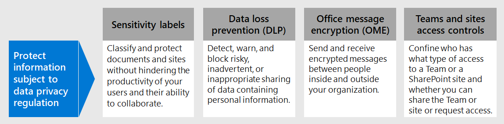
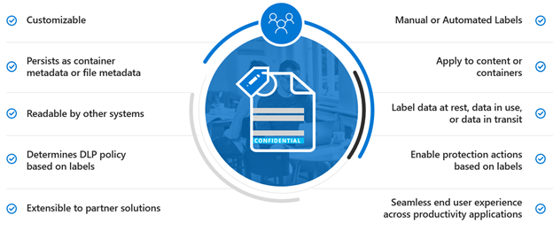
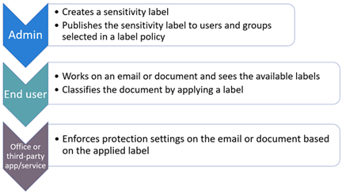
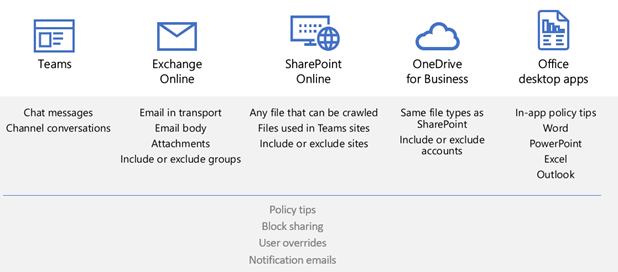
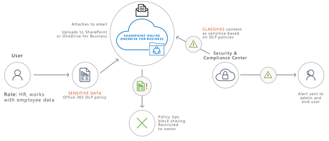
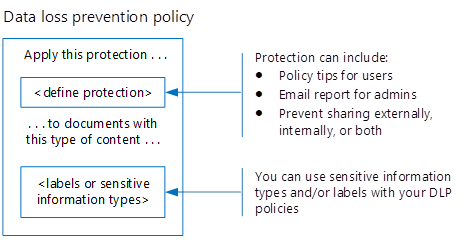
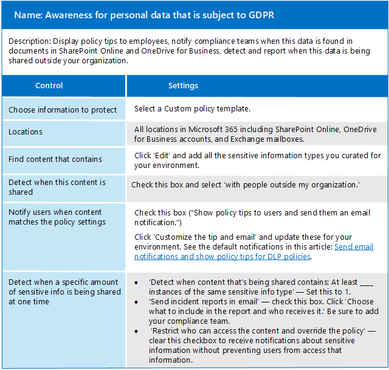
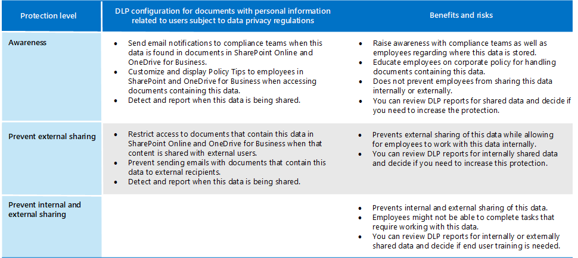
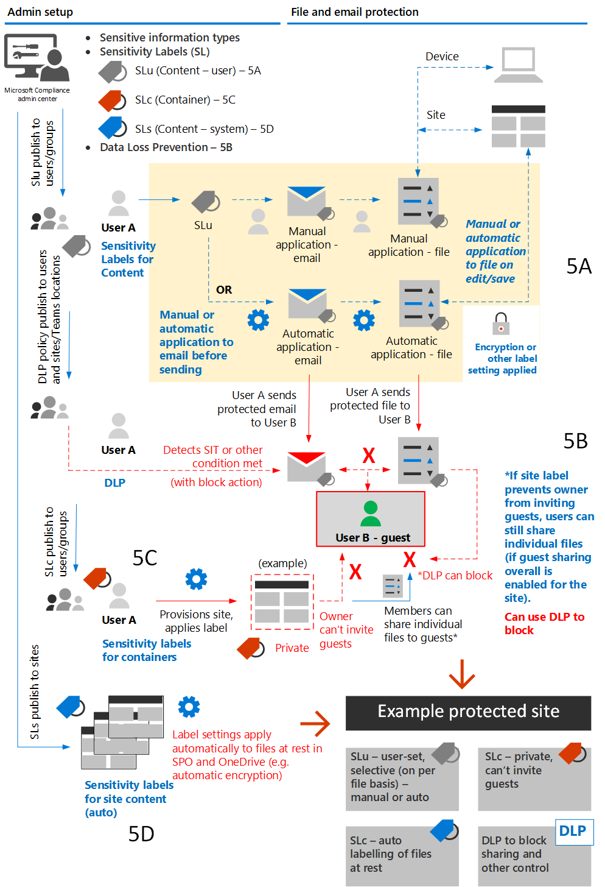

# Protect information subject to data privacy regulation

A number of information protection controls can be employed in your subscription to help address data privacy compliance needs and regulations. These include General Data Protection Regulation (GDPR), HIPAA-HITECH (the United States health care privacy act), California Consumer Protection Act (CCPA), and the Brazil Data Protection Act (LGPD).

These controls are within following solution areas:

- Sensitivity labels
- Data loss prevention (DLP)
- Office message encryption (OME)
- Teams and sites access controls

>[!Note]
>This solution describes security and compliance features to protect information subject to data privacy regulations. For a complete list of security features in Microsoft 365, see [Microsoft 365 security documentation](../security/index.yml). For a complete list of compliance features in Microsoft 365, see [Microsoft 365 compliance documentation](../compliance/index.yml).
>

## Data privacy regulations that impact information protection controls

Here is a sample list of data privacy regulations that may relate to information protection controls:

- GDPR Article 5(1)(f))
- GDPR Article (32)(1)(a)
- LGPD Article 46
- HIPAA-HITECH (45 CFR 164.312(e)(1))
- HIPAA-HITECH (45 C.F.R. 164.312(e)(2)(ii))

See the [assess data privacy risks and identify sensitive items article](information-protection-deploy-assess.md) for more information on each of the above.

Data privacy regulations for information protection recommend:

- Protection against loss or unauthorized access, usage and/or transmission.
- Risk-based application of protective mechanisms.
- Use of encryption where appropriate.

Your organization may also want to protect Microsoft 365 content for other purposes, such as other compliance needs or for business reasons. Establishing your information protection scheme for data privacy should be done as part of overall information protection planning, implementation, and management.

To help you get started with an information protection scheme in Microsoft 365, the following section includes a short list of related capabilities and improvement actions for Microsoft 365. The list includes capabilities and improvement actions that are applicable to data privacy regulations. However, the list doesn't include older technologies if there's a newer capability that largely supersedes the older one. For example, Information Rights Management (IRM) for SharePoint and OneDrive is not included in the list but sensitivity labels are included.

## Managing information protection in Microsoft 365

Microsoft [information protection solutions](../compliance/information-protection.md) include a number of integrated capabilities across Microsoft 365, Microsoft Azure, and Microsoft Windows. In Microsoft 365, information protection solutions include:

- [Service encryption with Customer Key](../compliance/customer-key-overview.md)
- [Sensitive information types](../compliance/sensitive-information-type-entity-definitions.md) (described in the [assess data privacy risks and identify sensitive items article](information-protection-deploy-assess.md))
- [Sensitivity labels](../compliance/sensitivity-labels.md) 
  - Service/container-level
  - Client-side/content-level
  - Automated for data-at-rest in SharePoint and OneDrive
- Data Loss Prevention (DLP)
- [Microsoft 365 Endpoint data loss prevention](../compliance/endpoint-dlp-learn-about.md)
- [Office 365 Message Encryption new capabilities (OME)](../compliance/ome.md) and OME [Advanced Message Encryption](../compliance/ome-advanced-message-encryption.md)

In addition, site and library level protection are important mechanisms to include in any protection scheme.

For information on other information protection capabilities outside of Microsoft 365, see:

- [Microsoft Cloud Application Security (MCAS)](/cloud-app-security/)
- [Azure Information Protection](/azure/information-protection/what-is-information-protection)
- [Microsoft Endpoint Manager](https://www.microsoft.com/microsoft-365/microsoft-endpoint-manager)
- [Windows Information Protection](/windows/security/information-protection/windows-information-protection/protect-enterprise-data-using-wip)

## Sensitivity labels

Sensitivity labels from the Microsoft Information Protection framework let you classify and protect your organization's data without hindering the productivity of users and their ability to collaborate.

> [!div class="mx-imgBorder"]
> 

### Prerequisites for sensitivity labels

Complete these activities prior to implementing any of the sensitivity label-based capabilities highlighted below:

1. Understand the following:
   - **Business requirements.** Establish the business reasons for applying sensitivity labels in your enterprise. For example, your data privacy requirements for information protection.
   - **Sensitivity label capabilities.** Sensitivity labeling can get complex, so make sure to read the [sensitivity labels documentation](../compliance/sensitivity-labels.md) before getting started.
   - **Key things to remember** Sensitivity labels are managed in the Microsoft Compliance admin center but the targeting and application options vary significantly.
      - There are sensitivity labels for sites, groups, and Teams at the container level (the settings do not apply to content inside the container). These are published to users and groups who apply them when a site, group or Team is provisioned.
      - There are sensitivity labels for active content. These are also published to user or groups, who either manually apply them, or they get applied automatically when:
        - The file is opened/edited/saved, either to the user’s desktop or a SharePoint site.
        - An email is drafted and sent.
      - There are sensitivity labels for automatic application to files at rest in SharePoint and OneDrive in addition to emails in transit through Exchange. These are targeted to either all sites or specific ones and automatically apply to the files at rest in these environments.

2. Rationalize current sensitivity labeling with past or alternative methods

   - Azure Information Protection

      The current sensitivity labeling scheme may need to be reconciled with any existing [Azure Information Protection](../compliance/sensitivity-labels.md#sensitivity-labels-and-azure-information-protection) labeling implementation.
   - OME

      If you are planning to use modern sensitivity labeling for email protection and existing email encryption methods like OME are in place, they can co-exist, but you should understand the scenarios in which either should be applied. See [Office 365 Message Encryption new capabilities (OME)](#office-365-message-encryption-ome-new-capabilities), which includes a table comparing modern sensitivity label-type protection with OME-based protection.

3. Plan for integration into a broader information protection scheme. On top of coexistence with OME, sensitivity labels can be used along-side capabilities like Microsoft 365 data loss prevention (DLP) and Microsoft Cloud App Security. See [Microsoft Information Protection in Microsoft 365](../compliance/information-protection.md) to achieve your data privacy-related information protection goals.

4. Develop a sensitivity label classification and control scheme. See [Data Classification and Sensitivity Label Taxonomy](https://aka.ms/dataclassificationwhitepaper).

### General guidance

1. **Schema definition.** Before using technical capabilities to apply labels and protection, work across your organization to define a classification schema. You might already have a classification schema, which makes it easier to add personal data. 
2. **Getting started.** Begin by deciding on the number and names of labels to implement. Do this activity without worrying about which technology to use and how labels will be applied. Apply this schema universally throughout your organization, including data that resides on premises and in other cloud services.
3. **Additional recommendations** When designing and implementing policies, labels, and conditions, consider following these recommendations:

   - **Use existing classification schema (if any).** Many organizations already are using data classification in some form. Carefully evaluate the existing label schema and if possible, use it as is. Using familiar labels that are recognizable to your end-users will drive adoption.
   - **Start small.** There is virtually no limit to the number of labels that you can create. However, large numbers of labels and sub-labels can slow adoption.
   - **Use scenarios and use cases.** Identify common use cases within your organization and use scenarios derived from the data privacy regulations to which you are subject. Verify if the envisioned label and classification configuration will work in practice.
   - **Question every request for a new label.** Does every scenario or use case really need a new label or can you use what you already have? Keeping the number of labels to a minimum improves adoption.
   - **Use sub-labels for key departments.** Some departments will have specific needs that require specific labels. Define these labels as sub-labels to an existing label and consider using scoped policies that are assigned to user groups instead of globally.
   - **Consider scoped policies.** Policies targeted at subsets of users will prevent label overload. A scoped policy enables assigning role or department specific labels or sub-labels to just employees that work for that specific department. 
   - **Use meaningful label names.** Try not to use jargon, standards, or acronyms as label names. Try to use names that resonate with the end user to improve adoption. Instead of using labels like PII, PCI, HIPAA, LBI, MBI and HBI, consider names like Non-Business, Public, General, Confidential and Highly Confidential.

### Create and deploy sensitivity labels for sites, groups, and teams

When you create [sensitivity labels](../compliance/sensitivity-labels-teams-groups-sites.md) in the Microsoft 365 compliance center, you can now apply them to these containers:

- Microsoft Teams sites
- Microsoft 365 groups (formerly Office 365 groups)
- SharePoint sites

Use the following label settings to help protect the content in those containers:

- Privacy (public or private) of Microsoft 365 group-connected Teams sites
- External user access
- Access from unmanaged devices

For data privacy, to prevent external sharing for containers that will be used for storing content with sensitive personal data, mark the files containing the data as private, and require managed devices.

### Create and deploy sensitivity labels for content

Sensitivity labels applied to files allow you to encrypt their content, watermark the content, and define other controls for Office applications content, including Outlook and Office on the web.

When you're ready to start protecting your organization's data with sensitivity labels:

1. **Create the labels.** Create and name your sensitivity labels according to your organization's classification taxonomy for different sensitivity levels of content. For more information on developing a classification taxonomy, see the [Data Classification and Sensitivity Label Taxonomy white paper](https://aka.ms/dataclassificationwhitepaper).
2. **Define what each label can do.** Configure the protection settings you want associated with each label. For example, you might want lower sensitivity content (such as a "General" label) to have just a header or footer applied, while higher sensitivity content (such as a "Confidential" label) should have a watermark and have encryption enabled.
3. **Publish the labels.** After your sensitivity labels are configured, publish them by using a label policy. Decide which users and groups should have the labels and what policy settings to use. A single label is reusable. You define it once and then you can include it in several label policies assigned to different users.

Once you publish sensitivity labels from the Microsoft 365 compliance center, they start to appear in [Office apps](../compliance/sensitivity-labels-office-apps.md) for users to classify and protect content as it's created or edited.

For data privacy, you manually apply a sensitivity label with encryption and other rules to email or content containing sensitive personal information.

>[!Note]
>Sensitivity labels with encryption enabled applied to email have some overlapping functionality with OME. See [Secure email scenarios comparison with OME and sensitivity labels](#secure-email-scenarios-comparison-with-ome-and-sensitivity-labels).

### Client-side auto-labeling when users edit documents or compose emails

When you create a sensitivity label, you can [automatically assign that label](../compliance/apply-sensitivity-label-automatically.md) to content including email when it matches conditions that you specify.

The ability to apply sensitivity labels to content automatically is important because:

- You don't need to train your users when to use each of your classifications.
- You don't need to rely on users to classify all content correctly.
- Users no longer need to know about your policies—they can instead focus on their work.

Auto-labeling supports recommending a label to users, as well as automatically applying a label. But in both cases, the user decides whether to accept or reject the label, to help ensure the correct labeling of content.

This client-side labeling has minimal delay for documents because the label can be applied even before the document is saved. However, not all client apps support auto-labeling. This capability is supported by the Azure Information Protection unified labeling client, and [some versions of Office apps](../compliance/sensitivity-labels-office-apps.md#support-for-sensitivity-label-capabilities-in-apps).

For configuration instructions, see [How to configure auto-labeling for Office apps](../compliance/sensitivity-labels-office-apps.md#support-for-sensitivity-label-capabilities-in-apps).

For data privacy, you auto-apply sensitivity labels for content containing sensitive personal information.

### Service-side auto-labeling when content is already saved

This method is referred to as auto classification with sensitivity labels. You might also hear it referred to as auto-labeling for data at rest (for documents in SharePoint and OneDrive) and data in transit (for email that is sent or received by Exchange). For Exchange, it doesn't include emails in mailboxes at rest.
 
Because this labeling is applied by the service itself rather than by user application, you don't need to worry about what apps users have and what version. As a result, this capability is immediately available throughout your organization and suitable for labeling at scale. Auto-labeling policies don't support recommended labeling because the user doesn't interact with the labeling process. Instead, the administrator runs the policies in simulation mode to help ensure the correct labeling of content before actually applying the label.

For configuration instructions, see [How to configure auto-labeling policies for SharePoint, OneDrive, and Exchange](../compliance/apply-sensitivity-label-automatically.md#how-to-configure-auto-labeling-policies-for-sharepoint-onedrive-and-exchange).

For data privacy within sites of concern, push sensitivity labels for automatic encryption of content containing sensitive personal information.

## Data loss prevention 

You can use [data loss prevention (DLP)](../compliance/dlp-learn-about-dlp.md) in Microsoft 365 to detect, warn, and block risky, inadvertent, or inappropriate sharing, such as sharing of data containing personal information, both internally and externally.

DLP allows you to:

- Identify and monitor risky sharing activities.
- Educate users with in-context guidance to make the right decisions.
- Enforce data use policies upon content without inhibiting productivity.
- Integrate with classification and labeling to detect and protect data when it is shared.

### Supported workloads for DLP

With a DLP policy in the Microsoft 365 compliance center, you can identify, monitor, and automatically protect sensitive items across many locations in Microsoft 365, such as Exchange Online, SharePoint, OneDrive, and Microsoft Teams.

For example, you can identify any document containing a credit card number that's stored in any OneDrive site, or you can monitor just the OneDrive sites of specific people.

You can also monitor and protect sensitive items in the locally-installed versions of Excel, PowerPoint, and Word, which include the ability to identify sensitive items and apply DLP policies. DLP provides continuous monitoring when people share content from these Office apps.

> [!div class="mx-imgBorder"]
> 

This figure shows an example of DLP protecting personal data.

> [!div class="mx-imgBorder"]
> 

DLP is used to identify a document or email containing a health record and then automatically blocks access to that document or blocks the email from being sent. DLP then notifies the recipient with a policy tip and sends an alert to the end-user and admin.

### Planning for DLP

Plan your DLP policies for: 

- Your business requirements.

- A risk-based assessment of the organization as described in the [assess data privacy risks and identify sensitive items article](information-protection-deploy-assess.md).

- Other information protection and governance mechanisms in place or in planning for data privacy.

- The sensitive information types that you’ve identified for personal data based on your assessment work as described in the [assess data privacy risks and identify sensitive items article](information-protection-deploy-assess.md). DLP policy conditions can be based on both sensitive information types and retention labels.

- The retention labels you'll need to specify DLP conditions. See the [govern information subject to data privacy regulation in your organization](information-protection-deploy-govern.md) article for more information.

- Ongoing DLP policy management, which requires someone in the organization to operate and tune policies for changes in sensitive information types, retention labels, regulations, and compliance policies.

Although sensitivity labels can’t be used in DLP policy conditions, certain protection scenarios to prevent access may be achievable with just sensitivity labels that can be auto-applied based on sensitive information types. If robust sensitivity labeling is in place, consider whether DLP should be used to augment protection because:

  - DLP can prevent sharing of files. Sensitivity labels can just prevent access.

  - DLP has more granular levels of control in terms of rules, conditions, and actions.

  - DLP policies can be applied to Teams chat and channel messages. Sensitivity labels can only be applied to documents and email.

### DLP policies

DLP policies are configured in the Microsoft Compliance admin center and specify the level of protection, the sensitive information type the policy is looking for, and the target workloads. Their basic components consist of identifying the protection and the types of data.

> [!div class="mx-imgBorder"]
> 

Here is an example DLP policy for awareness of GDPR.

See [this article](../compliance/create-test-tune-dlp-policy.md) for more information about creating and applying DLP policies.

### Protection levels for data privacy

The following table lists three configurations of increasing protection using DLP.

The first configuration, Awareness, can be used as a starting point and minimum level of protection to address compliance needs for data privacy regulations.

>[!Note]
>As the levels of protection increase, the ability of users to share and access information will decrease in some cases and could potentially impact their productivity or ability to complete daily tasks.

To help your employees continue to be productive in a more secure environment when increasing protection levels, take the time to train and educate them on new security policies and procedures.

### Example of using sensitivity labels with DLP

Sensitivity labels can work together with DLP to provide data privacy in a highly regulated environment. Here are the key steps of the integrated deployment:

1. Regulatory and otherwise business requirements for data privacy are documented.
2. Target data sources, types, and ownership are characterized relative to data privacy concerns.
3. An overall strategy to address requirements and protect and govern data privacy hotspots is established.
4. A phased action plan to address the data privacy control strategy is put into place.

Once these elements are determined, you can use sensitive information types, your sensitivity labeling taxonomy, and DLP policies together. This figure shows an example.

> [!div class="mx-imgBorder"]
> 

[See a larger version of this image](https://github.com/MicrosoftDocs/microsoft-365-docs/raw/public/microsoft-365/media/information-protection-deploy-protect-information/information-protection-deploy-protect-information-sensitivity-lables-dlp.png)

Here are some data protection scenarios using DLP and sensitivity labels together as shown in the figure.

| Scenario | Process |
|:-------|:-----|
| A | <ol><li>Sensitivity labels for content are published by an administrator to users and groups for manual or automatic application to content and email. </li><li>User A applies the labels manually or automatically when interacting with content, with encryption or other settings applied. </li><li>User A sends a protected email or file to User B, a guest user. </li></ol> |
| B | DLP policy published by an administrator to User A blocks User A from sending the email and/or file to User B. |
| C |  Sensitivity label with “owner can’t invite guests” setting is published to User A, who provisions a Teams team or SharePoint site. Another user of the site selectively tries sharing a file with User B, but DLP blocks it. |
| D | Sensitivity label for auto-application to site content is published to one or more sites, providing another layer of protection, resulting in a protected site. |
|||

## Office 365 Message Encryption (OME) new capabilities

People often use email to exchange sensitive items, such as patient health information or customer and employee information. Email message encryption helps ensure that only intended recipients can view message content.

With [OME](../compliance/ome.md), you can send and receive encrypted messages between people inside and outside your organization. OME works with Outlook.com, Yahoo!, Gmail, and other email services. OME helps ensure that only intended recipients can view message content.

For data privacy, you use OME to protect internal messages containing sensitive items. Office 365 Message Encryption is an online service that's built on Microsoft Azure Rights Management (Azure RMS) which is part of Azure Information Protection. This includes encryption, identity, and authorization policies to help secure your email. You can encrypt messages by using rights management templates, the Do Not Forward option, and the encrypt-only option.

You can also define mail flow rules to apply this protection. For example, you can create a rule that requires the encryption of all messages addressed to a specific recipient, or that contains specific keywords words in the subject line, and also specify that recipients can't copy or print the contents of the message.

In addition, OME [Advanced Message Encryption](../compliance/ome-advanced-message-encryption.md) helps you meet compliance obligations that require more flexible controls over external recipients and their access to encrypted emails. With OME Advanced Message Encryption in Microsoft 365, you can control sensitive emails shared outside the organization with automatic policies that detect sensitive information types. 

For data privacy, if you need to share email with an external party, you can specify an expiration date and revoke messages. You can only revoke and set an expiration date for messages sent to external recipients.

### Secure email scenarios comparison with OME and sensitivity labels

OME and sensitivity labels applied to email with encryption have some overlap, so it’s important to understand which scenarios that either might apply to, as shown in this table.

| Scenario | Sensitivity Labels | OME |
|:-------|:-----|:-------|
| Internal + partners   Securely communicate and collaborate between internal users and trusted partners | Recommend – labels with fully customized classification and protection | Yes – Encrypt only or Do Not Forward protection with no classification |
| External parties   Securely communicate and collaborate with any external/consumer users | Yes – predefine recipients in label | Recommend – just-in-time protection based on recipients |
| Internal + partners, with expiration/revocation   Control access of mail and content with internal users and trusted partners with expiration and revocation | Recommend - fully customized protection with access duration, user can manually track and revoke files | No – no revocation or expiration for internal mail |
| External parties with expiration/revocation   Control access of mail and content with external/consumer users with expiration and revocation | Yes – user can manually track files | Recommend (E5) – admin can revoke mail from Security & Compliance Center |
| Auto-labeling   Organization wants to automatically protect mail/attachments with specific sensitive content and/or specific recipients | Recommend (E5) - Auto-labeling in Exchange and Outlook clients, augments mail flow rules and DLP policy | Yes - mail flow rules and DLP policy with Encrypt only or Do Not Forward protection |
||||

There will also be differences in end-user and admin experiences between these two methods.

## Teams with protection for highly sensitive data

For organizations that plan to store personal data subject to data privacy regulations in Teams, see [Configure a team with security isolation](secure-teams-security-isolation.md), which provides detailed guidance and configuration steps for:

- Identity and device access
- Creation of a private team
- Lockdown of underlying team site permissions
- A group-based sensitivity label with encryption