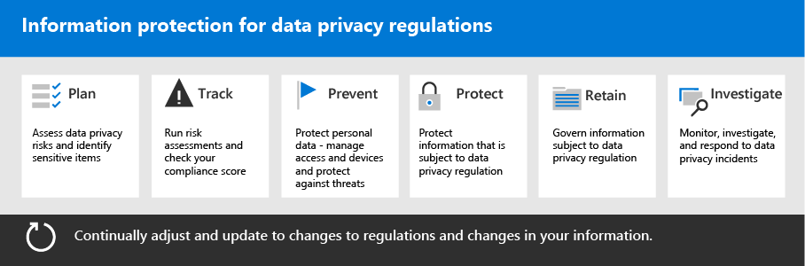

# Deploy information protection for data privacy regulations with Microsoft 365

Your organization may be subject to regional data privacy regulations that require you to protect, manage, and provide rights and control over personal information stored in your IT infrastructure, including both on-premises and in the cloud. The best example of a data privacy regulation is the European Union's General Data Protection Regulation (GDPR). Failure to comply with data privacy regulations can result in substantial fines.

Examples of the types of data in Microsoft 365 include chat sessions in Microsoft Teams, emails in Exchange, and files in SharePoint and OneDrive. This solution provides guidance on how to assess risks and take appropriate action to protect personal data in Microsoft 365. This includes identifying  personal information so you can protect, govern, and respond to data privacy incidents.

Additional information is also provided on the use of Microsoft 365 identity, device, and threat protection controls for your data privacy needs. 

These Microsoft 365 capabilities and features help you meet the criteria for protecting information.

| Capability or feature | Description | Licensing |
|:-------|:-----|:-------|
| Compliance Manager | Manage regulatory compliance activities, get an overall score of your current compliance configuration, and find recommendations for improvement. This is a workflow-based risk assessment tool in the Microsoft 365 compliance center. | Microsoft 365 E3 and E5 |
| Microsoft Defender for Office 365 | Protect your Microsoft 365 apps and data—such as email messages, Office documents, and collaboration tools—from attack. | Microsoft 365 E3 and E5 | 
| Sensitivity labels | Classify and protect your organization's data without hindering the productivity of users and their ability to collaborate. Place labels with various levels of protection on email, files, or sites. | Microsoft 365 E3 and E5 |
| Data Loss Protection (DLP) | Detect, warn, and block risky, inadvertent, or inappropriate sharing of data containing personal information, both internally and externally. | Microsoft 365 E3 and E5 | 
| Data retention labels and policies | Implement information governance controls. These can include determining how long to keep data (such as personal data related to customers) to comply with your organization's policies or data regulations. | Microsoft 365 E3 and E5 |
| Email encryption | Protect personal data by sending and receiving encrypted email messages between people inside and outside your organization. | Microsoft 365 E3 and E5 |
||||

## Organization of the guidance in this solution

To help you understand the Microsoft 365 tools available to help you meet one or more privacy-related regulations, this guidance is organized into sections.
 

Each of these sections corresponds to a separate article in this solution.

>[!Note]
>If you are already familiar with your data privacy obligations and are executing against an existing plan, you may want to focus on the Prevent, Protect, Retain, and Investigate guidance.

>[!Important]
>Following this guidance will not necessarily make you compliant with any data privacy regulation, especially considering the number of steps required that are outside the context of the features. You are responsible for ensuring your compliance and to consult your legal and compliance teams or to seek guidance and advice from third parties that specialize in compliance.
>

## Plan: Assess data privacy risks and identify sensitive items

Assessing data privacy regulations and risks that your organization is subject to is a key first step to take before starting to implement improvements, including configuring capabilities in Microsoft 365. This work can include an overall readiness assessment or identification of particular sensitive information types that are subject to regulatory controls your organization needs to comply with.

For more information, see [Assess data privacy risks and identify sensitive items](information-protection-deploy-assess.md).

## Track: Run risk assessments and check your compliance score

Compliance Manager, available in the Microsoft 365 compliance center, provides you with a built-in ability to track and manage improvement actions overall as well as those related to multiple data privacy regulations that apply to you.

You can use built in assessment templates specific to each regulation, where you can track action items for each assessment template selected, as well as view specific regulatory controls, and relate them to specific actions.

For more information, see [Use Compliance Manager to manage improvement actions](information-protection-deploy-compliance.md).

## Prevent: Protect personal data

Microsoft 365 provides identity, device, and threat protection capabilities that you can use to help comply with data privacy regulatory compliance. 

For more information, see [Use identity, device, and threat protection for data privacy regulation](information-protection-deploy-identity-device-threat.md).

This article briefly describes what the data privacy regulations generally call for in these areas and provides a listing of related Microsoft 365 solutions, with links to more information to help you address any implementation requirements. 

## Protect information subject to data privacy regulation

Data privacy regulations dictate a number of personal information protection controls that can be employed in your environment, including more than 40 controls for protecting information across just the four data privacy regulations in our sample set of GDPR, California Consumer Protection Act (CCPA), HIPAA-HITECH (United States health care privacy act), and the Brazil Data Protection Act (LGPD).

For more information, see [Protect information subject to data privacy regulation in your organization](information-protection-deploy-protect-information.md).

This article lays out the main control schemes that can be used for addressing information protection needs for data privacy in your organization.

## Retain: Govern information subject to data privacy regulation

Data privacy regulations call for personal information governance controls that can be employed in your environment, including more than 24 controls across the four data privacy regulations in our sample set of GDPR, CCPA, HIPAA-HITECH, and LGPD.

For more information, see [Govern information subject to data privacy regulation in your organization](information-protection-deploy-govern.md).

While the data privacy regulations can be vague regarding information governance&mdash;such as purposeful retention, deletion and archiving&mdash;this article lays out the primary control schemes that you can use address information governance needs for data privacy in your organization.

## Investigate: Monitor, investigate, and respond to data privacy incidents

There are Microsoft 365 features available to help you monitor, investigate, and respond to data privacy incidents in your organization as you operationalize related capabilities. 

Having processes, procedures, and other documentation for using these features can be important to demonstrate compliance to regulatory bodies.

For more information, see [Monitor and respond to data privacy incidents in your organization](information-protection-deploy-monitor-respond.md).
