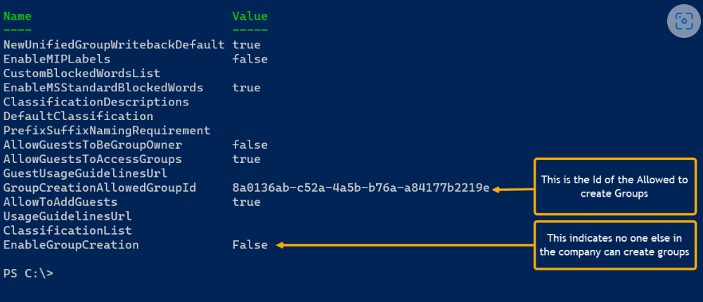

# Manage who can create Microsoft 365 Groups

By default, all users can create Microsoft 365 groups. This is the recommended approach because it allows users to start collaborating without requiring assistance from IT.

If your business requires that you restrict who can create groups, you can restrict Microsoft 365 Groups creation to the members of a particular Microsoft 365 group or security group.

If you're concerned about users creating teams or groups that don't comply with your business standards, consider requiring users to complete a training course and then adding them to the group of allowed users.

When you limit who can create a group, it affects all services that rely on groups for access, including:

- Outlook
- SharePoint
- Viva Engage
- Microsoft Teams
- Planner
- Power BI (classic)
- Project for the web / Roadmap

The steps in this article won't prevent members of certain roles from creating Groups. Microsoft 365 global admins can create groups via the Microsoft 365 admin center, Planner, Exchange, and SharePoint, but not other locations such as Teams. Other roles can create Microsoft 365 Groups via limited means, listed below.

- Exchange Administrator: Exchange admin center, Azure AD
- Partner Tier 1 Support: Microsoft 365 admin center, Exchange admin center, Azure AD
- Partner Tier 2 Support: Microsoft 365 admin center, Exchange admin center, Azure AD
- Directory Writers: Azure AD
- SharePoint Administrator: SharePoint admin center, Azure AD
- Teams Service Administrator: Teams admin center, Azure AD
- User Administrator: Microsoft 365 admin center, Azure AD

If you're a member of one of these roles, you can create Microsoft 365 Groups for restricted users, and then assign the user as the owner of the group.

## Licensing requirements

To manage who creates groups, the following people need Azure AD Premium licenses or Azure AD Basic EDU licenses assigned to them:

- The admin who configures these group creation settings
- The members of the group who are allowed to create groups

> [!NOTE]
> See [Assign or remove licenses in the Azure Active Directory portal](/azure/active-directory/fundamentals/license-users-groups) for more details about how to assign Azure licenses.

The following people don't need Azure AD Premium or Azure AD Basic EDU licenses assigned to them:

- People who are members of Microsoft 365 groups and who don't have the ability to create other groups.

## Step 1: Create a group for users who need to create Microsoft 365 groups

Only one group in your organization can be used to control who is able to create Microsoft 365 Groups. But, you can nest other groups as members of this group.

Admins in the roles listed above do not need to be members of this group: they retain their ability to create groups.

1. In the admin center, go to the [Groups page](https://admin.microsoft.com/adminportal/home#/groups).

2. Click on **Add a Group**.

3. Choose the group type you want. Remember the name of the group! You'll need it later.

4. Finish setting up the group, adding people or other groups who you want to be able to create groups as members (not owners).

For detailed instructions, see [Create, edit, or delete a security group in the Microsoft 365 admin center](../admin/email/create-edit-or-delete-a-security-group.md).

## Step 2: Run PowerShell commands

You must use the preview version of [Azure Active Directory PowerShell for Graph (AzureAD)](/powershell/azure/active-directory/install-adv2) (module name **AzureADPreview**) to change the group-level guest access setting:

- If you haven't installed any version of the Azure AD PowerShell module before, see [Installing the Azure AD Module](/powershell/azure/active-directory/install-adv2?preserve-view=true&view=azureadps-2.0-preview) and follow the instructions to install the public preview release.

- If you have the 2.0 general availability version of the Azure AD PowerShell module (AzureAD) installed, you must uninstall it by running `Uninstall-Module AzureAD` in your PowerShell session, and then install the preview version by running `Install-Module AzureADPreview`.

- If you have already installed the preview version, run `Update-Module AzureADPreview` to make sure it's the latest version of this module.

Copy the script below into a text editor, such as Notepad, or the [Windows PowerShell ISE](/powershell/scripting/components/ise/introducing-the-windows-powershell-ise).

Replace *\<GroupName\>* with the name of the group that you created. For example:

`$GroupName = "Group Creators"`

Save the file as GroupCreators.ps1.

In the PowerShell window, navigate to the location where you saved the file (type "CD \<FileLocation\>").

Run the script by typing:

`.\GroupCreators.ps1`

and [sign in with your administrator account](../enterprise/connect-to-microsoft-365-powershell.md#step-2-connect-to-azure-ad-for-your-microsoft-365-subscription) when prompted.

```PowerShell
$GroupName = "<GroupName>"
$AllowGroupCreation = $False

Connect-AzureAD

$settingsObjectID = (Get-AzureADDirectorySetting | Where-object -Property Displayname -Value "Group.Unified" -EQ).id
if(!$settingsObjectID)
{
    $template = Get-AzureADDirectorySettingTemplate | Where-object {$_.displayname -eq "group.unified"}
    $settingsCopy = $template.CreateDirectorySetting()
    New-AzureADDirectorySetting -DirectorySetting $settingsCopy
    $settingsObjectID = (Get-AzureADDirectorySetting | Where-object -Property Displayname -Value "Group.Unified" -EQ).id
}

$settingsCopy = Get-AzureADDirectorySetting -Id $settingsObjectID
$settingsCopy["EnableGroupCreation"] = $AllowGroupCreation

if($GroupName)
{
  $settingsCopy["GroupCreationAllowedGroupId"] = (Get-AzureADGroup -SearchString $GroupName).objectid
} else {
$settingsCopy["GroupCreationAllowedGroupId"] = $GroupName
}
Set-AzureADDirectorySetting -Id $settingsObjectID -DirectorySetting $settingsCopy

(Get-AzureADDirectorySetting -Id $settingsObjectID).Values
```

The last line of the script will display the updated settings:



If in the future you want to change which group is used, you can rerun the script with the name of the new group.

If you want to turn off the group creation restriction and again allow all users to create groups, set $GroupName to "" and $AllowGroupCreation to "True" and rerun the script.

## Step 3: Verify that it works

Changes can take thirty minutes or more to take effect. You can verify the new settings by doing the following:

1. Sign in to Microsoft 365 with a user account of someone who should NOT have the ability to create groups. That is, they are not a member of the group you created or an administrator.

2. Select the **Planner** tile.

3. In Planner, select **New Plan** in the left navigation to create a plan.

4. You should get a message that plan and group creation is disabled.

Try the same procedure again with a member of the group.

> [!NOTE]
> If members of the group aren't able to create groups, check that they aren't being blocked through their [OWA mailbox policy](/powershell/module/exchange/set-owamailboxpolicy).

## Related topics

[Collaboration governance planning recommendations](collaboration-governance-overview.md#collaboration-governance-planning-recommendations)

[Create your collaboration governance plan](collaboration-governance-first.md)

[Getting started with Office 365 PowerShell](../enterprise/getting-started-with-microsoft-365-powershell.md)

[Set up self-service group management in Azure Active Directory](/azure/active-directory/users-groups-roles/groups-self-service-management)

[Set-ExecutionPolicy](/powershell/module/microsoft.powershell.security/set-executionpolicy)

[Azure Active Directory cmdlets for configuring group settings](/azure/active-directory/users-groups-roles/groups-settings-cmdlets)
